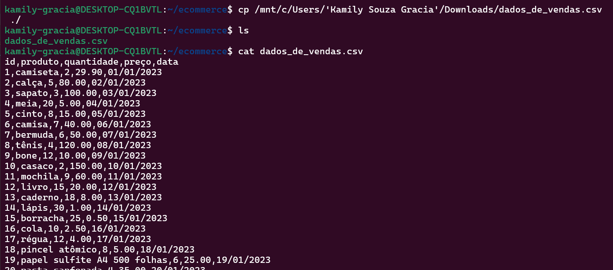
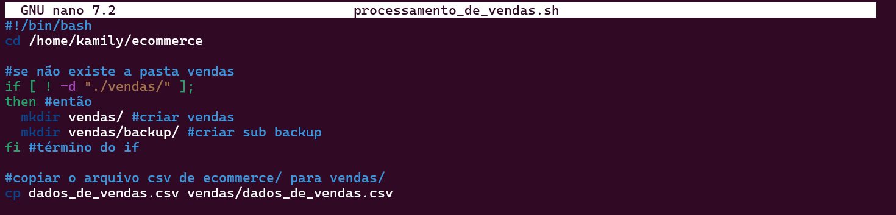
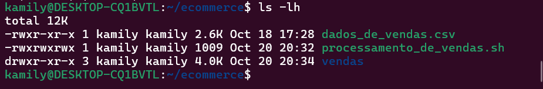
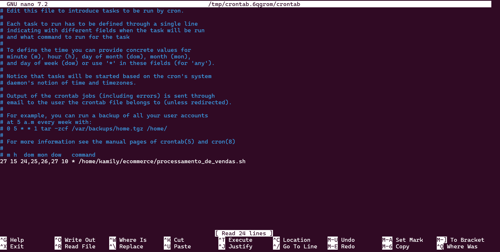

# Orientações

O desafio consiste em criar executáveis em **Shell** que realize as manipulações necessárias de diretórios e arquivos, além da criação de relatórios dos dados coletados. 

## Preparação

Para iniciar, foi necessário criar a pasta principal que realizará o armazenamento dos arquivos executáveis, de manipulção e as subpastas. Isto foi feito pelo comando:

```bash
    mkdir ecommerce
    #mkdir é o comando responsável pela criação de diretórios
```

Além da cópia do arquivo _dados_de_vendas.csv_ que será o responsável por alimentar os relatórios criados posteriormente. 



Onde:

```bash
    cp /mnt/c/Users/'Kamily Souza Gracia'/Downloads/dados_de_vendas.csv ./

    #cp é o comando responsável pela cópia de arquivos
    #/mnt/c/Users/'Kamily Souza Gracia'/Downloads/dados_de_vendas.csv é o caminho onde se encontra o arquivo no Windows
    #./ é o caminho da pasta atual
```
```bash
    ls 
    #ls é o comando que lista os ítens da pasta
```
```bash
    cat nome_do_arquivo 
    #cat é o comando que exibe o conteúdo do arquivo
```
Como visto, o arquivo _dados_de_vendas.csv_ possui dados das vendas de uma loja ecommerce que são divididos da seguinte forma "id, produto, quantidade, preço, data". Tal arquivo foi alterado no decorrer de 4 dias seguidos para que pudesse alimentar os relatórios dirios gerados pelo arquivo executável desenvolvido em Shell.

## O Desafio - Criação de Executáveis

### 1. Processamento_de_Vendas.sh

O arquivo executável, denominado _processamento_de_vendas.sh_, foi criado a partir do editor de texto _nano_ conforme o código a seguir: 

```bash
    nano processamento_de_vendas.sh
```
Antes de iniciar a descrição dos comandos que cumprirão as especificações, é necessário indicar ao sistema operacional que o arquivo será executável em Bash e para isso deve ser utilizado o interpretador. Portanto, a primeira linha deve conter o seguinte comando conhecido como "shebang":


Em seguida devemos entrar no diretório ecommerce para realizar as ações solicitadas:


Onde: 
```bash
    cd pasta/destino
    #cd é o comando que permite movimentar-nos entre os diretórios
```
Iniciando as a especificações do desafio, em primeiro lugar o script deve criar a pasta vendas, copiar o arquivo _dados_de_vendas.csv_ do diretório anterior (ecommerce) para o diretório novo e em seguida criar a pasta backup.

** Como o arquivo seria executado em mais de uma data, foi necessário criar uma condição, pois a pasta vendas só poderia ser criada uma vez.



Onde:

```bash
    if [ ! -d "./vendas/" ]
        then
            mkdir vendas/
            mkdir backup/
    fi
    #if abre uma condicional, no caso: se não existe o diretório vendas, expressa por "[ ! -d "./vendas/" ]"
    #then verifica se a condição for vedadeira
    #mkdir será o comando responsável por criar as pastas vendas e backup
    #fi demarca o final do if
```
** Se a condição for falsa, ou seja, se já existir no momento da execução a pasta vendas, então o script proceguirá para a cópia do arquivo _dados_de_vendas.csv_ para dentro da pasta vendas.

** Caso o arquivo _dados_de_vendas.csv_ já exista na pasta vendas no momento da execução, este será sobrescrito, está ação é realizada pelo comando _cp_.

```bash
    cp dados_de_vendas.csv vendas/dados_de_vendas.csv
```
Como citado anteriormente, é solicitado também que seja criada a pasta backup como subdiretório da pasta vendas. Esta ação ocorre na primeira execução do script dentro da condicional evidenciada.

Em seguida orienta-se que o arquivo _dados_de_vendas.csv_ localizado na pasta vendas seja copiado para a pasta backup com a adição da data no nome do arquivo e o prefixo "backup". 

Para isso, foram criadas duas variáveis que recebem o caminho dos arquivos de origem (pasta vendas) e destino (pasta backup):


Ademais, para armazenar a data do sistema o foi criada uma nova variável "data" que recebe comando date e seus atributos. Por fim, para cumprir o objetivo foram utilizadas as variáveis para substituir a descrição completa dos caminhos.


Onde:

```bash
    $origem="vendas/dados_de_vendas.csv"
    $destino="vendas/backup/"

    #origem é a variável que armazena o arquivo csv da pasta vendas
    #destino é a variável que armazena o caminho para onde deseja-se realizar a cópia

    data=$(date + %Y%m%d)
    cp "origem" "destino/dados-$data.csv"

    #data é a variável que receberá o comando
    #data=$(...) é a conveção utilizada para capturar a saída do comando e armazenar na variável data
    #date captura as informações de data do sistema operacional
    #+ é a operação de concatenação de informações
    #%Y%m%d define a formatação que deseja-se imprimir a data
```

O próximo passo então, é renomear o arquivo na pasta backup adicionando o prefixo mencionado, para isso novas variáveis foram criadas para capturar o antigo nome e formatar da maneira instruída:


Onde:

```bash
    nome_antigo="$destino/dados-$data.csv"
    novo_nome="$destino/backup-dados-$data.csv"

    mv "$nome_antigo" "$novo_nome"

    #nome_antigo variável que recebe o caminho completo vendas/backup/dados-$data.csv
    #novo_nome variável que recebe o caminho completo com a adição da palavra "backup" no nome do arquivo
    #mv comando que renomeia arquivos, no caso foram utilizadas as variáveis para representar os nomes
```

A seguir, orienta-se que seja criado um arquivo chamado _relatório.txt_

** Buscando diferenciar os relatórios, adicionei a data ao nome do arquivo _relatório.txt_


Onde:

```bash
    touch "vendas/backup/relatorio-$data.txt"
    #touch é o comando responsável pela criação de arquivos
```
Nesse relatório (que deve ser gerado diariamente) deve conter as seguintes informações:

* Data e hora do Sistema Operacional em formato YYYY/MM//DD HH:MI;
* Data do primeiro registro de venda contido no arquivo _dados_de_vendas.csv_;
* Data do último registro de venda contido no arquivo _dados_de_vendas.csv_;
* Quantidade  de ítens distintos vendidos;
* Dez primeiras linhas do arquivo _backup-dados-YYYYMMDD.csv_

Para concluir o primeiro objetivo, foram criadas novas variáveis com a finalidade de formatar a exibição:


Onde:

```bash
    data_formatada=$(date + "%Y/%m/%d")
    hora_formatada=$(date + "%H:M")
    echo -e "$data_formatada $hora_formatada" >> "vendas/backup/relatorio-$data.txt"

    #variáveis capturam as saídas do comando date da forma desejada
    #echo -e comando que faz a impressão dos textos e variáveis
    #>> realiza a adição das informações na última linha do arquivo relatório (concatenação)
```
Para exibir a data do primeiro registro de venda, foi necessário filtrar o arquivo _dados_de_vendas.csv_ em busca da informação correta, para isso foram utilizados os seguintes comandos:


**Foi também utilizado o método de conexão de entrada e saída de informações entre comandos através do símbolo "|" (pipe).

Onde:

```bash
    echo "Primeira venda: $(sort -k5 -t"," dados_de_vendas.csv | head -n1 | cut -d"," -f5)" >> "vendas/backup/relatorio-$data.txt"

    #echo comando de exibição
    #$(...) captura da saída

    #sort -k5 -t"," ordena as linhas por meio da coluna 5 (datas) e delimita as colunas pela vírgula
    #head -n1 seleciona a primeira linha do arquivo
    # cut -d"," -f5 extrai a informação (data) da coluna 5 (datas) delimitando as colunas por vírgula novamente
```

Da mesma forma, para filtrar a informação do última registro de venda foram utilizados os comandos:


```bash
    echo "Ultima venda: $(sed '1d' dados_de_vendas.csv | sort -k5 -t"," | tail -n1 | cut -d"," -f5)" >> "vendas/backup/relatorio-$data.txt"

    #echo comando de exibição
    #$(...) captura da saída

    #sed '1d' deleta a primeira linha (cabeçalho do arquivo)
    #sort -k5 -t"," ordena as linhas por meio da coluna 5 (datas) e delimita as colunas pela vírgula
    #tail -n1 exibe a última linha do arquivo
    # cut -d"," -f5 extrai a informação (data) da coluna 5 (datas) delimitando as colunas por vírgula novamente
```

Em seguida, para determinar a quantidade total de ítens distintos vendidos, foi utilizada a sequência de comandos:


Onde:

```bash
    echo "Quantidade de ítens (distintos) vendidos: $(sed '1d' dados_de_vendas.csv | sort -k2 -t"," | uniq -u | wc -l)" >> "vendas/backup/relatorio-$data.txt"

    #echo comando de exibição
    #$(...) captura da saída

    #sed '1d' deleta a primeira linha (cabeçalho do arquivo)
    #sort -k2 -t"," ordena as linhas por meio da coluna 2 (produtos) e delimita as colunas pela vírgula
    #uniq -u seleciona os ítens que possuem apenas uma ocorrência
    #wc -l faz a contagem de linhas
```

Por fim, para concatenar ao relatório as dez primeiras linhas do arquivo backup, foi utilizada a sequência:


Onde:
```bash
    cat $novo_nome | sed '1d' | head >> "vendas/backup/relatorio-$data.txt"

    #cat exibe as informações do arquivo backup armazenado na variável novo_nome
    #sed remove a primeira linha (cabeçalho)
    #head exibe as dez primeiras linhas (por padrão) do arquivo
    #>> faz a concatenação
```
Finalizado o relatório, é solicitado que o arquivo localizado na pasta backup seja comprimido, para isso utilizou-se:


Onde:
```bash
    zip $novo_nome.zip "vendas/backup/relatorio-$data.txt"

    #zip comando que comprime pastas e arquivos
    #$novo_nome.zip utiliza da configuração estabelecida na variável para definir o nome do novo arquivo
    #"vendas/backup/relatorio-$data.txt" é arquivo que será comprimido
```

Também é solicitado que o arquivo _backup-dados-YYYYMMDD.csv_ localizado na pasta backup e _dados_de_vendas.csv_ localizado na pasta vendas sejam excluídos:


Onde:
```bash
    rm $novo_nome $origem

    #rm é o comando responsável por deletar arquivos e diretórios (este último, em caso da passagem do argumento -r)
    #$novo_nome variável que armazena o arquivo backup com extensão csv
    #origem variável que armazena o arquivo dados_de_vendas.csv em vendas 
```

___
### 2. Agendamento do Script

Conforme orientado, a geração dos relatórios deve ser feita de maneira diária e agendada. Para isso é necessário:

1. Conceder ao arquivo Processamento_de_vendas.sh a permissão de execução:
    ```bash
    chmod +x processamento_de_vendas.sh

    #chmod configura as permissões de arquivos
    ```
    *** Para conferir se a permissão foi atribuída basta inserir o comando:
    ```bash
        ls -lh
        #ls lista os arquivos
        #-lh de maneira humanizada detalha as informações dos arquivos listados
        #resultado esperado: inserção da letra x entre as permissões do script 
    ```
    

2. Configurar o utilitário "crontab" responsável pela execução do script nos horários e datas definidos.

    ```bash
        crontab -e
        #crontab é o utilitário que cuida de agendamentos, este arquivo pode ser editado por meio do editor selecionado no primeiro uso.
        #No editor inserir as seguintes informações na ordem:
        #Minutos Horas Dias Mês Ano caminho/do/arquivo
        #Ctrl + O - salvar
        #Ctrl + X - sair
    ```
    

** Como especificado, o arquivo _dados_de_vendas.csv_ presente na pasta ecommerce deve ser alterado diariamente de forma manual e o crontab deve realizar a execução do arquivo às 15:27 durante 4 dias seguidos.
___

### 3. Consolidador_de_Processamento_de_Vendas.sh

Para a criação de um relatório final, foi solicitado a criação e a execução manual de um segundo script. Este será responsável pela união dos scripts gerados de forma individual diariamente.

Evidenciando as linhas de código temos então:

* A adição da shebang (linha responsável por sinalizar ao Sistema Operacional a execução de um script Shell)
* A entrada na pasta ecommerce para a execução do código
  


* A criação da variável "data"
* A criação do variável "relatorio_final" que armazenará o caminho absoluto do relatório a ser criado
  


* A criação do relatório com o comando _touch_
* A concatenação do título inserindo a variável "data"
  


* A entrada na pasta backup (onde se localizam os relatórios a serem unidos)
* A concatenação dos relatórios gerados individualmente no arquivo _relatorio_final.txt_
  


Onde: 

```bash
    cat relatorio* >> "../../relatorio_final.txt"
    #cat exibe o conteúdo do arquivo
    #relatorio* o caractere curinga "*" permite a seleção de todos os arquivos que comecem com a palavra "relatorio"
    #../../ o caminho sinaliza que o arquivo se encontra a duas pastas que antecedem a pasta atual
```

## Execuções - Resultados

### Relatório 1 - 24/10 15:27


### Relatório 2 - 25/10 15:27


### Relatório 3 - 26/10 15:27


### Relatório 4 - 27/10 15:27


## Problemas encontrados

Durante o desenvolvimento, encontrei dificuldades ao implementar as funcionalidades de busca do primeiro e último registro de venda no arquivo _dados_de_vendas.csv_.

Na primeira tentativa, em 23/10, realizei um teste prévio antes do horário programado para a execução do script _processamento_de_vendas.csv_. A sequência de comandos utilizada para encontrar o último registro retornou erroneamente o último registro do mês 1, em vez de localizar o último registro do arquivo completo.

Após investigar o erro, descobri que o problema estava na leitura incorreta das datas devido à formatação com barras. Para resolver, modifiquei o código para substituir as barras por hífens, o que funcionou corretamente no primeiro dia. No entanto, no segundo dia, a alteração falhou e acabou corrompendo a exibição  do arquivo. Assim, optei por retornar à função original para assegurar a entrega, ainda que com essa limitação.
