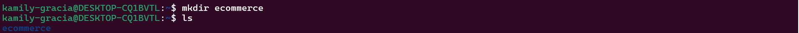
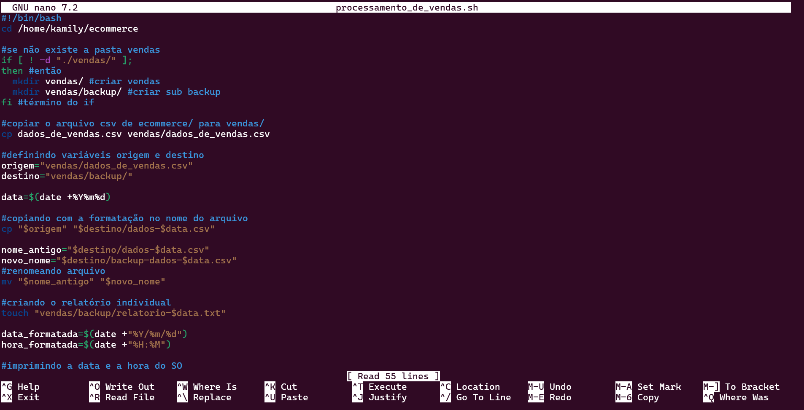
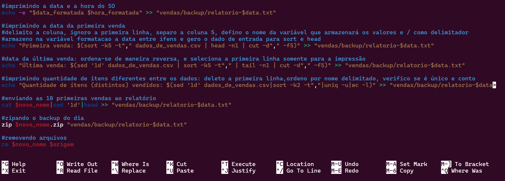
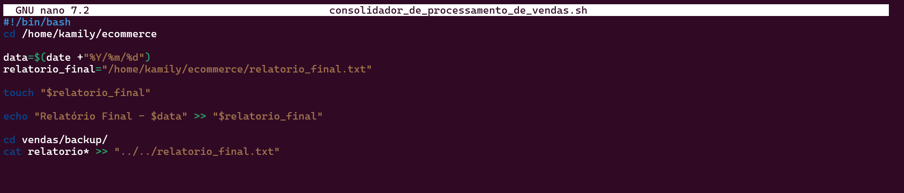
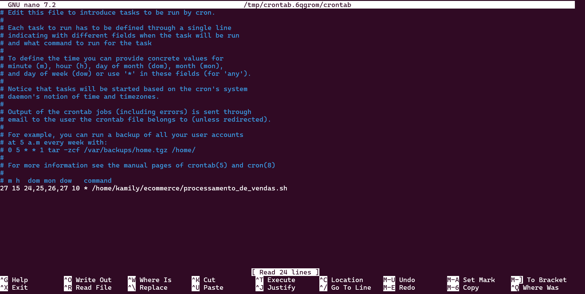
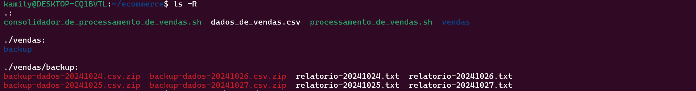

# Informações

Na primeira sprint, pude, por meio de vídeo-aulas, aprender sobre o sistema operacional **Linux (Ubuntu)**, o desenvolvimento em **Shell** e o funcionamento das ferramentas **Git** e **GitHub**. Ademais, pude colocar em prática os conhecimentos aprendidos na execução do **[desafio](./Desafio/README.md)** que consistia em criar executáveis em Shell para a manipulação de arquivos.

# Resumo

**Git Hub:** Pude aprender o funcionamento do servidor e suas ferramentas, além dos comandos necessários para trabalhar com os repositórios armazenados de forma local e remota. Sendo os mais utilizados no dia a dia:

**1. Criar e clonar repositórios**
   
Permite iniciarmos o repositório de maneira local e realizarmos a conexão via link com o repositório remoto.

``` Git
    git init 
    git commit -m "first commit"
    git branch -M main
    git remote add origin <<link_do_repositório>>
    git push -u origin main
```
Permite clonar o repositório já existente no servidor na pasta atual e realizar mudanças que podem ou não serem comitadas.

``` Git
    git clone <<link_do_repositorio>> .
```
**2. Enviar ao servidor mudanças (de arquivos, branchs, tags)**
   
``` Git
    git add . ou git add <<nome_do_arquivo>>
    git commit -a -m"Mensagem a ser comitada"
    git push
```
**3. Atualizar as mudanças realizadas de forma remota na pasta local**

```Git
    git pull
```

Pude também conhecer acerca das boas práticas para ambientes de desenvolvimento colaborativo, como:

* A criação de branchs para isolar novas funcionalidades e não causar erros no arquivo principal;
* A criação de tags para isolar versões e permitir a restauração de códigos;
* A maneira correta de escrever commits que tenham a semÂntica que permitirá a interpretação fluida dos processos.
___
<br/>

**Linux:** Pude aprender comandos básicos e intermediários realizados no terminal e em linguagem Shell que permitem a interação com o sistema operacional e a manipulação de arquivos. Tais como:

**1. Movimentar-se entre as pastas de diretório**
```bash
    cd -argumento
```
**2. Listar arquivos do diretório**
```bash
    ls -argumento
```
**3. Exibição do caminho do diretório atual**
```bash
    pwd
```
**4. Cópia de arquivos para outros locais**
```bash
    cp arquivo caminho/desejado/nome_do_arquivo
```
**5. Mudança de local do arquivo ou renomeação**
```bash
    #mudaça de pasta
    mv arquivo nova/pasta/novo_nome_do_arquivo
    #renomeação
    mv arquivo novo_nome_do_arquivo
```
Pude também  me aprofundar sobre seus argumentos que facilitam a realização de tarefas na rotina. Além disso tive contato com outras funcionalidades que podem ser acessadas via terminal, como:
 * Os editores de texto **nano** e **vim**;
 * Gerenciadores de pacotes;
 * Gerenciadores de grupo/usuário;
 * Gerenciadores de rede.
___

Em suma, durante a sprint, muitos conhecimentos foram agregados de forma teórica e prática. Embora este não tenha sido meu primeiro contato com as tecnologias apresentadas, aproveitei a oportunidade para aprofundar meu entendimento e explorar aspectos que anteriormente só havia abordado de forma superficial. O que me permitiu aplicar conceitos mais complexos, identificar melhores práticas e ganhar maior confiança no uso das ferramentas. 

# Evidências

Pode-se dividir as evidências em alguns tópicos que podem ser aprofundados individualmente na seção Desafio:

* [Preparação](desafio/README.md#preparação);
* [Desafio - Script 1](desafio/README.md#o-desafio---criação-de-executáveis);
* [Desafio - Agendamento](desafio/README.md#2-agendamento-do-script);
* [Desafio - Script 2](desafio/README.md#3-consolidador_de_processamento_de_vendassh);
* [Desafio - Resultados](desafio/README.md#execuções---resultados);
* [Problemas encontrados](desafio/README.md#problemas-encontrados);

No desafio, foi solicitada a etapa preparatória do ambiente para o armazenamento de arquivos e pastas, como resultado houve então a criação da pasta ecommerce e o download do arquivo disponibilizado, como visualiza-se nas imagens abaixo:




Em seguida, foi solicitada a criação dos executáveis _processamento_de_vendas.sh_ responsável pela geração de relatórios a partir de um arquivo alimentado diariamente e o _consolidador_de_processamento de_vendas.sh_, executavel responsável pela união dos relatórios. Ao final da elaboração dos scripts os códigos configuram-se da seguinte forma:

**Processamento de Vendas - Script Final**





**Consolidador de Processamento de Vendas - Script Final**



O **agendamento**, realizado pelo utilitário crontab também foi utilizado para a realização automática do script durante os dias 24, 25, 26 e 27 de outubro de 2024.



**Diretórios ao final do desafio**



**Dificuldades Encontradas**

* Configuração das funções de registro da primeira e última venda no script _processamento_de_vendas.sh_