# Orientações

O desafio consiste em criar duas estruturas de organização de dados: o Modelo Relacional e o Modelo Dimensional.

Para isso, foi disponibilizado um banco de dados onde todos os dados da concessionária estavam concentrados em uma única tabela chamada tb_locacao. O objetivo do desafio é realizar a normalização dessas informações, seguindo as [Formas Normais](../README.md#2-normalização-de-tabelas), criando tabelas estruturadas e organizadas que atendam aos requisitos do Modelo Relacional e do Modelo Dimensional, facilitando o acesso e a análise dos dados.

<div style="text-align: center;">
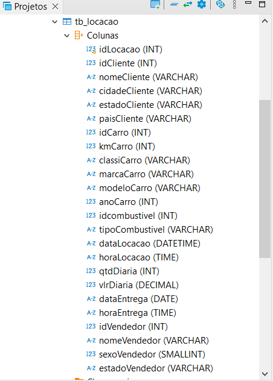
</div>
<br>

# Etapas

[Etapa I - Script SQL do Modelo Relacional](./etapa-1/Desafio%20MER.sql)

## 1. Modelagem Relacional

Começando pelo modelo relacional, foi necessário dividir os dados presentes nas tabelas locação em diferentes entidades:

* Tabela Cliente

A tabela 'Cliente' então deve reunir todos os atributos relacionados ao cliente, como seu id, nome, cidade, estado e país.

Ao observar na tabela de origem 'tb_locacao', nota-se a repetição de id's devido as múltiplas vezes que o cliente realizou a locação, violando então a 1FN. 

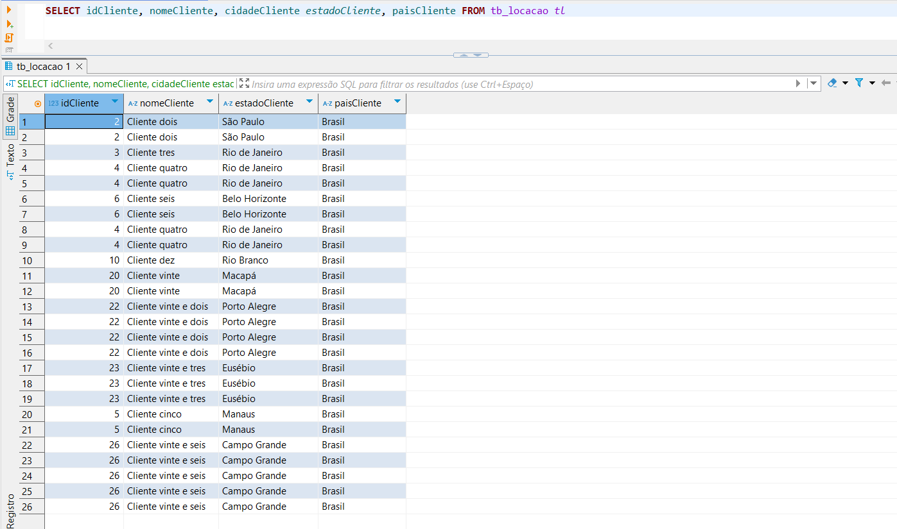

Para normalizar está tabela foi utilizada a lógica de distinção dos ids na inserção dos dados, por meio da linha:

```SQL
    DISTINCT idCliente
```

Possibilitando então a eliminação da repetição dos id's, e estes tornaram-se chaves primárias para a identificação do cliente:

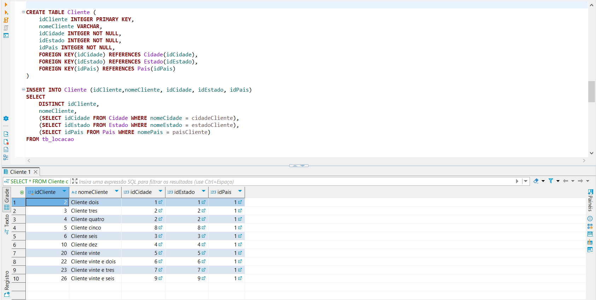

Além disso, observa-se que na tabela Cliente foi mantida apenas a visualização do atributo não-chave 'nomeCliente', que está em conformidade com a 2ª Forma Normal (2FN), pois depende exclusivamente da chave primária. Os atributos 'cidadeCliente', 'estadoCliente' e 'paisCliente' foram realocados para as novas tabelas 'Cidade', 'Estado' e 'Pais'. Essa alteração visa otimizar a estrutura do banco de dados, pois, caso haja a necessidade de incluir novos dados ou realizar alterações nessas informações, as modificações poderão ser feitas centralmente nas tabelas correspondentes, sem a necessidade de atualizar cada registro da tabela Cliente individualmente. As novas tabelas puderam então relacionar-se com a tabela 'Cliente' por meio das chaves estrageiras (id's gerados automáticamente).

* Tabela Cidade

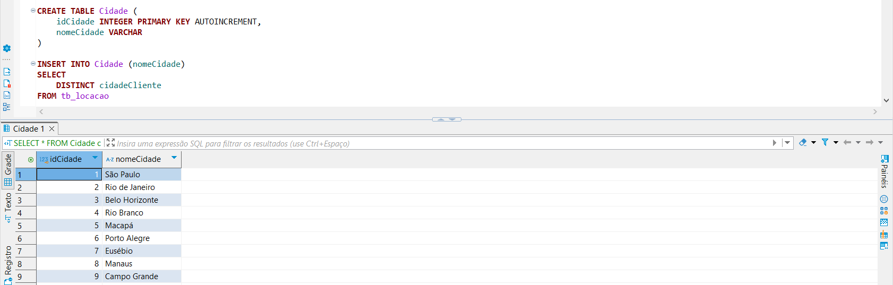

* Tabela Estado 

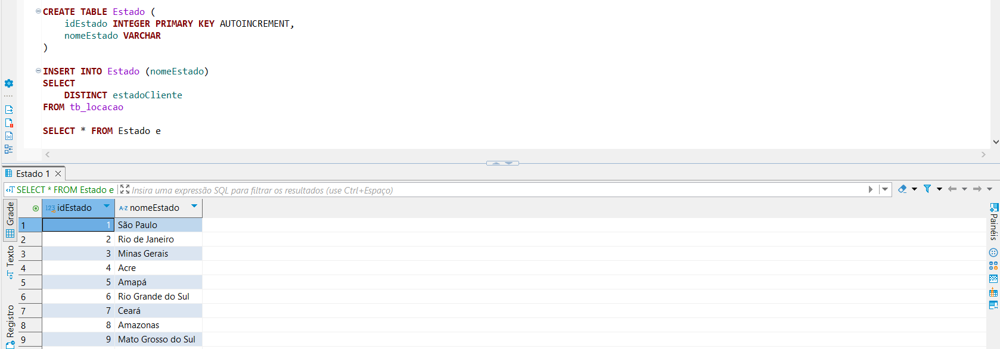

* Tabela País 

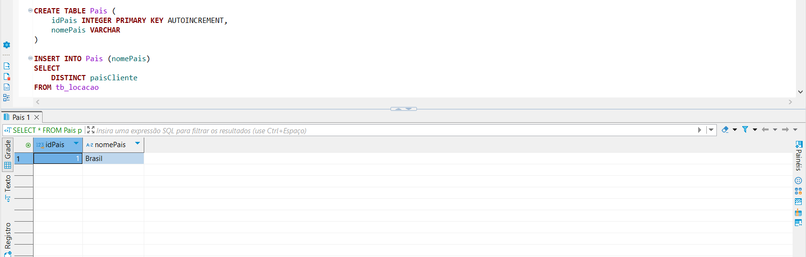

* Tabela Carro

Ao reunir todos os atributos relacionados ao carro na tabela Locação, observam-se diversas redundâncias e inconsistências em relação às formas normais.

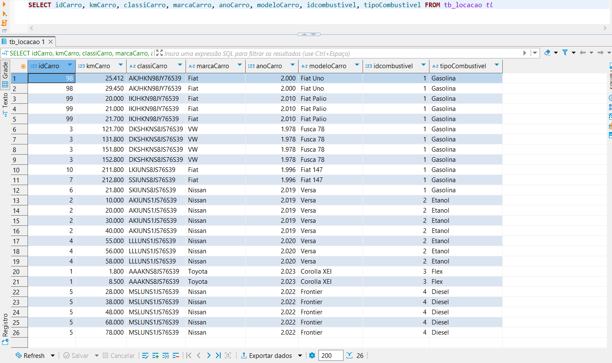

Pode-se citar como inconsistência:

* A repetição dos id's devido ao fato de que o carro foi alocado várias vezes e como resultado, dados como o kmCarro (quilometragem do carro) são alterados a cada nova locação. Isso contraria a 1ª Forma Normal (1FN), que exige que os dados da tabela não contenham valores repetidos ou múltiplos valores em uma mesma célula.
  * Isto exigiu a aplicação da seguinte lógica: colher apenas a última quilometragem do carro para ser exibida ao usuário, uma vez que está estará sempre atualizando-se. Esta condição foi feita a partir da seguinte linha:
  ```SQL
    WHERE (idCarro, kmCarro) IN 
        (SELECT idCarro, MAX(kmCarro) FROM tb_locacao GROUP BY idCarro) -- Seleciona apenas a última quilometragem (última locação)  
  ```
  * Além disso também foi utilizado o comando DISTINCT para o recolhimento de id's que fossem distintos e estes puderam tornar-se então chaves primárias.
  ```SQL
    DISTINCT idCarro -- Inserção de id's diferentes na tabela Carro
  ```
  
* Existe uma dependência transitiva entre os atributos 'idCombustivel' e 'tipoCombustivel', uma vez que o tipo do combustível não depende da chave primária 'idCarro' e sim do 'idCombustivel' violando a 3FN este atributo deve ser realocado para uma nova tabela;

Normalizada a tabela 'Carro' temos então a seguinte visualização:

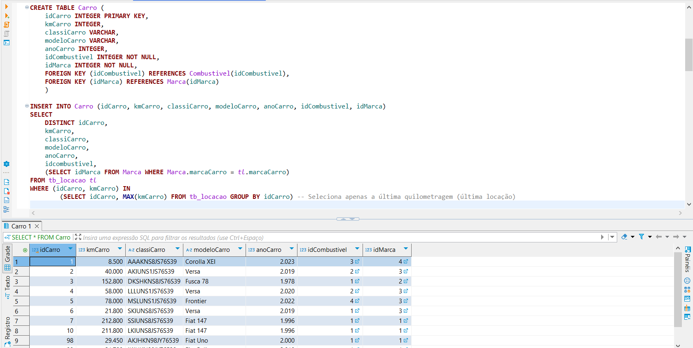

Observação: A marca do Carro, foi também realocada para uma nova tabela visando a otimização de alterações futuras.

Sendo assim disponibiliza-se a visualização do scrpt de criação das tabelas secundárias 'Combustível' e 'Marca':

* Tabela Combustível

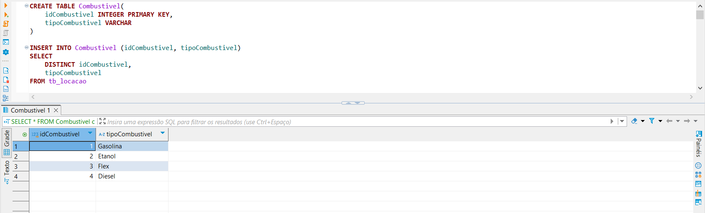

* Tabela Marca

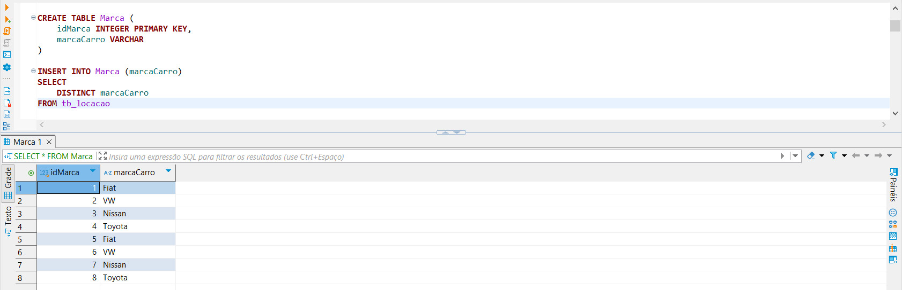

* Tabela Vendedor

Reunindo as informações referentes ao vendedor na tabela 'tb_locacao', temos que:

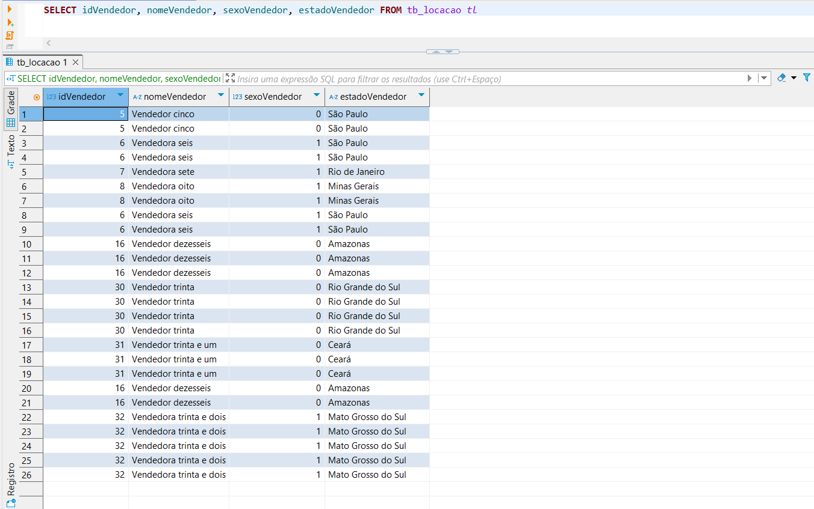

* Id's são repetidamente apresentados devido as diversas locações que o vendedor está presente. Foi então utilizado o comando DISTINCT na inserção de dados na tabela Vendedor para torná-los chaves primárias distintas.
```SQL
    DISTINCT Vendedor -- Inserção de id's diferentes na tabela Vendedor
```

* O atributo 'estadoVendedor' possui os mesmos dados que o atributo 'estadoCliente' que foi realocado para a tabela 'Estado', sendo assim pôde-se realizar a relação entre esta tabela e a tabela Vendedor a ser criada, relacionando-se pelo id do Estado gerado automaticamente.

A tabela Vendedor então apresenta as seguintes colunas:

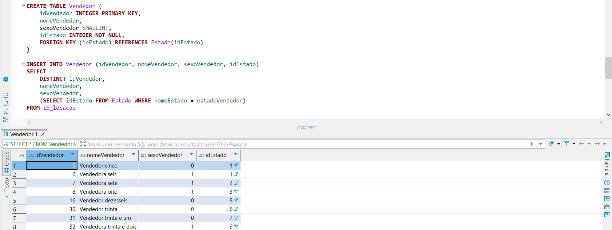

* Tabela Locação

Por fim, a tabela locação reúne os dados que estão sempre em constante atualização, além dos id's das entidades que fazem parte do evento, ou seja, do Carro, do Vendedor e do Cliente. Consultando os dados que compõem o evento da locação na tabela original, visualizamos a seguinte tabela:

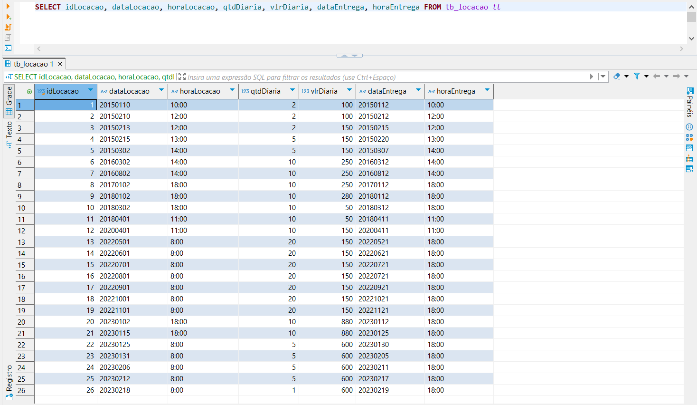

Após a criação da tabela 'Locacao', temos a seguinte visualização:

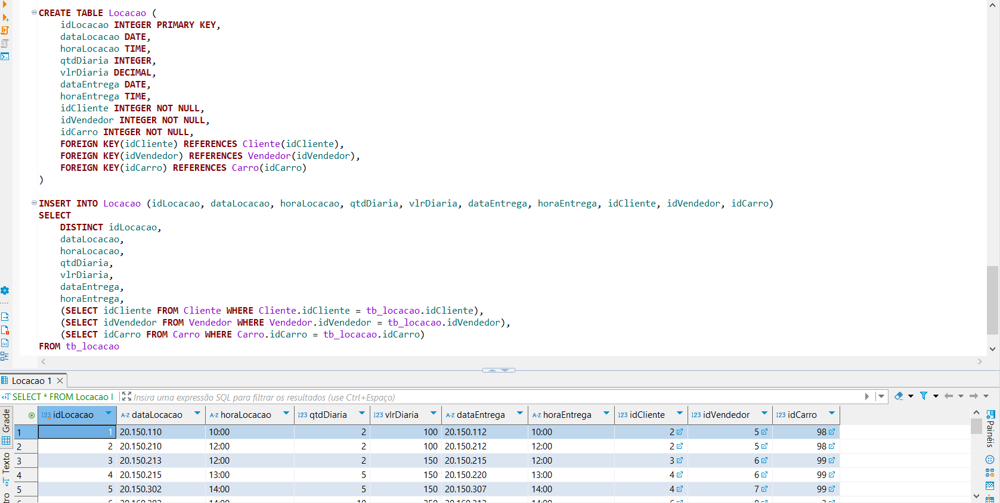

Observação: o formato da data exibido é uma configuração do banco de dados para a visualização da informação. Em formato nativo, ainda é apresentada no formato 'yyyy-mm-dd.

### Diagrama Entidade-Relacionamento

Após a conclusão da criação e inserção de dados nas novas tabelas chegamos então na seguinte demonstração visual das entidades:

<div style="text-align: center;">

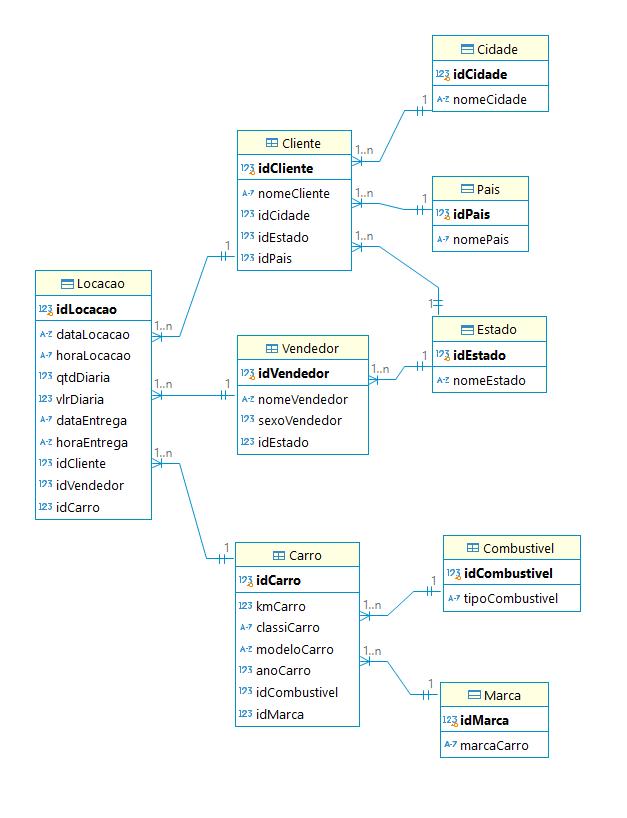

</div>

* Cardinalidade entre as entidades

Nota-se que as associações possuem cardinalidade 'um para muitos' ou 'muitos para um', isto observa-se em:

* Um cliente pode estar associados a muitas locações, ao contrário, cada locação pode haver apenas um cliente;
  
* Um tipo de combustível pode estar associado a muitos carros diferentes, ao contrário, cada carros só possui um tipo de combustível aceito.

* Um estado pode estar associado a muitos clientes e vendedores, mas cada um destes reside em apenas um estado.

Tal lógica pode ser sucessivamente aplicada para as demais associações.

## 2. Modelagem Dimensional

[Etapa II - Script SQL do Modelo Dimensional](./etapa-2/Script-Views.sql)

A segunda etapa do desafio consiste na criação do modelo dimensional, utilizando as tabelas previamente criadas na etapa anterior.

O modelo dimensional tem como principal característica o agrupamento de todos os atributos de uma entidade ou dimensão em uma única tabela ou view. Isso permite uma organização mais eficiente dos dados voltados para análise. Já os atributos relacionados a eventos ou transações, que capturam os dados operacionais, devem ser armazenados na tabela fato.

Durante esse processo, o relacionamento entre as tabelas é estabelecido por meio de JOINS, que permitem vincular as tabelas dimensão umas às outras e à tabela fato, garantindo que a análise de dados seja realizada de maneira integrada e coerente.

* Dimensão Cliente

A tabela dim_Cliente agrega todos os atributos relacionados ao cliente, como nome, cidade, estado e país. A estrutura do relacionamento com as outras tabelas (Estado, Cidade e País) é estabelecida por meio de LEFT JOINs, permitindo acessar as informações relevantes de cada cliente, independentemente da presença de dados associados.

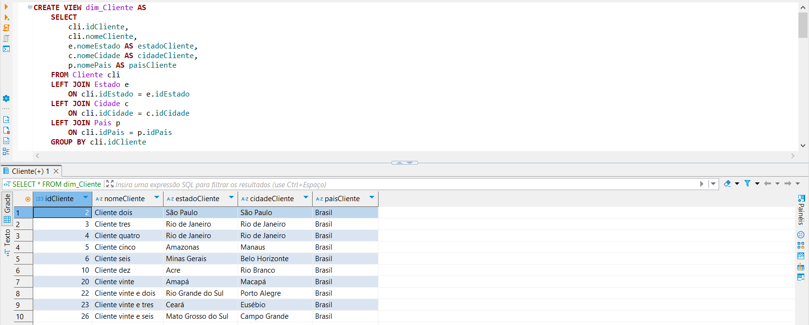

* Dimensão Carro

A tabela dim_Carro agrega os atributos do carro, incluindo o modelo, ano, quilometragem, a marca e o combustível. A exposição dos atributos que antes estavam nas tabelas 'Combustivel' e 'Marca' se dá pelo uso do LEFT JOIN que associa os id's semelhantes nas tabelas selecionadas. 

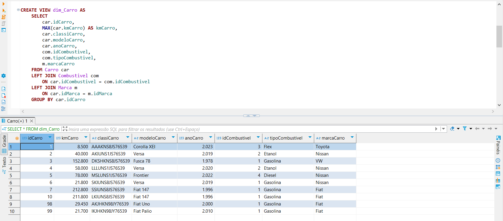

* Dimensão Vendedor

A tabela dim_Vendedor organiza as informações sobre os vendedores, incluindo nome, sexo e o estado em que atuam. Da mesma forma que as outras dimensões, essa tabela é construída com LEFT JOIN para associar dados do estado de atuação do vendedor.

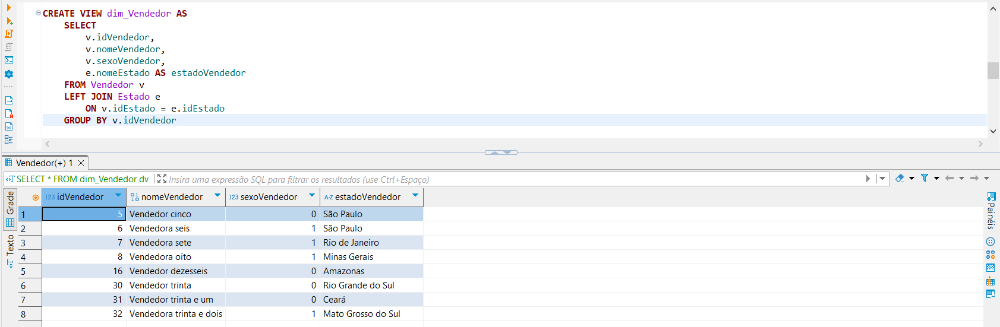

* Tabela Fato Locação

A tabela fato Locação é responsável por registrar os detalhes das transações de locação. Ela contém informações sobre cada locação, como data, hora, valor e quantidade de diárias, além de vincular cada locação aos registros de cliente, vendedor e carro, por meio de LEFT JOINs. Isso permite que cada evento de locação seja associado a uma dimensão relevante para a análise, como o cliente que alugou, o carro alugado e o vendedor que fez a venda.

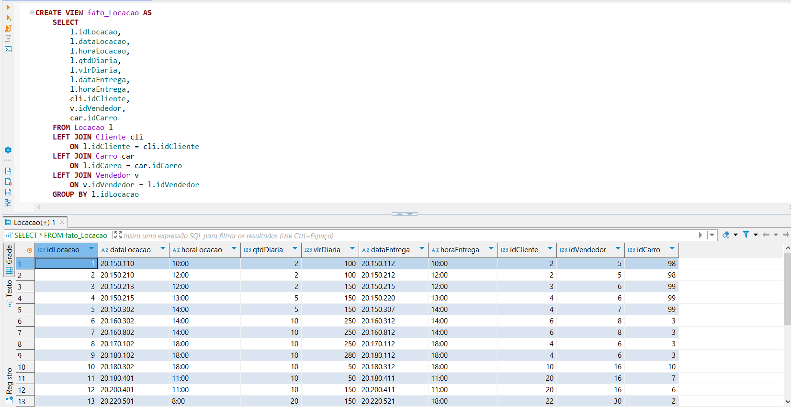

Após a criação das views para as dimensões e a tabela fato, o modelo dimensional foi representado no diagrama a seguir, utilizando a abordagem Star-Schema. Nesse modelo, as tabelas de dimensão são dispostas em torno da tabela fato, formando um esquema em estrela que facilita a consulta e a análise dos dados.

<div style="text-align: center;">

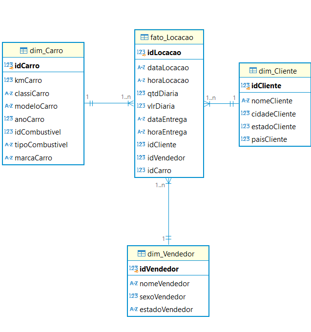

</div>
 
