# Informações

Na segunda sprint, pude aprender sobre banco de dados **SQL**, desde seu planejamento a fim organizar os dados que suprirão um sistema, satisfazendo assim as necessidades de um negócio, até seu desenvolvimento e otimização visando o fornecimento de informações claras e precisas que garantem uma boa tomada de decisão. Além disso, com o curso da **AWS** pude aprender <!--continuar-->

# Resumo

**SQL:** Por meio de vídeo aulas, exercícios e a leitura de materiais, pude aprender os comandos utilizados para a manipulação de tabelas e seus dados contidos com base nas formas de normalização buscando manter o banco de dados livre de redundâncias e inconsistências. Pode-se então dividir os conceitos nos seguintes tópicos:

## 1. Comandos SQL

<details>
<summary>Comandos Básicos;</summary>

```SQL
    SELECT coluna1, coluna2 -- Seleciona colunas de uma tabela

    SELECT DISTINCT coluna1 -- Seleciona valores distintos de uma coluna

    SELECT * -- Seleciona todas as colunas da tabela

    FROM tabela1 -- Define a(s) tabelas a ser(em) explorada(s)
    
    WHERE condicao = true -- Define condição para a seleção

    HAVING condicao_calculada = true -- Como o where, define uma condição para a seleção, diferenciando-se por aceitar condições que são calculadas por meio de funções.
    
    GROUP BY coluna1, coluna2 -- Agrupa os ítens semelhantes - evitando a repetição de linhas (o mesmo ocorre em GROUP BY 1,2)

    ORDER BY 1,2 -- Ordena a exibição de maneira crescente, onde 1 representa a "tabela1" e 2, a "tabela2"
    -- Caso for necessário ordenar de maineira decrescente, acrescentar "DESC" ao comando, ex. ORDER BY 1 DESC

    LIMIT N -- Limita a exibição ao número (N) de linhas definido
```
</details>

<details>
<summary>Operadores Aritméticos;</summary>


```SQL
    +  -- Soma de valores entre colunas ou constantes
    -- Exemplo (soma das colunas "salario" e "bonus" - resultado será exibido em uma nova coluna "total"):
    SELECT salario + bonus AS total FROM funcionarios;
    
    -  -- Subtração de valores
    -- Exemplo (subtração das colunas "preco" e "desconto" - resultado será exibido em uma nova coluna "preco_final") 
    SELECT preco - desconto AS preco_final FROM produtos;
    
    *  -- Multiplicação de valores
    -- Exemplo (multiplicação das colunas "quantidade" e "preco_unitario - resultado será exibido em uma nova coluna "pedidos")
    SELECT quantidade * preco_unitario AS total FROM pedidos;
    
    /  -- Divisão de valores, onde o divisor não pode ser zero
    -- Exemplo (divisão da coluna "total_vendas" por 12 - resultado será exibido em uma nova coluna "media_mensal")
    SELECT total_vendas / 12 AS media_mensal FROM vendas;
   
    %  -- Resto da divisão entre valores (módulo)
    -- Exemplo (divisão da coluna id por 2 e exibição de seu resto)
    SELECT id % 2 AS resto FROM usuarios;

    ^ -- Potenciação de valores
    -- Exemplo (2³ - retorno na nova coluna "resultado")
    SELECT 2 ^ 3 AS resultado;  

    || --Concatenação de strings
    -- Exemplo (junção das colunas "nome" e "sobrenome" na nova coluna "nome_completo")
    SELECT nome || ' ' || sobrenome AS nome_completo
    FROM usuarios;
```
</details>

<details>
<summary>Funções de agregação;</summary>

```SQL
    COUNT(*) -- Contagem de linhas ou valores não nulos de uma coluna

    SUM(coluna_x) --Calcula a soma de valores em uma coluna numérica.

    MIN(coluna_y) -- Filtra o menor valor entre as linhas

    MAX(coluna_z) -- Filtra o maior valor entre as linhas

    AVG(coluna_k) -- Calcula a média entre os valores
```
</details>

<details>
<summary> Join; </summary>

```SQL
    INNER JOIN  -- Retorna apenas as linhas que têm correspondência em ambas as tabelas
    -- Exemplo:
    SELECT A.nome, B.departamento
    FROM funcionarios A
    INNER JOIN departamentos B ON A.departamento_id = B.id;

    LEFT JOIN  -- Retorna todas as linhas da tabela à esquerda e as correspondências da tabela à direita; onde não há correspondência, retorna NULL
    -- Exemplo:
    SELECT A.nome, B.departamento
    FROM funcionarios A
    LEFT JOIN departamentos B ON A.departamento_id = B.id;

    RIGHT JOIN  -- Retorna todas as linhas da tabela à direita e as correspondências da tabela à esquerda; onde não há correspondência, retorna NULL
    -- Exemplo:
    SELECT A.nome, B.departamento
    FROM funcionarios A
    RIGHT JOIN departamentos B ON A.departamento_id = B.id;

    FULL JOIN  -- Retorna todas as linhas quando há correspondência em pelo menos uma das tabelas, e NULL onde não há correspondência
    -- Exemplo:
    SELECT A.nome, B.departamento
    FROM funcionarios A
    FULL JOIN departamentos B ON A.departamento_id = B.id;

```
</details>

<details>
<summary>Union e Union All;</summary>

```SQL
    UNION  -- Combina os resultados de duas consultas e remove linhas duplicadas
    -- Exemplo:
    SELECT nome FROM clientes
    UNION
    SELECT nome FROM fornecedores;

    UNION ALL  -- Combina os resultados de duas consultas e mantém todas as linhas, incluindo duplicadas
    -- Exemplo:
    SELECT nome FROM clientes
    UNION ALL
    SELECT nome FROM fornecedores;
```
</details>

<details>
<summary>Subquery;</summary>

```SQL
    -- Realizam consultas e são executadas junto aos comandos:

    Subquery em WHERE -- Retorna um conjunto de valores que será usado como condição
    -- Exemplo:
    SELECT nome FROM funcionarios
    WHERE departamento_id IN (SELECT MIN(id) FROM departamentos);

    Subquery em SELECT -- Retorna um valor que será exibido como uma coluna
    -- Exemplo:
    SELECT nome, 
           (SELECT COUNT(*) FROM projetos) AS total_projetos
    FROM funcionarios;

    Subquery em FROM -- Executa uma subquery como uma tabela temporária - não recomendado
    -- Exemplo:
    SELECT sub.categoria, sub.quantidade_total
    FROM (
        SELECT categoria, SUM(quantidade) AS quantidade_total
        FROM produtos
        GROUP BY categoria
    ) AS sub
    WHERE sub.quantidade_total > 100;

    Subquery com WITH -- Realiza uma consulta prévia e esta pode ser implementada na query principal
    -- Exemplo:
    WITH total_por_categoria AS (
        SELECT categoria, SUM(quantidade) AS quantidade_total
        FROM produtos
        GROUP BY categoria
    )
    SELECT categoria, quantidade_total
    FROM total_por_categoria
    WHERE quantidade_total > 100;    
```
</details>

<details>
<summary>Tratamento de dados;</summary>

```SQL
    :: -- Conversão de unidade
    -- Exemplos:
    SELECT '2021-10-01'::DATE
    SELECT coluna1::TEXT | SELECT '100'::NUMERIC

    CASE WHEN -- Condicional (if-else)
    -- Exemplo:
    SELECT nome,
       CASE WHEN salario > 5000 THEN 'Alto'
            ELSE 'Baixo' END AS faixa_salarial
    FROM funcionarios;

    COALESCE() -- Verifica a partir do primeiro campo quais dados são nulos, se houver, retorna o segundo e assim sucessivamente 
    SELECT nome, COALESCE(email, 'email_não_fornecido') AS email
    FROM clientes;

    LOWER(nome) -- Converte texto para letras minúsculas

    UPPER(nome) -- Converte texto para letras maiúsculas

    TRIM() -- Remove espaços das extremidades de um texto
    -- Exemplo:
    SELECT TRIM(nome) AS nome_ajustado
    FROM clientes;

    REPLACE() -- Substitui uma substring por outra dentro de um texto
    -- Exemplo:
    SELECT REPLACE(nome, 'Maria', 'Ana') AS nome_ajustado
    FROM clientes;

    INTERVAL() -- Define intervalos de tempo para operações com datas
    -- Exemplo:
    SELECT NOW() + INTERVAL '7 days' AS data_proxima_semana;

    DATE_TRUNC -- Trunca uma data/hora para uma parte específica (como ano, mês, etc.)
    -- Exemplo: 
    SELECT DATE_TRUNC('month', NOW()) AS inicio_do_mes;

    EXTRACT — Extrai uma parte específica de uma data/hora (como dia, mês, ano).
    -- Exemplo:
    SELECT EXTRACT(year FROM data_nascimento) AS ano_nascimento
    FROM clientes;    
```
</details>

<details>
<summary>Funções;</summary>

```SQL 
    CREATE FUNCTION nome_funcao(parametro1, parametro2)
    RETURNS tipo_de_retorno
    LANGUAGE linguagem_a_ser_lida
    AS
        $$
            --Lógica da função
        $$
```
</details>

<details>
<summary>Manipulação de tabelas;</summary>

* Criação de tabelas a partir de uma Query 
```SQL
    SELECT 
        atributo1,
        atributo2,
    INTO nova_tabela
    FROM tabela_original
```

  * Criação de tabelas do zero
```SQL
    CREATE TABLE nova_tabela (
        coluna1,
        coluna2
    )
```

  * Deleção de tabelas
```SQL
    DROP tabela
```

  * Inserção de linhas
```SQL
    INSERT INTO tabela (coluna1, coluna2) 
    VALUES
        (dado_col_1, dado_col2),
        (dado_col_1, dado_col2)
```

  * Atualização de linhas
```SQL
    UPDATE tabela
    SET coluna_x  = 'alteração'
    WHERE condicao = true
```

  * Deleção de linhas
```SQL
    DELETE FROM tabela
    WHERE condicao = true
```

  * Inserção de colunas

```SQL
    ALTER TABLE tabela
    ADD nova_coluna int -- definir o tipo dos dados a serem inseridos na coluna
```

  * Alteração de colunas
```SQL

    -- ALTERAÇÃO DO TIPO --
    ALTER TABLE tabela
    ALTER COLUMN coluna1 TYPE TIPO_DESEJADO

    -- ALTERAÇÃO DE NOME --
    ALTER TABLE tabela
    RENAME COLUMN nome_atual to novo_nome
```

  * Deleção de coluna
```SQL
    ALTER TABLE tabela
    DROP COLUMN coluna
```
</details>

## 2. Normalização de tabelas 

Para garantir que os dados nas tabelas estejam organizados de forma eficiente, minimizando redundâncias e inconsistências, existe o processo de normalização. Esse processo consiste em aplicar uma série de regras cumulativas para organizar os dados em várias tabelas inter-relacionadas, facilitando o armazenamento e o acesso eficiente. A normalização melhora a integridade dos dados e facilita sua visualização e manutenção ao longo do tempo. Sendo assim, pode-se citar as seguintes formas normais integrantes desse processo:

### 1ª Forma Normal 

A primeira forma normal (1NF) tem como objetivo eliminar atributos compostos nas tabelas, ou seja, campos que contêm mais de uma informação em um único atributo. Para adequar uma tabela à 1NF, é necessário decompor esses atributos em novas tabelas, onde cada dado seja armazenado de forma independente.

Por exemplo, o atributo 'endereço' pode conter várias informações, como logradouro, número, bairro, cidade, estado e país. Para organizar esses dados de maneira separada e estruturada, podemos criar tabelas específicas para cada uma dessas informações. Em seguida, usamos chaves estrangeiras para relacionar essas novas tabelas com a tabela original, assegurando que os dados estejam devidamente normalizados e interligados.

### 2ª Forma Normal

A segunda forma normal (2NF) é alcançada quando a tabela já está na primeira forma normal (1NF) e todos os atributos não-chave dependem integralmente da chave primária. Isso significa que, em tabelas com chaves primárias compostas (formadas por mais de um atributo), não deve haver atributos que dependam apenas de parte dessa chave; todos os atributos não-chave devem depender da chave completa.

Para garantir a conformidade com a 2NF, os atributos não-chave que dependem apenas parcialmente da chave primária devem ser movidos para tabelas separadas, onde se tornarão totalmente dependentes de novas chaves primárias. Essas novas tabelas se relacionam com a tabela original através de chaves estrangeiras.

Por exemplo: Em uma tabela que possui uma chave primária composta pelos atributos 'id_cliente' e 'id_projeto', o atributo 'nomeCliente' por depender somente de 'id_Cliente' deve ser movido para uma nova tabela que se relacionará com a tabela original por meio da chave estrangeira.

### 3ª Forma Normal

A terceira forma normal (3NF) visa eliminar dependências transitivas, ou seja, situações em que um atributo não-chave depende de outro atributo não-chave, em vez de depender diretamente da chave primária. Assim como a segunda forma normal (2FN), esta etapa é atendida quando as etapas anteriores estão em conformidade e todos os atributos não-chave devem depender exclusivamente da chave primária.

Por exemplo: Em uma tabela que possua como chave primária 'id_funcionário' e os atributos não chave 'id_departamento' e 'nomeDepartamento', neste caso há uma transitividade entre os atribustos não-chave pois 'nomeDepartamento' não depende da chave primária e sim de outro atributo. Sendo assim faz-se necessária a criação de uma nova tabela, onde o atributo'nomeDepartamento' dependerá da chave primária 'id_Departamento' e está por sua vez será uma chave estrangeira na tabela original.
___

**AWS Partner: Sales Accreditation (Business):** No curso, aprendi sobre o funcionamento dos microserviços da AWS e sobre estratégias para lidar com objeções de clientes interessados em adquirir esses recursos. A AWS oferece inúmeras oportunidades de negócios e opções personalizadas de gerenciamento e financiamento para facilitar a adoção da nuvem. Cada perfil de cliente tem acesso a uma variedade de recursos adaptáveis às suas necessidades, ajudando-os a crescer juntamente com tamanha multinacional.

___

# Exercícios

Ao todo, 18 atividades práticas foram realizadas com foco em manipulação de tabelas, podendo dividi-las em 3 partes:

## 1. Estudo de Caso: **Biblioteca**


### Exercício 1. 

Apresente a query para listar todos os livros publicados após 2014. Ordenar pela coluna cod, em ordem crescente, as linhas.  Atenção às colunas esperadas no resultado final: cod, titulo, autor, editora, valor, publicacao, edicao, idioma. 

[**Resolução**](./Exercicios/Exercicio-01.sql)


```SQL
    SELECT * -- Realiza a seleção de todas as colunas
    FROM livros -- Define a fonte da consulta na tabela livros
    WHERE publicacao >= '2015-01-01' -- Define a condição para a consulta, neste caso, na coluna "publicaco", buscará por todas as datas que são maiores ou iguais (>=) a data estabelecida
    ORDER BY cod -- Define que a ordenação dos valores, tomando como base a coluna "codigo", será de forma crescente
```

### Exercício 2

Apresente a query para listar os 10 livros mais caros. Ordenar as linhas pela coluna valor, em ordem decrescente.  Atenção às colunas esperadas no resultado final:  titulo, valor.

[**Resolução**](./Exercicios/Exercicio-02.sql)

```SQL
    SELECT titulo, valor -- Seleção das colunas especificadas
    FROM livro -- Fonte dos dados: tabela livro
    ORDER BY valor DESC -- Ordenação dos livros pelo valor de maneira decrescente (do mais caro ao mais barato)
    LIMIT 10 -- Limita a exibição em até dez linhas
```

### Exercício 3

Apresente a query para listar as 5 editoras com mais livros na biblioteca. O resultado deve conter apenas as colunas quantidade, nome, estado e cidade. Ordenar as linhas pela coluna que representa a quantidade de livros em ordem decrescente.

[**Resolução**](./Exercicios/Exercicio-03.sql)

```SQL
    SELECT  -- Seleção das colunas especificadas
        COUNT(livro.cod) AS quantidade, -- Contagem de ocorrências de cada código será exibida na nova coluna "quantidade"
        editora.nome, 
        ende.estado,
        ende.cidade
    FROM editora -- Fonte: tabela "editora"
    LEFT JOIN livro -- juntamente à tabela "livro"
        ON editora.codeditora = livro.editora -- As tabelas "editora" e "livro" se relacionam por meio do atributo código da editora
    LEFT JOIN endereco AS ende -- juntamente à tabela "endereço"
        ON editora.endereco = ende.codendereco -- Relacionamento entre as tabelas "endereço" e "editora" se dá por meio do atributo que define o código do endereço 
    GROUP BY editora.nome, ende.estado, ende.cidade -- Agrupamento dos dados realizados de forma sequencial a partir dos atributos, evitando repetições desnecessárias
    HAVING COUNT(livro.cod) > 0 -- Define a condição "Quantidade maior que 0"
    ORDER BY quantidade DESC -- Ordena de maneira decrescente pela quantidade
```
### Exercício 4

Apresente a query para listar a quantidade de livros publicada por cada autor. Ordenar as linhas pela coluna nome (autor), em ordem crescente. Além desta, apresentar as colunas codautor, nascimento e quantidade (total de livros de sua autoria).

[**Resolução**](./Exercicios/Exercicio-04.sql)

```SQL
    SELECT -- Seleção das colunas especificadas
        autor.nome,
        autor.codautor,
        autor.nascimento,
        COUNT(livro.cod) AS quantidade -- Cotagem de livros/códigos
    FROM autor -- Fonte: tabela autor
    LEFT JOIN livro -- juntamente a tabela livro
        ON autor.codautor = livro.autor -- Relacionamento estabelecido por meio do atributo código do autor
    GROUP BY autor.nome, autor.codautor, autor.nascimento -- Agrupamento sequencial
    ORDER BY autor.nome -- Ordenação da exibição a partir do nome do autor em ordem alfabética
```

### Exercício 5

Apresente a query para listar o nome dos autores que publicaram livros através de editoras NÃO situadas na região sul do Brasil. Ordene o resultado pela coluna nome, em ordem crescente. Não podem haver nomes repetidos em seu retorno.

[**Resolução**](./Exercicios/Exercicio-05.sql)

```SQL
    SELECT DISTINCT -- Seleção de diferentes ocorrências da coluna nome
	autor.nome
FROM autor -- Fonte: tabela autor
LEFT JOIN livro -- juntamente a tabela livro
	ON autor.codautor = livro.autor -- Relacionando-se por meio do atributo código do autor
LEFT JOIN editora -- juntamente a tabela editora
	ON livro.editora = editora.codeditora  -- Relacionando-se por meio do atributo código da editora
LEFT JOIN endereco -- juntamente a tabela endereço
	ON editora.endereco = endereco.codendereco -- Relacionando-se por meio do atributo código do endereço
WHERE endereco.estado not in ('PARANÁ', 'RIO GRANDE DO SUL')
-- Define a condição que o endereço da editora não está entre os argumentos evidenciados
ORDER BY autor.nome -- Em ordem alfabética exibe os nomes dos autores
```

### Exercício 6

Apresente a query para listar o autor com maior número de livros publicados. O resultado deve conter apenas as colunas codautor, nome, quantidade_publicacoes.

[**Resolução**](./Exercicios/Exercicio-06.sql)

```SQL
    SELECT -- Seleção das colunas especificadas
        DISTINCT autor.codautor, -- Distinct define que apenas códigos diferentes serão exibidos
        autor.nome,
        COUNT(livro.publicacao) AS quantidade_publicacoes -- Contagem de ocorrências do atributo publicacao
    FROM autor -- Fonte: tabela autor
    LEFT JOIN livro -- juntamente a tabela livro
        ON autor.codautor = livro.autor -- Relacionam-se por meio do código do autor
    GROUP BY autor.codautor, autor.nome -- Agrupamento sequencial pelas colunas selecionadas
    ORDER BY quantidade_publicacoes DESC -- Ordenação decrescente da quantidade de publicações
    LIMIT 1 -- Limita a exibição em uma linha (Autor que possui maior quantidade de publicações)
```

### Exercício 7

Apresente a query para listar o nome dos autores com nenhuma publicação. Apresentá-los em ordem crescente.

[**Resolução**](./Exercicios/Exercicio-07.sql)

```SQL
    SELECT DISTINCT -- Seleção de nomes distintos
        autor.nome
    FROM autor -- Fonte: tabela autor
    LEFT JOIN livro -- juntamente a tabela livro
        ON autor.codautor = livro.autor -- Relacionamento entre as tabelas se dá por meio do código do autor
    GROUP BY autor.nome -- Agrupamento realizado pelo nome
    HAVING COUNT(livro.publicacao) = 0 -- Condição estabelecida: Aqueles que possuirem 0 ocorrências na tabela publicacao, ou seja, que não possuam livros publicados
    ORDER BY COUNT(livro.publicacao) DESC -- Ordenação de maneira crescente
```
## 2. Estudo de Caso: **Loja**


### Exercício 8

Apresente a query para listar o código e o nome do vendedor com maior número de vendas (contagem), e que estas vendas estejam com o status concluída.  As colunas presentes no resultado devem ser, portanto, cdvdd e nmvdd.

[**Resolução**](./Exercicios/Exercicio-08.sql)

```SQL
    WITH agrupamento AS( -- Criada a subquery agrupamento
	SELECT 
		cdvdd, -- Selecionada a coluna código do vendedor
		COUNT(cdven) as contagem -- Contagem de ocorrências
	FROM tbvendas t -- Fonte: tabela vendas
	WHERE status = 'Concluído' -- Condição: Status concluído
	GROUP BY cdvdd -- Agrupamento e distinção dos códigos
	ORDER BY contagem -- Ordenação de maneira crescente
)
SELECT -- Seleção do código e nome do vendedor
	tbvendedor.cdvdd, 
	tbvendedor.nmvdd 
FROM tbvendedor -- Fonte: tabela vendedor
LEFT JOIN agrupamento -- juntamente à subquery criada
	ON tbvendedor.cdvdd = agrupamento.cdvdd -- Relacionamento: por meio do atributo código do vendedor
GROUP BY tbvendedor.cdvdd, tbvendedor.nmvdd -- Agrupamento sequencial pelo código e nome do vendedor
ORDER BY agrupamento.contagem DESC -- Ordenação decrescente pela contagem de ocorrências/vendas realizadas
LIMIT 1
```
### Exercício 9

Apresente a query para listar o código e nome do produto mais vendido entre as datas de 2014-02-03 até 2018-02-02, e que estas vendas estejam com o status concluída. As colunas presentes no resultado devem ser cdpro e nmpro.

[**Resolução**](./Exercicios/Exercicio-09.sql)

```SQL
    WITH mais_vendido AS ( -- Criação da subquery que calcula o produto mais vendido
	SELECT -- Seleção do código e a contagem de vendas
		cdpro,
		COUNT(cdven) as contagem
		FROM tbvendas -- Fonte: tabela vendass
		WHERE dtven between DATE('2014-02-03') and DATE('2018-02-02') AND status = 'Concluído' -- Condição: estar entre as dats especificadas
		GROUP BY cdpro -- Agrupamento pelo código do produto
		ORDER BY contagem DESC -- Odenação decrescente
)
SELECT -- Seleção do código e nome do produto
	tbvendas.cdpro,
	tbvendas.nmpro
FROM tbvendas -- Fonte: tabela vendas
LEFT JOIN mais_vendido -- juntamente à subquery
	ON tbvendas.cdpro = mais_vendido.cdpro -- Relacionam-se pelo código do produto
GROUP BY tbvendas.cdpro -- Agrupamento pelo códifo do produto
LIMIT 1 -- Limita-se a exibição de um produto (o mais vendido)
```

### Exercício 10

A comissão de um vendedor é definida a partir de um percentual sobre o total de vendas (quantidade * valor unitário) por ele realizado. O percentual de comissão de cada vendedor está armazenado na coluna perccomissao, tabela tbvendedor. 

Com base em tais informações, calcule a comissão de todos os vendedores, considerando todas as vendas armazenadas na base de dados com status concluído.

As colunas presentes no resultado devem ser vendedor, valor_total_vendas e comissao. O valor de comissão deve ser apresentado em ordem decrescente arredondado na segunda casa decimal.

[**Resolução**](./Exercicios/Exercicio-10.sql)

```SQL
    SELECT -- Seleção do nome , valor de vendas e comissao de cada vendedor
        tbvendedor.nmvdd AS vendedor,
        SUM(tbvendas.qtd * tbvendas.vrunt) as valor_total_vendas, -- Multiplica-se a quantidade de produtos por seus respectivos valores unitários e soma-se todas as vendas chegando no valor total
        ROUND(SUM(tbvendas.qtd * tbvendas.vrunt) * tbvendedor.perccomissao/100,2) as comissao -- Multiplicação da comissão individual pelo valor total de vendas e arredondamento do valor
    FROM tbvendas -- Fonte: tabela vendas
    LEFT JOIN tbvendedor -- juntamente a tabela vendedor
        ON tbvendas.cdvdd = tbvendedor.cdvdd -- Relacionamento se dá pelo código do vendedor
    WHERE tbvendas.status = 'Concluído'-- Condição: status concluído
    GROUP BY tbvendedor.nmvdd -- Agrupamento pelo nome do vendedor
    ORDER BY comissao DESC -- Ordenação decrescente pela comissão
```

### Exercício 11

Apresente a query para listar o código e nome cliente com maior gasto na loja. As colunas presentes no resultado devem ser cdcli, nmcli e gasto, esta última representando o somatório das vendas (concluídas) atribuídas ao cliente.

[**Resolução**](./Exercicios/Exercicio-11.sql)

```SQL
    SELECT -- Seleção das colunas código, nome do cliente e gasto
        cdcli,
        nmcli,
        SUM(vrunt * qtd) AS gasto -- Gasto calculado a partir da quantidade comprada e o valor unitário de cada produto
    FROM tbvendas -- Fonte: tabela vendas
    WHERE status = 'Concluído' -- Condição: status de venda concluído
    GROUP BY cdcli, nmcli -- Agrupamento sequencial pelo código e nome
    ORDER BY gasto DESC -- Ordenação decrescente a partir do gasto
    LIMIT 1 -- Limita-se a exibição de um cliente, aquele com o maior gasto
```
### Exercício 12

Apresente a query para listar código, nome e data de nascimento dos dependentes do vendedor com menor valor total bruto em vendas (não sendo zero). As colunas presentes no resultado devem ser cddep, nmdep, dtnasc e valor_total_vendas.

Observação: Apenas vendas com status concluído.

[**Resolução**](./Exercicios/Exercicio-12.sql)


```SQL
    SELECT -- Seleção dos atributos dos dependentes
        tbdependente.cddep,
        tbdependente.nmdep,
        tbdependente.dtnasc,
        SUM(tbvendas.qtd * tbvendas.vrunt) AS valor_total_vendas -- Soma do valor bruto total de vendas, calculado a partir da quantidade de produtos vendidos vezes o valor unitário
    FROM tbvendas -- Fonte: tabela vendas
    LEFT JOIN tbvendedor -- juntamente à tabela vendedor
        ON tbvendas.cdvdd =  tbvendedor.cdvdd -- Relação se dá pelo código do vendedor
    INNER JOIN tbdependente -- juntamente à tabela dependente
        ON tbvendedor.cdvdd = tbdependente.cdvdd -- Relação se dá pelo código do vendedor
    WHERE tbvendas.status = 'Concluído' -- Condição: status de venda concluído
    GROUP BY tbvendedor.cdvdd, tbdependente.cddep, tbdependente.nmdep, tbdependente.dtnasc -- Agrupamento sequencial
    HAVING valor_total_vendas > 0 -- Condição calculada: onde o valor total de vendas deve ser maior que 0
    ORDER BY valor_total_vendas -- Ordenação crescente pelo valor total de vendas
    LIMIT 1 -- Exibição limita-se a um 
```

### Exercício 13

Apresente a query para listar os 10 produtos menos vendidos pelos canais de E-Commerce ou Matriz (Considerar apenas vendas concluídas).  As colunas presentes no resultado devem ser cdpro, nmcanalvendas, nmpro e quantidade_vendas.

[**Resolução**](./Exercicios/Exercicio-13.sql)


```SQL
    SELECT -- Seleção das colunas especificadas
        cdpro,
        nmcanalvendas,
        nmpro,
        SUM(qtd) AS quantidade_vendas
    FROM tbvendas -- Fonte: tabelas vendas
    WHERE nmcanalvendas IN ('Ecommerce', 'Matriz') AND status = 'Concluído' -- Condição: Venda realizada por meio dos canais de venda ecommerce e matriz e que possuam status concluído
    GROUP BY cdpro, nmcanalvendas, nmpro -- Agrupamento sequencial
    ORDER BY quantidade_vendas -- Ordenação crescente pela quantidade
```

### Exercício 14

Apresente a query para listar o gasto médio por estado da federação. As colunas presentes no resultado devem ser estado e gastomedio. Considere apresentar a coluna gastomedio arredondada na segunda casa decimal e ordenado de forma decrescente.

Observação: Apenas vendas com status concluído.

[**Resolução**](./Exercicios/Exercicio-14.sql)


```SQL
    SELECT -- Seleção de estado e gasto médio 
        estado,
        ROUND(AVG(qtd * vrunt),2) AS gastomedio -- Média de gasto calculada pela função AVG, que recebe os todos os gastos. Valor arredondado em duas casas decimais por meio da função ROUND.
    FROM tbvendas -- Fonte: tabela vendas
    WHERE status = 'Concluído' -- Condição: status concluído
    GROUP BY estado -- Agrupamento e distinção por estados
    ORDER BY gastomedio DESC -- Ordenação decrescente pelo gasto médio
```

### Exercício 15

Apresente a query para listar os códigos das vendas identificadas como deletadas. Apresente o resultado em ordem crescente.

[**Resolução**](./Exercicios/Exercicio-15.sql)

```SQL
    SELECT -- Seleção de códigos de vendas
        cdven
    FROM tbvendas -- Fonte: tabela vendas
    WHERE deletado > 0 -- Condição: Possuir um valor maior que 0 na coluna deletado
    GROUP BY cdven -- Agrupamento e distinção dos códigos
    ORDER BY cdven -- Ordenação crescente
```

### Exercício 16

Apresente a query para listar a quantidade média vendida de cada produto agrupado por estado da federação. As colunas presentes no resultado devem ser estado e nmprod e quantidade_media. Considere arredondar o valor da coluna quantidade_media na quarta casa decimal. Ordene os resultados pelo estado (1º) e nome do produto (2º).

Obs: Somente vendas concluídas.

[**Resolução**](./Exercicios/Exercicio-16.sql)

```SQL
    SELECT -- Seleção das colunas especificadas
        estado,
        nmpro,
        ROUND(AVG(qtd),4) AS quantidade_media -- Arredonda-se os valores, em quatro casas decimais, das médias calculadas a partir da quantidade de vendas 
    FROM tbvendas -- Fonte: tabela Vendas
    WHERE status = 'Concluído' -- Condição: status concluído
    GROUP BY estado, nmpro -- Adrupamento e e distinção sequencial 
    ORDER BY 1,2 -- Ordenação crescente e sequencial pelas colunas estado da federação e nome do produto
```

## 3. Atividade - Exportação de Dados

### Objetivo

No dia a dia, a exportação de dados é uma prática comum para muitos profissionais, sendo essencial para a análise e compartilhamento de informações. A atividade propôs a exportação dos resultados dos exercícios 2 e 3 em formato CSV, simulando uma situação real de uso. Para isso, foi utilizado o cliente SQL DBeaver, uma ferramenta robusta e versátil para manipulação e extração de dados, que facilitou a exportação para os formatos desejados. 

### Resultados da Exportação

Abaixo estão os arquivos resultantes, cada um com dados relevantes que representam diferentes aspectos do acervo da biblioteca:

1. **Etapa 1 - Os 10 livros mais caros da biblioteca**  
   [Clique para acessar o arquivo CSV](./Exercicios/CSV-Etapa1.csv)  
   Este arquivo contém uma lista dos 10 livros mais caros, organizada de forma decrescente por preço. Ele é útil para análises de valor e inventário. Possui as seguintes informações:
   * Código do Livro;
   * Título;
   * Código do Autor;
   * Nome do Autor;
   * Valor;
   * Código da Editora;
   * Nome da Editora.

2. **Etapa 2 - As 5 editoras com maior quantidade de livros**  
   [Clique para acessar o arquivo CSV](./Exercicios/CSV-Etapa2.csv)  
   Este arquivo lista as editoras com o maior número de títulos no acervo, oferecendo uma visão sobre as editoras mais representativas na coleção da biblioteca. Possui as seguintes informações:
   * Código da Editora;
   * Nome da Editora;
   * Quantidade de Livros.

### Considerações

Esses dados podem ser utilizados para análises financeiras e estratégicas, facilitando a tomada de decisões para o gerenciamento do acervo. A exportação para CSV também permite a integração com outras ferramentas de análise de dados e visualização, ampliando o alcance dos insights obtidos.


# Evidências

### Exercício 1

Ao executar o código, observei que a query retorna todos os registros da tabela livro onde a data de publicação (publicacao) é igual ou posterior a 1º de janeiro de 2015 conforme podemos ver na imagem a seguir:

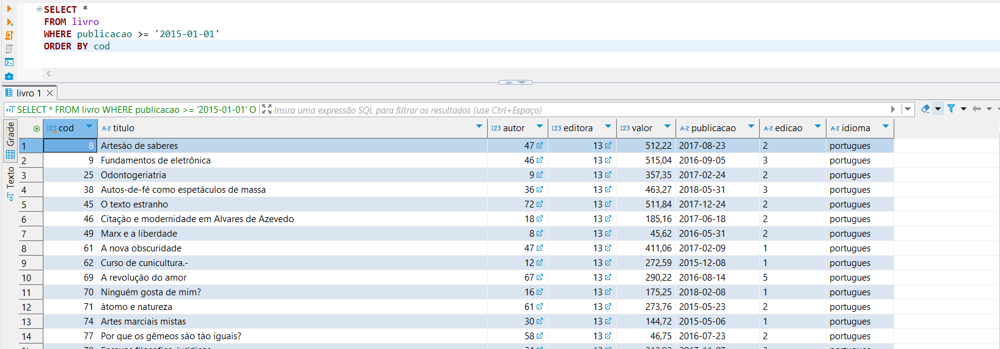

### Exercício 2

Observa-se que a query retorna os títulos e valores dos livros, exibindo os 10 livros com os maiores valores, em ordem decrescente.

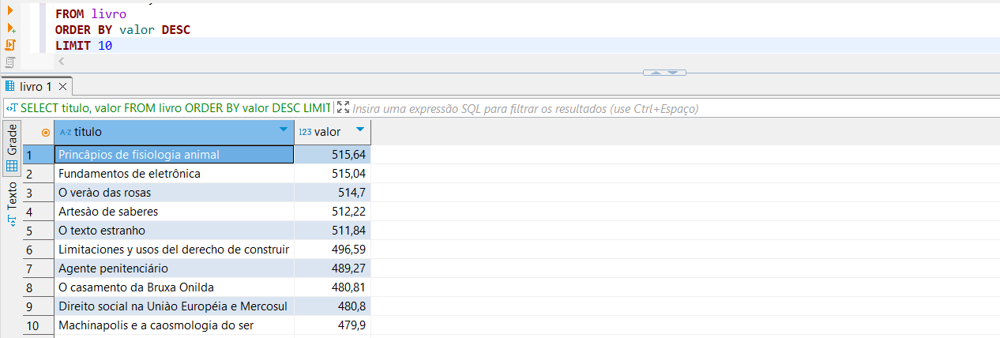

### Exercício 3

A query retorna a quantidade de livros associados a cada editora, seu nome da editora, estado e cidade. A cláusula **LEFT JOIN** garante que todas as editoras sejam incluídas e o filtro **HAVING COUNT(livro.cod) > 0** exibe apenas editoras com pelo menos um livro cadastrado. Os resultados são ordenados pela quantidade de livros em ordem decrescente, mostrando as editoras com mais publicações primeiro.

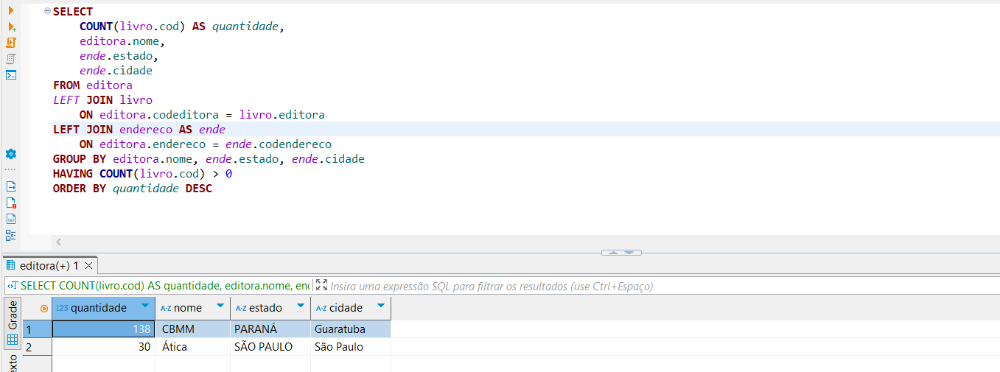

### Exercício 4

A query retorna o nome, código e data de nascimento de cada autor, junto com a quantidade de livros publicados por eles. A cláusula LEFT JOIN é usada para garantir que todos os autores sejam listados, mesmo aqueles sem livros registrados.

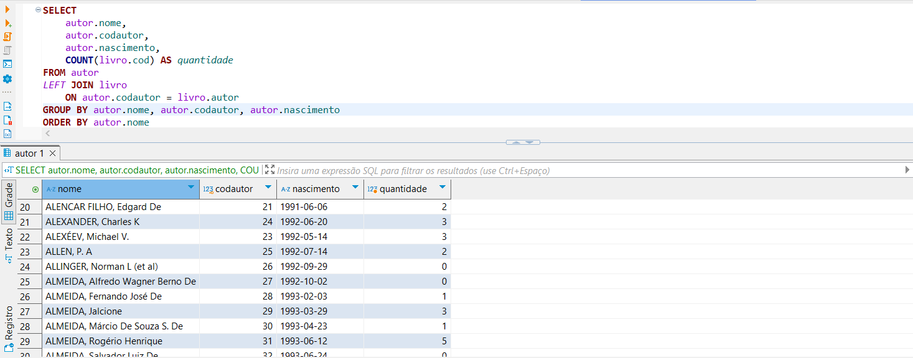

### Exercício 5

São exibidos os nomes dos autores cujos livros estão associados a editoras localizadas em estados diferentes de Paraná e Rio Grande do Sul.

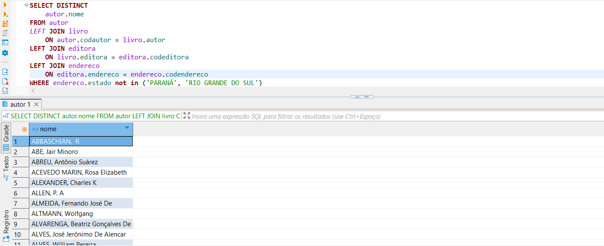

### Exercício 6

A query retorna o código e o nome do autor com o maior número de publicações, mostrando também a quantidade de publicações desse autor (José Wilson Barp). 

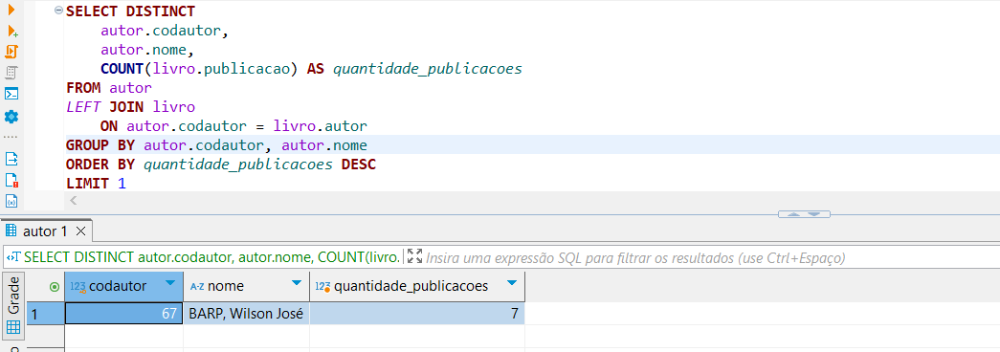

### Exercício 7

São exibidos os nomes dos autores que não têm nenhuma publicação registrada na tabela livro por meio da cláusula **HAVING COUNT(livro.publicacao) = 0**. 

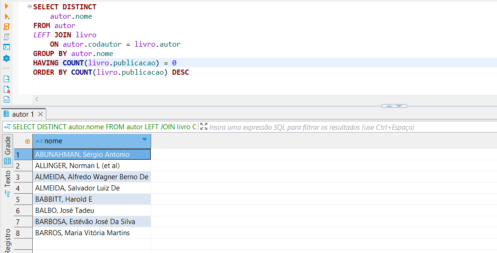

### Exercício 8

Por meio da consulta realizada previamente à subquery agrupamento, a query principal retorna o vendedor com o maior número de vendas concluídas (Vendedor 2).

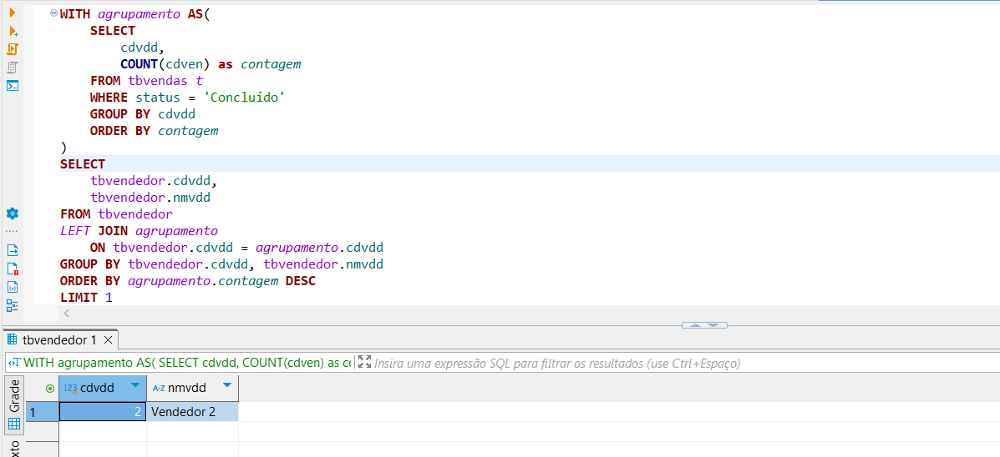

### Exercício 9

Identifica-se do produto A como o mais vendido no período de 03 de fevereiro de 2014 a 02 de fevereiro de 2018, com base no número de vendas concluídas.

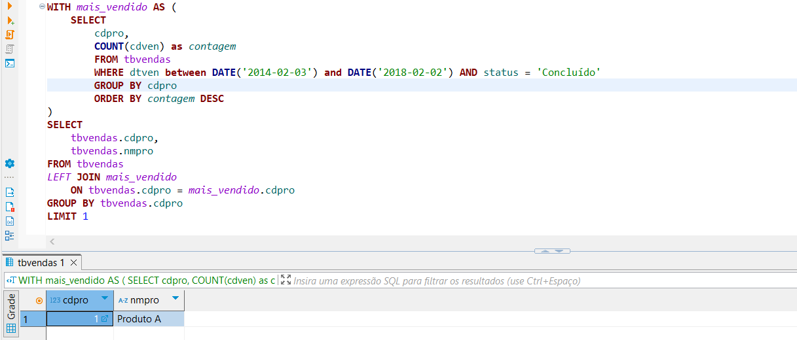

### Exercício 10

A partir da execução desta query, pude observar que ocorreu o cálculo do valor total das vendas concluídas e da comissão de cada vendedor.

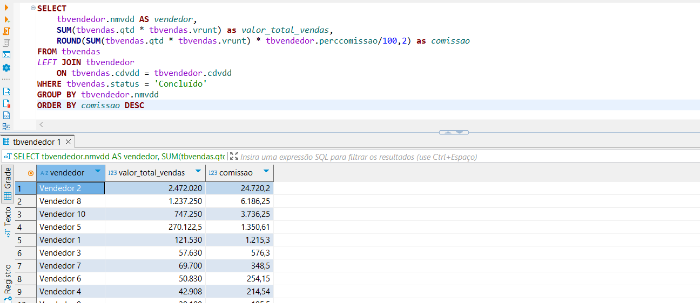

### Exercício 11

Observa-se que ocorreu a identificação do cliente que mais gastou em compras concluídas (Cliente BCA), com base no valor total (quantidade multiplicada pelo valor unitário) das vendas realizadas.

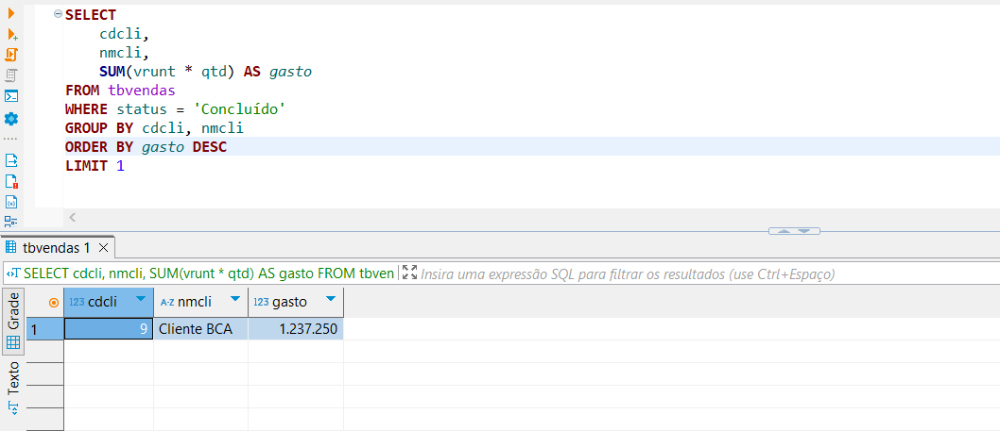

### Exercício 12

São exibidas as informações do dependente do vendedor com o maior valor em vendas. 

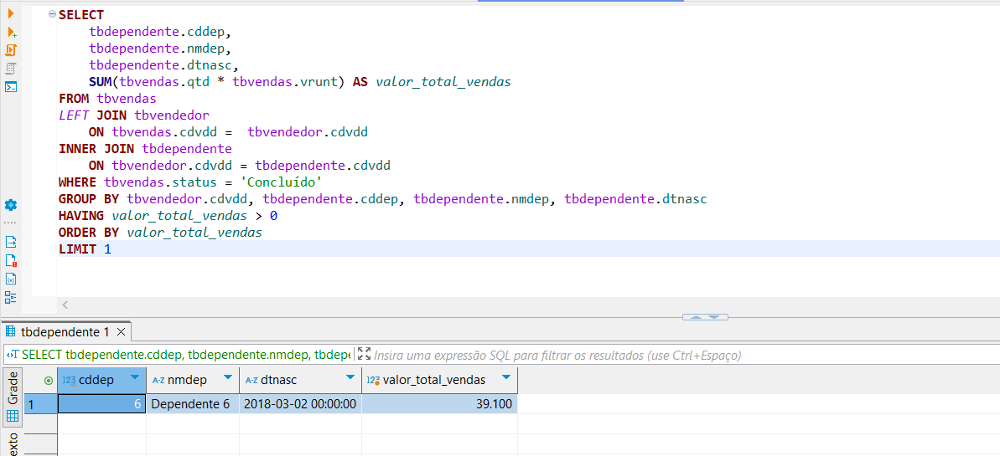

### Exercício 13

Ocorre na execução, o cálculo da quantidade total de vendas por produto, considerando apenas as vendas concluídas nos canais "Ecommerce" e "Matriz".

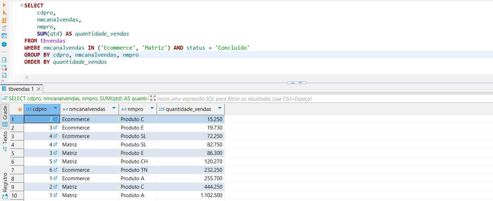

### Exercício 14

Ocorre na execução, o cálculo do gasto médio por estado, considerando apenas as vendas concluídas.

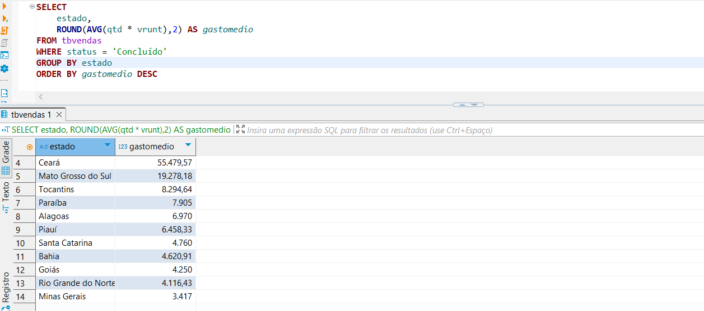

### Exercício 15

São exibidos os códigos das vendas que foram deletadas.

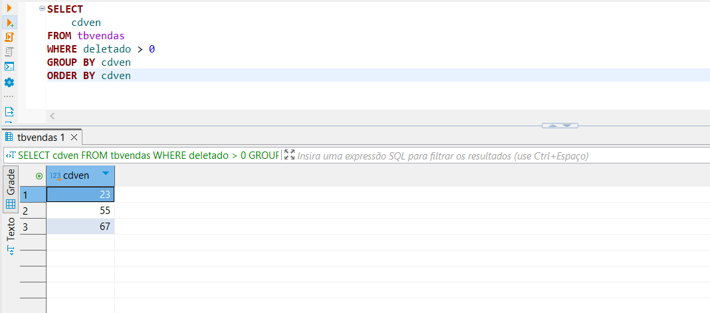

### Exercício 16

Observa-se a ocorrência do cálculo da quantidade média de vendas por produto em cada estado, considerando apenas as vendas concluídas.

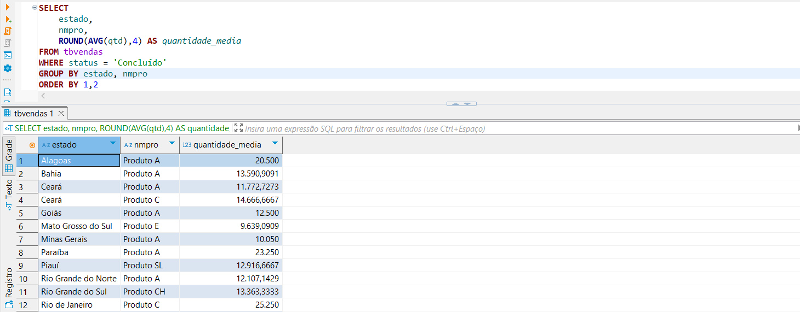

### Exportação dos Dados

A exportação de ambos os resultados foi realizada pela ferramenta "Exportar dados" do próprio cliente SQL DBeaver e configurada de acordo com as especificações da atividade. Abaixo, seguem as evidências da realização da atividade:

* **Etapa 1 - Exercício 2**
  
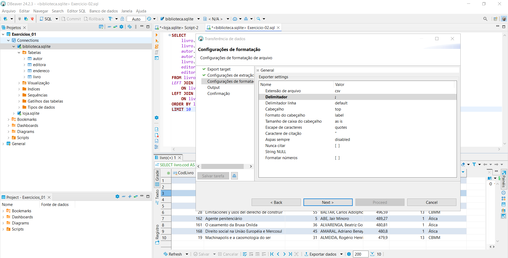

* **Etapa 2 - Exercício 3**
  
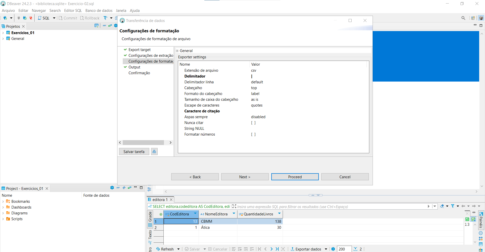

# Certificados


Certificado do Curso AWS Partner: Sales Accreditation (Business): 

