# Orientações

O desafio consiste em abrir um arquivo CSV e transformá-lo em um dataframe, permitindo a extração de informações, a realização de análises detalhadas e a construção de gráficos com base nos resultados obtidos. Esse processo facilita a manipulação e visualização dos dados de forma estruturada e eficiente.

## Preparação

Foi feito o download do arquivo 'googleplaystore.csv', onde se encontram dados diversos sobre os aplicativos contidos na platadforma com indormações como: nome, categoria, quantidade de reviews, tamanho, etc. Com base nas informações obtidas como a ajuda das bibliotecas Matplotlib e Pandas objetiva-se construir gráficos informativos.

## Desenvolvimento
   
Após a importação da biblioteca Pandas e a transformação do arquivo que antes configurava-se em formato csv, o dataframe exibido continha cerca de 10841 linhas e 13 colunas.

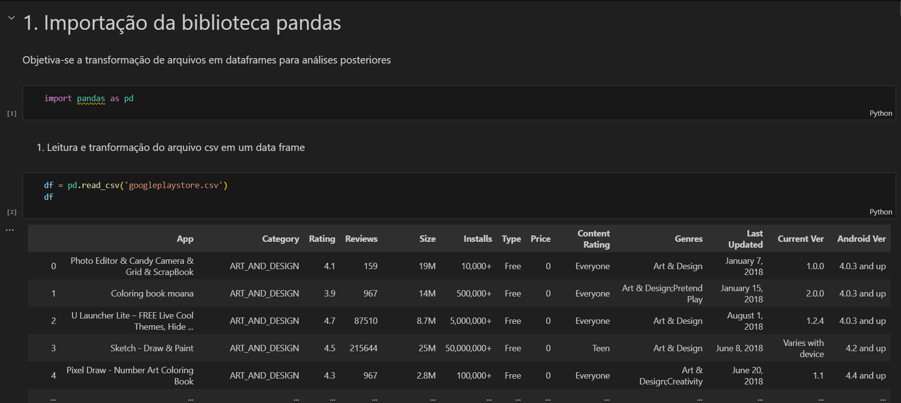

Em primeiro lugar foi verificada a quantidade de duplicatas presentes no arquivo, para que os dados tornassem-se precisos para a análise, tais linhas foram removidas. Reduzindo então o dataframe para 10358 linhas × 13 colunas

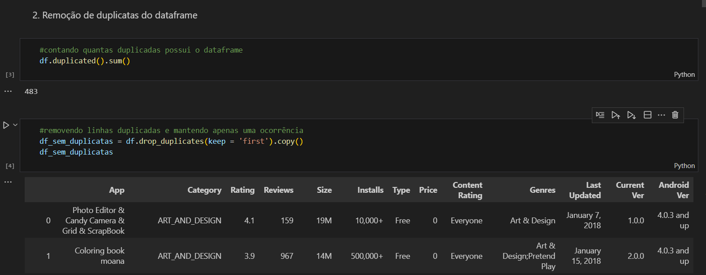


Com a presença de dados numéricos que poderiam ser utilizados posteriormente, foram verificados os tipos das colunas e quais entre elas havia a presença de dados nulos, tais dados poderiam interfirir na análise de resultados e por isso deveriam ser tratados.

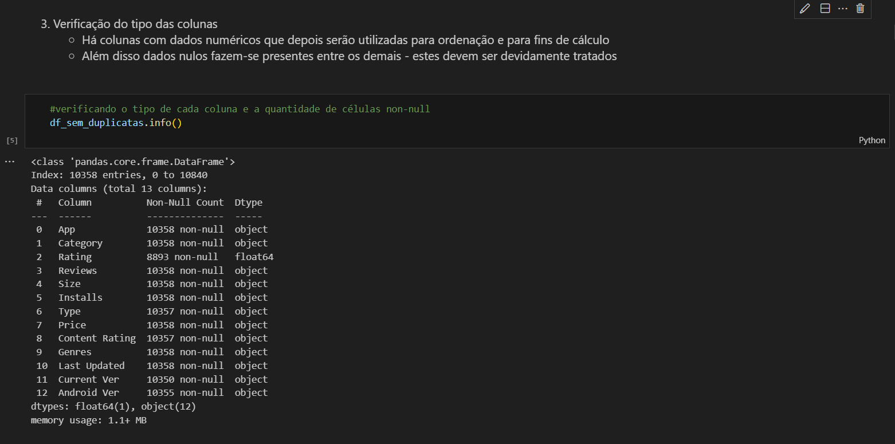

Com tal retorno observou-se que as colunas 'Type' e 'Content Rating' possuiam extamente 1 dado nulo e com a possuibilidade disso ocorrer na mesma linha foi consultada tal condição.

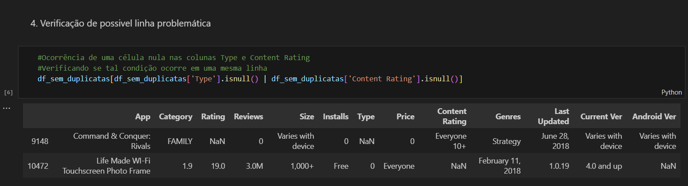


Notou-se que embora os dados nulos não estivessem presentes na mesma linha, a linha de índice 10472 houvera seus dados movidos para a esquerda. Para ajustar foram feitos os seguintes passos:

* Identificação da linha problemática e armazenamento em uma variável a parte:
  
  
    ```Python
        linha_deslocada = df_sem_duplicatas[df_sem_duplicatas['Content Rating'].isnull()]
    ```

* Conversão da linha problemática para uma lista para facilitar a manipulação dos dados:
  
    ```Python
        lista_linha_deslocada = linha_deslocada.iloc[0].tolist()
    ```

* Armazenamento do índice da linha para posterior atualização do data frame :

    ```Python
        indice_linha_deslocada = linha_deslocada.index[0]
    ```

* Correção individual da linha - atribuiu-se o dado 'Unknown' à coluna de categorias:

    ```Python
        linha_corrigida = ['Life Made WI-Fi Touchscreen Photo Frame','Unknown',1.9,'19','3.0M','1,000+','Free','0','Everyone',float('nan'),'February 11,2018','1.0.19','4.0 and up']
    ```

* Atribuição da linha corrigida na posição onde encontrava-se a linha movida:
  
  ```Python
    df_sem_duplicatas.loc[indice_linha_deslocada] = linha_corrigida
  ```

Imagens do desafio:

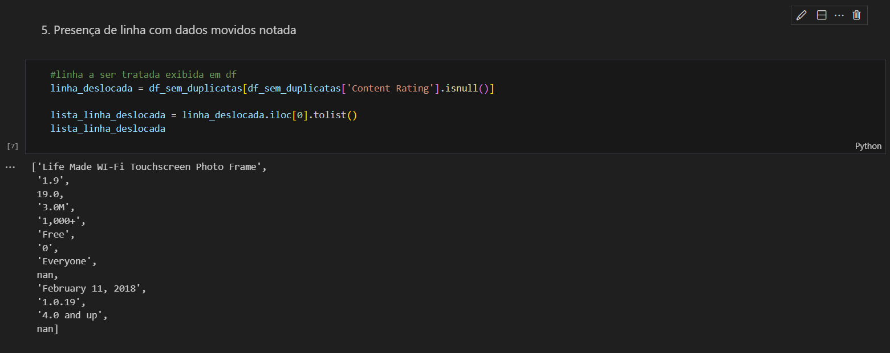
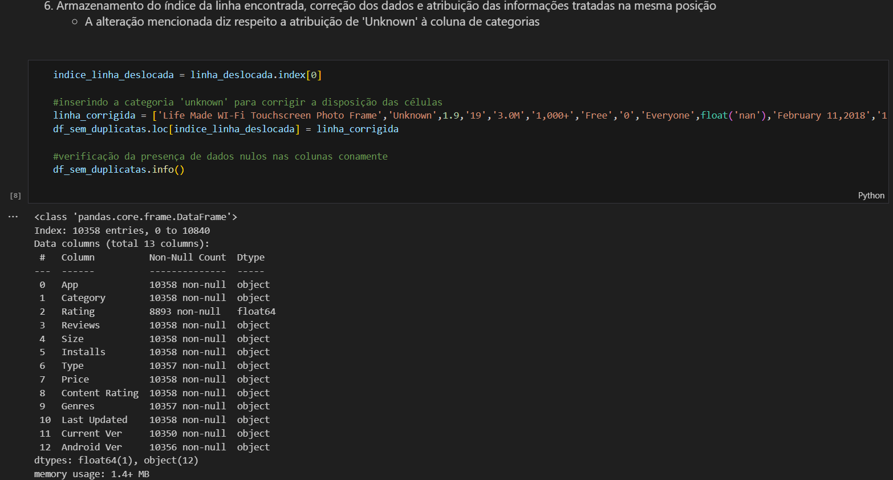

Após o tratamento:

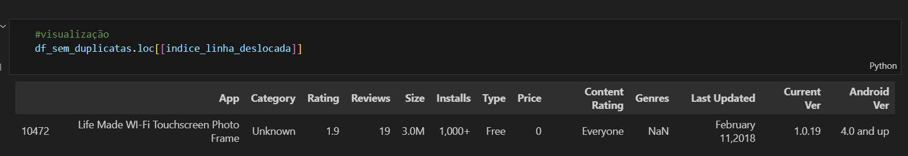

Sabendo que outras colunas também apresentavam valores nulos a serem tratados, concentrei-me na coluna Rating, que possuía cerca de 1.465 valores ausentes. Para decidir como preencher esses campos, avaliei as estatísticas da coluna.

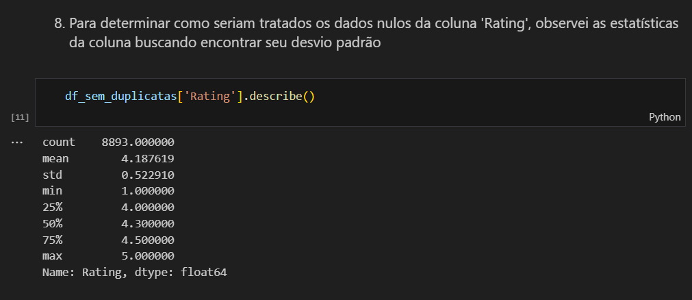

Com base nas informações estatísticas, observei que o desvio padrão era relativamente baixo em comparação à média. Por essa razão, optei por preencher os valores nulos utilizando a média da coluna, garantindo consistência nos dados sem introduzir grande variação.

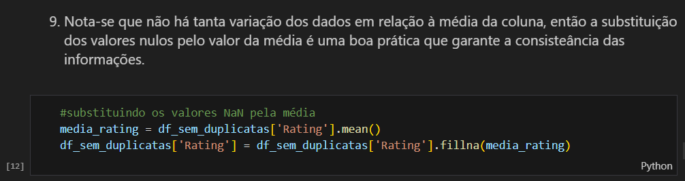

Passando para a coluna 'Type', o valor nulo encontrava-se na linha 9148 que possuia a informação de que o preço do aplicativo era igual a 0, sendo assim optei por atribuir ao campo nulo a característica 'Free' que diz respeito aos apps gratuitos.

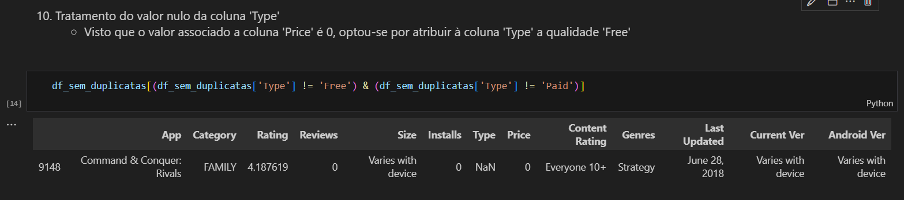

Para as demais colunas, que apresentavam características qualitativas e não dedutivas, optei por preencher os campos com valores nulos utilizando a categoria "Unknown". Dessa forma, foi possível manter a integridade dos dados, sem introduzir inferências indevidas, enquanto os registros permaneceram consistentes para análise.


    

Como última instância de tratativa, percebi que alguns nomes de aplicativos ainda se repetiam, mesmo após a remoção das duplicatas. Isso ocorria porque, em algumas colunas, como a data ou a versão do aplicativo, havia informações diferentes, indicando que dados do mesmo aplicativo haviam sido coletados mais de uma vez. Para resolver esse problema, decidi considerar a linha com a maior quantidade de reviews, uma vez que, ao longo do tempo, os valores de reviews foram somados. A maior quantidade de reviews sugere que a linha corresponde à versão mais recente do aplicativo.

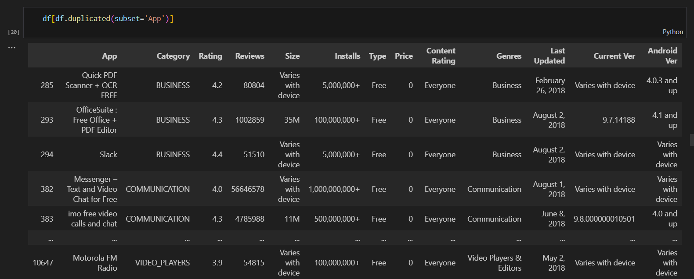


Para isso, foi necessário então converter a coluna 'Reviews' para inteiro, ordená-la e utilizá-la para consultar o maior valor por app:

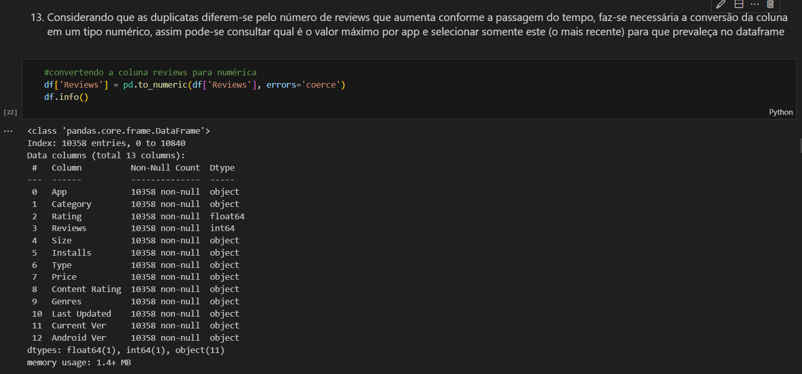

Após, considerando as colunas 'Apps' e 'Reviews' foram removidas as duplicatas, deixando então os dados mais recentes de cada aplicativo. O dataframe passou então a ter 9660 linhas e 13 colunas

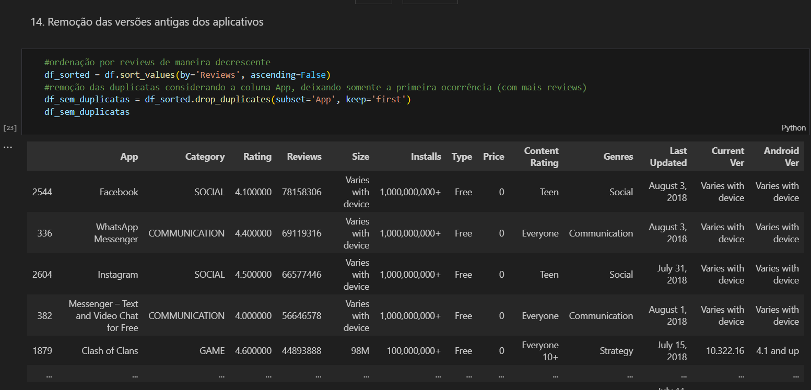

### Geração de Gráficos

1. Para a geração do primeiro gráfico que possui como tema os "Top 5 apps por número de instalação" foram realizados os seguintes passos:
   * Conversão do tipo da tabela 'Installs' para numérico:
    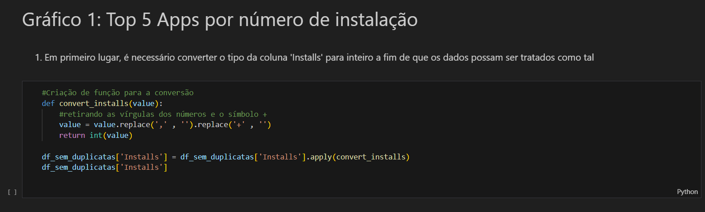

   * Ordenação de 'Installs' do maior para o menor e 'fatiamento' dos 5 primeiros:
    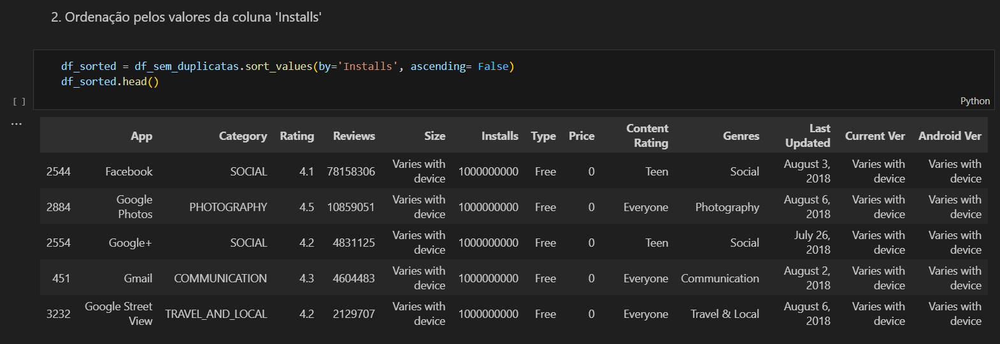

   * Atribuição da lista dos top 5 apps em uma variável:
    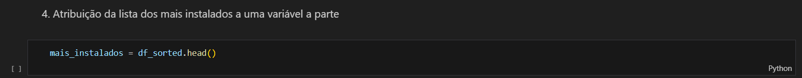

   * Construção do gráfico a partir da importação da biblioteca mathplotlib:
    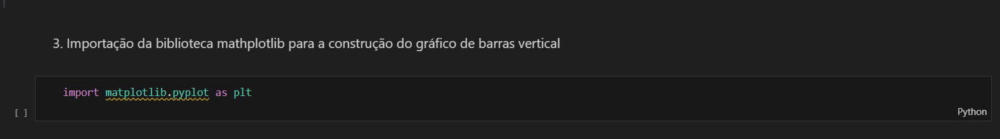
    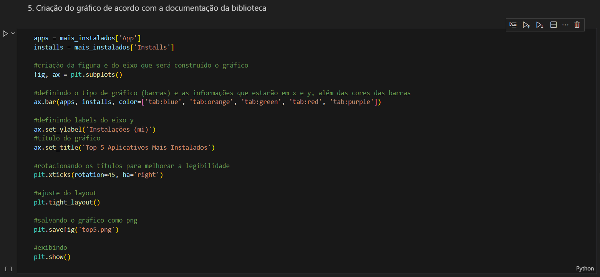

    * Resultado final:
  
        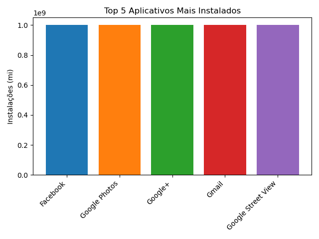

2. Para a geração do segundo gráfico que possui como tema a "frequencia que cada categoria de filme apresenta", foram realizados os seguintes passos:
   
   * Cálculo da frequência das categorias presentes na coluna Category utilizando a função value_counts() com o parâmetro normalize=True, que permite calcular a frequência relativa de cada categoria. Em seguida, os valores foram multiplicados por 100 para converter as proporções em porcentagens, facilitando a análise dos dados.
  
        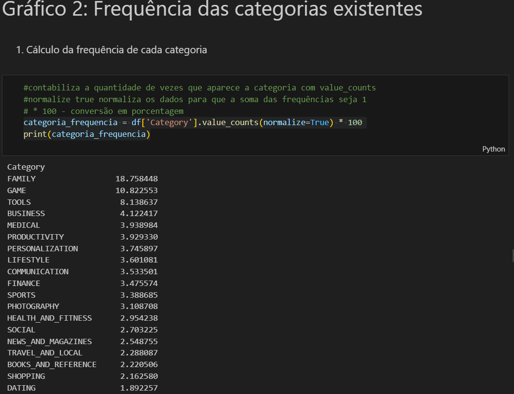
  
   * Agrupamento das categorias que possuem frequência relativa menor do que 1% a fim de melhorar a visualização e legibilidade do gráfico:
  
        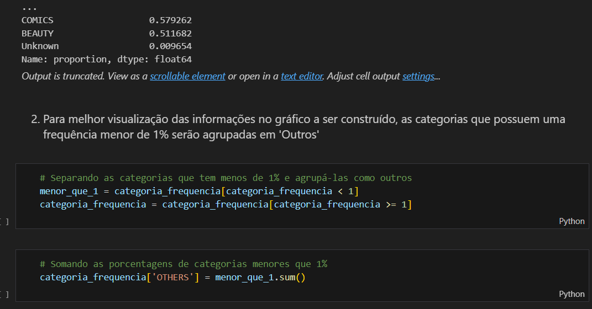

    * Geração do gráfico 'Pie' de acordo com a documentação apresentada da biblioteca Mathplotlib:
        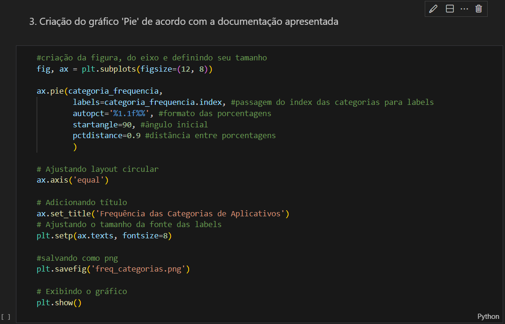

    * Resultado final:

        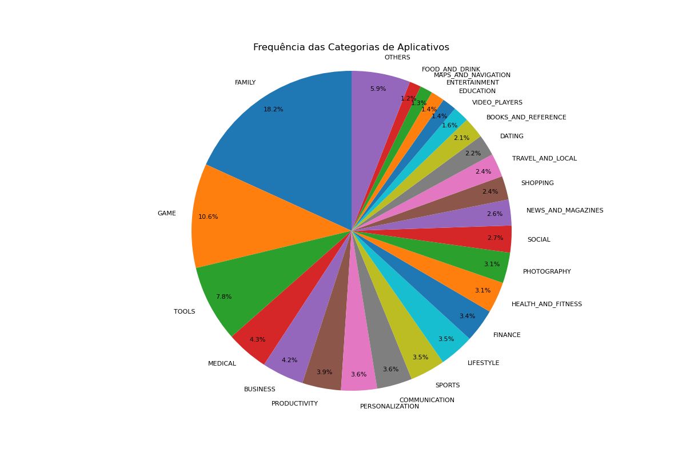

### Consultas
1. Para a realização da consulta ao dataframe a respeito de qual o aplicativo mais caro, foi necessário converter a coluna 'Price' para float e extrair da coluna o maior valor:

    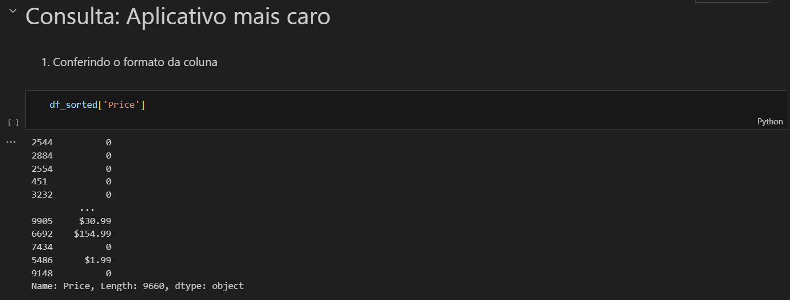
    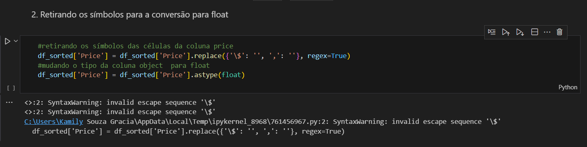

    Resultado final: O aplicativo mais caro denomina-se "I'm Rich - Trump Edition"

    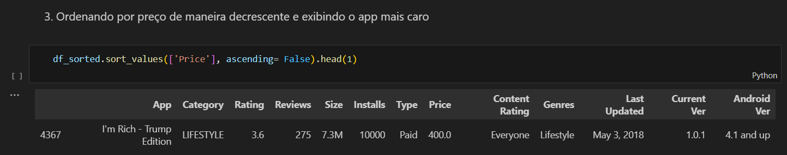

2. Para a realização da consulta ao dataframe a respeito de quais os apps que possuem classificação 'Mature 17+', foi necessário listar os apps que possuiam a característica mensionada na coluna 'Content Rating':

    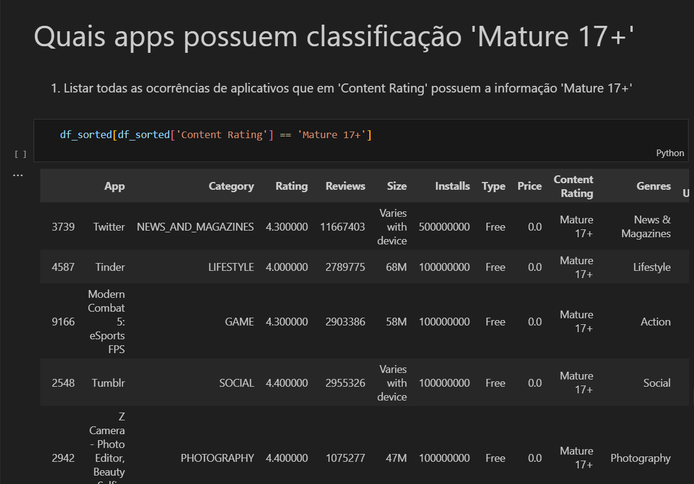

    Ao todo foram retornadas 393 linhas e 13 colunas.

3. Para a consulta da lista dos 10 apps com maior número de reviews, foi necessário ordenar a coluna 'Reviews' e colocá-la como argumento da posição, além disso a exibição foi limitada a 10 apps:

    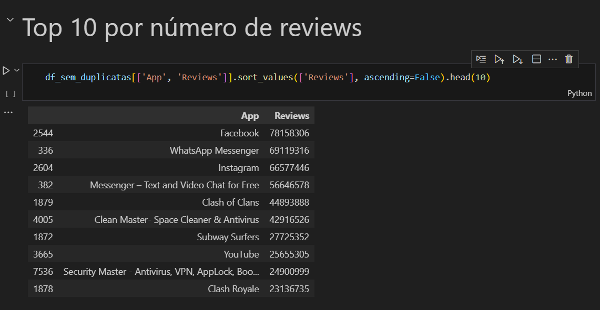

### Gráficos criados

1. Top 5 apps gratuitos mais bem avaliados - Retorno em formato de lista e gráfico.

    Para a construção deste gráfico de dispersão, foram consideradas as colunas 'Type' e 'Rating'. Os aplicativos selecionados atenderam às seguintes condições:

*    O tipo ('Type') deve ser gratuito.
*    O rating ('Rating') foi ordenado em ordem decrescente, do maior para o menor.
*    
    Estas condições foram verificadas em:

    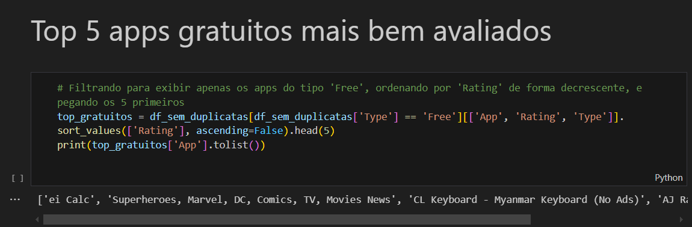

    O gráfico foi construido da seguinte forma:
    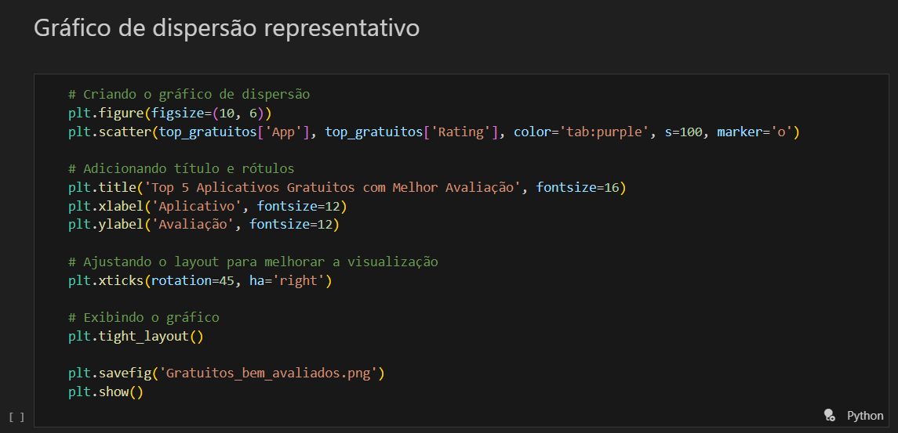

    O resultado final pode então ser exibido da seguinte forma:

    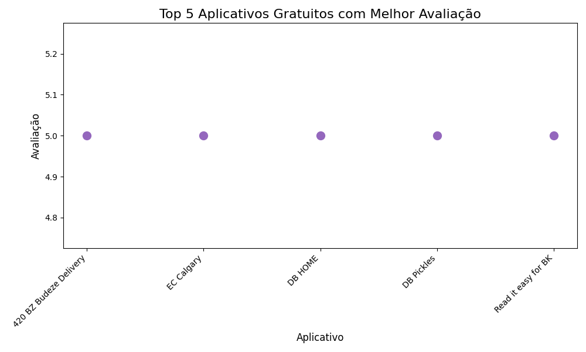

2. O jogo mais instalado - Retorno em formato de valor e gráfico.

    Para atender a condição foi utilizada como base a coluna 'installs' que foi ordenada de maneira decrescente e então pôde-se extrair o app mais instalado:

    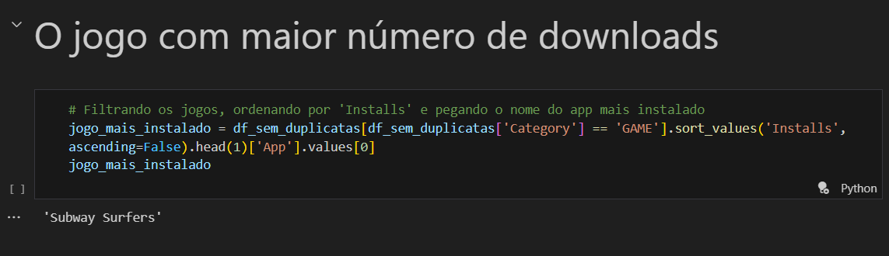

    Para que o gráfico fosse construido com mais de um valor para fins de comparação, utilizou-se da exibição dos 5 primeiros jogos mais instalados:

    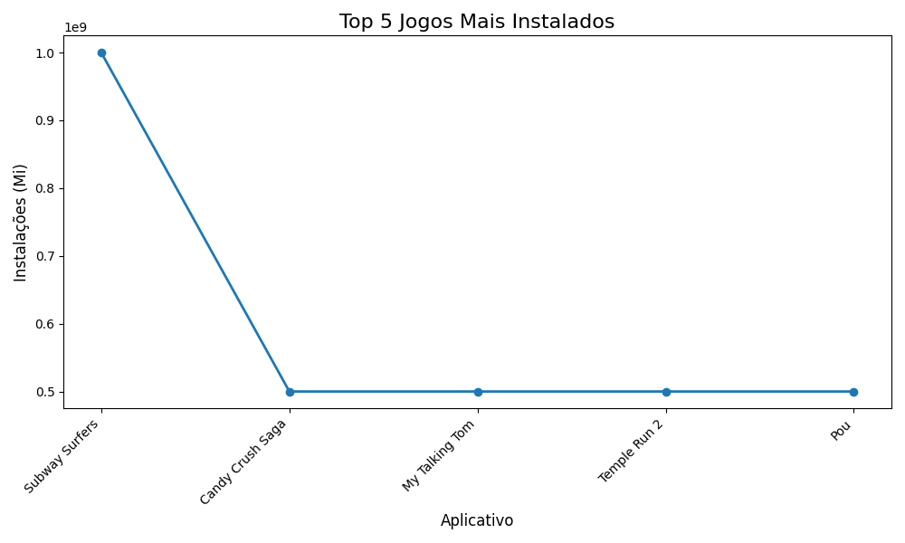


## Dificuldades encontradas

Este foi meu primeiro contato com as bibliotecas do Python, o que tornou o desenvolvimento do desafio especialmente desafiador. Durante o processo, enfrentei diversos obstáculos, principalmente na adaptação aos conceitos.

Além disso, próximo ao prazo final de entrega, o código deixou de funcionar corretamente em determinado ponto. Como não havia sido abordado em detalhes nas aulas ou no material de estudo, tive que recorrer a ferramentas externas e a pesquisas mais aprofundadas para encontrar soluções e gerar os gráficos solicitados.