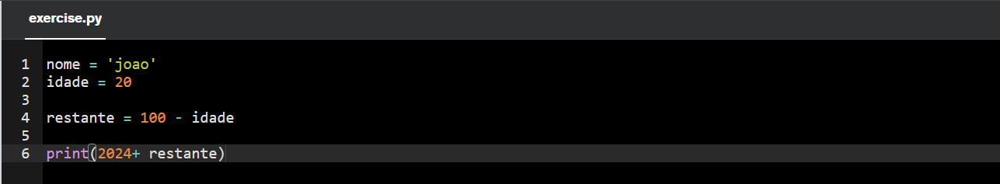
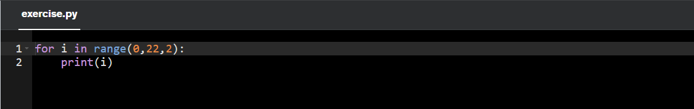
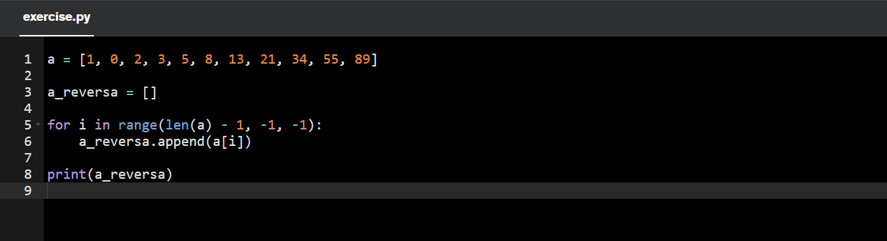

# Informações

Na terceira sprint, pude aprender a linguagem Python, amplamente reconhecida por sua versatilidade em áreas como análise de dados, prototipagem e aprendizado de máquina. Durante esse período, foram abordados diversos conteúdos, desde os fundamentos da sintaxe básica até conceitos mais avançados, como desenvolvimento orientado a objetos e integração com bancos de dados.

Além disso, explorei as boas práticas de programação, incluindo o uso de bibliotecas como Pandas, Numpy e Matplotlib. Pude aplicar tais conhecimentos no cenário de manipulação de dados e análise das informações por meio de exercícios e também pela resolução do desafio que  inclui a geração de gráficos informativos.

Por fim, foi oferecido o curso de AWS Cloud Economics, que aborda como a AWS possibilita a otimização dos custos para seus clientes, ajustando os recursos de maneira flexível às necessidades específicas de cada tipo de negócio. O curso também explora estratégias para maximizar o retorno sobre investimento (ROI) ao utilizar os serviços da AWS, destacando práticas recomendadas para gerenciamento eficiente de recursos em nuvem. Além disso, são apresentadas ferramentas e métricas que auxiliam na análise e controle financeiro, permitindo que as empresas alinhem seus gastos às suas metas de crescimento e inovação.

# Resumo

**Python:** Por meio de vídeo aulas, exercícios e a leitura de materiais, pude aprender os comandos básicos e avançados utilizados para a criação e manipulação de listas, tuplas, dicionários e arrays. Além da introdução das bibliotecas e de funções nativas da linguagem que permitem uma análise e obtenção de resultados mais eficiente.

## 1. Comandos básicos

Comandos Básicos

1. Impressão de resultados

    ``` Python
        print() #realiza a impressão dos dados

        Print(type(variável)) #retorna o tipo da variável
    ``` 

2. Introdução de valores em variáveis

    ``` Python
        input()

        #exemplo
        variavel = input('Digite seu nome: ')
        #por padrão, o dado recebido será em formato de string
    ``` 

3. Conversão de tipos de dados
   
    ``` Python
        int() #transformação para tipo inteiro
        #ex.: var = int(input('Digite sua idade: ))

        str() #transformação para tipo string
        #ex.: var2 = str(var)

        float() #transformação para ponto flutuante
        #ex.: var3 = float(var)
    ``` 

4. Método Slicing - Técnica usada para extrair ou consultar partes específicas de dados dentro de um conjunto maior, como strings, listas ou arrays.

    Pode-se consultar caracteres e parte de valores presentes em variáveis

    ``` Python
        #exemplo de string
        fruta = ‘Abacate’

        print(fruta[3]) #a - retorna o caractere na posição 3
        #lembre-se: a contagem inicia-se sempre de 0.

        print(fruta[2:6]) #acat - retorna o intervalo

        print(fruta[-1])  #e - decrementa a contagem 

        #exemplo de float
        valor = 99.75

        print(str(valor[2:4])) #75

        print(str(valor[:2])) #99 (até posição 2)

        print(str(valor[2:])) #75 (da posição 2 em diante)
    ``` 

5. Formated String = variáveis que contém strings formatadas

    ``` Python
        nome= 'Marcos'
        sobrenome = 'Silva'
        profissao= 'Programador'

        texto = f' O {nome} {sobrenome} é um excelente {profissao}'
        print(texto) #O Marcos Silva é um excelente programador
    ``` 

6. Métodos de manipulação de string

    ``` Python
        mensagem = 'Eu gosto de ameixa'

        print(mensagem.lower()) #eu gosto de ameixa
        print(mensagem.upper()) #EU GOSTO DE AMEIXA
        print(mensagem.capitalize()) #Eu gosto de ameixa
        print(mensagem.find(d)) #9 - retorna a posição da letra passada como argumento
        print(mensagem.find(gosto)) #3 - retorna a posição de onde se inicia a palavra; se o retorno é -1 então não encontrou
        print(mensagem.replace('a', 'e')) #Eu gosto de emeixe
        print(mensagem.replace('ameixa', 'Pudim')) #eu gosto de Pudim
        print(mensagem.strip()) # retira os espaços antes do início e fim da string
    ``` 

7. Operações Matemáticas
    ``` Python
        #ordem de execução das operações: 
        #1. () - operações contidas em parênteses
        #2 ** - potência
        # * e / - multiplicação e divisão
        # + e - - adição e subtração
        
        #operadores de comparação
        == #igual
        != #diferente
        > #maior
        < #menor
        >= #maior ou igual
        <= #menor ou igual

        #Operadores de atribuição
        = #recebe
        += #soma
        -= #subtrai
        *= #multiplica
        /= #divide
        %= #consulta o resto da divisão
    ``` 
8. Operações condicionais

    ```Python
        velocidade = 100

        if velocidade > 110: #se
            print('acima da velocidade permitida')
        elif velocidade  < 60: #senão se
            print('favor dirigir acima de 80km/h')	
        else: #senão
            print('velocidade ok')
    ```
9. Operações lógicas

    ```Python
        renda_acima_5mil = True
        nome_limpo = False
    
        #and (e)
    
        if renda_acima_5mil and nome_limpo: 
            print('financiamento aprovado')
        else:
            print('financiamento negado')
        
        #or (ou)

        if renda_acima_5mil or nome_limpo:
            print('financiamento aprovado')
        else:
            print('financiamento negado')
        
        #multiplos operadores
        
        x = 2
        if 4 <= x >8 #retorna true ou false
    ```

10. Loops (for e while)
    1. Utilizar 'For' se é conhecido o tamanho da lista/vetor
    
        ``` Python
            # para int - inicar o início do loop, padada e o passo da incrementação/decrementação
            for variavel in range(start, stop, step) 

            #para str
            for letra in 'Google': #acessa os indexes da palavra, a cada execução imprime uma letra
                print(letra) #G #o #o #g #l #e 
        ``` 

    2. Utilizar 'While' quando não se conhece a quantidade de vezes que será necessário aplicar o loop
        ```Python
            valor = int(input('Informe o valor do produto: '))
            #enquanto a condição for verdadeira o loop será executado
            while valor > 20:
                valor = (valor * 0.10) + valor
                print(f'O valor final do seu produto será de R${valor}')
                break #parada da execução
        ```

11. Operador ternário
    
    ``` Python
        idade = 13

        #a variavel receberá uma das duas strings dependendo da conformidade da variável 'idade' com a condição
        resultado = 'Voto permitido' if idade >= 16 else 'Voto não permitido'

        print(resultado)
    ``` 

## 2. Funções/Métodos
Blocos de códigos que são reutilizados mais de uma vez no código visando evitar redundâncias e repetições desnecessárias. 

'def' é  comando para sua criação e a função deve ser chamada no local onde deseja-se executar as operações nela contidas:
```Python
    def nome_da_funcao():
        #lógica da função
    
    #[...]
    nome_da_funcao() #chamada da função no código
    #[...]
```

- Exemplos
  
    Função sem retorno 
    ``` Python
        
        def boas_vindas(cliente, estoque=6): #estoque é um parâmetro default (estático) deve ser informado no final
        print(f'Olá {cliente}') 
        print(f'Temos {estoque} laptops em estoque')

        #chamada e impressão
        boas_vindas('Márcia')

        #Olá Márcia
        #Temos 6 laptops em estoque
    ``` 
    Função com retorno
    ``` Python
        def atualizar_estoque(estoque): #função que calcula e retorna valor
            estoque -= 1 
            return estoque #estoque == 4

        #variável global
        estoque = 5

        for i in range(3):
            cliente = input('Qual seu nome: ')
            #o nome recebido será passado como parâmetro, e estoque é definido acima como uma variável global
            boas_vindas(cliente, estoque) #chamada da função
            estoque = atualizar_estoque(estoque) #a variável globlal estoque passa então a ter o valor após a operação feita pela função
    ``` 
## 3. Listas, Arrays, Tuplas, SETs e Dicionários

1. **Listas:** Armazenam mais de uma informação, ordenadamente em uma só variável. Algumas operações que podem ser realizadas são:

    ```Python
        #criação 
        cidades = ['Rio de Janeiro', 'São paulo', 'Salvador']
        print(cidades[-3]) #Rio de Janeiro

        #substituição de valores na posição desejada
        cidades[0] = 'Brasilia'
        print(cidades) #['Brasilia', 'São paulo', 'Salvador']

        #adição ao final
        cidades.append('Santa Catarina')
        print(cidades) #['Brasilia', 'São paulo', 'Salvador', 'Santa Catarina']

        #adição na posição desejada
        cidades.insert(1, 'Goiania')
        print(cidades) #['Brasilia', 'Goiania', 'São paulo', 'Santa Catarina']

        #remoção
        cidades.remove('Salvador')
        print(cidades) #['Brasilia', 'São paulo', 'Santa Catarina']

        #remoção na posição desejada
        cidades.pop(0)
        print(cidades) #['Goiania', 'São paulo', 'Santa Catarina']

        #ordenação em ordem alfabética ou crescente
        cidades.sort()
        print(cidades) #['Goiania', 'Santa Catarina', 'São paulo']
    ```
    Pode-se também realizar a concatenação de listas, sejam elas numéricas ou de strings:

    ```Python
        numeros = [2, 3, 4]
        letras = ['a', 'b', 'c', 'd']

        final = numeros*2
        print(final) #[2,3,4,2,3,4]

        final2 = numeros + letras
        print(final2) #[2,3,4,'a','b','c','d']

        #ou

        numeros.extend(letras)
        print(numeros) #[2,3,4,'a','b','c','d']

        #listas dentro de listas

        itens = [['i1', 'i2'], ['i3', 'i4']]
        print(itens[1]) #['i3', 'i4']
        print(itens[1][0]) #i3
    ```
    Pode-se dividir a lista em mais de uma variável:
    ```Python
        produtos = ['arroz', 'feijao', 'laranja', 'banana']

        item1, item2, item3, item4 = produtos

        '''
        é o mesmo que

        item1 = produtos[0]
        item2 = produtos[1]
        item3 = produtos[2]
        item4 = produtos[3]
        '''
        print(item1, item2, item3, item4)
    ```
    Para realizar a iteração de listas utiliza-se o loop 'For':
    ```Python
        valores = [50, 80, 110, 150, 170]

        for x in valores:
            print(f'O valor final do produto é de RS{x}')
        
        #serão exibidas mensagens até o final da lista
    ```
    Pode-se utilizar operações condicionais em listas para realizar verificações:
    ```Python
        cor_cliente = input('Digite a cor desejada: ')
        cores = ['amarelo', 'verde', 'azul', 'vermelho']

        if cor_cliente.lower() in cores:
            #lower é utilizado para formatar as strings em caso de input de dados, uma vez que o usuário pode digitar de maneiras diferentes a mesma palavra
            print('Disponível')
        else:
            print('Não disponível em estoque')
    ```
    Exemplos de manipulação de listas podem ser citados a agregação de duas listas por meio do comando 'zip' (que formará pares combinados) e a inserção de uma  única string (que posteriormente será dividida em valores) em uma lista:
    ```Python
        #Agregação de listas

        valores = [50, 80, 110, 150]
        cores = ['amarelo', 'verde', 'azul', 'vermelho']

        duas_listas = zip(cores,valores) #agregação
        #tuplas feitas com base nos indexes
        print(list(duas_listas)) #[(50, 'amarelo'),(80, 'verde'),(110, 'azul'), (150, 'vermelho')]

        #input
        frutas_user = input('Digite o nome das fruta separados por vírgula: ')

        frutas = frutas_user.split(', ')
    ```
___

2. **Tuplas:** Estruturas de dados usadas para armazenar coleções imutáveis, ou seja, que não podem ser alteradas após a criação. São mais eficientes em termos de memória e execuçãos. Exemplo:
    ```Python
        #criação
        coordenadas = (10, 20)

        #acesso
        print(f"A coordenada X é {coordenadas[0]} e a coordenada Y é {coordenadas[1]}.") #são passados os índices contidos nas tuplas para acessar o valores

        #tentativa de alteração
        coordenadas[0] = 15  # Isso não é permitido em uma tupla
    ```
___

3. **Arrays:** São listas que contém muitos valores. Para sua criação em Python é necessário importar da biblioteca 'array' e devem ser definidos tipos
    ```Python
        from array import array

        #exemplos com listas pequenas
        letras = ['a','b','c','d']
        numeros_i = [10, 20, 30, 40]
        numeros_f = [1.2, 2.2, 3.2]

        #define-se o tipo do array
        #array(typecode u-string, i-integer, f-float; lista a ser transformada)
        letras = array('u', ['a','b','c','d'])
        numeros_i = array('i', [10, 20, 30, 40])
        numeros_f = array('f', [1.2, 2.2, 3.2])
    ```
___

4. **SET:** Estrutura de dados usada para armazenar coleções. São semelhantes a listas ou tuplas, mas não permitem elementos duplicados e não possuem ordem definida (não utilizam index). São úteis para operações como eliminar duplicatas ou realizar operações matemáticas de conjuntos (união, interseção, diferença):

    ```Python
        #exemplo com inteiros
        lista1 = [10, 20, 30, 40, 50]
        lista2 = [10, 20, 60, 70]

        num1 = set(lista1)
        num2 = set(lista2)

        print(num1) # {40, 10, 50, 20, 30}

        #union retirando os repetidos
        print(num1 | num2) 

        #difference - aquilo que está em 1 e não em 2
        print(num1 - num2)

        #symmetric difference - mostra todos aqueles que não estao presentes em ambos
        print(num1 ^ num2)

        #and - aquilo que possuem em comum
        print(num1 & num)
    ```
    ```Python
        #para strings

        set1 = {'a', 'b', 'c'}
        set2 = {'a', 'd', 'e'}
        set3 = {'c', 'd', 'f'}

        set4 = set1.union(set2)
        #{'a', 'b', 'c', 'd', 'e'}

        set4 = set1.difference(set3)
        #{'b', 'a'}

        set4 = set1.intersection(set2)
        #{'a', 'b'}

        set4 = set.symmetric_difference(set3)
        #{'a', 'b', 'd', 'f'}

        print(len(num1)) #tamanho do set/list
    ```
    Suas operações, além de sua criação, permitem adicionar, alterar e deletar:
    ```Python
        #exemplo com inteiros
        lista1 = [10, 20, 30, 40, 50]
        s1 = {10, 20, 30, 40, 50}

        print(s1) #{10, 20, 30, 40, 50}

        s1.add(70)
        print(s1) #{10, 20, 30, 40, 50, 70}

        s1.update([70, 90])
        print(s1) #{10, 20, 30, 40, 50, 70, 90}

        s1.remove(10) #se o numero não existir no set gera um erro
        print(s1) #{20, 30, 40, 50, 70, 90}

        s1.discard(10) #se o numero nao existir no set não gera um erro
        print(s1) #{20, 30, 40, 50, 70, 90}
    ```
___

5. **Dicionários:** Estrutura de dados que armazena pares de chave e valor (keys e values), permitindo associar um identificador único (a chave) a um dado específico (o valor). Isso acrescenta significado às informações, tornando-as mais organizadas e fáceis de acessar.

    ```Python
        aluno = {} #dicionário vazio
        aluno = {'nome': 'Ana', 'idade': '16', 'nota_final': 'A', 
            'aprovacao': True}
        print(aluno[nome]) #Ana
    ```

    Operações de consulta, adição, alteração e deleção:
    ```Python
        #Atualização de dicionários
        #1 - de um único valor
        aluno[nome]= 'Jose'

        #2 - de múltiplos valores
        aluno.update({'nome': 'Joao', 'nota_final': 'F'})

        #Adição de chave - ao final
        aluno.update({'endereco': 'Rua A'}) 

        #Consultar valor com mensagem de erro tratada
        # dict.get(atributo, mensagem de retorno)
        print(aluno.get('endereco', 'Nao existe'))

        #Remover atributo
        del aluno['idade']
        print(aluno) #{'nome': 'Ana', 'nota_final': 'A', 'aprovacao': True}
    ```
    O uso de loops para realizar a iteração também é possível por meio do 'For':
    ```Python
        for x in aluno.keys():
            print(x) #imprime somente as keys 
            
        for x in aluno.values():
            print(x) #imprime somente values
            
        for x in aluno.items():
            print(x) #imprime ambos em formato de tuple
            
        for keys, values in aluno.items():
            print(keys, values) #imprime ambos fora de tuples
    ```
___

### Outras formas de manipulação
Em Python, há diversas formas de manipular coleções de dados de maneira concisa e eficiente. Entre elas, destacam-se:

* **Funções lambda:** Funções anônimas usadas para criar pequenas operações inline.
  
    ```Python
        dobro = lambda x: x * 2
        print(dobro(5))
    ```
* **map:** Aplica uma função a todos os itens de uma coleção, retornando um iterador.
  
    ```Python
        #aplicação da função lambda como argumento da função map
        numeros = [1, 2, 3, 4]
        quadrados = map(lambda x: x ** 2, numeros)
        print(list(quadrados)) #[1, 4, 9, 16]
    ```
* **list(map(...)):** Combinação do map com a função list para gerar uma lista diretamente.

    ```Python
        cubos = list(map(lambda x: x ** 3, numeros))
        print(cubos)  # [1, 8, 27, 64]
    ```
* **List comprehension:** Forma elegante e compacta de criar listas.
    ```Python
        #Usar quando precisa-se criar uma nova lista a partir de uma lista existente

        frutas1 = ['abacate', 'banana', 'kiwi', 'morango', 'abacaxi']
        frutas2 = []

        for item in frutas1:
            if 'b' in item:
                frutas2.append(item)
                
        print(frutas2) #['abacate', 'banana', 'abacaxi']

        ## ou
        # [expressão for i in lista condicao]
        frutas2 = [item for item in frutas1 if 'b' in item]
        print(frutas2)
    ```
    ```Python
        #Exemplo com números
        valores = []
        for x in range(6):
            valores.append(x * 10)
            
        print(valores) 

        ## ou

        valores = [x * 10 for x in range(6)]
        print(valores) # [10,20,30,40,50,60]
    ```

* **Generator expressions:** Criam iteradores de forma semelhante às list comprehensions, mas economizando memória.
    ```Python
        #para gerar muitos valores em uma lista - forma de não ocupar muita memória
        numeros = (x * 10 for x in range(10)) #colocar entre parênteses
        print(list(numeros))
    ```

## 4. Erros
Permitem a execução de testes sem realizar o 'stop do programa'. Exemplos:

``` Python
    try: #tente
        letras = ['a', 'b', 'c'] #index 2
        print(letras [3]) #IndexOutOfRange - erro retornado
    except IndexError: #tratamento do erro em questão
	    print('Index não existe')
	
    ## Se houver um erro apresentará a mensagem tratada e
    #continuará a execução do programa.

    #Exemplo com input

    try:
        valor = int(input('Digite o valor do seu produto: ')) #ValueError - usuário digitou uma letra
        print(valor) 
    except ValueError: #except baseado no erro que tenho ou espero ter
        print('Digite o valor em números!')


    ## outras funcionalidades
    # else e finally

    try:
        valor = int(input('Digite o valor do seu produto: '))
        print(valor)
    except ValueError # quando try == False
            print('Digite o valor em números!')
    else: #quando try == True
        print('O usuário digitou um valor correto')
    finally:
        print('Esta mensagem aparecerá após a execução de ambos os casos')
```
___

## 5. Programação Orientada a Objetos (POO)
A Programação Orientada a Objetos (POO) em Python organiza o código em classes e objetos. As classes definem os atributos e métodos, enquanto os objetos são instâncias dessas classes. Os principais conceitos da POO são:

* Classe: Modelo que define o comportamento e os dados.
* Objeto: Instância de uma classe.
* Encapsulamento: Oculta detalhes internos e expõe apenas o necessário.
* Herança: Permite que uma classe herde atributos e métodos de outra.
* Polimorfismo: Permite que métodos com o mesmo nome tenham comportamentos diferentes.
  
Em Python, o 'self' é usado para referir-se ao objeto atual, facilitando a manipulação dos seus atributos e métodos.

1. Criação de uma classe básica com atributos

    ```Python
        class Funcionarios:
        #atributos estáticos da classe
        nome = 'Elena'
        sobrenome = 'Cabral'
        data_nascimento = '12/01/2009'

        #criando o objeto e acessando os atributos
        usuario1 = Funcionarios()  #criação do objeto
        print(usuario1.nome)  # Elena
        print(usuario1.sobrenome)  # Cabral
        print(usuario1.data_nascimento)  # 12/01/2009
    ```
2. Classe com dados definidos por parâmetros
    ```Python
        class Funcionarios:
            pass  #classe inicialmente vazia

        #criação dos objetos e instância da classe
        usuario1 = Funcionarios()
        usuario2 = Funcionarios()

        # Definindo os atributos individualmente para cada objeto
        usuario1.nome = 'Elena'
        usuario1.sobrenome = 'Cabral'
        usuario1.data_nascimento = '12/01/2009'

        usuario2.nome = 'Carol'
        usuario2.sobrenome = 'Silva'
        usuario2.data_nascimento = '14/01/2004'

        # Exibindo os dados
        print(usuario1.nome)  # Elena
        print(usuario2.nome)  # Carol

        #Esta é uma opção de utilização de classes, porém a longo prazo conforme mais usuários vão sendo cadastrados, a utilização do código se torna inviável
    ```
3. Uso de construtores para simplificar a passagem de parâmetros

    O método especial '__init__' é usado para inicializar automaticamente os atributos ao criar o objeto.

    ```python
        class Funcionarios:
            # Construtor
            def __init__(self, nome, sobrenome, data_nascimento):
                self.nome = nome
                self.sobrenome = sobrenome
                self.data_nascimento = data_nascimento

        # Criando objetos e passando os dados diretamente no momento da criação
        usuario1 = Funcionarios('Elena', 'Cabral', '12/01/2009')
        usuario2 = Funcionarios('Carol', 'Silva', '14/01/2004')

        # Exibindo os atributos
        print(usuario1.nome)  # Elena
        print(usuario2.nome)  # Carol
    ```
4. Classe com métodos adicionais

    Agora, adicionamos um método à classe para retornar o nome completo do funcionário.

    ```Python
        class Funcionarios:
            def __init__(self, nome, sobrenome, data_nascimento):
                self.nome = nome
                self.sobrenome = sobrenome
                self.data_nascimento = data_nascimento

            # Método para retornar o nome completo
            def nome_completo(self): 
                return f"{self.nome} {self.sobrenome}"

        # Criando objetos
        usuario1 = Funcionarios('Elena', 'Cabral', '12/01/2009')
        usuario2 = Funcionarios('Carol', 'Silva', '14/01/2004')

        # Exibindo o nome completo
        print(usuario1.nome_completo())  # Elena Cabral
        print(Funcionarios.nome_completo(usuario2))  # Carol Silva
    ```
5. Classe com métodos de cálculo

    Adicionamos um método para calcular a idade do funcionário com base no ano atual.

    ```Python

        from datetime import datetime #utilizado para consultarmos no sistema o ano atual

        class Funcionarios:
            def __init__(self, nome, sobrenome, ano_nascimento):
                self.nome = nome
                self.sobrenome = sobrenome
                self.ano_nascimento = ano_nascimento

            # Método para retornar o nome completo
            def nome_completo(self): 
                return f"{self.nome} {self.sobrenome}"

            # Método para calcular a idade do funcionário
            def idade_funcionario(self):
                ano_atual = datetime.now().year
                return ano_atual - self.ano_nascimento

        # Criando objetos
        usuario1 = Funcionarios('Elena', 'Cabral', 2009)
        usuario2 = Funcionarios('Carol', 'Silva', 2004)

        # Exibindo a idade
        print(usuario1.idade_funcionario())  # Exemplo: 2024-2009 = 15
        print(usuario2.idade_funcionario())  # Exemplo: 2024-2004 = 20 
    ```
___

**AWS Partner: Cloud Economics** 

**Objetivo:** Entender e demonstrar os benefícios financeiros e comerciais da migração para a nuvem AWS, auxiliando na criação de casos de negócio e estratégias de otimização de custos.

Benefícios da migração para a nuvem:
* Redução de custos: Os serviços são pagos conforme o uso (sob-demanda); A AWS oferece descontos constantes nos serviçoes prestados e variados tipos de planos que podem se adaptar conforme a necessidade do negócio.

* Produtividade: Eliminação de tarefas manuais (manutenção de hardware e datacenters); Foco em atividades estratégicas.

* Resiliência Operacional: Menor tempo de inatividade; Soluções automatizadas e seguras para falhas humanas, ataques cibernéticos e desastres naturais.

* Agilidade de negócios: Rápida adaptação às demandas de mercado; Conceito aplicado de “Fail Fast”, visando a experimentação rápida de ideias para a inserção de ideias inovadoras no mercado sem o desperdício de recursos.

* Sustentabilidade: Redução da pegada de carbono com ferramentas para monitorar e prever emissões.

Gestão financeira na nuvem: visa garantir o controle eficiente dos custos e maximizar os benefícios associados ao uso da AWS. Os pilares são:

* Medição e atribuição de responsabilidade: Separar custos por projetos ou equipes com contas e tags.
  
* Otimização de custos: Eliminar desperdícios, redimensionar recursos e adotar novas funcionalidades econômicas.

* Planejamento e previsão: Estimativas financeiras precisas com ferramentas como AWS Price Calculator e MPA (Migration Portfolio Assessment).
  
Governança:

* Criar diretrizes de uso e implementar automações (ex.: desligamento automático de instâncias).
* MPA (Migration Portfolio Assessment): Ferramenta para analisar custos e planejar a migração, identificando oportunidades de economia e ganhos operacionais.

Resultados esperados:

* Retorno sobre o investimento (ROI).
* Redução de gastos operacionais e maior agilidade nos negócios.
* Criação de um alinhamento entre TI e financeiro para maior eficiência.
___

# Exercícios e Evidências

Ao todo, 26 atividades práticas foram realizadas com foco em utilização de loops, manipulação de iteráveis, arquivos e POO, podendo dividi-las em 3 partes:

## Parte 1 - Utilização de loop e Formatação de saídas 

### Exercício 1. 

Desenvolva um código em Python que crie variáveis para armazenar o nome e a idade de uma pessoa, juntamente com seus valores correspondentes. Como saída, imprima o ano em que a pessoa completará 100 anos de idade.


[**Resolução**](./Exercicios/ex01.py)



Onde:

```Python
    # São passadas as informações da pessoa
    nome = 'joao' 
    idade = 20
    # E como cálculo, subtrai-se a idade de 100 anos, assim pode-se chegar a quantidade de anos restante
    restante = 100 - idade

    # Como impressão, é somado ao ano atual o restante encontrado
    print(2024+ restante)
```

### Exercício 2

Escreva um código Python que use a função range() para adicionar três números em uma lista(Esta lista deve chamar-se 'números')  e verificar se esses três números são pares ou ímpares. Para cada número, imprima como saída Par: ou Ímpar: e o número correspondente (um linha para cada número lido).


Importante: Aplique a função range() em seu código.


Exemplos de saída:

Par: 2 <br>
Ímpar: 3

[**Resolução**](./Exercicios/ex02.py)


Onde:

``` Python
    # Criação de uma lista vazia
    numeros = []

    # Definição de loop 'For' para que sejam feitas 3 iterações
    for i in range(3): 
        numeros.append(i) #agregação à lista 

    # Para cada número contido na lista 'numeros'
    for num in numeros:
        # Se a divisão do número por 2 não há sobra
        if num % 2 == 0:
            # Imprima que o número é par
            print(f'Par: {num}')
        # Senão
        else:
            # Imprima que o número é ímpar
            print(f'Ímpar: {num}')
``` 

### Exercício 3

Escreva um código Python para imprimir os números pares de 0 até 20 (incluso).

Importante: Aplique a função range() em seu código.

[**Resolução**](./Exercicios/ex03.py)



Onde:

``` Python
    # Utiliza-se o loop 'For' para a realização de iterações
    # Define-se start = 0, stop = 22 (excluso), step = 2
    for i in range(0,22,2):
        print(i) #Imprima a contagem
``` 

### Exercício 4

Escreva um código Python para imprimir todos os números primos entre 1 até 100. Lembre-se que você deverá desenvolver o cálculo que identifica se um número é primo ou não.

Importante: Aplique a função range().

[**Resolução**](./Exercicios/ex04.py)


Onde:
``` Python
    # loop 'for': start = 2, stop = 101 (excluso) 
    # este será responsável por contar até 100
    # inicia-se de 2 pois sabe-se que 1 não é primo
    for i in range(2,101):
        # atribui-se à variável o estado bool True no início
        primo = True
        # inicia-se outro loop
        # este será responsável por incrementar os divisores do número
        for j in range(2, i):
            # se o número for divisivel por algum número do segundo laço
            if i % j == 0:
                # então não é primo
                primo = False
                # saia do segundo laço e retorne ao primeiro laço - que segue a contagem
                break
        #senão (se não for divisível por nenhum outro número)
        else:
            # imprima o número primo
            print(i)
``` 

### Exercício 5

Escreva um código Python que declara 3 variáveis:

* dia, inicializada com valor 22

* mes, inicializada com valor 10 e

* ano, inicializada com valor 2022

Como saída, você deverá imprimir a data correspondente, no formato a seguir dia/mes/ano.

[**Resolução**](./Exercicios/ex05.py)


Onde
:
``` Python
    #Inicialização das variáveis
    dia = 22
    mes = 10
    ano = 2022

    #impressão formatada
    print(f'{dia}/{mes}/{ano}')
``` 

## Parte 2 - Funções, manipulação de iteráveis, de arquivos e POO

### Exercício 6

Considere as duas listas abaixo:

a = [1, 1, 2, 3, 5, 8, 14, 21, 34, 55, 89]

b = [1, 2, 3, 4, 5, 6, 7, 8, 9, 10, 11, 12, 13, 14, 15]


Escreva um programa para avaliar o que ambas as listas têm em comum (sem repetições), imprimindo a lista de valores da interseção na saída padrão.

Importante:  Esperamos que você utilize o construtor set() em seu código.

[**Resolução**](./Exercicios/ex06.py)


Onde:

``` Python
    # Inicialização das listas
    a = [1, 1, 2, 3, 5, 8, 14, 21, 34, 55, 89]
    b = [1, 2, 3, 4, 5, 6, 7, 8, 9, 10, 11, 12, 13, 14, 15]

    # Utilização do método set para a remoção de repetidos
    lista_a = set(a)
    lista_b = set(b)

    # Atribuição da intersecção de a e b à variável lista c 
    lista_c = lista_a.intersection(lista_b)

    # Impressão da lista c pelo método list()
    print(list(lista_c))
``` 


### Exercício 7

Dada a seguinte lista:

a = [1, 4, 9, 16, 25, 36, 49, 64, 81, 100]

Faça um programa que gere uma nova lista contendo apenas números ímpares.

[**Resolução**](./Exercicios/ex07.py)


Onde:

```Python
    #Inicialização das listas
    a = [1, 4, 9, 16, 25, 36, 49, 64, 81, 100]
    b = []

    # para cada número na lista 'a'
    for n in a:
        # verifique se é impar (se na divisão do número por dois resta um valor diferente de 0)
        if n % 2 != 0:
            # se sim agregue o número à lista 'b' 
            b.append(n)
    #exiba 'b'
    print(b)
``` 

### Exercício 8

Verifique se cada uma das palavras da lista ['maça', 'arara', 'audio', 'radio', 'radar', 'moto'] é ou não um palíndromo.

Obs: Palíndromo é uma palavra que permanece igual se lida de traz pra frente.

É necessário que você imprima no console exatamente assim:

A palavra: maça não é um palíndromo
 
A palavra: arara é um palíndromo
 
A palavra: audio não é um palíndromo
 
A palavra: radio não é um palíndromo
 
A palavra: radar é um palíndromo
 
A palavra: moto não é um palíndromo

[**Resolução**](./Exercicios/ex08.py)


Onde:

``` Python
    #Inicializa-ção da lista
    lista = ['maça', 'arara', 'audio', 'radio', 'radar', 'moto']

    # inicialização da verificação de palíndromo
    palindromo = False

    #para cada palavra contida em 'lista'
    for palavra in lista:
        # armazena-se o tamanho da palavra
        tamanho = len(palavra)
    
        #para cada caractere em uma range que vai até a metade da palavra
        for i in range(tamanho // 2):
            #se o caractere é diferente da última letra não verificada
            if palavra[i] != palavra[tamanho - 1 - i]: 
                #Não é palíndromo
                palindromo = False 
                print(f'A palavra: {palavra} não é um palíndromo')
                break #pare a iteração sobre a palavra atual e volte ao primeiro laço para ir para a próxima
        #senão (se ao final de todas as iterações do segundo loop, não houve a entrada na condição)
        else: 
            #É palíndromo
            palindromo = True
            print(f'A palavra: {palavra} é um palíndromo')
``` 

### Exercício 9

Dada as listas a seguir:

primeirosNomes = ['Joao', 'Douglas', 'Lucas', 'José']

sobreNomes = ['Soares', 'Souza', 'Silveira', 'Pedreira']

idades = [19, 28, 25, 31]

Faça um programa que imprima o dados na seguinte estrutura: "índice - primeiroNome sobreNome está com idade anos".

Exemplo:

0 - João Soares está com 19 anos

[**Resolução**](./Exercicios/ex09.py)


Onde:

``` Python
    # Inicialização das listas
    primeirosNomes = ['Joao', 'Douglas', 'Lucas', 'José']
    sobreNomes = ['Soares', 'Souza', 'Silveira', 'Pedreira']
    idades = [19, 28, 25, 31]

    #Utiliza-se a função zip para a junção de ítens de mesma posição em tuplas e divisão entre as demais
    juncao = zip(primeirosNomes, sobreNomes, idades)

    #para cada índice, tupla em junção 
    #a função enumarate adiciona um contador
    for indice, (primeirosNomes, sobreNomes, idades) in enumerate(juncao):
        #exiba o índice e as informações
        print(f'{indice} - {primeirosNomes} {sobreNomes} está com {idades} anos')
``` 

### Exercício 10

Escreva uma função que recebe uma lista e retorna uma nova lista sem elementos duplicados. Utilize a lista a seguir para testar sua função.

['abc', 'abc', 'abc', '123', 'abc', '123', '123']


[**Resolução**](./Exercicios/ex10.py)


Onde: 

``` Python
    #criação da função que recebe como parâmetro a lista
    def removerDuplicatas(lista):
        # atribui-se a variável 'numero_unicos' o set da lista recebida - onde são removidas as repetições
        numeros_unicos = set(lista)
        # tornando a variável uma lista por meio de list
        nova_lista = list(numeros_unicos)
        print(nova_lista) #exibição da nova lista

    #inicialização da lista
    lista = ['abc', 'abc', 'abc', '123', 'abc', '123', '123']

    #chamada da função
    removerDuplicatas(lista)
``` 

### Exercício 11

Leia o arquivo person.json, faça o parsing e imprima seu conteúdo.

Dica: leia a documentação do pacote json

[**Resolução**](./Exercicios/ex11.py)

* Arquivo Json
   
    

* Código
  
    

Onde:

``` Python
    # importação do módulo json para que possa ser manipulado
    import json

    # abertura do arquivo
    # with garante que este será fechado após as operações
    # como argumentos são passados o caminho do arquivo e a operação desejada, no caso 'r' - read (leitura)
    with open("person.json", "r") as arquivo:
        #atribuição dos dados do arquivo à variável utilizando do método do módulo importado
        dados = json.load(arquivo)
    
    #exibição do conteúdo
    print(dados)
``` 
### Exercício 12

Implemente a função my_map(list, f) que recebe uma lista como primeiro argumento e uma função como segundo argumento. Esta função aplica a função recebida para cada elemento da lista recebida e retorna o resultado em uma nova lista.

Teste sua função com a lista de entrada 
[1, 2, 3, 4, 5, 6, 7, 8, 9, 10] e com uma função que potência de 2 para cada elemento.

[**Resolução**](./Exercicios/ex12.py)


Onde:

``` Python
    # Inicialização da lista
    lista = [1, 2, 3, 4, 5, 6, 7, 8, 9, 10]

    # Criação da função f que recebe como parâmetro a lista
    def f(x):
        # retorna todos os valores da lista ao quadrado
        return x ** 2

    # Criação da função my_map que recebe a lista e a função f como parâmetro
    def my_map(lista, f):
        # atribui-se com a função map à variável 'lista2' o resultado da função f
        lista2 = map(f, lista) #map permite a aplicação de uma função em todos os valores da lista
        return lista2 #retorna a variável criada

    # Chamada da função e sua exibição em formato de lista
    print(list(my_map(lista, f)))
``` 

### Exercício 13

Escreva um programa que lê o conteúdo do arquivo texto arquivo_texto.txt e imprime o seu conteúdo.

Dica: leia a documentação da função open(...)

[**Resolução**](./Exercicios/ex13.py)

* Arquivo txt
   
    

* Código
  
    

Onde:

``` Python
    # Abertura do arquivo txt em modo leitura
    arquivo = open('arquivo_texto.txt', 'r')
    # para cada linha em arquivo
    for i in arquivo:
        #imprima a linha retirando os espaços desnecessários
        print(i, end='')
``` 
### Exercício 14

Escreva uma função que recebe um número variável de parâmetros não nomeados e um número variado de parâmetros nomeados e imprime o valor de cada parâmetro recebido.

Teste sua função com os seguintes parâmetros:

(1, 3, 4, 'hello', parametro_nomeado='alguma coisa', x=20)

[**Resolução**](./Exercicios/ex14.py)


Onse:

``` Python
    # criação da função que recebe args (argumentos não nomeados) e kwargs (argumentos nomeados) 
    # o símbolo '*' representa que podem ser passados mais de um argumento
    def imprimir_valor(*args, **kwargs):
        # para cada valor arg entre os argumentos passados
        for arg in args:
            #imprima-os
            print(arg)
        
        #para cada chave e valor presente nos parâmetros nomeados passados
        for key, value in kwargs.items():
            # imprima somente o valor
            print(value)

    #chamada da função enviando os parâmetros
    imprimir_valor(1, 3, 4, 'hello', parametro_nomeado='alguma coisa', x=20)
``` 

### Exercício 15

Implemente a classe Lampada. A classe Lâmpada recebe um booleano no seu construtor, Truese a lâmpada estiver ligada, False caso esteja desligada. A classe Lampada possuí os seguintes métodos:

* liga(): muda o estado da lâmpada para ligada

* desliga(): muda o estado da lâmpada para desligada

* esta_ligada(): retorna verdadeiro se a lâmpada estiver ligada, falso caso contrário

Para testar sua classe:

* Ligue a Lampada

* Imprima: A lâmpada está ligada? True

* Desligue a Lampada

* Imprima: A lâmpada ainda está ligada? False

[**Resolução**](./Exercicios/ex15.py)


Onde: 

``` Python
    #criação da classe lâmpada
    class Lampada:

    #definição do  construtor que recebe o objeto o atributo 'ligada'
    def __init__(self, ligada):
        # o atributo é inicializado com o estado recebido
        self.ligada = ligada
    
    #criação do método liga
    def liga(self):
        # torna True o estado da lâmpada
        self.ligada = True
    
    #criação do método desliga
    def desliga(self):
        # torna False o estado da lâmpada
        self.ligada = False

    #criação do método esta ligada
    def esta_ligada(self):
        #retorna o estado atual da lâmpada
        return self.ligada

    #instÂncia do objeto que passa o estado False
    l1 = Lampada(False)

    #chamada dos métodos
    Lampada.liga(l1)
    print(Lampada.esta_ligada(l1)) #True
    Lampada.desliga(l1)
    print(Lampada.esta_ligada(l1)) #False
``` 

### Exercício 16

Escreva uma função que recebe uma string de números separados por vírgula e retorne a soma de todos eles. Depois imprima a soma dos valores.

A string deve ter valor  "1,3,4,6,10,76"

[**Resolução**](./Exercicios/ex16.py)


Onde:

``` Python
    #criação da dunção soma que recebe a frase/string como parâmetro
    def soma (frase):
        #divisão e conversão da string recebida em int
        #split - divide a lista pelo delimitador ','
        #int - converte a string em inteiro
        #map - aplica a fução int na string
        #list - transforma em lista o resultado
        #numeros recebe a lista
        numeros = list(map(int, frase.split(",")))
        #inicialização da variável soma
        soma = 0
        #para cada número em números
        for i in range (len(numeros)):
            #a variavel 'soma' é somada ao número iterado
            soma += numeros[i]
        # retorno do resultado final da soma
        return soma

    #string a ser passada como parâmetro
    frase = "1, 3, 4, 6, 10, 76"
    #chamada e exibição da função
    print(soma(frase))
``` 
### Exercício 17

Escreva uma função que recebe como parâmetro uma lista e retorna 3 listas: a lista recebida dividida em 3 partes iguais. Teste sua implementação com a lista abaixo

lista = [1, 2, 3, 4, 5, 6, 7, 8, 9, 10, 11, 12]

[**Resolução**](./Exercicios/ex17.py)


Onde:

``` Python
    # Criação da função dividir que recebe como parâmetro a lista
    def dividir(lista):
        #abertura das listas
        lista1 = []
        lista2 = []
        lista3 = []
        #utilização da variável número para a definição da divisão da lista e iteração
        numero = len(lista) // 3 # 4 (particionamento)
        #para cada número na range de 4
        for i in range(numero):
            lista1.append(lista[i]) #lista 1 agrega 0:3
            lista2.append(lista[i+4]) #lista 2 agrega 4:7
            lista3.append(lista[i+8]) #lista 3 agrega 8:11
        return f"{lista1} {lista2} {lista3}" #retorno das três listas em partes iguais
    
    lista = [1, 2, 3, 4, 5, 6, 7, 8, 9, 10, 11, 12]
    print(dividir(lista))
    # [1, 2, 3, 4] [5, 6, 7, 8] [9, 10, 11, 12]
    
``` 
### Exercício 18

Dado o dicionário a seguir:

speed = {'jan':47, 'feb':52, 'march':47, 'April':44, 'May':52, 'June':53, 'july':54, 'Aug':44, 'Sept':54}

Crie uma lista com todos os valores (não as chaves!) e coloque numa lista de forma que não haja valores duplicados.

[**Resolução**](./Exercicios/ex18.py)


Onde:

``` Python
    # Criação do dicionário com suas keys e values
    speed = {
        'jan':47, 
        'feb':52, 
        'march':47, 
        'April':44, 
        'May':52, 
        'June':53, 
        'july':54, 
        'Aug':44, 
        'Sept':54
    }
    
    #exibição em formato de lista, os valores contidos no dicionário de forma única
    print(list(set(speed.values())))
``` 
### Exercício 19

Calcule o valor mínimo, valor máximo, valor médio e a mediana da lista gerada na célula abaixo:

Obs.: Lembrem-se, para calcular a mediana a lista deve estar ordenada!


```python
import random 
# amostra aleatoriamente 50 números do intervalo 0...500
random_list = random.sample(range(500),50)
```

Use as variáveis abaixo para representar cada operação matemática:

* mediana
* media
* valor_minimo 
* valor_maximo 

Importante: Esperamos que você utilize as funções abaixo em seu código:

* random
* max
* min
* sum

[**Resolução**](./Exercicios/ex19.py)


Onde:

``` Python
    # Importação do módulo random
    import random
    #lista recebe valóres alearórios
    random_list = random.sample(range(500), 50)

    #ordenando a lista
    random_list.sort()
    #armazenando o tamanho da lista
    n = len(random_list)

    # Inicialização da variável mediana
    mediana = 0
    if n % 2 == 0: #se a lista contém tamanho par
        # mediana recebe a soma dos valores centrais dividido por dois
        mediana = (random_list[n // 2] + random_list[n // 2 - 1])/2
    else:
        #se o tamanho é impar, recebe o o valor que se encontra exatamente no centro
        mediana = (random_list[n//2])

    # Inicialização da variável media
    media = 0
    # media recebe a soma dos números dividida pela quantidade
    media = sum(random_list) / n

    # Inicialização da variável valor_minimo
    valor_minimo = 0
    #função min extrai o menor valor
    valor_minimo = min(random_list)

    # Inicialização da variável valor_maximo
    valor_maximo = 0
    #função max extrai o maior valor
    valor_maximo = max(random_list)

    # Impressão final
    print(f'Media: {media}, Mediana: {mediana}, Mínimo: {valor_minimo}, Máximo: {valor_maximo}')
``` 
### Exercício 20

Imprima a lista abaixo de trás para frente.

a = [1, 0, 2, 3, 5, 8, 13, 21, 34, 55, 89]

[**Resolução**](./Exercicios/ex20.py)



Onde:

``` Python
    #inicialização da lista 
    a = [1, 0, 2, 3, 5, 8, 13, 21, 34, 55, 89]

    # abertura da lista que receberá o decremento da primeira lista
    a_reversa = []

    #para cada valor contido na lista, decrementando
    for i in range(len(a) - 1, -1, -1):
        #lista2 recebe o inverso
        a_reversa.append(a[i])

    #exibição
    print(a_reversa)
``` 

### Exercício 21

Implemente duas classes, Pato e Pardal , que herdam de uma superclasse chamada Passaro as habilidades de voar e emitir som.

Contudo, tanto Pato quanto Pardal devem emitir sons diferentes (de maneira escrita) no console, conforme o modelo a seguir.

Imprima no console exatamente assim:

1. Pato
2. Voando...
3. Pato emitindo som...
4. Quack Quack
5. Pardal
6. Voando...
7. Pardal emitindo som...
8. Piu Piu

[**Resolução**](./Exercicios/ex21.py)


Onde:

``` Python
    #criação da super-classe 
    class Passaro:
        #médodo voar recebe o objeto e imprime o status
        def voar(self):
            print('voando')
        
        #método emitir som é uma assinatura, não contém lógica
        def emitir_som(self):
            pass
    #criação da classe-filha 
    class Pato(Passaro):
        #método voar imprime o tipo de pássaro e adiciona a execução da classe-pai
        def voar(self):
            print('Pato')
            super().voar()
        #método emitir_som sobrescreve sobre o método da classe-pai (exemplo de polimorfismo)
        def emitir_som(self):
            print('Quack Quack')

    class Pardal(Passaro):
        #método voar imprime o tipo de pássaro e adiciona a execução da classe-pai
        def voar(self):
            print('Pardal')
            super().voar()
        
        #método emitir_som sobrescreve sobre o método da classe-pai (exemplo de polimorfismo)
        def emitir_som(self):
            print('Piu Piu')

    # instância da classe pai
    passaro = Passaro()

    #instâncias das classes filhas e a chamada de seus métodos
    pato = Pato()
    pato.voar() 
    pato.emitir_som()

    pardal= Pardal()
    pardal.voar()
    pardal.emitir_som()
``` 

### Exercício 22

Crie uma classe chamada Pessoa, com um atributo privado chamado nome (declarado internamente na classe como __nome) e um atributo público de nome id.

Adicione dois métodos à classe, sendo um para definir o valor de __nome e outro para retornar o valor do respectivo atributo.

Lembre-se que o acesso ao atributo privado deve ocorrer somente através dos métodos definidos, nunca diretamente.  Você pode alcançar este comportamento através do recurso de properties do Python.

Veja um exemplo de como seu atributo privado pode ser lido e escrito:

pessoa = Pessoa(0) 
pessoa.nome = 'Fulano De Tal'
print(pessoa.nome)

[**Resolução**](./Exercicios/ex22.py)


Onde:

``` Python
    #Criação da classe
    class Pessoa:
        #Abertura do construtor
        def __init__(self, id):
            #inicialização dos atributos nome e id
            self.__nome = "" #atributo privado
            self.id = id #atributo público
        
        @property #utilização do método property que permite o acesso indireto da variável privada - boa prática
        def nome(self): #método getter (retorna o nome contido na variável)
            return self.__nome

        @nome.setter #método setter atribui indiretamente um valor ao nome
        def nome(self, nome):
            self.__nome = nome
    
    #intância da classe passando o id 0
    pessoa = Pessoa(0)
    # set
    pessoa.nome = 'Fulano De Tal'
    #exibição
    print(pessoa.nome) #Fulano De Tal
``` 
### Exercício 23

Crie uma classe  Calculo  que contenha um método que aceita dois parâmetros, X e Y, e retorne a soma dos dois. Nessa mesma classe, implemente um método de subtração, que aceita dois parâmetros, X e Y, e retorne a subtração dos dois (resultados negativos são permitidos).

Utilize os valores abaixo para testar seu exercício:

x = 4 

y = 5

imprima:

Somando: 4+5 = 9

Subtraindo: 4-5 = -1

[**Resolução**](./Exercicios/ex23.py)


Onde:

``` Python
    # Criação da classe
    class  Calculo:
        # Criação do construtor que recebe os valores x e y como parâmetros do objeto 'self'
        def __init__(self,x,y):
            self.x = x
            self.y = y
        
        #criação do método de soma
        def soma(self):
            print('Somando:')
            resultado = self.x + self.y
            print(f'{self.x}+{self.y} = {resultado}')
            
        #criação do método de subtração
        def subtrai(self):
            print('Subtraindo:')
            resultado = self.x - self.y
            print(f'{self.x}-{self.y} = {resultado}')

    # Instância do objeto da classe   
    s = Calculo(4,5)

    #chamada dos métodos
    s.soma()
    s.subtrai()
``` 
### Exercício 24

Crie uma classe Ordenadora que contenha um atributo listaBaguncada e que contenha os métodos 'ordenacaoCrescente' e 'ordenacaoDecrescente'.

Instancie um objeto chamado crescente dessa classe 'Ordenadora' que tenha como 'listaBaguncada' a lista [3,4,2,1,5] e instancie um outro objeto, decrescente dessa mesma classe com uma outra 'listaBaguncada' sendo [9,7,6,8].

Para o primeiro objeto citado, use o método 'ordenacaoCrescente' e para o segundo objeto, use o método 'ordenacaoDecrescente'.

Imprima o resultado da ordenação crescente e da ordenação decresce

[1, 2, 3, 4, 5] 

[9, 8, 7, 6]

[**Resolução**](./Exercicios/ex2.py)


Onde:

``` Python
    # Criação da classe
    class Ordenadora:
        #criação do construtor que recebe a lista
        def __init__(self, listaBaguncada):
            self.listaBaguncada = listaBaguncada
            
        #definição do método que ordena de forma crescente
        def ordenacaoCrescente(self):
            #ordenação por meio do método sorted
            return sorted(self.listaBaguncada)
            
        #definição do método que ordena de forma decrescente
        def ordenacaoDecrescente(self):
            #ordenação por meio do método sorted passando como argumento 'reverse' como True(que fará a inversão)
            return sorted(self.listaBaguncada, reverse = True)
        
    #instâncias dos objetos e passagem das listas à classe
    crescente = Ordenadora([3,4,2,1,5])
    decrescente = Ordenadora([9,7,6,8])

    #chamada de métodos e exibição de resultado
    print(crescente.ordenacaoCrescente())
    print(decrescente.ordenacaoDecrescente())
``` 

### Exercício 25

Imprima a lista abaixo de trás para frente.

a = [1, 0, 2, 3, 5, 8, 13, 21, 34, 55, 89]

[**Resolução**](./Exercicios/ex20.py)


Onde:

``` Python
    # Criação da classe
    class Aviao:
        #a cor será um atributo estático
        cor='Azul'
        #criação do construtor
        def __init__(self, modelo, velocidade_maxima, capacidade):
            self.modelo = modelo
            self.velocidade_maxima = velocidade_maxima
            self.capacidade = capacidade

        #criação do método de apresentação
        def __str__(self): #convenção
            return  f"O avião de modelo {self.modelo} possui uma velocidade máxima de {self.velocidade_maxima} km/h, capacidade para {self.capacidade} passageiros e é da cor {self.cor}."

    #instâncias dos objetos
    a1 = Aviao('BOIENG456', 1500, 400)
    a2 = Aviao('Embraer Praetor 600', 863, 14)
    a3 = Aviao('Antonov An-2', 258, 12)

    # atribuição dos objetos a uma nova lista
    lista = [a1, a2, a3]

    #iteração e exibição das strings formatadas
    for aviao in lista:
        print(aviao)
``` 

## Parte 3 - Exercício ETL

### Objetivo

O exercício tem como objetivo realizar a abertura e manipulação de um arquivo CSV para tratamento e extração de dados, seguindo o processo de ETL (Extract, Transform, Load). Os dados processados serão utilizados para preencher arquivos adicionais, conforme especificado em diferentes etapas. Cada etapa é projetada para responder a uma pergunta específica, promovendo uma análise direcionada e estruturada dos dados.

### Abertura e tratamento do arquivo 

O arquivo foi aberto, e para viabilizar a extração dos dados, eles foram organizados em um dicionário, onde o cabeçalho foi utilizado como chaves (keys), enquanto os demais valores do arquivo foram associados como seus valores (values). Essa estruturação permitiu uma manipulação mais eficiente dos dados para as próximas etapas do processo.


Inicialmente, após a atribuição dos valores às suas respectivas chaves, identificou-se um problema. Em uma das linhas do arquivo CSV, o nome de ator foi escrito contendo uma vírgula ("Robert Downey, Jr."), o que resultou na separação incorreta dos valores, já que a vírgula foi interpretada como um delimitador, comprometendo a estrutura.


Como essa foi a única ocorrência do problema, o arquivo CSV foi ajustado manualmente para corrigir a separação incorreta dos valores. Após o ajuste, foi possível prosseguir com a atividade, garantindo que as colunas estivessem devidamente organizadas e alinhadas para as próximas etapas do processamento.


**Etapa 1 -**  Realizar a consulta no dicionário em busca do ator/atriz com o maior número de filmes e sua respectiva quantidade. Tais informações deveriam ser gravadas no arquivo criado previamente com o nome de 'etapa-1.txt'


Ao final do processamento o resultado encontrado foi de que o ator Robert Deniro, com 79 filmes, é aquele com maior quantidade de filmes produzidos.


**Etapa 2 -**  Realizar a consulta e cálculo no dicionário em busca da média de receita bruta dos principais filmes, considerando a coluna atores. Tais informações deveriam ser gravadas no arquivo criado previamente com o nome de 'etapa-2.txt'


Ao final do processamento, o resultado encontrado é de que a média de receita de bilheteria bruta dos filmes principais resulta em 428.69 milhões de dólares.


 
**Etapa 3 -**  Realizar a consulta no dicionário em busca do ator/atriz com a maior média de receita de bilheteria por filme. Tais informações deveriam ser gravadas no arquivo criado previamente com o nome de 'etapa-3.txt'


Ao final do processamento, o resultado encontrado foi de que o ator Anthony Daniels, é aquele com maior média de receita de bilheteria por filmes produzidos.


 
**Etapa 4 -**  Realizar a contagem de ocorrências de cada filme na coluna '#1 Movie' e listá-los de maneira decrscente seguindo a formatação de exibição 'O filme "{filme}" aparece {quantidade} vez(es) no dataset.'. Tais informações deveriam ser gravadas no arquivo criado previamente com o nome de 'etapa-4.txt'


Ao final do processamento, a lista de filmes é apresentada seguinte forma:


 
**Etapa 5 -**  Ordenar a coluna de autores com base em sua receita de bilheteria  bruta de maneira decrescente. O padrão de saída deveria ser 'ator - média'. Tais informações deveriam ser gravadas no arquivo criado previamente com o nome de 'etapa-5.txt'


Ao final do processamento, a lista de atores e suas respectivas receitas é apresentada seguinte forma:


### Considerações

Com a conclusão do exercício, tive a oportunidade de vivenciar na prática o processo de extração de dados para obtenção de informações. Dessa forma, pude compreender melhor as etapas envolvidas e a importância de um tratamento adequado para garantir a qualidade e a utilidade dos dados.


# Certificados


Certificado do Curso AWS Partner: Cloud Economics

