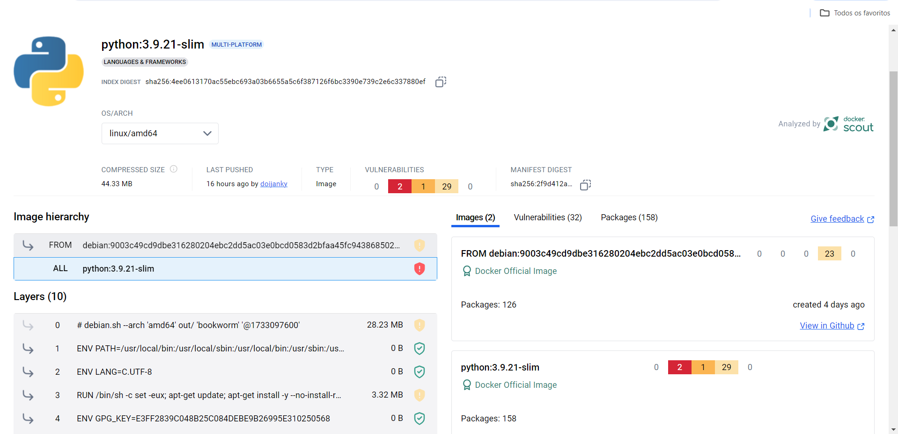

# Orientações

O desafio consiste na criação de imagens Docker para a execução de scripts Python, utilizando containers para isolar e automatizar o processo.

## Preparação

Para iniciar o desafio, foi necessário instalar o Docker e fazer o download do arquivo `carguru.py`.

## Desenvolvimento

### Etapa 1

Na primeira etapa, foi fornecido o script denominado [`carguru.py`](./etapa1/carguru.py), que contém uma lista de carros armazenada em uma variável. Ao ser executado, o script imprime uma string com um elemento aleatório selecionado da lista.

A tarefa foi, então, construir uma imagem Docker a partir de um arquivo Dockerfile, permitindo a criação de um container capaz de rodar o script Python de forma automatizada.

Os passos executados foram, respectivamente:

1. A criação do arquivo Dockerfile, responsável por reunir as instruções para a construção da imagem:

```Dockerfile
    # versao da imagem-base, será utilizada para dar origem a minha imagem
    FROM python:3.9.21-slim 

    # definindo diretório da imagem: subdiretório app
    WORKDIR /app

    # copia o arquivo da aplicação presente na máquina local para minha imagem/diretório de trabalho.
    COPY carguru.py .

    # comandos que serão realizados na iniciação do container: execução do arquivo carguru.py.
    CMD ["python", "carguru.py"]
```
- Observações: 
  - Imagem base: A versão "slim" do Python foi escolhida para reduzir o tamanho da imagem, pois ela contém apenas os componentes essenciais do Python, sem bibliotecas extras ou recursos desnecessários. Isso resulta em uma imagem mais leve e otimizada, mantendo a funcionalidade necessária para a execução de scripts. Tal versão é encontrada no hub oficial de imagens do Docker:
  
    
  
  - Escolha do diretório de trabalho: Criou-se um ambiente organizado e separado para a aplicação denominado `/app` com o objetivo de facilitar a gestão dos arquivos dentro do container.

1. Construção da imagem: processo que envolve a leitura das instruções no Dockerfile e a criação de uma imagem personalizada, que contém todos os elementos necessários para rodar o script.

    Tal passo foi realizado por meio do comando:

    ```docker
        docker build -t carguru_image .

        # A flag -t permite nomear a imagem no momento de sua criação em "-t carguru_image"
        # O "." ao final, indica que o Dockerfile está localizado no diretório atual, onde o comando está sendo executado
    ```
2. Criação e execução do container a partir da imagem, logo, o script pôde ser executado.

    Tal passo foi realizado por meio do comando:

    ```docker
        docker run -it --name carguru_conatainer carguru_image

        # A flag -it permite que o container seja executado de maneira iterativa para que fique disponível no terminal até sua parada.
        # "--name" atribui um nome ao container
    ```

Ao final tem-se o seguinte resultado:


### Etapa 2

É possível reutilizar containers? Em caso positivo, apresente o comando necessário para reiniciar um dos containers parados em seu ambiente Docker? Não sendo possível reutilizar, justifique sua resposta.

Sim, é possível fazer a reutilização de containers uma vez que sua execução foi encerrada, isto se dá por meio do comando:

```Docker
    docker start <nome_ou_id_container>

    # Caso seja necessário executar em modo iterativo (no terminal) basta adicionar a flag -a (attached) ao comando.

    docker start -a <nome_ou_id_container>
```
Como é visto em: 


Desta forma, é possível economizar tempo, já que não se faz necessária a criação e configuração de um container todas vezes que este for necessário, e, recursos, como a memória já que este será armazenado apenas uma vez.

### Etapa 3
   
Na terceira etapa, foi solicitado o desenvolvimento de um script em Python para gerar o hash de uma string fornecida pelo usuário. Além disso, foi necessária a construção de uma imagem Docker e a execução de um container com o script.

Os passos seguidos para essa etapa foram:

1. Criação do script Python, que realiza as seguintes ações:
   - Recebe uma string via input;
   - Gera o hash da string utilizando o algoritmo SHA-1;
   - Exibe o hash gerado no formato hexadecimal (método hexdigest);
   - Repete o processo continuamente (loop infinito).

```Python
    # Importação da biblioteca responsável pela disponibilização dos algoritmos de hash
    import hashlib

    # Abertura do looping que fará a repetição da ação
    while True:
        # Armazenamento da string digitada pelo usuário
        entrada = input("Digite uma string para gerar o hash: ")

        # Conversão feita por meio da biblioteca e seu algoritmo SHA-1
        conversao_hash = hashlib.sha1(entrada.encode())
        # Formatação do hash armazenado por meio do método hexdigest
        hash_hex = conversao_hash.hexdigest()

        # Impressão do hash final
        print(f"Hash SHA-1: {hash_hex}")
```
2. Criação da imagem, denominada "mascarar-dados", que execute o script Python criado:

    Tal ação pôde ser realizada por meio do comando:

    ```Docker
        docker build -t mascarar-dados .
    ```

    Como é visto em:
   
   

3. Iniciação do conainer a partir da imagem, enviando algumas palavras para mascaramento:
   
    Tal ação pôde ser realizada por meio do comando:

    ```Docker
        docker run -it mascarar-dados
    ```
    Como é visto em:

    

    - Observações: 
      - Envio das palavras: Tal passo é feito de maneira iterativa, o usuário é solicitado a realizar a inserção de uma frase.

## Dificuldades encontradas

   Não houve dificuldade para a realização deste desafio.  