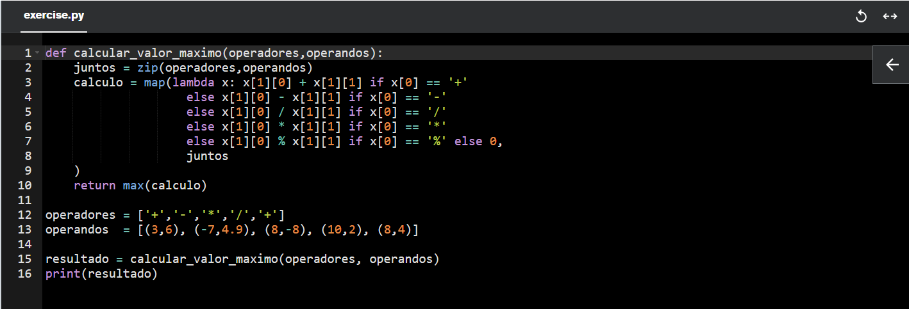

# Informações

Na quarta sprint, tive a oportunidade de aprender sobre programação funcional, uma abordagem que enfatiza o uso de funções imutáveis para resolver problemas de forma mais eficiente e previsível. Além disso, explorei a contenção utilizando o Docker, uma ferramenta que permite criar, gerenciar e executar aplicações em ambientes isolados, garantindo maior portabilidade e consistência.

Além disso, por meio dos cursos AWS Partner Accreditation (Technical) e AWS Technical Essentials, aprofundei meus conhecimentos sobre a arquitetura e os serviços oferecidos pela AWS. Tais cursos evidenciam como a empresa disponibiliza soluções robustas e escaláveis para diferentes necessidades, como o lançamento e gerenciamento de instâncias de aplicações, configuração de redes, armazenamento eficiente de dados e otimização do uso de memória.

Outrossim, foram explorados os cursos de Segurança da Informação, que destacam as boas práticas para proteger dados e sistemas contra ameaças, abordando princípios fundamentais como confidencialidade, integridade e disponibilidade. Também foi estudado o curso de Métodos Ágeis, que apresenta metodologias destinadas a tornar o processo de desenvolvimento de projetos mais eficiente e colaborativo, além de introduzir ferramentas práticas, como o método Scrum, para facilitar a gestão de tarefas e equipes.

# Resumo

## **Programação funcional:** 
A programação funcional é um paradigma que enfatiza o uso de funções como elementos centrais na construção de software. Diferente de abordagens imperativas, ela foca na imutabilidade de dados e na ausência de efeitos colaterais, permitindo que problemas sejam resolvidos de maneira declarativa. Esse paradigma é amplamente utilizado em linguagens como Haskell, Scala e Python, oferecendo recursos que promovem a reutilização de código, maior previsibilidade e facilidade na manutenção.

### **Tópicos principais**

- **First-Class Functions:** As funções são tratadas como cidadãos de primeira classe, o que significa que podem ser atribuídas a variáveis, passadas como argumentos e retornadas por outras funções, assim como qualquer outro dado. Isso permite maior flexibilidade na composição de soluções.
  
    Exemplo:

    ```Python
        def dobro(x):
            return x * 2
        
        funcao = dobro

        print(funcao(6)) # Saída: 12
    ```

- **High-Order Functions:** Funções de alta ordem são aquelas que recebem outras funções como argumentos ou retornam funções como resultado. Esse recurso é útil para abstrair padrões comuns, como mapeamento, filtragem e redução de coleções.

    Exemplo:

    ```Python
        def dobro(x):
            return x * 2

        def aplicar_funcao(func, valores):
            return [func(x) for x in valores]

        nums = [1, 2, 3, 4, 5]
        print(aplicar_funcao(dobro, nums)) # Saída: [2, 4, 6, 8, 10]
    ```

    **Funções relevantes:**

    - **map()** : Aplica uma função a cada item de um iterável (como uma lista) e retorna uma nova lista com os resultados.

    ```Python
        resultado = list(map(dobro, nums))
        print(resultado) # Saída: [2, 4, 6, 8, 10]
    ```
    - **filter()** : Aplica uma função de teste (que retorna True ou False) a cada item de um iterável e retorna apenas os elementos para os quais a função retorna True.
    ```Python
        def e_par(x):
            return x % 2 == 0

        resultado = list(filter(e_par, nums))
        print(resultado)  # Saída: [2, 4]
    ```

    - **reduce()** : Aplica uma função de forma acumulativa aos itens de um iterável, reduzindo-o a um único valor. Essa função não faz parte do módulo principal, então é necessário importar de functools.

    ```Python
        from functools import reduce

        nums = [1, 2, 3, 4, 5]

        def soma(x, y):
            return x + y

        #reduce(lambda acumulador, variavel: lógica, list/dict/tuple, valor inicial do acumulador)
        resultado = reduce(lambda soma, s: soma + s, nums, 0)
        print(resultado)  # Saída: 15
    ```

- **Funções Anônimas (Lambda):** São expressões simples que permitem criar funções de forma concisa, sem a necessidade de defini-las com um nome. Elas são amplamente usadas em operações pontuais e retornos rápidos.

    Exemplo:

    ```Python
        nums = [1, 2, 3, 4, 5]

        resultado = list(map(lambda x: x * x, nums))
        print(resultado) # Saída: [2, 4, 6, 8, 10]
    ```

- **Closure:** Função que "lembra" o ambiente em que foi criada, mesmo após esse ambiente deixar de existir. Isso é possível porque ela captura e mantém acesso às variáveis do escopo externo.

    Exemplo:

    ```Python
        def multiplicar(x):
            def calcular(y):
                return x * y # Função conhece seu ambiente externo
            return calcular
        
        dobro = multiplicar(2)
        print(dobro(5)) # Saída: 10
    ```
- **Recursividade:** A recursividade é um conceito em que uma função se chama diretamente ou indiretamente para resolver um problema. Em programação funcional, ela substitui muitas vezes as iterações tradicionais, sendo essencial para trabalhar com listas e árvores.
    Exemplo:

    ```Python
        def fatorial(n):
            return n * (fatorial(n-1) if n > 1 else 1)
        
        print(f'10! = {fatorial(10)}') # Saída: 3628800
    ```

- **Imutabilidade:** Dados que não podem ser alterados após sua criação. Em vez disso, são criadas novas instâncias com os valores atualizados, o que reduz a probabilidade de erros relacionados a estados mutáveis.

    Exemplo:

    ```Python
        nums = [1, 2, 3, 4, 5]
        resultado = sorted(nums, reverse= True)

        print(nums) # Saída: [1, 2, 3, 4, 5] 
        print(resultado)  # Saída: [5, 4, 3, 2, 1]
    ```

- **Lazy Evaluation (Generator):** Adia a execução de uma expressão até que seu valor seja necessário, otimizando o uso de memória e processamento. Generators, no Python, são exemplos práticos desse conceito, permitindo a geração de valores sob demanda.
    
    Exemplo:

    ```Python
        nums = [1, 2, 3, 4, 5]
        def gerar_quadrados(valores):
            for x in valores:
                yield x * x

        gerador = gerar_quadrados(nums)
        for valor in gerador:
            print(valor, end=" ")  # Saída: 1 4 9 16 25
    ```
___

## **Docker:** 
Software que permite criar, implantar e executar aplicativos dentro de contêineres, que são ambientes isolados e portáteis. Ele é amplamente utilizado para simplificar o desenvolvimento, teste e implantação de software. Os conceitos que ambrange são:

1. **Contêineres**: São como "mini máquinas virtuais", mas mais leves e eficientes. Eles compartilham o kernel do sistema operacional host, mas operam de forma independente, garantindo isolamento entre aplicativos.
2. **Imagens**: Uma imagem Docker é um modelo imutável que contém tudo o que um aplicativo precisa para ser executado, como código, bibliotecas, dependências e configurações.
3. **Docker Engine**: É o núcleo do Docker, responsável por criar e gerenciar contêineres.

**Casos de Uso**

- **Desenvolvimento e Teste**: Criar ambientes consistentes para desenvolvimento e testes, independentemente do sistema operacional ou configuração.
- **Implantação**: Implantar aplicativos em ambientes de produção com rapidez e consistência.
- **Microserviços**: Hospedar aplicativos como uma coleção de serviços menores e independentes.

### **Comandos**

#### Containers
  - Execução com Interação

    ```docker
        docker run -it ubuntu  # Inicia o container Ubuntu e mantém a sessão ativa
        exit  # Para a execução do container e sai da interação
    ```
  - Execução em Segundo Plano (Detached Mode)

    ```docker
        docker run -d ubuntu
    ```
  - Listando Containers em Execução
    ``` docker
        docker ps  #ou
        docker container ls 
    ```
  - Para listar todos os containers (ativos e inativos):
    ```docker
        docker ps -a  # Exibe todos os containers
    ```

  - Expondo Portas para Conexão Externa
    ```docker
        docker run -p 80:80 nginx  # Mapeia a porta 80 do host para a porta 80 do container
    ```

  - Parando a Execução de Containers
    ```docker
    docker stop <container_id>  # Para o container pelo seu ID
    docker stop <container_name>  # Para o container pelo nome
    ```

  - Iniciando um Container (reiniciar)
    ```docker
        docker start <container_id>  # Inicia o container pelo seu ID
    ```
    Observação: O comando docker run cria e inicia um novo container, enquanto docker start apenas reinicia um container existente.

  - Definindo o Nome do Container

    ``` docker
        docker run --name nginx_app  
    ``` 

  - Verificando os Logs do Container
    ```docker
        docker logs <container_id>  # Exibe as últimas ações realizadas no container
    ```
  - Removendo Containers
    ```docker
        docker rm <container_id>  # Remove o container pelo seu ID
        docker rm <container_name>  # Remove o container pelo nome
    ```

#### Imagens

  - Criação de imagens: Arquivo Dockerfile presente na pasta do projeto, que será executado com as seguintes instruções:
    - `FROM`: Imagem base
    - `WORKDIR`: Diretório da aplicação
    - `EXPOSE`: Porta da aplicação
    - `COPY`: Arquivos que precisam ser copiados
    - `RUN`: Comandos que serão executados durante a constrção da imagem
    - `CMD`: Comandos que serão executados após a iniciação do container
    
    ```docker
    # Cada linha é uma camada - se uma é alterada, a reexecução começará a partir dela
    
    FROM node
    
    WORKDIR /app
    
    COPY package*.json .
    
    RUN npm install
    
    COPY . .
    
    EXPOSE 3000
    
    CMD ["node", "./app.js"]  # Comando que executará o projeto
    ```

  - Rodando a imagem no container

    1. Parar o container com `docker stop` para realizar o build
    2. Criar a imagem:
    
    ```docker
    docker build <diretório da imagem / Dockerfile>  # ou docker build . para o Docker entender que esta é a imagem
    ```

    3. Rodar a imagem em um container:
    
    ```docker
    docker run -d -p 3000:3000 <id da imagem>  # Expor a porta e realizar a conexão com o container
    ```

    4. Ver as imagens disponíveis:
    
    ```docker
    docker image ls
    ```

    5. Nomear o container:
    
    ```docker
    docker run -d -p 3000:3000 --name <nome desejado> <id da imagem>
    ```

  - Alterando a imagem
    
    Para o Docker, é como se fosse uma imagem completamente nova.
    As camadas a partir da camada alterada são atualizadas, enquanto as anteriores permanecem em cache, tornando o build mais rápido.

  - Download de imagens
    
    ```docker
        docker pull <imagem>  # Faz o download e deixa a imagem disponível no ambiente em cache
    ```

  - Múltiplas aplicações no mesmo container
    - Atribui-se uma porta diferente para cada aplicação e rodar diversos containers com a mesma imagem em paralelo.
    - Atribui-se nomes diferentes a cada container também.
  
  - Nomeação de imagens

    ```docker
        docker tag <id da imagem> <nome desejado>  
    ```

  - Nomear na criação/build:

    ```docker
        docker build -t <nome desejado>:<nome da tag desejada> .  # '.' significa que a imagem está na pasta atual
    ```
  - Para baixar versões diferentes da mesma imagem
  
    ```docker
        docker pull <nome_imagem>:N  # N é o número da versão. Por padrão, o Docker baixa a última versão da imagem.
    ```

  - Reiniciando o container com interatividade
    
    Quando reinicia-se com docker start <id>, por padrão o container roda em segundo plano. Para ter interação no terminal novamente, usa-se:
    
    ```docker
        docker start -i <id>  # Retorna a interação no terminal
    ```

  - Removendo imagem
    
    ```docker
        docker rmi <id da imagem>  
        
        # Flag-f para forçar a remoção
        
        docker rmi -f <id da imagem> 
    ```

  - Removendo imagens e containers não utilizados

    ```docker
        docker system prune 
    ```

  - Copiando arquivos entre containers
    ```docker
        docker cp <diretório> <nome do container>:<destino>

        # Para copiar um arquivo de um container em execução para um diretório:

        docker cp <nome do container>:/<pasta_WORKDIR>/<nome_arquivo> ./<pasta destino>
    ```

#### Comandos de Análise
  - Verificar informações de processamento: Exibe detalhes como o tempo de execução, ID do processo e o comando executado pelo container (CMD):

    ```docker
        docker top <container>
    ```

  - Inspecionar containers: Fornece informações detalhadas, como ID, data de criação, e imagem associada ao container:
  
    ```docker
      docker inspect <container>
    ```
  - Monitorar consumo de recursos : Exibe os recursos consumidos por todos os containers em execução, como processamento e memória:

    ```docker
      docker stats
    ```

- Enviar Imagens para o Docker Hub
  - Autenticação no Docker Hub: Antes de enviar imagens, é necessário fazer login
    ```docker
      docker login
      docker logout # Encerra a conexão
    ```
  - Enviar imagens para o repositório
    1. Crie um repositório no Docker Hub.
    2. No terminal:

    ```docker
      docker build -t <nomeusuario>/<nome_repositorio> . # Cria a imagem com o nome do repositório
      docker push <nomeusuario>/<nome_repositorio> # Envia a imagem para o Docker Hub

  - Baixar imagens do Docker Hub e utilizá-las
    ```docker
      docker pull <nomeusuario>/<nome_repositorio> # Faz o download da imagem
      docker run <imagem> # Executa o container a partir da imagem

  - Atualizar uma imagem no repositório
    ```docker
      # Gere a imagem com uma nova tag:
        docker build -t <nomeusuario>/<nome_repositorio>:<tag> .
      # Envio da imagem 
        docker push <nomeusuario>/<nome_repositorio>:<tag>
    ```

#### Volumes

  Volumes são usados para armazenar dados fora do ciclo de vida do container, permitindo que os dados persistam. Existem três tipos:

  - Anônimos: Criados automaticamente com nomes aleatórios, geralmente usados para testes:

    ```docker
      docker run -d -p 80:80 --name container --rm -v /data imagem
    ```

  - Nomeados: Têm um nome definido, facilitando o gerenciamento:
    
    ```docker
      docker run -d -p 80:80 --name container --rm -v nomeVolume:/workdir imagem
    ```

  - Bind Mounts: Armazenam dados diretamente no sistema de arquivos da máquina host:

    ```docker
      docker run -d -p 80:80 --name container --rm -v /diretorioLocal:/workdir imagem
    ```

  **Comandos para Volumes**

  - Criar volume manualmente:

      ```docker
        docker volume create <nome>
      ```
  - Listar todos os volumes:

      ```docker
        docker volume ls
      ```
  - Inspecionar detalhes de um volume:

      ```docker
        docker volume inspect <nome>
      ```

  - Remover volumes não utilizados:

      ```docker
        docker volume prune
      ```

#### Redes (Networks)
  
  As redes no Docker permitem conectar containers entre si ou a outros sistemas. Tipos principais:

  - Externa: Conecta o container a APIs ou servidores remotos.
  - Host: Comunica o container diretamente com a máquina host.
  - Bridge: Conecta múltiplos containers entre si.

  Comandos para Redes

  - Criar uma nova rede (bridge):
    ```docker
      docker network create <nome>
    ```

  - Listar redes existentes:

    ```docker
      docker network ls
    ```

  - Remover redes não utilizadas:
    ```docker
      docker network prune
    ```

### YAML
Linguagem de serialização (configuração)

```YAML
  #variáveis recebem o valor por :

var_string: 'nome' #o espaçamento é obrigatório
#quebra de linha feita com enter
var_identada:
  var2: 'idade' #identação feita com dois espaços
  
var_int: 20
var_float: 60.3  
var_string_sem_aspas: Este é um texto válido
 
var_nula: null
#ou
var_nula: ~

var_bool: True #ou On
var_bool: False #ou Off

array: [1, 2, 3]
#ou
array:
  - 1
  - True
  - teste
  
dicionario: {a: 1; b: 2; c: 3, obj_interno: {x:2}}
#ou
dicionario: 
  a: 1
  b: 2
    obj_interno:
      x:2
  c: 3
```

### Docker Compose

Ferramenta para executar múltiplos containers (builds e runs)

- Extensão YAML : docker-compose.yaml
- Version: Versão do Compose
- Services: Containers/serviços que vão ser executados na aplicação
- Volumes: Possível adição de volumes

```yaml

  #execução do compose
  docker-compose up

  #stop da execução
  C^

  #execução em modo detached
  docker-compose up -d

  #stop da execução em modo detached
  docker-compose down

```

#### Variáveis de ambiente

Para aplicar uma maior segurança aos dados sensíveis dos arquivos presentes no Compose (como informações de usuários e senhas) pode-se criar arquivos de extensão “.env” a parte para armazenar tais variáveis. Estas não serão expostas, mas sim incluídas no arquivo Compose.

#### Redes no Compose

Por padrão, o Compose cria uma rede bridge entre os containers da aplicação, mas pode-se isolar redes com a chave networks e com ela ligarmos apenas os containers desejados e definir drivers diferentes.

```yaml
  docker-compose ps
  #verificando quais serviços estão atuando
```

### Docker Swarm e Kubernetes

#### Docker Swarm

Ferramenta de orquestração de containers nativa do Docker, projetada para gerenciar clusters de containers de forma simples. Ele permite distribuir containers entre múltiplos nós e garantir alta disponibilidade.

**Principais Conceitos**
- **Cluster**: Um grupo de máquinas (nós) que trabalham juntas.
- **Nó**: Cada máquina no cluster, podendo ser:
  - *Manager*: Controla o cluster.
  - *Worker*: Executa containers.
- **Serviço**: Um conjunto de containers gerenciados como uma única entidade no cluster.
- **Task**: Uma instância de um container dentro de um serviço.

**Funcionalidades**
- **Balanceamento de carga**: Distribui requests automaticamente entre os nós.
- **Tolerância a falhas**: Se um nó falhar, os serviços são recriados em outros nós disponíveis.
- **Escalabilidade**: Containers podem ser escalados para mais instâncias com um único comando.

**Comandos Básicos**

1. **Inicializar o Swarm**:
   
    ```docker
      docker swarm init
    ```
2. Adicionar um nó ao cluster:

    ```docker
      docker swarm join --token <token> <manager_ip>:<port>
    ```
3. Criar um serviço:
    ```docker
      docker service create --name <nome_servico> <imagem>
    ```
4. Escalar um serviço:
    ```
      docker service scale <nome_servico>=<número_de_replicas>
    ```
5. Listar serviços:
    ```docker
      docker service ls
    ```
#### Kubernetes

Kubernetes é uma plataforma avançada de orquestração de containers, criada pelo Google. Ele oferece controle detalhado para gerenciar aplicativos containerizados em ambientes distribuídos.

**Principais Conceitos**
- **Pod**: A menor unidade no Kubernetes, geralmente contendo um ou mais containers.
- **Node**: Máquina (física ou virtual) que executa Pods.
- **Cluster**: Conjunto de nós gerenciados pelo Kubernetes.
- **Deployment**: Controla como os Pods são gerenciados, incluindo replicações e atualizações.
- **Service**: Exposição de Pods para comunicação interna ou externa.
- **Namespace**: Divisão lógica no cluster para organização e isolamento.

**Funcionalidades**
- **Automação** de deploys, balanceamento de carga e escalonamento.
- **Resiliência** com monitoramento contínuo e reinício de containers falhados.
- **Rolling Updates** para aplicar atualizações sem tempo de inatividade.

**Comandos Básicos**

1. Criar um cluster
    ```docker
      minikube start
    ```

2. Implantar um aplicativo
    ```docker
      kubectl create deployment <nome_deployment> --image=<imagem>
    ```
3. Escalar um aplicativo
    ```docker
      kubectl scale deployment <nome_deployment> --replicas=<número_de_replicas>
    ```

4. Expor um serviço
    ```docker
      kubectl expose deployment <nome_deployment> --type=LoadBalancer --port=<porta>
    ```

5. Listar Pods
    ```docker
      kubectl get pods
    ```

# Exercícios e Evidências

1. Você está recebendo um arquivo contendo 10.000 números inteiros, um em cada linha. Utilizando lambdas e high order functions, apresente os 5 maiores valores pares e a soma destes. Você deverá aplicar as seguintes funções no exercício:
  - map
  - filter
  - sorted
  - sum

    Seu código deverá exibir na saída (simplesmente utilizando 2 comandos `print()`):

  - a lista dos 5 maiores números pares em ordem decrescente;
  - a soma destes valores.

    [**Resolução**](./Exercicios/ex01.py)
    

    Onde:

    ``` Python
      #abertura do arquivo disponibilizado
      with open('number.txt', 'r') as number:
        #conversão das entradas string em inteiros
        numeros = map(int, number) 
        
        #filtragem dos numeros pares
        pares = filter(lambda x: x % 2 == 0, numeros)
        #ordenação do maior para o menor
        pares_ordenados = sorted(pares, reverse=True)
        #seleção dos 5 primeiros e conversão em lista
        cinco_maiores_pares = list(pares_ordenados[:5])
        #soma dos 5 primeiros
        soma = sum(cinco_maiores_pares)
        
      print(cinco_maiores_pares)
      print(soma)
    ```
<br>

2. Utilizando high order functions, implemente o corpo da função conta_vogais. O parâmetro de entrada será uma string e o resultado deverá ser a contagem de vogais presentes em seu conteúdo. É obrigatório aplicar as seguintes funções:
   
- len
- filter
- lambda

  Desconsidere os caracteres acentuados. Eles não serão utilizados nos testes do seu código.

  [**Resolução**](./Exercicios/ex02.py)
  

  Onde:

  ```Python
    def conta_vogais(texto:str)-> int: #função recebe string retorna int
    #filtro de vogais
    vogais = filter(lambda i: i in 'aeiouAEIOU', texto)
    #contagem utilizando len em um objeto iterável
    contagem = len(list(vogais))
    #retorno int
    return contagem
                
    texto = 'Hello word!'            
    resultado = conta_vogais(texto)            
    print(resultado)
  ```
<br>

3. A função calcula_saldo recebe uma lista de tuplas, correspondendo a um conjunto de lançamentos bancários. Cada lançamento é composto pelo seu valor (sempre positivo) e pelo seu tipo (C - crédito ou D - débito). 

    Abaixo apresentando uma possível entrada para a função.

    `
    lancamentos = [
        (200,'D'),
        (300,'C'),
        (100,'C')
    ]
    `

    A partir dos lançamentos, a função deve calcular o valor final, somando créditos e subtraindo débitos. Na lista anterior, por exemplo, teríamos como resultado final 200.

    Além de utilizar lambdas, você deverá aplicar, obrigatoriamente, as seguintes funções na resolução:

    - reduce (módulo functools)
    - map

    [**Resolução**](./Exercicios/ex03.py)
    


    ```Python
      #importação da biblioteca functools
      from functools import reduce 

      #função que receberá o iterável e retornará um valor do tipo float
      def calcula_saldo(lancamentos)-> float:

        #tornando positivo ou negativo com base no tipo
        conversao = map(lambda x: x[0] if x[1] == 'C' else -x[0], lancamentos)
        #soma dos valores ajustados
        soma_lancamentos = reduce(lambda soma, lancamento: soma + lancamento, conversao, 0)
        #retorno da soma
        return soma_lancamentos
          
      lancamentos = [
          (200,'D'),
          (300,'C'),
          (100,'C')
      ]

      resultado = calcula_saldo(lancamentos)
      print(resultado)
    ```

<br>

4. A função calcular_valor_maximo deve receber dois parâmetros, chamados de operadores e operandos. Em operadores, espera-se uma lista de caracteres que representam as operações matemáticas suportadas `(+, -, /, *, %)`, as quais devem ser aplicadas à lista de operadores nas respectivas posições. Após aplicar cada operação ao respectivo par de operandos, a função deverá retornar o maior valor dentre eles.

    Veja o exemplo:

    - Entrada:

      `operadores = ['+','-','*','/','+']`

      `operandos  = [(3,6), (-7,4.9), (8,-8), (10,2), (8,4)]`


    - Aplicar as operações aos pares de operandos

      `[ 3+6 , -7-4.9, 8*-8 , 10/2 , 8+4 ]` 

    - Obter o maior dos valores

      `12`

    Na resolução da atividade você deverá aplicar as seguintes funções:

    - max
    - zip
    - map

    [**Resolução**](./Exercicios/ex04.py)
    

    Onde:

    ```Python
      #função ue recebe os iteráveis
      def calcular_valor_maximo(operadores,operandos):
        #junção dos elementos com a númeração do índice em comum
        juntos = zip(operadores,operandos)
        # aplicação do cálculo de acordo com o operando
        calculo = map(lambda x: x[1][0] + x[1][1] if x[0] == '+'
                        else x[1][0] - x[1][1] if x[0] == '-'
                        else x[1][0] / x[1][1] if x[0] == '/'
                        else x[1][0] * x[1][1] if x[0] == '*'
                        else x[1][0] % x[1][1] if x[0] == '%' else 0, juntos)
        #retorno do maior valor armazenado na variável cálculo
        return max(calculo)
        
      operadores = ['+','-','*','/','+']
      operandos  = [(3,6), (-7,4.9), (8,-8), (10,2), (8,4)]

      resultado = calcular_valor_maximo(operadores, operandos)
      print(resultado)
    ```
<br>

5. Um determinado sistema escolar exporta a grade de notas dos estudantes em formato CSV. Cada linha do arquivo corresponde ao nome do estudante, acompanhado de 5 notas de avaliação, no intervalo [0-10]. É o arquivo estudantes.csv de seu exercício.

    Precisamos processar seu conteúdo, de modo a gerar como saída um relatório em formato textual contendo as seguintes informações:

    - Nome do estudante
    - Três maiores notas, em ordem decrescente
    - Média das três maiores notas, com duas casas decimais de precisão

    O resultado do processamento deve ser escrito na saída padrão (print), ordenado pelo nome do estudante e obedecendo ao formato descrito a seguir:

    `Nome: <nome estudante> Notas: [n1, n2, n3] Média: <média>`

    Exemplo:

    Nome: Maria Luiza Correia Notas: [7, 5, 5] Média: 5.67
    
    Nome: Maria Mendes Notas: [7, 3, 3] Média: 4.33

    Em seu desenvolvimento você deverá utilizar lambdas e as seguintes funções:

    - round
    - map
    - sorted

    [**Resolução**](./Exercicios/ex05.py)
    

    Onde:

    ```Python
      #abertura do arquivo
      with open('estudantes.csv', 'r', encoding='utf-8') as arquivo:
        #leitura de todas as linhas do arquivo e armazenamento em uma lista
        conteudo_arquivo = arquivo.readlines()

      #função que receberá cada linha para a realização da lógica
      def processar_conteudo(linha):
          #remoção de espaços em branco ao redor da linha e separação dos dados por vírgula
          dados = linha.strip().split(',')
          #o primeiro elemento da linha é o nome do estudante
          estudante_nome = dados[0]
          #os demais elementos são convertidos de strings para inteiros e armazenados como uma lista de notas
          lista_notas = list(map(int, dados[1:]))
          #seleção das 3 maiores notas, ordenando em ordem decrescente
          notas_selecionadas = sorted(lista_notas, reverse=True)[:3]
          #cálculo da média das 3 maiores notas, arredondando para 2 casas decimais
          media_calculada = round(sum(notas_selecionadas) / 3, 2)
          #retorno da uma tupla formatada com as informações
          return (estudante_nome, f"Nome: {estudante_nome} Notas: {notas_selecionadas} Média: {media_calculada}")

      #processa cada linha usando a função 'processar_conteudo' e organiza o relatório por ordem alfabética dos nomes
      relatorio_final = sorted(map(processar_conteudo, conteudo_arquivo), key=lambda x: x[0])

      for _, relatorio in relatorio_final:
        print(relatorio)
    ```
<br>

6. Você foi encarregado de desenvolver uma nova feature  para um sistema de gestão de supermercados. O analista responsável descreveu o requisito funcional da seguinte forma:

- Para realizar um cálculo de custo, o sistema deverá permitir filtrar um determinado conjunto de produtos, de modo que apenas aqueles cujo valor unitário for superior à média deverão estar presentes no resultado. Vejamos o exemplo:

  Conjunto de produtos (entrada):

  - Arroz: 4.99
  - Feijão: 3.49
  - Macarrão: 2.99
  - Leite: 3.29
  - Pão: 1.99

  Produtos com valor acima da média:

  - Arroz: 4.99
  - Feijão: 3.49

  Observe que estamos definindo a assinatura de uma função como parte de sua resposta. Você não pode mudá-la, apenas codificar seu corpo. O parâmetro conteudo é um dicionário cuja chave contém o nome do produto e o valor, o respectivo preço (ponto flutuante).

  Observe um exemplo de valor para conteudo:

  {
    
    "arroz": 4.99,

    "feijão": 3.49,

    "macarrão": 2.99,

    "leite": 3.29,

    "pão": 1.99
  
  }

  O retorno da função obrigatoriamente deve ser uma lista. Cada elemento da lista é uma tupla em que a primeira posição contém o nome do produto e a segunda, o respectivo preço. Veja um exemplo de retorno:

  `[ ('feijão', 3.49), ('arroz', 4.99) ]`

  Importante: O retorno da função deve estar ordenado pelo preço do item (ordem crescente).

  [**Resolução**](./Exercicios/ex06.py)
  

  Onde:

  ```Python
    #função que recebe um dicipnário e retorna uma lista
    def maiores_que_media(conteudo:dict)->list:
      # média recebe a soma dos valores dividida pelo tamanho do dicionário (quantidade de ítens)
      media = sum(conteudo.values()) / len(conteudo)

      #filtragem dos ítens que possuem um valor maior que a média calculada
      produtos_acima_media = filter(lambda item: item[1] > media, conteudo.items())

      #ordenação dos ítens pelo valor de maneira crescente      
      produtos_ordenados = sorted(produtos_acima_media, key=lambda item: item[1])
      
      return list(produtos_ordenados)

    conteudo = {
        "arroz": 4.99,
        "feijão": 3.49,
        "macarrão": 2.99,
        "leite": 3.29,
        "pão": 1.99
    }

    maiores_que_media(conteudo)
  ```
<br>

7. Generators são poderosos recursos da linguagem Python. Neste exercício, você deverá criar o corpo de uma função, cuja assinatura já consta em seu arquivo de início (`def pares_ate(n:int):`) .

    O objetivo da função `pares_ate` é retornar um generator para os valores pares no intervalo `[2,n]` . Observe que `n` representa o valor do parâmetro informado na chamada da função.

    [**Resolução**](./Exercicios/ex07.py)
    

    Onde:

    ```Python
      def pares_ate(n:int):
        #itera de 2 até n (inclusive), com incrementos de 2
        for i in range(2, n+1, 2):
            #retorna o valor atual sem encerrar a função, permitindo continuar a iteração
            yield i
      
      #cria um gerador que produzirá números pares de 2 até 8
      generator = pares_ate(8)

      for par in generator:
          print(par)
    ```

# Certificados


Certificado do Curso AWS Partner: Credenciamento (Técnico)


Certificado do Curso AWS Partner: Technicals Essentials

