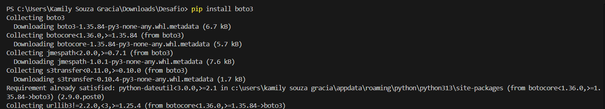
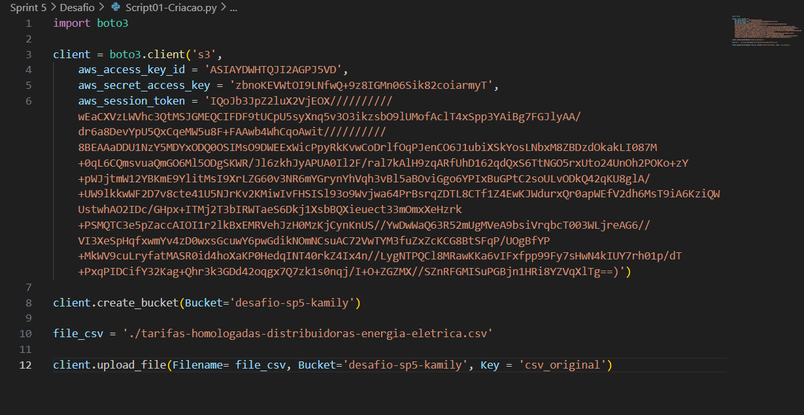
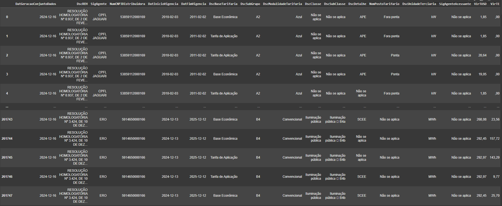
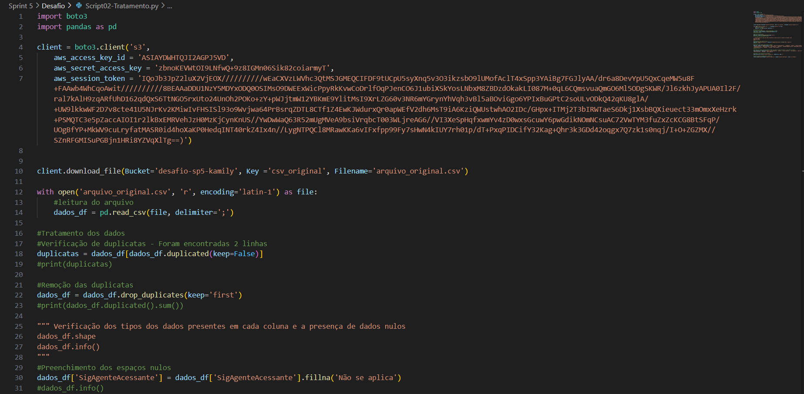
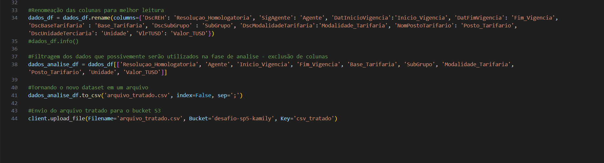
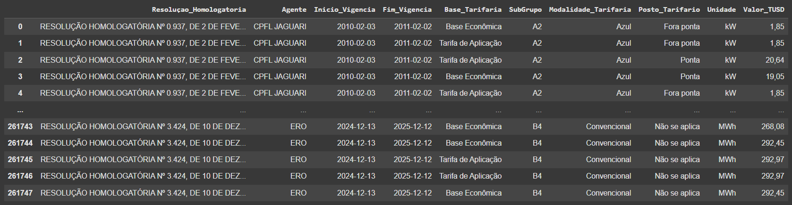
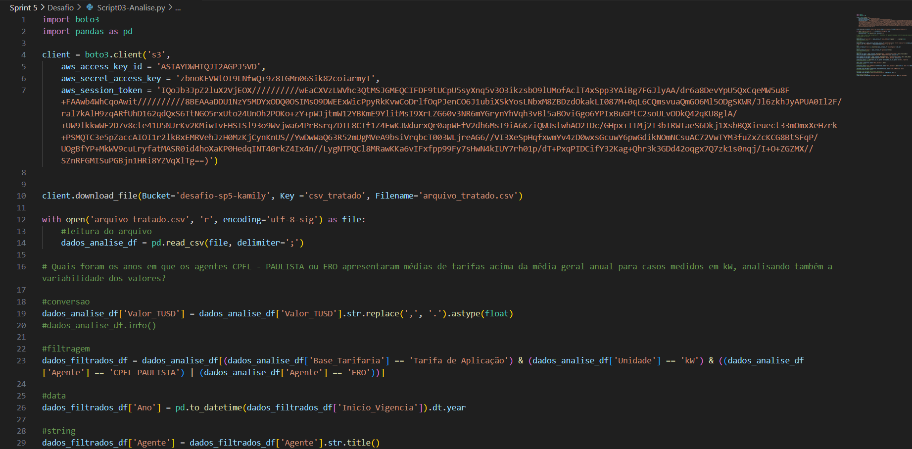
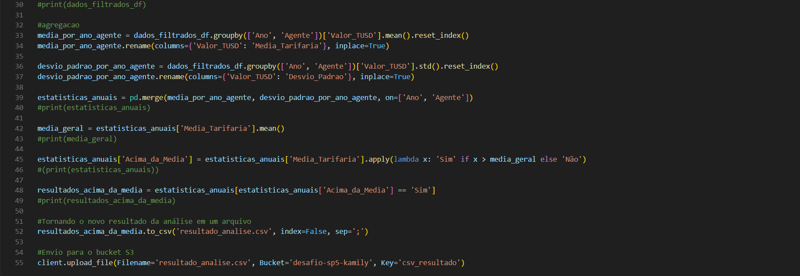
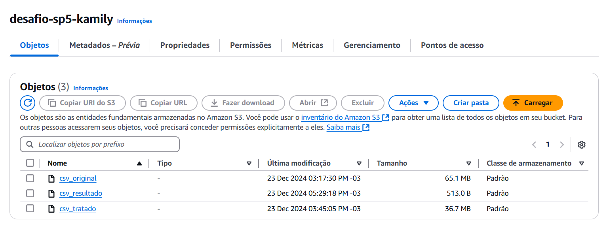

# Orientações

O desafio consiste na criação de um bucket no serviço Amazon S3 da AWS, upload e download de arquivos por meio de scripts em linguagem Python e o tratamento e análise de uma base de dados real.

## Preparação

Para iniciar o desafio, foi necessário realizar a busca e o download de uma base de dados real fornecida pelo portal de dados públicos oficial do Governo Brasileiro: http://dados.gov.br.

Foi escolhida a base de dados [Tarifas de aplicação das distribuidoras de energia elétrica](https://dados.gov.br/dados/conjuntos-dados/tarifas-distribuidoras-energia-eletrica) disponibilizada pela Agência Nacional de Energia Elétrica - ANEEL.

Em resumo, a base de dados disponibiliza as tarifas aplicadas por cada concessionária e agente autorizado pela organização para o cálculo das contas de energia dos consumidores finais, considerando diversas condições, como a bandeira tarifária, posto tarifário, subgrupo de consumidores, resolução homologatória vigente, períodos de aplicação, entre outras informações relevantes para a análise.

## Desenvolvimento

### Etapa 1 - Criação do bucket S3 e upload do arquivo original

Para a criação do bucket, foi necessário realizar a instalação da biblioteca boto3 do Python, que permite a interação com os serviços da AWS, incluindo o Amazon S3. Isto pode ser realizado por meio do comando:

```
    pip install boto3
```

Como é visto na seguinte execução:



Após a instalação, configurou-se as credenciais de acesso à conta AWS, permitindo a criação do bucket e a definição de permissões para armazenamento e gerenciamento de objetos dentro dele. Isto pôde ser feito diretamente no [script de criação do bucket](./Script01-Criacao.py):



Desmembrando cada parte do código, temos então:

1. A importação da biblioteca que permitirá a interação com os serviços AWS:
```Python
    import boto3
```

2. A configuração do serviço a ser utilizado e das credenciais para acesso da conta:
```Python
    client = boto3.client('s3', 
    aws_access_key_id = 'id disponibilizado para o acesso',
    aws_secret_access_key = 'chave de acesso secreta disponibilizada',
    aws_session_token = 'token da sessão ativa')
```
3. A criação do bucket por meio do comando:
```Python
    client.create_bucket(Bucket='desafio-sp5-kamily')
```
OBS: O nome do bucket deve ser único, ou seja, caso já exista um bucket com o mesmo nome informado em outra conta não será autorizada a sua criação.

4. Upload do arquivo original para o bucket:
```Python
    #Armazenamento do caminho do arquivo em uma variável
    file_csv = './tarifas-homologadas-distribuidoras-energia-eletrica.csv'

    #Comando que realiza o upload passando como argumento o caminho do arquivo, o nome do bucket e o nome que ficará disponível para visualização em nuvem.
    client.upload_file(Filename= file_csv, Bucket='desafio-sp5-kamily', Key = 'csv_original')
```
Tem-se então a visualização do dataset original:


### Etapa 2 - Recuperação do arquivo em nuvem, tratamento da base de dados e upload do novo arquivo

Para a realização da etapa tratamento da base de dados original, foi necessário baixar o arquivo presente no bucket e após as modificações realizar o upload da versão para a nuvem. Assim como visualiza-se no [Script de tratamento](./Script02-Tratamento.py):




Ao analisar as cláusulas contidas no código, podemos identificar as seguintes diferenças:

1. Importação da biblioteca *Pandas* que permitirá a utilização de métodos necessários para o tratamento dos dados contidos no dataset:
```Python
    import pandas as pd
```

2. Comando importado pela biblioteca `boto3` para realizar o download do arquivo presente no bucket para a máquina local:
```Python
    #Como argumento do comando de download são informados: o nome do bucket, o nome do arquivo desejado e o nome que dará-se ao arquivo localmente ao realizar o download.
    client.download_file(Bucket='desafio-sp5-kamily', Key ='csv_original', Filename='arquivo_original.csv')
```

3. Leitura do arquivo:
```Python
    #comando resoinsável por abrir o arquivo e direcionar suas informações para uma variável, podem ser passados como argumentos: o nome do arquivo, a operação a ser realizada (r-read), o tipo de codificação.
    with open('arquivo_original.csv', 'r', encoding='latin-1') as file: 
        #armazenamento do conteúdo em uma variável, informando o delimitador do csv.
        dados_df = pd.read_csv(file, delimiter=';')
```

4. Visualização da existência de duplicatas e remoção destas:
```Python
    #Retorno de todas as duplicatas encontradas.
    duplicatas = dados_df[dados_df.duplicated(keep=False)]
    #Remoção mantendo a primeira ocorrência da linha considerada como duplicata.
    dados_df = dados_df.drop_duplicates(keep='first')
```

5. Preenchimento de espaços *NaN*
```Python
    dados_df['SigAgenteAcessante'] = dados_df['SigAgenteAcessante'].fillna('Não se aplica')
```
OBS: Optou-se pelo preenchimento dos campos nulos na coluna "SigAgenteAcessante", considerando que os dados desta coluna estão em formato de string e que havia apenas 22 valores ausentes. Essa abordagem foi escolhida por não comprometer a análise final.

6. Renomeação das colunas
```Python
    dados_df = dados_df.rename(columns={'DscREH': 'Resoluçao_Homologatoria', 'SigAgente': 'Agente', 'DatInicioVigencia':'Inicio_Vigencia', 'DatFimVigencia': 'Fim_Vigencia', 'DscBaseTarifaria' : 'Base_Tarifaria', 'DscSubGrupo' : 'SubGrupo', 'DscModalidadeTarifaria':'Modalidade_Tarifaria', 'NomPostoTarifario': 'Posto_Tarifario', 'DscUnidadeTerciaria': 'Unidade', 'VlrTUSD': 'Valor_TUSD'})
```
OBS: Tal ação foi tomada para melhorar a interpretação das informações contidas nas colunas, uma vez que os títulos estavam dispostos de maneira técnica antes da mudança.

7. Seleção (filtragem) das colunas da base  de dados original para posterior análise
```Python
    dados_analise_df = dados_df[['Resoluçao_Homologatoria', 'Agente', 'Inicio_Vigencia', 'Fim_Vigencia', 'Base_Tarifaria', 'SubGrupo', 'Modalidade_Tarifaria', 'Posto_Tarifario', 'Unidade', 'Valor_TUSD']]
```

8. Conversão do dataset tratado em um arquivo separado
```Python
    #Comando que transforma a variável em um arquivo csv passando como argumento o nome do arquivo a ser salvo, a opção de adição de uma coluna que descreve o index e o delimitador dos dados
    dados_analise_df.to_csv('arquivo_tratado.csv', index=False, sep=';')
```

9. Upload do arquivo tratado para o bucket em nuvem
```Python
    client.upload_file(Filename='arquivo_tratado.csv', Bucket='desafio-sp5-kamily', Key='csv_tratado')
```

Após o tratamento, o dataset encontra-se da seguinte forma:


### Etapa 3 - Recuperação do dataset tratado, análise e upload do resultado
   
Para a realização desta etapa, foi necessário criar um questionamento sobre a base de dados já tratada para que pudesse ser respondido utilizando as funções em Python de:

* Filtragem (utilizando ao menos dois operadores lógicos);
* Agregação (ao menos duas);
* Condição;
* Conversão;
* Data;
* String.

O questionamento levantado foi:

Quais foram os anos em que os agentes CPFL - PAULISTA ou ERO apresentaram médias de tarifas acima da média geral anual para casos medidos em kW, analisando também a variabilidade dos valores?

Seguindo tais orientações tem-se então o seguinte [Script de análise](./Script03-Analise.py):




Onde notam-se as seguintes funções, importadas pela biblioteca *Pandas* reponsáveis pela análise da base de dados:

1. Função de conversão: Transformação dos dados da coluna "Valor_TUSD" em *float* para a manipulação destes como números:
```Python
    #Foi também trocada a vírgula por ponto para que os valores pudéssem ser identificados conforme o padrão do inglês pelo método replace.
    dados_analise_df['Valor_TUSD'] = dados_analise_df['Valor_TUSD'].str.replace(',', '.').astype(float)
```

2. Função de filtro: Seleção das linhas que podem ser utilizadas para a análise. Onde:
   * A Base tarifária é "tarifa de aplicação" (tarifa utilizada pela distribuidora para o faturamento dos acessantes (consumidores, geradores e distribuidoras));
   * A unidade de medida é kW para que haja um padrão entre os dados;
   * Os agentes são "CPFL-PULISTA" ou "ERO" como pede o enunciado.
```Python
    dados_filtrados_df = dados_analise_df[(dados_analise_df['Base_Tarifaria'] == 'Tarifa de Aplicação') & (dados_analise_df['Unidade'] == 'kW') & ((dados_analise_df['Agente'] == 'CPFL-PAULISTA') | (dados_analise_df['Agente'] == 'ERO'))]
```

3. Função de data: Criação de uma coluna no dataset com o ano extraído da data de início de vigência da resolução homologatória:
```Python
    dados_filtrados_df['Ano'] = pd.to_datetime(dados_filtrados_df['Inicio_Vigencia']).dt.year
```

4. Função de string: Converção de cada palavra em uma string para o formato Title Case, onde apenas a primeira letra de cada palavra é maiúscula e as demais são minúsculas:
```Python
    dados_filtrados_df['Agente'] = dados_filtrados_df['Agente'].str.title()
```

5. Funções de agregação: Cálculo da média e do desvio padrão baseando-se no ano e no agente aplicador das tarifas:

* Cálculo da média:
```Python
    #Agrupamento dos valores por ano e agente e cálculo da média.
    media_por_ano_agente = dados_filtrados_df.groupby(['Ano', 'Agente'])['Valor_TUSD'].mean().reset_index()
    #Renomeação da coluna "Valor_TUSD" para "Média_Tarifaria" onde se encontrará os resultados do cálculo anterior.
    media_por_ano_agente.rename(columns={'Valor_TUSD': 'Media_Tarifaria'}, inplace=True)
```
* Cálculo do desvio padrão:
```Python
    #Agrupamento dos valores por ano e agente e cálculo do desvio padrão.
    desvio_padrao_por_ano_agente = dados_filtrados_df.groupby(['Ano', 'Agente'])['Valor_TUSD'].std().reset_index()
    #Renomeação da coluna "Valor_TUSD" para "Desvio_Padrao" onde se encontrará os resultados do cálculo anterior.
    desvio_padrao_por_ano_agente.rename(columns={'Valor_TUSD': 'Desvio_Padrao'}, inplace=True)
```

6. Junção dos datasets criados considerando a semelhança entre os anos e agentes:
```Python
    estatisticas_anuais = pd.merge(media_por_ano_agente, desvio_padrao_por_ano_agente, on=['Ano', 'Agente'])
```

7. Calculo da média geral por meio da coluna "Media_tarifaria" criada:
```Python
    media_geral = estatisticas_anuais['Media_Tarifaria'].mean()
```

8. Função de condição: Criação da coluna "Acima_da_Media" que determinará se a média encontrada para determinado ano e agente é maior que a média geral encontrada:
```Python
    estatisticas_anuais['Acima_da_Media'] = estatisticas_anuais['Media_Tarifaria'].apply(lambda x: 'Sim' if x > media_geral else 'Não')
```

9. Seleção das linhas em que a média do ano e agente é maior do que a média geral:
```Python
    resultados_acima_da_media = estatisticas_anuais[estatisticas_anuais['Acima_da_Media'] == 'Sim']
```

10. Tranformação do novo dataset em arquivo e envio ao bucket:
```Python
    resultados_acima_da_media.to_csv('resultado_analise.csv', index=False, sep=';')

    client.upload_file(Filename='resultado_analise.csv', Bucket='desafio-sp5-kamily', Key='csv_resultado')
```

Ao final da análise o resultado encontrado envidencia que o agente EROS é aquele que possui a maior ocorrência de médias de aplicação de tarifas acima da média geral, como é evidenciado no dataset:


Além disso, pode-se apresentar a visualização final do bucket S3 após a execução de todos os scripts:



## Dificuldades encontradas

   Não houveram dificuldades para a realização deste desafio.  