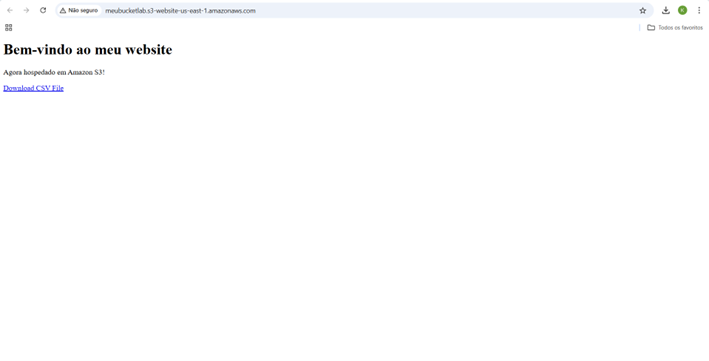

# Informações

Na quinta sprint, pude aprender mais sobre os serviços da AWS ao explorar dois recursos complementares: o curso AWS Certified Cloud Practitioner CLF-02 e o jogo interativo AWS Cloud Quest: Cloud Practitioner. O curso proporcionou uma base teórica abrangente, acerca dos principais conceitos e serviços da AWS que estarão presentes na prova de certificação, enquanto o jogo trouxe uma abordagem prática e dinâmica, permitindo-me aplicar as soluções aprendidas para resolver problemas reais utilizando os serviços da AWS.

# Resumo

**AWS Certified Cloud Practitioner CLF-02**:  

1. Conceitos de Computação em Nuvem

* Definição: Autoatendimento sob demanda, elasticidade e cobrança baseada no consumo.
* Benefícios: Alta disponibilidade, tolerância a falhas, eficiência de custos e sustentabilidade.
* Princípios: Excelência operacional, segurança, confiabilidade, eficiência de desempenho e otimização de custos.

2. Estratégias de Migração

* Fases: Projeto, migração e reinvenção.
* Estratégias: Lift-and-shift, refatoração e realocação.
  
3. Serviços AWS

* Armazenamento: Amazon S3, Glacier, EFS.
* Bancos de Dados: RDS, Aurora, DynamoDB.
* Computação: EC2, AWS Lambda.
* Segurança: AWS WAF, GuardDuty, Shield.
* Governança: CloudTrail, Audit Manager.

4. Segurança e Conformidade

* Modelo de Responsabilidade Compartilhada.
* Ferramentas de segurança: Criptografia, IAM, Grupos de Segurança, Listas de Controle de Acesso.

5. Infraestrutura Global e Serviços em Nuvem

* Regiões, zonas de disponibilidade e locais de borda.
* Modelos de nuvem: pública, privada, híbrida, multinuvem.
* Serviços de computação, banco de dados, e rede (VPC).

6. Armazenamento na Nuvem

* Objetos (Amazon S3): Ideal para dados não estruturados, escalabilidade ilimitada.
* Arquivos (Amazon EFS, FSx): Soluções para sistemas de arquivos, compatíveis com Linux e Windows.
* Blocos (Amazon EBS): Para instâncias EC2, alta resiliência e suporte a snapshots.
  
7. Machine Learning e Inteligência Artificial

* ML: Algoritmos que permitem aprendizado de dados.
* IA: Resolução de problemas cognitivos associados à inteligência humana.
* Serviços de ML: Amazon SageMaker, frameworks como TensorFlow, PyTorch.

8. Serviços de Análise da AWS

* Data Analytics: Conversão de dados em informações úteis.
* Serviços Principais: Athena, Macie, Redshift, Kinesis, Glue, QuickSight, EMR.

9. Monitoramento e Observabilidade

* AWS Well-Architected Framework.
* Serviços: CloudWatch, X-Ray, EventBridge.

10. Integração de Aplicações

* Serviços: EventBridge, SNS, SQS.

11. Serviços para Desenvolvedores

* Ferramentas de DevOps: AWS AppConfig, CodeBuild, CodePipeline, etc.

12. Otimização de Custos

* Uso eficiente de recursos: AWS Budgets, Cost Explorer.
* Modelos de preços: Instâncias sob demanda, reservadas, spot, Savings Plans.

13. Faturamento, Orçamento e Gerenciamento de Custos

* Monitoramento de Custos: AWS Cost Explorer, CloudWatch.
* Controle de Orçamento: AWS Budgets, AWS Organizations.

14. Suporte Técnico AWS

* Orientação proativa para melhorar a eficiência e resolver problemas.

# Exercícios e Evidências

O exercício consiste na criação de um bucket no serviço Amazon S3 da AWS para utilização de seu conteúdo em um site estático, para isso foram seguidas as seguintes instruções:

1. Criação do bucket:
   

  
  * Configuração do nome e região
  
  

  * Resultado final
  
  

2. Ativação da hospedagem de site estático no bucket:

  * Em "Propriedades" editar a seção "Hospedagem de site estático"
  
  

  * Configurações necessárias:
    * Habilitar "Hospedagem de site estático";
    * Em tipo de hospedagem, selecionar "Hospedar um site estático";
    * Em "Documento de Índice", fornecer o nome do arquivo que contém a página principal do site;
    * Em "Documento de erro", fornecer  o nome do arquivo que contém a mensagem de erro caso necessário.
  
  

  * Resultado final 
    * Copiar o endpoint (endereço do site do Amazon S3 para o bucket) fornecido
  
  

  * Teste de acesso ao endpoint
  
  
  Obs: O acesso à pagina é bloqueado devido a configuração padrão de bloqueio de acesso ao público habilitada.

3. Edição das configurações de bloqueio de acesso ao público:

  * Em "Permissões" editar a seção "Bloquear acesso ao público"
  
  

  * Desabilitar a caixa "Bloquear todo acesso público"
  
  

  * Resultado final
  
  

4. Tornar o bucket publicamente disponível por meio da adição de uma política de bucket:

  * Em "Permissões" editar a seção "Política de bucket"
    * Colar o seguinte script no "Editor de política de bucket"
    
  

  * Resultado Final
  
  

5. Upload dos arquivos *index.html*, *404.html* e o *nomes.csv* (conteúdo a ser disponibilizado para download no site)

  * Criação do arquivo *index.html* (documento de índice informado anteriormente)
  
  
  OBS: Após a criação o arquivo index.html, este pode ser "arrastado" do gerenciador de arquivos local para a seção "Objetos" assim o upload será realizado.

  *  Criação do arquivo *404.html* (documento de erro informado anteriormente)
  
  
  OBS: Após a criação o arquivo 404.html, este pode ser "arrastado" do gerenciador de arquivos local para a seção "Objetos" assim o upload será realizado.

  * Arquivo *nomes.csv*: deve ser criada uma pasta "dados" que armazenará o arquivo e esta deverá ser "arrastada" para a seção objetos.

  * Resultado final
  
   

6. Teste do Endpoint
  * Colar o endpoint do bucket na barra de pessquisa
  
   
  
# Certificados

[Badge AWS Cloud Quest: Cloud Practitioner:](https://www.credly.com/badges/aeffd60c-0678-4ed0-a792-addcd6855c9d/public_url)

Certificado do Curso AWS Certified Cloud Practitioner CLF-C02:

