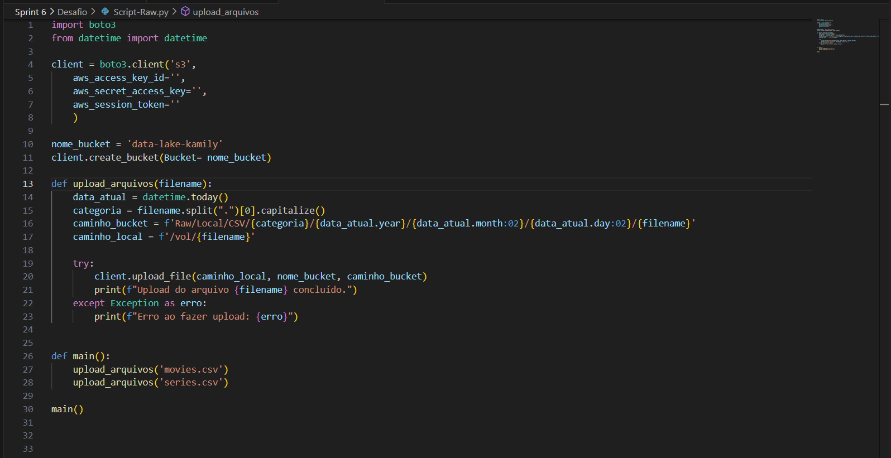
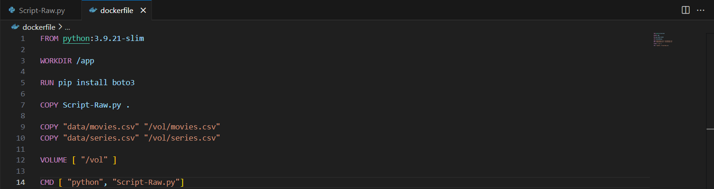
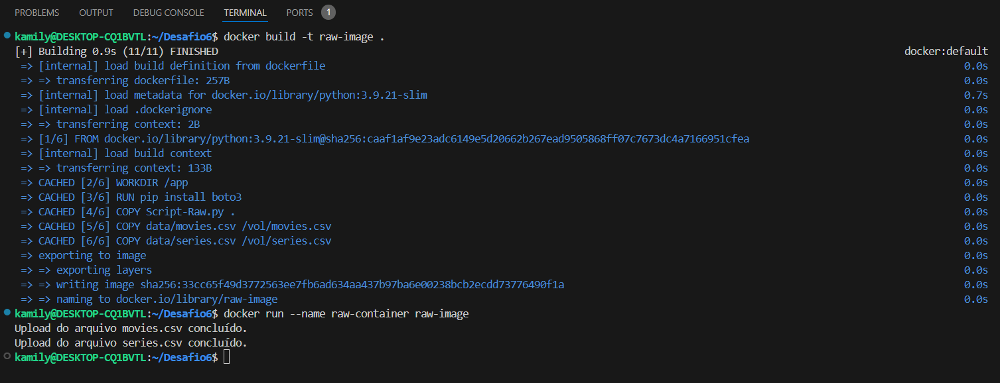
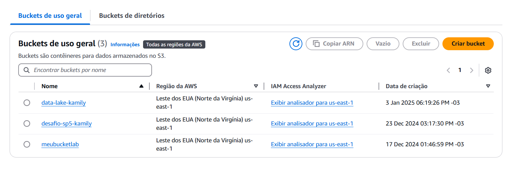
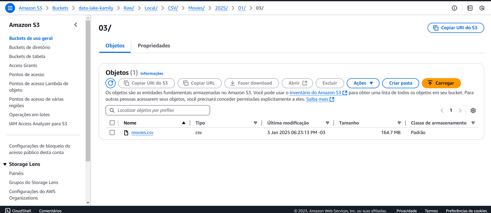
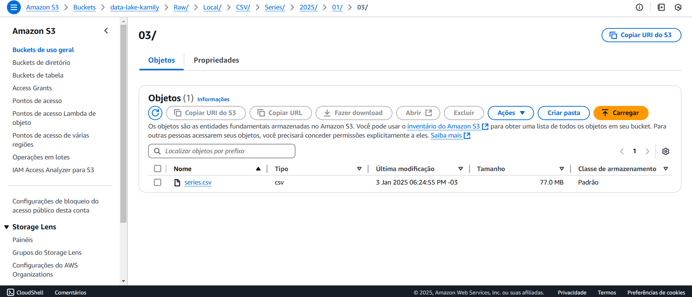

# Orientações

A primeira entrega do desafio final consiste na combinação dos asssuntos Docker, Python e AWS. Consiste no envio dos arquivos a serem utilizados nas futuras análises, em sua forma original, para um bucket S3 por meio da execução de um script em Python através de um contêiner para a constução de um Data Lake, mais especificamente sua camada Raw.

## Preparação

Para iniciar o desafio, foi necessário fazer o download do arquivo *Filmes e Series.zip* e a extração dos arquivos csv para a visualização dos dados e criação das perguntas, além do envio desses ao bucket.

## Análises a serem realizadas

Para o desafio final, pretendo analisar como a nacionalidade dos filmes influencia as pectos relacionados a sua popularidade, bilheteria, custo e retorno, etc. Para tal, será analisado o arquivo `movies.csv` a fim de responder as seguintes perguntas:

1. Quais países produziram os filmes de comédia/animação mais populares nos últimos cinco anos?
2. Qual é a tendência histórica da nota média de filmes de comédia e animação por nacionalidade?
3. Quais países apresentam a melhor relação entre custo de produção e retorno financeiro?
4. Quais países dominam as maiores bilheterias de filmes de comédia/animação?
5. Qual a popularidade média dos filmes por país e como ela se relaciona com as notas médias?
6. Quais são os países com maior número de filmes de comédia e animação indicados para prêmios importantes?

## Desenvolvimento

### Etapa 1 - Implementação do código Python

O [script Python](./Script-Raw.py) deve fazer a conexão com o serviço S3, a criação do bucket e o upload dos arquivos separadamente para pastas distintas. Isso é feito da seguinte maneira:



Ao observar cada linha, tem-se:

1. A importação das bibliotecas:
   
* `boto3` - para realizar a conexão com os serviços AWS;
* `datetime` - para utilização da data.

2. A configuração do serviço a ser utilizado e a descrição das credenciais:

```Python
client = boto3.client('s3',
    aws_access_key_id='',
    aws_secret_access_key='',
    aws_session_token=''
    )
```

3. A criação do bucket:

```Python
nome_bucket = 'data-lake-kamily'
client.create_bucket(Bucket= nome_bucket)
```

4. Upload dos arquivos considerando o padrão do caminho do bucket.

`<nome do bucket>\<camada de armazenamento>\<origem do dado>\<formato do dado>\<especificacao do dado>\<ano atual>\<mes atual>\<dia atual>\<arquivo>.`

Onde:

* Envia-se para a função o nome de cada arquivo:
```Python
def main():
    upload_arquivos('movies.csv')
    upload_arquivos('series.csv')

main()
```

* Para o upload dos arquivos, são separadas em variáveis:
  * A data atual completa;
  * A categoria do arquivo;
  * O caminho do arquivo completo, utilizando das variáveis anteriores para preencher o nome das pastas;
  * O local onde se encontra o arquivo (o volume do container que será executado).
  
* O comando de upload recebe como argumento:
  * O caminho local dos arquivos;
  * O nome do bucket;
  * O caminho que se encontrará o arquivo no bucket.

```Python
def upload_arquivos(filename):
    data_atual = datetime.today()
    categoria = filename.split(".")[0].capitalize()
    caminho_bucket = f'Raw/Local/CSV/{categoria}/{data_atual.year}/{data_atual.month:02}/{data_atual.day:02}/{filename}'
    caminho_local = f'/vol/{filename}'

    try:
        client.upload_file(caminho_local, nome_bucket, caminho_bucket)
        print(f"Upload do arquivo {filename} concluído.")
    except Exception as erro:
        print(f"Erro ao fazer upload: {erro}")
```

### Etapa 2 - Criação do arquivo dockerfile

Para a criação da imagem e execução do contêiner, faz-se necessária a criação de um arquivo dockerfile:



Onde:

```Docker
FROM python:3.9.21-slim #imagem base que será executada

WORKDIR /app #pasta de trabalho utilizada na execução

RUN pip install boto3 #comando realizado durante a execução

COPY Script-Raw.py . #cópia do script para a pasta de trabalho

# cópia dos arquivos a serem enviados para o bucket, para o volume do contêiner
COPY "data/movies.csv" "/vol/movies.csv" 
COPY "data/series.csv" "/vol/series.csv"

VOLUME [ "/vol" ] #criação do volume

CMD [ "python", "Script-Raw.py"] #comando de iniciação do script na execução do contêiner
```
Ao serem executados os comandos de construção de imagem e execução do contêiner, é possível observar no terminal os seguintes retornos:



E no bucket S3, o seguinte resultado:

* Bucket criado:
  


* Caminho do arquivo `movies.csv`:
  


* Caminho do arquivo `series.csv`:



## Dificuldades encontradas

   Não houveram dificuldades para a realização deste desafio.  