# Informações

Na sexta sprint, pude explorar mais sobre os serviços AWS através de cursos diversos que abordam o conteúdo tanto de uma maneira geral como de forma especializada com o suporte de tutoriais e vídeos explicativos. Por meio dos exercícios pude explorar os serviços AWS Lambda e Amazon Athena de maneira prática o que permitiu uma visão mais clara sobre os serviços mencionados. Além disso o [desafio](./Desafio/README.md) uniu conceitos anteriores como a utilização do Python, Docker e a conexão com o bucket do serviço S3, favorecendo assim a compreensão da utilização das ferramentas.

# Resumo

### Noções básicas de Analytics na AWS - Parte 1 

**Data Analytics** é um conceito abrangente que utiliza dados brutos capturados de diversas fontes para processar, analisar e interpretar informações, ajudando as organizações a prever cenários futuros e transformar dados em valor estratégico. Esse campo se divide em diferentes tipos de análise, cada um com um propósito específico:

* Descritiva: Resumo de dados históricos.
* Diagnóstica: Análise de causas usando correlações.
* Preditiva: Previsões baseadas em dados históricos.
* Prescritiva: Sugestões de ações baseadas em predições.
  
**Machine Learning (ML) e AWS**
* IA: Máquinas que imitam inteligência humana.
* Modelo de ML: Treinamento de padrões em dados.
* Algoritmos de ML: Previsões e recomendações baseadas em padrões.

**Big Data e os 5 V's**
* Volume: Quantidade de dados.
* Variedade: Tipos de dados (estruturados, semiestruturados e não estruturados).
* Velocidade: Frequência de dados.
* Veracidade: Precisão e confiança.
* Valor: Insights úteis.
  
**OLTP e OLAP**
* OLTP: Otimizado para gravação.
* OLAP: Otimizado para leitura.
  
**Processamento de Dados**
* Tipos: Batch (em lotes) e Streaming (fluxo contínuo).
* Velocidades: Agendado, periódico, quase em tempo real e em tempo real.

**ETL (Extração, Transformação e Carregamento)**
* Extração: Planejamento das origens e destino dos dados.
* Transformação: Limpeza e preparação dos dados.
* Carregamento: Armazenamento em banco de dados ou data lake

**ELT (Extração, Carregamento e Transformação)**
* Carrega dados em seu estado bruto para o data warehouse e os transforma posteriormente.
* Requer definição prévia dos requisitos de analytics para garantir a estruturação correta dos dados.
* Toda a limpeza, transformação e enriquecimento ocorrem dentro do data warehouse, permitindo interações e transformações contínuas.

### Noções básicas de Analytics na AWS - Parte 2:

**Data Lake:** É um repositório centralizado que armazena grandes volumes de dados estruturados e não estruturados em seu formato original. Ele coleta dados de diversas fontes, como bancos de dados, sensores e mídias sociais, e permite transformações, como limpeza e agregação, antes da análise.

**Benefícios:**
* Escalabilidade: Armazenamento flexível de grandes volumes de dados.
* Eficiência de custos: Pagamento conforme o uso.
* Flexibilidade: Suporta diferentes tipos de dados e novas fontes.
* Análise rápida: Processamento em tempo real e consultas no mesmo local.
* Visualização centralizada: Exibição única e governança comum.
  
**Funções:**
* Ingestão e armazenamento: Dados são coletados e armazenados inicialmente em sua forma bruta, e depois processados.
* Catalogação e pesquisa: Ajuda a localizar dados para análise.
* Proteção e segurança: Proteção através de criptografia, controles de acesso e auditoria.
* Analytics: Análise de dados no Amazon S3 usando ferramentas como Athena e Redshift.
  
**Desafios:**
* Governança de dados: Gerenciar grandes volumes de dados de diferentes fontes é complexo.
* Qualidade dos dados: Ingestão de dados brutos pode gerar problemas de consistência.
* Segurança: Proteger grandes volumes de dados heterogêneos exige planejamento.

**Lake Formation:** Serviço que simplifica a criação, proteção e gerenciamento de data lakes, automatizando ingestão, catalogação e transformação de dados.

**Data Warehouses:** São repositórios centralizados para armazenar dados para análise. Eles facilitam o acesso rápido a informações por meio de ferramentas de BI e analytics. O Amazon Redshift oferece um serviço baseado na nuvem para data warehousing, com benefícios como escalabilidade e integração com BI e ML.

**ETL Zero:** Permite a duplicação instantânea de dados usando captura de alterações, facilitando a análise sem a necessidade de pipelines ETL complexos.

**Arquitetura de Dados Moderna**

A arquitetura de dados moderna integra data lakes e data warehouses, promovendo governança unificada, segurança e fácil movimentação de dados. Ela permite o uso eficiente de dados, minimizando a movimentação e atendendo às necessidades específicas de infraestrutura.

**Pilares da arquitetura de dados moderna:**

* Data Lakes escaláveis: Armazenamento de dados sem interrupções.
* Serviços de analytics com propósito específico: Ferramentas especializadas para otimizar o desempenho.
* Acesso unificado a dados: Otimiza a movimentação seletiva de dados.
* Governança unificada: Gerenciamento centralizado de acessos.
* Custo-benefício: Alta performance com custo otimizado.

**Amazon DataZone:** Plataforma que facilita o acesso, descoberta e colaboração em dados, ajudando as organizações a obter mais valor de suas fontes de dados e ferramentas de analytics.

### Severless Analytics:

O curso apresenta como a AWS oferece soluções para clientes interessados em obter insights de seus sites de forma direta, utilizando uma base de dados própria, mas sem a necessidade de gerenciar infraestrutura de servidores. 

Com a integração de serviços como AWS IoT Core, é possível coletar e processar dados em tempo real, facilitando a análise e a tomada de decisões estratégicas. Quando combinado com outras ferramentas poderosas, como Amazon QuickSight para visualização de dados e OpenSearch para pesquisa e exploração de informações, os resultados podem ser ainda mais robustos e eficientes. 

Essas soluções permitem que empresas melhorem a experiência do usuário, monitorem métricas importantes e gerem relatórios detalhados, tudo isso com alta escalabilidade e segurança, características fundamentais da AWS.

### Introduction to Amazon Athena

O curso apresenta uma breve explicação sobre o serviço juntamente com a demontração prática do Console onde é ensinado a criação de um banco de dados e a execução de consultas no editor.

### AWS Glue Getting Started

O AWS Glue é um serviço de integração de dados sem servidor que permite a descoberta, preparação e combinação de dados para análise, aprendizado de máquina e desenvolvimento de aplicativos. Ele oferece interfaces visuais e baseadas em código, além de facilitar o acesso e a organização dos dados pelo AWS Glue Data Catalog. Com o AWS Glue, é possível criar e monitorar fluxos de trabalho ETL, limpar e normalizar dados sem escrever código, e realizar consultas interativas para análise de dados de forma rápida e eficiente.

**Problemas que resolve**

- **Provisionamento e gerenciamento de recursos**: AWS Glue gerencia recursos como servidores, armazenamento e ambiente de execução necessários para jobs de ETL, removendo-os quando não estão em uso.
- **Ferramentas interativas**: Oferece ferramentas para desenvolvimento de baixo e nenhum código, facilitando o trabalho de diferentes perfis de usuários e reduzindo o tempo de desenvolvimento.
- **Geração automática de código**: Auto-genera código otimizado para transformação de dados, o que melhora a performance e reduz custos.
- **Conexão com múltiplos armazenamentos de dados**: Conecta-se a diversos sistemas, como Amazon Redshift, bancos de dados relacionais e MongoDB, além de APIs para criação de conectores personalizados.
- **Catálogo de dados**: Cria catálogos de dados para diversas fontes, permitindo fácil pesquisa e classificação de metadados, utilizado por vários serviços de análise.
- **Identificação de dados sensíveis com ML**: Usa aprendizado de máquina para identificar dados sensíveis (PII) e permite correção por ofuscação ou hash criptográfico.
- **Gerenciamento de esquemas em aplicativos de streaming**: Garante a integridade dos dados em sistemas de streaming, como Apache Kafka e Amazon Kinesis.
- **Qualidade de dados e escalabilidade automática**: Oferece ferramentas para garantir a qualidade dos dados e escala automaticamente à medida que o volume de dados aumenta, integrando-se ao Amazon CloudWatch para monitoramento.

**Benefícios**

- **Integração rápida de dados**: AWS Glue oferece flexibilidade nas ferramentas de preparação e processamento de dados, acelerando entregas para análises, ML e desenvolvimento de aplicativos.
- **Automatização em grande escala**: Crawlers identificam fontes de dados, formatos e esquemas, gerando código para transformações e criando pipelines avançadas de ETL.
- **Sem infraestrutura para gerenciar**: AWS Glue é serverless, gerenciando automaticamente recursos, permitindo que desenvolvedores se concentrem na lógica de negócios.
- **ETL sem codificação**: AWS Glue Studio permite criação, execução e monitoramento de jobs ETL com interface fácil de usar, gerando código automaticamente e incluindo transformações para limpeza de dados.
- **Pagamento pelo uso**: A cobrança é baseada no consumo de recursos, sem custos fixos ou por tempo de inicialização/desligamento.

### Amazon EMR Getting Started

Amazon EMR permite o processamento eficiente de grandes volumes de dados usando frameworks como Apache Hadoop, Spark, Hive e Presto integrados aos serviços AWS. Ele automatiza tarefas complexas, como configuração, ajuste de desempenho e monitoramento, para simplificar o uso de análises distribuídas e machine learning.

**Problemas que resolve**

- Integração de dados de fontes diversas e formatos variados.
- Dificuldades operacionais e de custo ao usar clusters on-premises.
- Escalabilidade limitada e desafios para atender a SLAs.

**Benefícios:**

- Redução de custos com redimensionamento automático de clusters.
- Escalabilidade independente de armazenamento e computação.
- Integração com Amazon S3 para data lakes e Amazon 
CloudWatch para monitoramento.

### Amazon QuickSight - Getting started

Amazon QuickSight é um serviço de business intelligence (BI) em nuvem que permite criar e compartilhar dashboards interativos e relatórios paginados altamente formatados. Ele oferece análises self-service poderosas com suporte para machine learning e recursos de consulta em linguagem natural.

**Problemas que resolve**

- Criação de dashboards e relatórios sem necessidade de infraestrutura.
- Conexão segura a dados em AWS, nuvens de terceiros e locais.
- Detecção de anomalias, previsões e narrativas automatizadas baseadas em dados.
- Incorporação de dashboards interativos e funcionalidades de BI diretamente em aplicações.

**Benefícios:**

- Escalabilidade para milhões de usuários com segurança empresarial e alta disponibilidade.
- Recursos integrados de machine learning para análises avançadas.
- Experiência intuitiva de consulta por linguagem natural com QuickSight Q.
- Solução totalmente gerenciada, eliminando custos operacionais de manutenção de servidores.

### Getting Started with Amazon Redshift

Amazon Redshift é um data warehouse em nuvem, orientado por colunas e totalmente gerenciado, que utiliza processamento massivamente paralelo (MPP) para consultas analíticas complexas em grandes volumes de dados, desde gigabytes até petabytes. Ele é projetado para suportar múltiplos usuários simultâneos e otimizar a velocidade de consultas usando machine learning.

**Problemas que resolve**

- Coleta, armazenamento e análise de dados estruturados e semi-estruturados.
- Visualização de tendências históricas e insights em tempo real.
- Análises preditivas com datasets próprios ou de terceiros.
- Eliminação de tarefas manuais como instalação, manutenção e atualizações.

**Benefícios:**

- **Gerenciamento de Carga de Trabalho:** Flexibilidade para priorizar consultas rápidas, evitando bloqueios por consultas demoradas.
- **Editor de Consultas v2:** Interface SQL baseada na web, facilitando a exploração de dados para analistas e engenheiros.
- **Design Automatizado de Tabelas:** Machine learning para otimizar o layout físico dos dados, acelerando consultas.
- **Compatibilidade com Ferramentas Externas:** Suporte a QuickSight, Tableau, Power BI e notebooks como Jupyter.
- **Interação Simples com API:** Acesso a dados para aplicações tradicionais e modernas, incluindo soluções sem servidor.
- **Alta Tolerância a Falhas:** Monitoramento contínuo, replicação automática e substituição de nós defeituosos.

# Exercícios e Evidências

Os exercícios consistem na utilização dos serviços AWS Lambda e Athena por meio do Console.

### Lab AWS Athena

1. Para iniciar o exercício, préviamente o bucket do [Lab AWS S3](../Sprint%205/README.md) realizado na sprint anterior deveria estar criado e contendo o caminho *dados/nomes.csv*. Nesse bucket, dever ser então criada a pasta *queries/*.

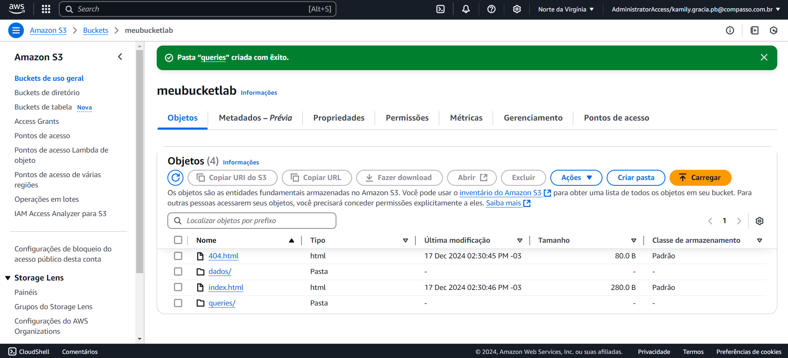
   
2. No AWS Athena, em configurações, ajustar:

* O local onde será armazenado o resultados das consultas - pasta *queries*
* Pode ser informado o caminho completo em *Location of query result*.
  
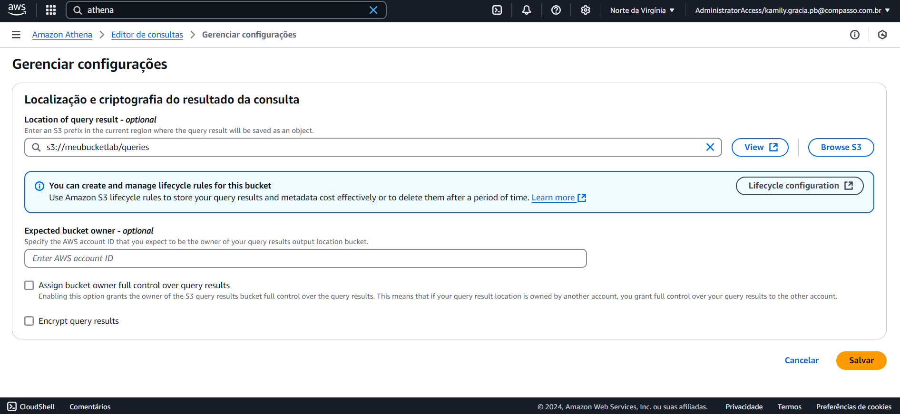
  
* Ou pesquisada a pasta em *Browse S3*.
  
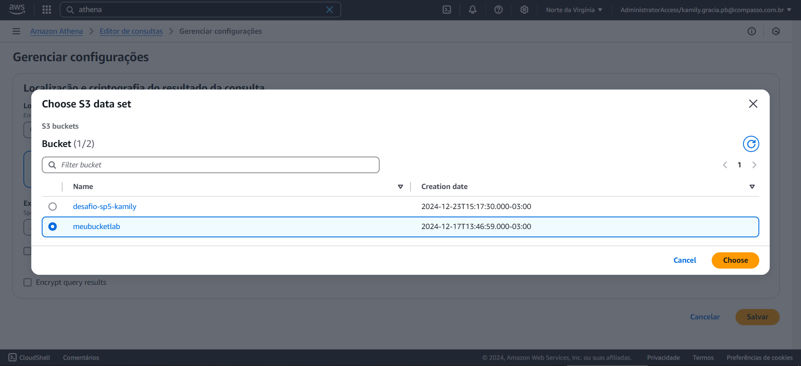

Ao salvar, o resultado esperado é a confirmação do local:

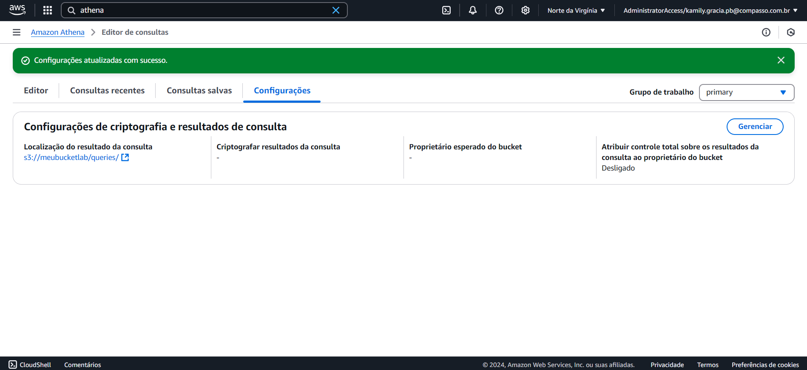

3. Na aba editor, deve ser executado o comando de criação do banco de dados:

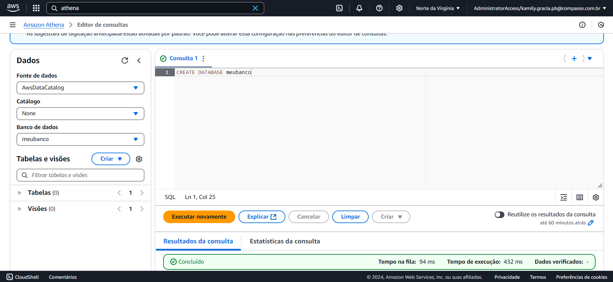

4. Utizando dos dados presentes no arquivo *nomes.csv* pretende-se criar uma tabela para o banco de dados. Para isso é necessário:
   
* Nomear a tabela;
* Descrever quais são seus atributos e seu tipo com base no tipo dos dados;
* Informar o local do arquivo base.

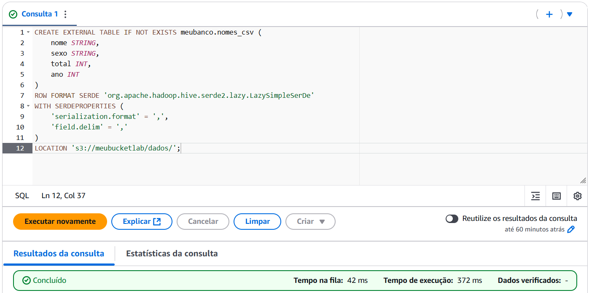

5. Para realizar o teste de consulta, 15 nomes mais utilizados no ano de 1999, pode-se então utilizar da seguinte query:

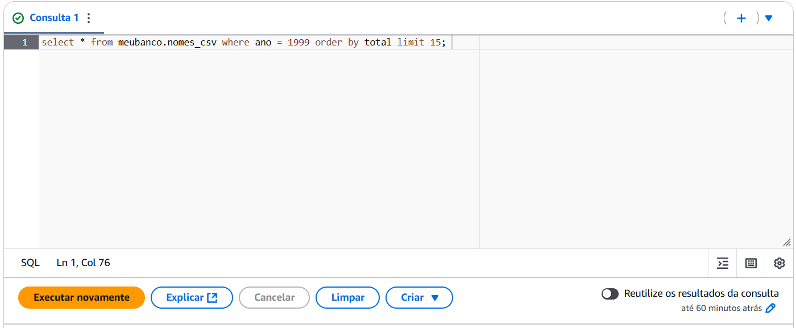

Como resultado, obtém-se:

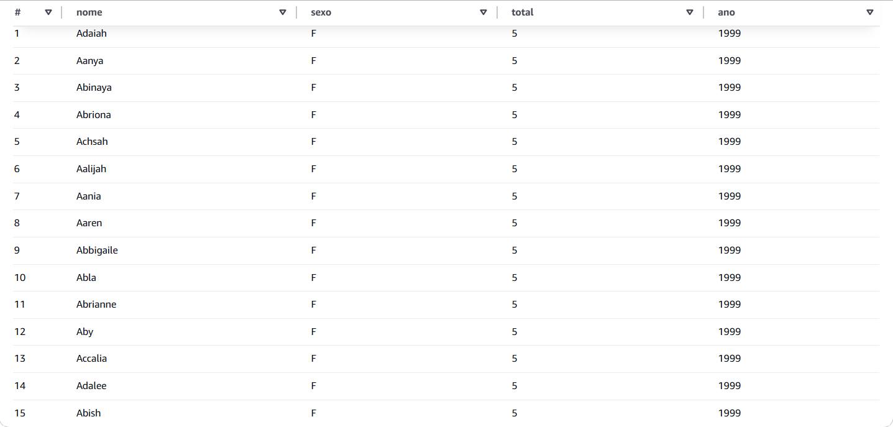

Obs: Preferiu-se manter os demais dados da linha além do nome para garantir o resultado correto.

6. Por fim, é solicitado que seja criada uma consulta que retorne os 3 nomes mais utilizados em cada década a partir de 1950. Para isso foi utilizada a seguinte query:

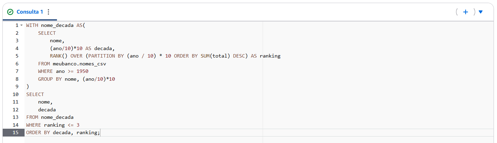

Onde:

```SQL
--subquery que irá dividir os anos em décadas e ranquear os nomes pelo total
WITH nome_decada AS( 
    SELECT 
        nome, --seleção do nome
        (ano/10)*10 AS decada, --cálculo da década
        --ranqueamento dos elementos em cada agrupamento (década)
        RANK() OVER (PARTITION BY (ano / 10) * 10 ORDER BY SUM(total) DESC) AS ranking
    FROM meubanco.nomes_csv --tabela de onde se extrai a consulta
    WHERE ano >= 1950 --condição (ano maior que 1950)
    GROUP BY nome, (ano/10)*10 -- dados agrupados por nome e década
) 
--query principal
SELECT --seleção dos dados que serão visualizados
    nome, 
    decada
FROM nome_decada --consulta-se a partir do resultado obtido com a subquery
WHERE ranking <= 3 --condição (posição do nome no ranking realizado por década)
ORDER BY decada, ranking; --ordenação por decada e por ranking de forma crescente.
```

Como resultado, obtém-se os seguintes nomes:

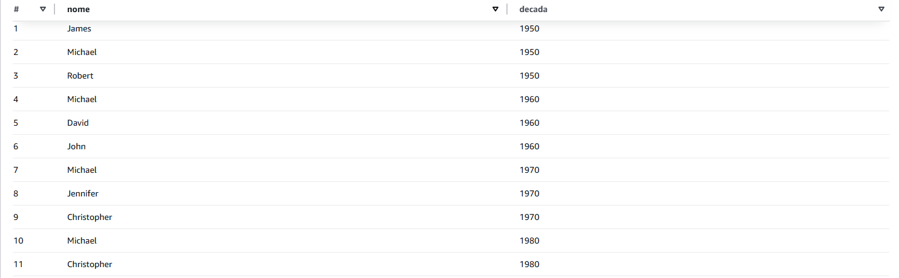
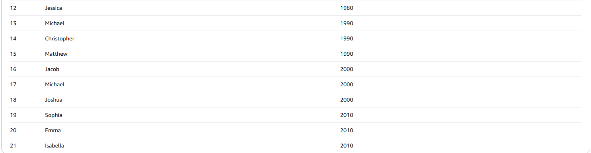

### Lab AWS Lambda

1. Acessar o serviço AWS Lambda e selecionar criar função, na guia de configuração ajustar:

* Selecionar opção *criar do zero*;
* Nomear a função;
* Em tempo de execução, selecionar Python 3.9;
* Arquitetura x86_64;
* Salvar.

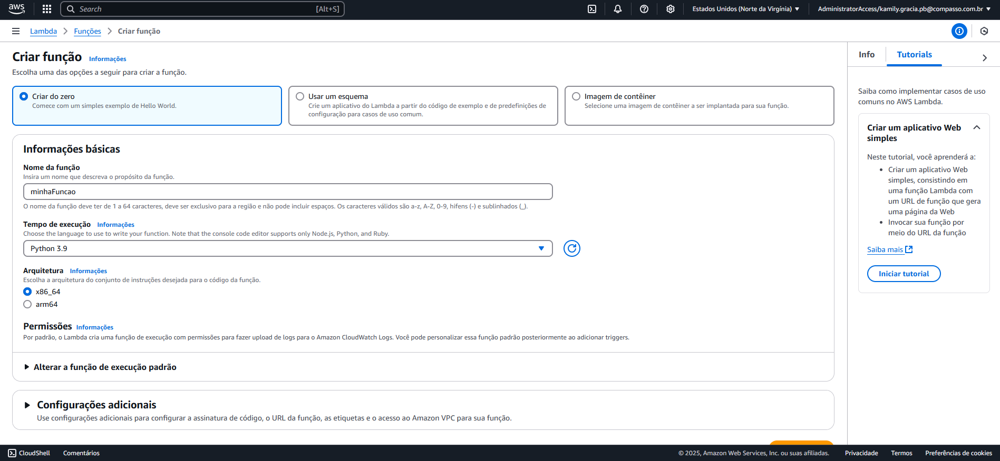

Como resultado, a função é criada, como pode ser observado em:

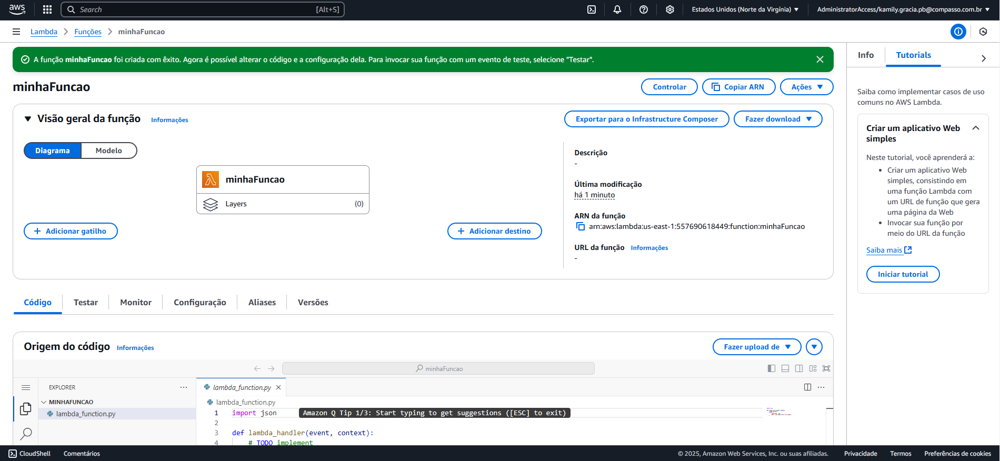

2. No editor de função deve ser substituído o código padrão pelo código fornecido e o deploy pode ser realizado:

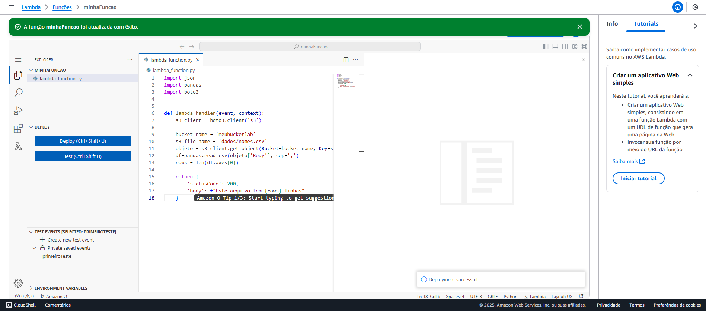

3. Ao realizar o teste é necessário configurar o nome do evento:
   
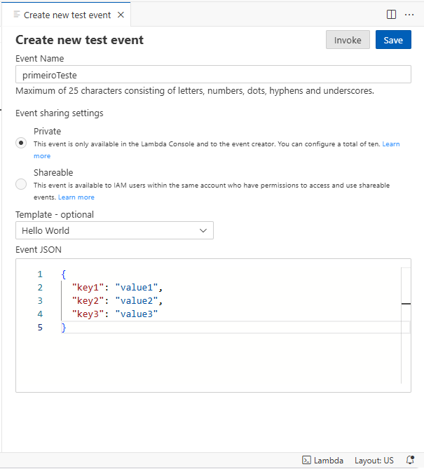

4. Como resultado observa-se o seguinte erro:
 
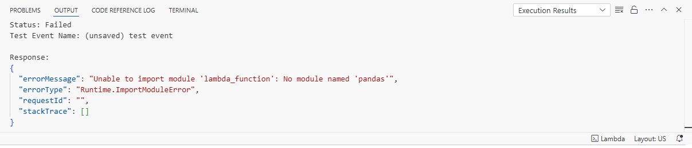

Para que a função funcione corretamente, é necessário importar a biblioteca pandas, o que demanda a criação de uma layer — camadas que empacotam a biblioteca e seus complementos a serem utilizados na função.

Para isso, as bibliotecas foram instaladas em uma pasta dentro de um contêiner Docker que utiliza o sistema operacional Amazon Linux. Em seguida, essa pasta foi compactada.

5. Na máquina local, no editor de código, criar um arquivo [dockerfile](./Exercicios/ExLambda/dockerfile) e realizar o build da imagem:

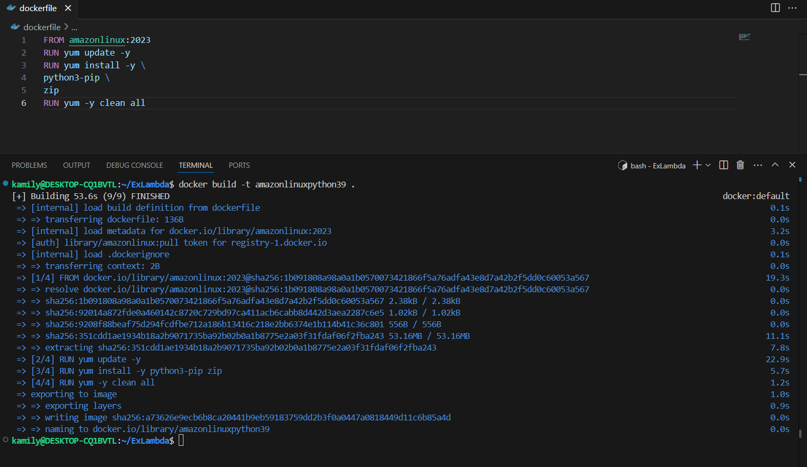

E a execução do contêiner em modo iterativo por meio do comando:

```bash
    docker run -it amazonlinuxpython39 bash
```

6. Criar a pasta que receberá as bibliotecas por meio dos comandos no terminal: 
   
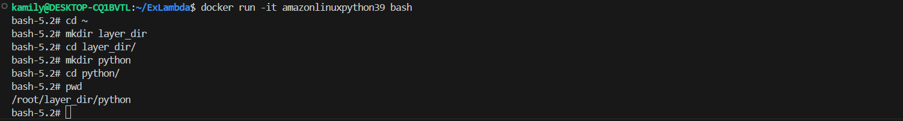

7. Instalação das bibliotecas no local:

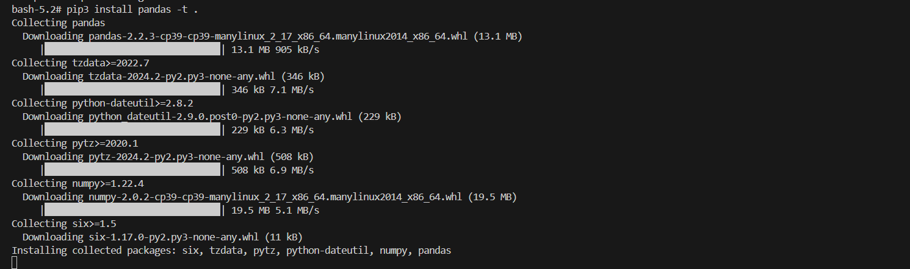

8. Na pasta anterior realizar a compactação da pasta onde se encontra as bibliotecas:

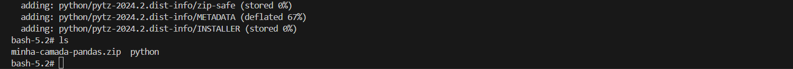

9. Abrir outra aba do terminal e copiar o ID do contêiner em execução. Com o código copiado, pode-se enviar o arquivo zip para máquina local com o seguinte comando:

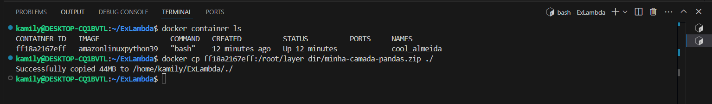

10. Realizar o upload do arquivo zip para o bucket do S3:

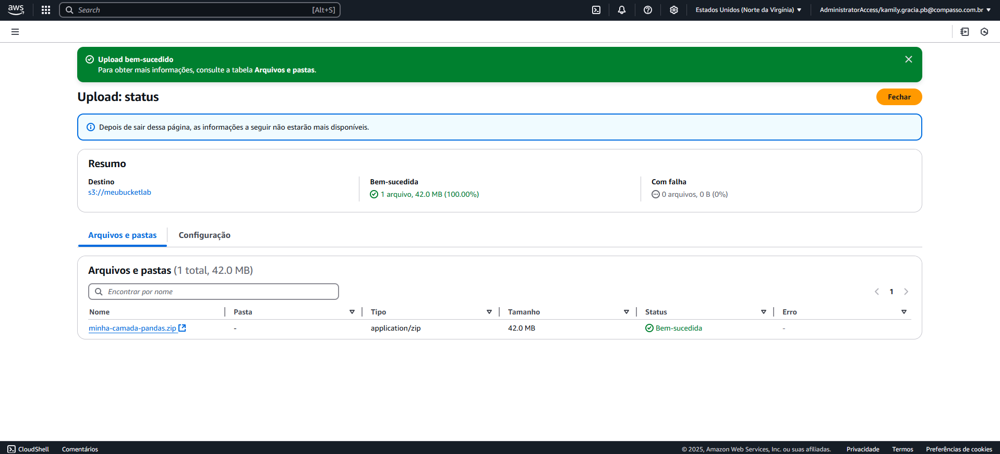

11. Copiar a URL do arquivo presente no bucket:

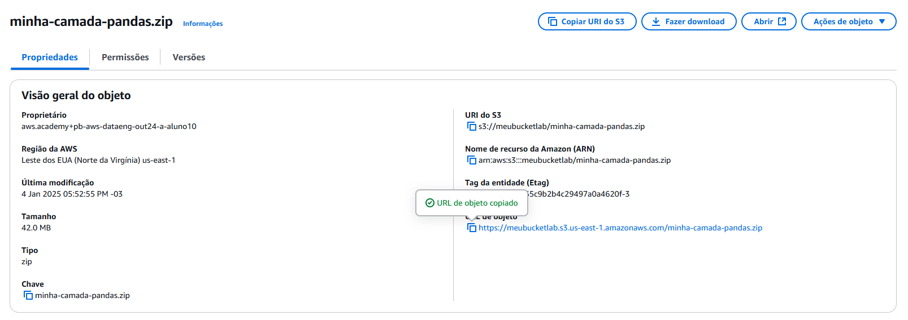

12. De volta ao serviço AWS Lambda, em camadas, clicar em criar camadas. nesta seção deve-se:

* Nomear a camada;
* Selecionar a opção *Fazer upload de um arquivo do Amazon S3*;
* Selecionar a arquitetura x86_64;
* Em tempos de execução compatíveis, selecionar Python 3.9;
* Salvar. 

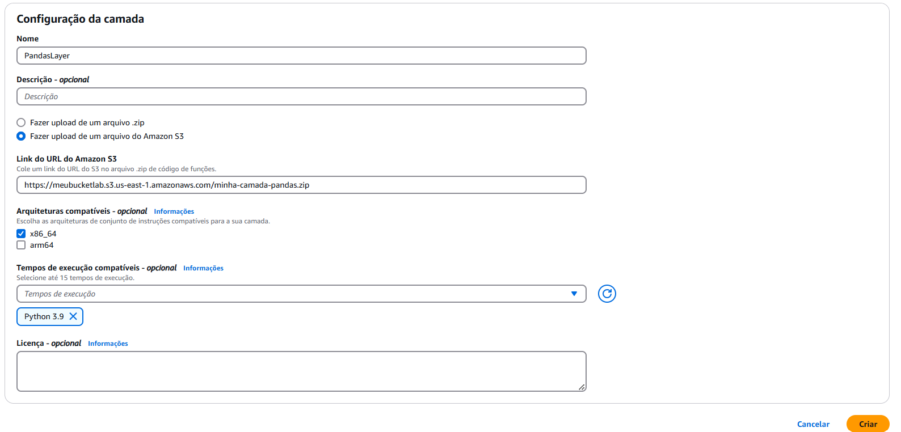

13. Adicionar a camada criada a função Lambda:

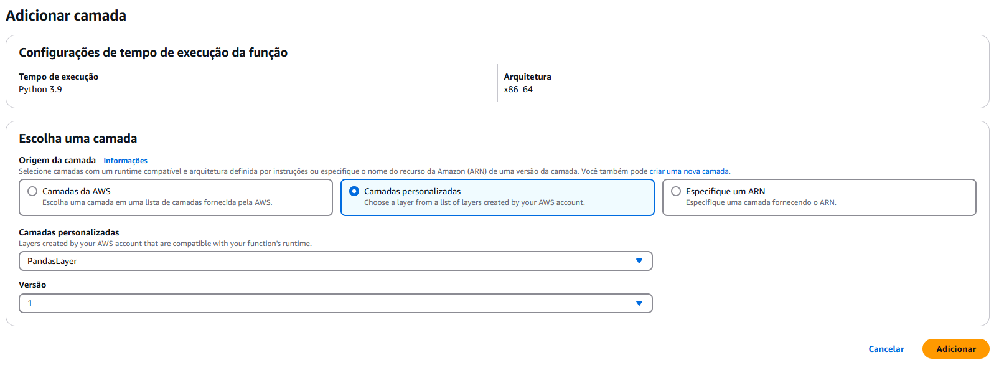

Como resultado, observa-se a função Lambda completa:

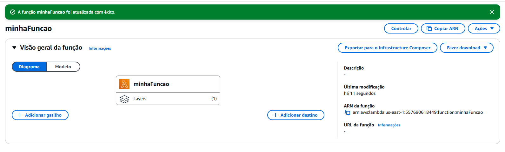

14. Para a realização do teste final, fez-se necessário alterar o tempo limite e o tamanho da memória da função:

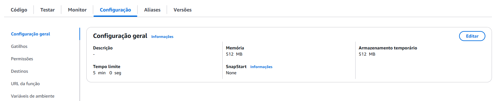

15. Após os ajustes, o teste pôde ser realizado e a função funcionou corretamente.

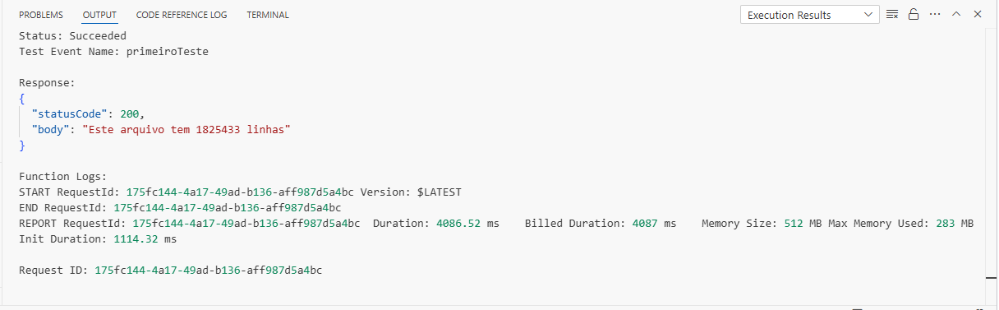


# Certificados

Noções básicas de Analytics na AWS - Parte 1:


Noções básicas de Analytics na AWS - Parte 2:


Amazon EMR Getting Started:


Amazon QuickSight - Getting Started:


AWS Glue Getting Started:


Best Practices for Data Warehousing with Amazon Redshift (Portuguese):
.png)

Getting Started with Amazon Redshift (Português):
.PNG)

Introduction to Amazon Athena (Portuguese):
.PNG)

Serverless Analytics (Portuguese):
.PNG)