# Orientações

A segunda entrega do desafio propõe-se a dar continuidade ao processo de ETL iniciado na última sprint. Nesta etapa foram selecionados os dados providos pela API do site TMDB que serão utilizados posteriormente no decorrer do processo. Para isso um [script Python](./script.py) foi criado para a realização das requisições e organização dos resultados em arquivos jsons, estes que foram enviados ao bucket do serviço S3.

## Preparação

Para iniciar o desafio, com base nas perguntas definidas previamente na sprint anterior, foram selecionadas as informações a serem consumidas pela API do site TMDB, estas que serão agragadas ao arquivo csv `movies.csv` disponibilizado anteriormente. Entre elas se encontram informações sobre o gênero dos filmes, o nome dos países em que foram produzidos, sua companhia de produção, a receita e custos, status, além de informações sobre os atores e diretores presentes.


## Análises a serem realizadas

Acerca das análises a serem realizadas, em maioria permanecem as mesmas definidas anteriormente, no entanto em razão da falta de informações relacionadas às premiações de filmes na base de dados utilizada, a pergunta "Quais são os países com maior número de filmes de comédia e animação indicados para prêmios importantes?" teve de ser substituída. Sendo assim, as perguntas que estarão presentes na análise final são:

1. Quais países produziram os filmes de comédia/animação mais populares nos últimos cinco anos?
2. Qual é a tendência histórica da nota média de filmes de comédia e animação por nacionalidade?
3. Quais países apresentam a melhor relação entre custo de produção e retorno financeiro?
4. Quais países dominam as maiores bilheterias de filmes de comédia/animação?
5. Qual a popularidade média dos filmes por país e como ela se relaciona com as notas médias?
6. Quais são os atores mais populares presentes nos filmes de comédia/animação, estes atuaram majoritariamente em produções de quais países?

## Desenvolvimento

Para a resolução do desafio, inicialmente os testes de requisições foram realizados localmente, e, assim que concluídos, a execução no serviço AWS Lambda pôde ser realizada. Sendo assim o desafio pode ser dividido em algumas etapas:

### Etapa 1: Script (consumo de dados da API)

Em primeiro lugar, podem ser explicadas as linhas de código que compõem o [script](./script.py) utilizado para o consumo de dados da API do TMDB:

1. Importação das bibliotecas utilizadas:
   
```python
import requests
import json
import boto3
from datetime import datetime
```
* A biblioteca `requests` será a responsável por realizar a conexão entre o script e a API do TMDB por meio de requisições HTTP, buscando os dados necessários;
* A biblioteca `json` permitirá a manipulação dos arquivos em formato json;
* A biblioteca `boto3` permitirá a conexão com o serviço S3 da AWS;
* A biblioteca `datetime` traz consigo as informações do sistema de data e hora que serão utilizado durante a fase de upload dos arquivos ao bucket.

2. Definição do serviço AWS a ser utilizado:

```python
s3_client = boto3.client('s3')
#será utilizado o cliente s3 para a persistência dos dados consumidos pela API.
```

3. Adaptação do código para o modelo aceito pelo serviço AWS Lambda:

```python
#linha utilizada como convenção pela Lambda 
def lambda_handler(event, context):

#da mesma forma ao final do código a função retorna um valor
return {
   'statusCode': 200,
   'body': json.dumps('Arquivos JSON enviados com sucesso!')
   }
```

4. Parâmetros iniciais

```python
#para a conexão com a API é necessário que o código tenha a 'chave de acesso' obtida no próprio site, ela deve estar presente na URL no momento das requisições.
api_key = ''

#para consumir os dados da página 'discover/movie', podem ser passados os parâmetros abaixo para a delimitação de resultados. 
params = {
   'api_key': api_key, #chave de acesso
   'language': 'pt-BR', #linguagem em que serão retonados os resultados
   #seleção do período de lançamento de filmes
   'primary_release_date.gte': '2020-01-01', #>=
   'primary_release_date.lte': '2024-12-31', #<=
   #delimitação dos gêneros que devem estar presentes nos filmes resultantes
   'with_genres': '35,16', 
   'without_genres' : '28|12|80|99|18|10751|14|36|27|10402|9648|10749|878|10770|53|10752|37'
}

#url disponibilizada pelo site para o acesso aos filmes
url = f"https://api.themoviedb.org/3/discover/movie"

#por meio do teste manual, foi verificada a existencia de 27 páginas resultantes. Para que sejam recolhidos todos os filmes, este parâmetro foi colocado no script para ser iterado.
total_pages = 27 
```

5. Especificação de listas

```python
#abertura de uma lista vazia para o armazenamento dos resultados após o processamento
movies = []

#definição das colunas/informações a serem consumidas em uma das url's
columns = [
   'imdb_id', 
   'production_countries', 
   'production_companies', 
   'budget', 
   'revenue', 
   'status'
]
```

6. Abertura do primeiro loop

```python

#para obter todos os resultados, é necessário percorrer todas as páginas retornadas pela API. 
#para isso, é utilizado um loop iterativo que percorre o número total de páginas.

#para cada página
for page in range(1, total_pages + 1):
   #criação do parâmetro página e atualização a cada iteração
   params['page'] = page
   #requisição à API utilizando o pétodo get, enviando os parâmetros à URL e armazenamento dos resultados em uma variável
   discover_response = requests.get(url, params=params)
   #se o status de resposta for igual a 200, significa que a requisição foi bem-sucedida
   if discover_response.status_code == 200:
      #nesse caso, os dados recebidos são convertidos para o formato JSON
      data = discover_response.json()
   else:
      #caso contrário, é exibida uma mensagem indicando que o acesso à página falhou
      print(f"Erro ao acessar a página {page}: {discover_response.status_code}")
      continue
```

7. Abertura do segundo loop:

```python
#para cada filme presente da variável 'data'
for movie in data['results']:
   #organização das informações retornadas pela url 'discover/movies' em um dicionário 
   movies_dict = {
      'id': movie.get('id'),
      'title': movie.get('title'),
      'original_title': movie.get('original_title'),
      'genre_ids': movie.get('genre_ids'),
      'popularity': movie.get('popularity'),
      'release_date': movie.get('release_date'),
      'vote_average': movie.get('vote_average'),
      'vote_count': movie.get('vote_count')
   }
```

8. Obtenção de dados mais detalhados sobre cada filme por meio do envio dos ids armazenados a uma segunda url 'movie/movie_id':

```python
#inserção da url que será consumida
details_url = f"https://api.themoviedb.org/3/movie/{movie['id']}"

   #passagem da chave de acesso como parâmetro
   detail_params = {'api_key': api_key}
   id_external_response = requests.get(details_url, params=detail_params)

   #verificação do status da página, se é igual a 200
   if id_external_response.status_code == 200:
      #então os dados serão armazendos em formato json em uma variável
      details_data = id_external_response.json()
```

9. Abertura do terceiro loop (alteração na forma de armazenamento de resultados que antes configuravam-se como uma lista):
    
```python
#utilização da lista columns definida anteriormente

#para cada coluna em colunas
for col in columns:
   #se a coluna é 'production_countries'
   if col == 'production_countries':
      #a variável countries receberá o valor da chave 'production_countries'
      countries = details_data.get('production_countries', [])

      #concatenação dos valores da lista com a separação sendo realizada por vírgulas      
      #para cada elemento da variável 'countries', buscar pelo 'nome' do país
      #salvar o nome como valor da chave como string
      movies_dict[col] = ', '.join([country.get('name') for country in countries])
   #se a chave for 'production_companies':
   elif col == 'production_companies':
      #armazenar o nome da companhia em formato string
      companies = details_data.get('production_companies', [])
      movies_dict[col] = ', '.join([company.get('name') for company in companies])
   #para as demais chaves/colunas
   else:
      #atribuir o valor presente em 'details_data' e se não existir atribuir 'None'
      movies_dict[col] = details_data.get(col, None)
```

10. Formatação dos valores da coluna gênero

Assim como em `production_countries` e `production_companies`, a coluna gênero tinha valores presentes em lista, para então formatar os valores em string foi realizada o mesmo processo. No entanto, este processamento foi feito fora do loop `for` principal para evitar a necessidade de inserir uma condição específica dentro dele.

```python
#acesso ao s gêneros
genres = details_data.get('genres', [])
   #armazenar os gêneros como string
   movies_dict['genres'] = ', '.join([genre['name'] for genre in genres])
```

11. Obtenção dos dados de atores e diretores dos filmes para complemento da base de dados

```python
#utilização do caminho 'credits' - que fornece as informações do elenco e produção
credits_url = f"https://api.themoviedb.org/3/movie/{movie['id']}/credits"
credits_response = requests.get(credits_url, params=detail_params)

#se a requisição for bem-sucedida
if credits_response.status_code == 200:
   #armazenar os resultados em formato json
   credits_data = credits_response.json()
   #divisão das informações do elenco e produção das informações do diretor
   cast = credits_data.get('cast', [])
   crew = credits_data.get('crew', [])

   #se houver informações de produção
   if cast:
      #buscar pelo ator mais popular por meio da função max que buca em 'cast' a maior popularidade com a aplicação de lambda
      most_popular_actor = max(cast, key=lambda x: x.get('popularity', 0))
      #ao encontrar armazenar o nome e a popularidade
      movies_dict['most_popular_actor'] = most_popular_actor.get('name')
      movies_dict['actor_popularity'] = most_popular_actor.get('popularity')
   #se não atribuir 'None' para ambos os campos
   else:
      movies_dict['most_popular_actor'] = None
      movies_dict['actor_popularity'] = None

   #para o primeira pessoa que atende a condição de possuir 'job' == 'Director' armazenar suas informações na variável 'director'
   director = next((person for person in crew if person.get('job') == 'Director'), None)

   #buscando na variável os campos relevantes: nome e popularidade do diretor
   movies_dict['director'] = director.get('name') if director else None
   movies_dict['director_popularity'] = director.get('popularity') if director else None

#se a requisição não for bem-sucedida, apresentar uma mensagem de erro
else:
   print(f"Erro ao obter créditos para o filme {movie['id']}: {credits_response.status_code}")

#após todas as atribuições de chaves e valores, armazenar o dicionário na lista criada             
movies.append(movies_dict)
```

12. Envio ao bucket s3

Para a realização desse passo, foi solicitado que o caminho do bucket fosse:
`<nome do bucket>/<camda de armazenamento>/<origem do dado>/<especificação do dado>/<ano>/<mês>/<dia>/<arquivo>`

Além disso, os registros obtidos pela API do TMDB deveriam estar presentes em arquivos JSONs que limitavam-se a 100 registros, não possuindo mais do que 10 MB em tamanho.

Para a formatação do caminho foi necessário pegar do sistema as informações de dia, mês e ano.

```python
data_atual = datetime.now()
dia = data_atual.day
mes = data_atual.month
ano = data_atual.year

#configuração do caminho e definição do nome do bucket
bucket_name = 'data-lake-kamily'
s3_path = f'Raw/TMDB/JSON/{ano}/{mes}/{dia}/'
```

O recorte dos registros em diferentes arquivos JSONs foi feita da seguinte maneira:

```python
fatia = [] #abertura de uma lista vazia
contador = 0 #inicialização de um contador

#para cada registro presente na lista movies
for registro in movies:
   #fatia adiciona o registro
   fatia.append(registro)
   
   #se o tamanho da lista fatia chegar a 100
   if len(fatia) == 100:
      #contador recebe 1
      contador+=1
      #converte-se a lista fatia em um arquivo json
      arquivo_json = json.dumps(fatia, ensure_ascii=False, indent=4)
      #envia-se o arquivo para o caminho s3 com a numeração presente no contador
      s3_key = f'{s3_path}arquivo_{contador}.json'
      s3_client.put_object(
            Bucket=bucket_name,
            Key=s3_key,
            Body=arquivo_json,
            ContentType='application/json'
      )
      #a lista fatia torna-se vazia novamente para atribuir os novos registros e a iteração continua
      fatia = []

      # se após todas as iterações houverem registros na lista fatia que totalizam um valor menor que 100
      if fatia:
         #é realizado o mesmo processo para o último arquivo json
         contador += 1
         arquivo_local = f"arquivo_{contador}.json"

         arquivo_json = json.dumps(fatia, ensure_ascii=False, indent=4)
         s3_key = f'{s3_path}arquivo_{contador}.json'
         s3_client.put_object(
               Bucket=bucket_name,
               Key=s3_key,
               Body=arquivo_json,
               ContentType='application/json'
         )
```

### Etapa 2: Construção da função Lambda

Seguindo os mesmos procedimentos realizados no [exercício de TMDB](../README.md), foi criada a função Lambda:

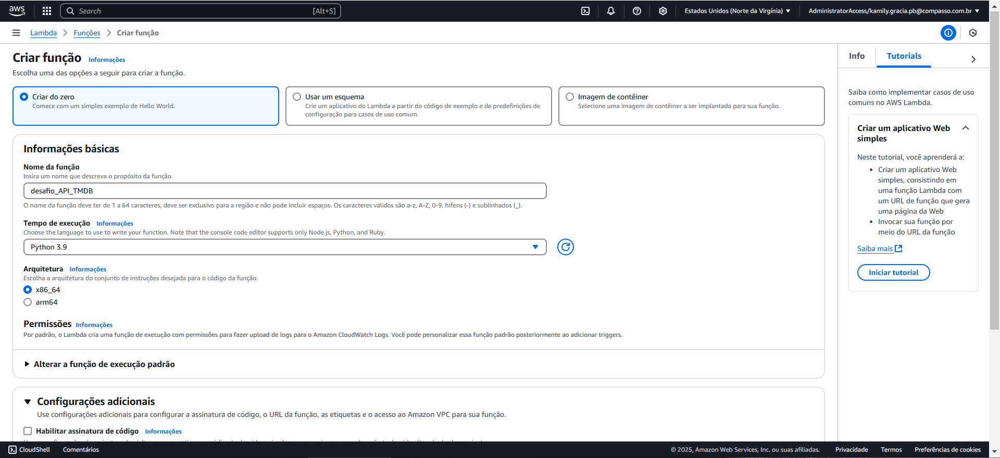

Com a função criada, tendo em vista que foi utilizada a biblioteca externa `requests`, foi necessário adicionar uma camada contendo a biblioteca para que a função pudesse funcionar. Então foi seguido o precedimento aprendido anteriormente:

1. Criar o arquivo dockerfile com a imagem amazon-linux e iniciar o container:

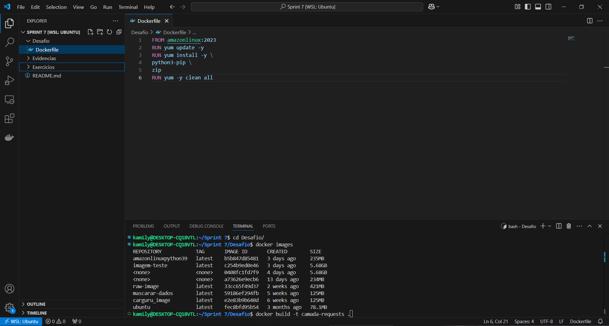

2. Criar o diretório onde será instalada a biblioteca:
   
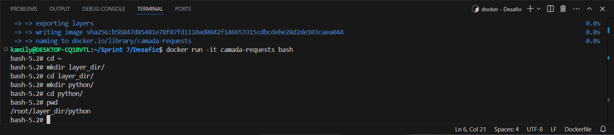

3. Download da biblioteca requests:

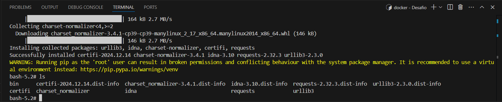 

4. Compactação da pasta e a exportação para a máquina local:

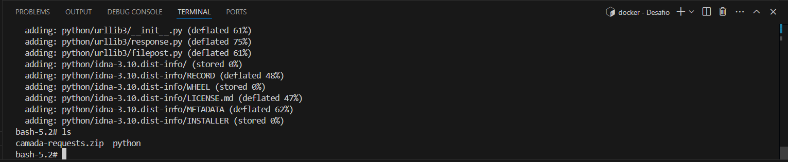
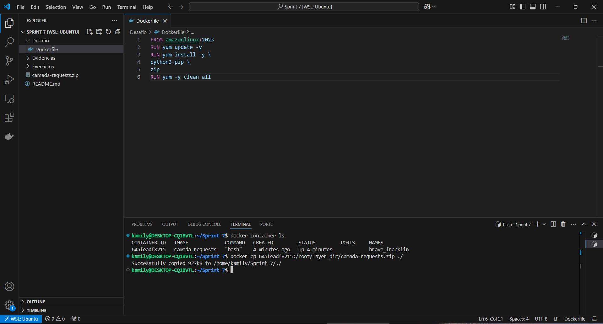

5. Upload do zip no bucket s3:

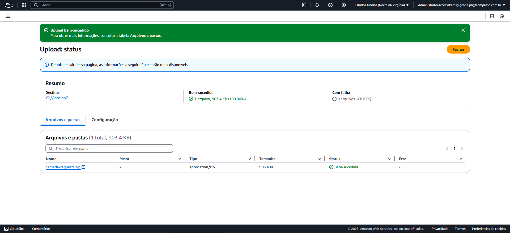

6. Criação da camada no Lambda, passando o caminho do arquivo no bucket S3:

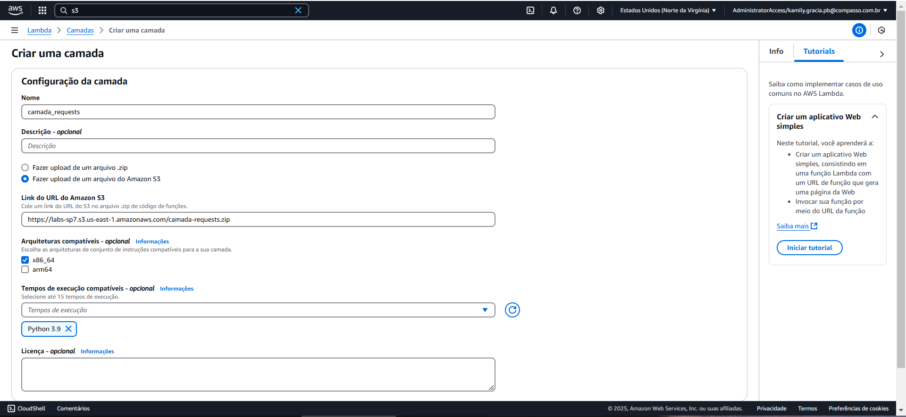

7. Adição da camada à função criada:

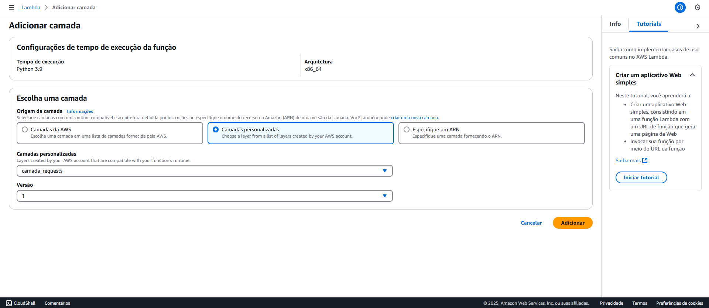

Além disso foi necessário ajustar no Lambda o tempo limite de execução para que a função pudesse realizar os passos do script dentro do tempo permitido:

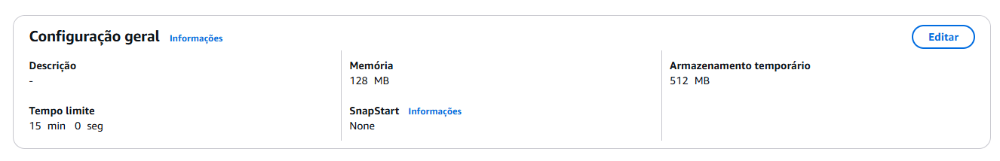

### Etapa 3: Configuração do AWS IAM

Por fim na role criada com a execução do teste, foi necessário atribuir a esta a permissão de acesso total ao serviço s3:

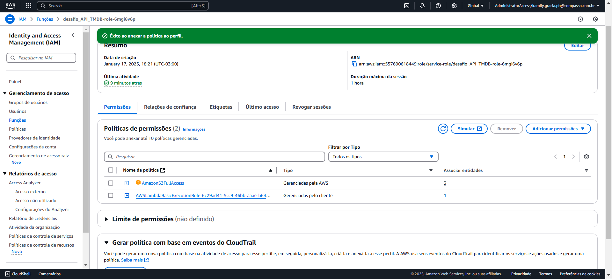
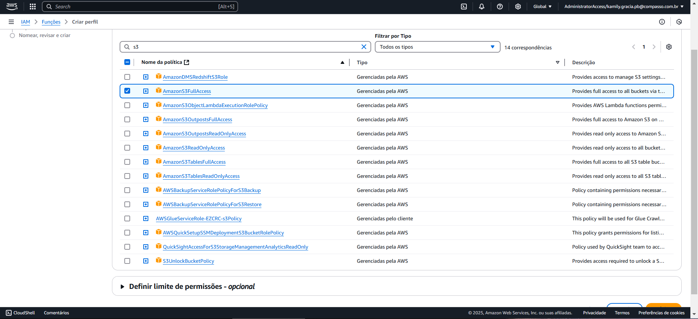

### Resultados

Ao executar a função uma mensagem de sucesso é exibida:

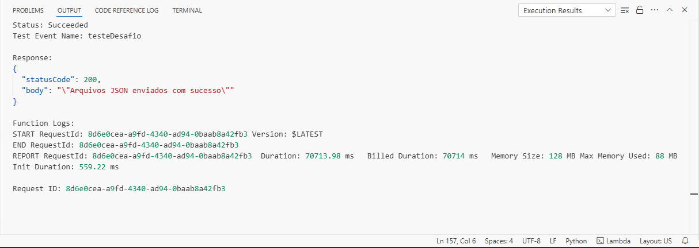

E pode ser verificado no bucket o caminho de subdiretórios criados e os arquivos JSONs enviados:

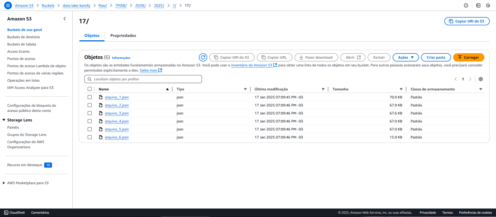

## Dificuldades encontradas

   As maiores dificuldades encontradas se relacionam com o manuseio das requisições para a API do TMDB.