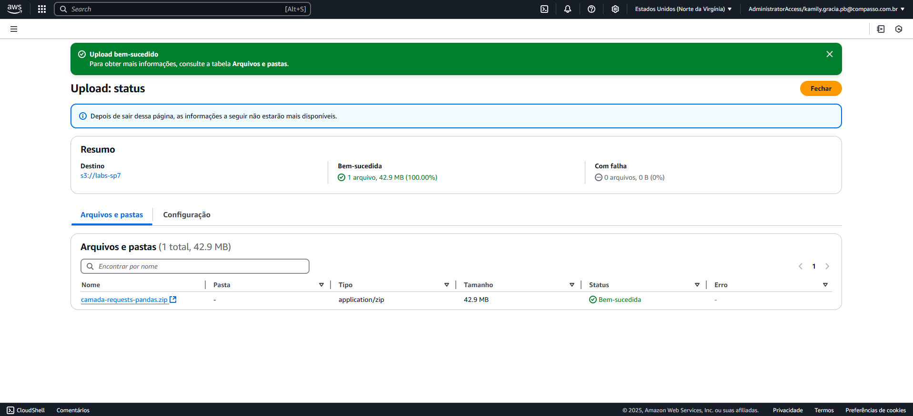
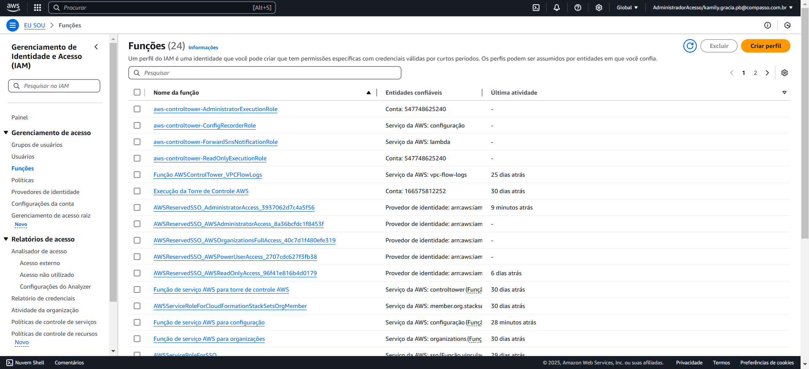
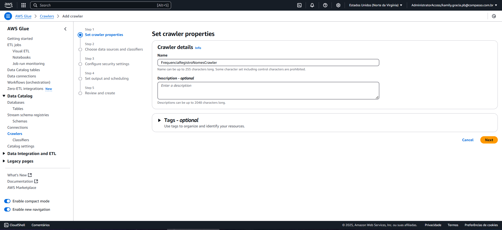

# Informações

Na sexta sprint, pude aprender sobre os frameworks Spark e Hadoop que fazem o gerenciamento e processamento de grandes quantidades de dados. Por meio das atividades e desafio, pude colocar em prática os conhecimentos aprendidos nessa sprint e nas anteriores. Além disso, pude utilizar os serviços da AWS S3, Glue e Lambda, possibilitando uma noção melhor de como é a integração dos serviços e a sua utilização no dia a dia.

## Resumo

**Spark** 

Apache Spark é uma poderosa ferramenta de processamento de dados, amplamente utilizada para análise e processamento em larga escala. Trata-se de uma plataforma projetada para executar tarefas de processamento distribuído em clusters, que são redes de computadores que operam juntos para atingir um mesmo objetivo. Um dos grandes diferenciais do Spark é a capacidade de realizar operações diretamente em memória, o que proporciona um desempenho muito superior em relação a outras soluções que dependem do acesso ao disco.

No Spark, os dados são particionados e distribuídos entre os nós do cluster. Essa abordagem permite que grandes volumes de informações sejam processados de forma paralela, melhorando a eficiência. Para garantir a tolerância a falhas, o Spark utiliza replicção e recuperação automática, assegurando que o processamento continue mesmo que algum componente do sistema falhe.

**RDD (Resilient Distributed Datasets)**

O RDD é a estrutura básica de dados de baixo nível no Spark. Ele representa um conjunto de dados distribuídos imutáveis que podem ser manipulados usando transformações e ações. A flexibilidade dos RDDs é uma das principais vantagens do Spark, permitindo o desenvolvimento de soluções personalizadas para diferentes tipos de processamento.

Uma característica importante do Spark é o conceito de Lazy Evaluation. Isso significa que as transformações aplicadas aos RDDs não são executadas imediatamente. Em vez disso, elas são registradas em um plano de execução que só será realizado quando uma ação é invocada, otimizando o uso dos recursos.

**Dataset e DataFrame**

Além dos RDDs, o Spark também oferece estruturas de dados de mais alto nível: Datasets e DataFrames. Ambos são utilizados para manipulação tabular de dados, facilitando o uso de consultas e operações títicas comuns em bancos de dados.

DataFrame: é uma abstração similar a uma tabela relacional, composta por linhas e colunas. Os dados em um DataFrame são imutáveis e podem ser de diversos tipos. As operações com DataFrames incluem agregar, ordenar e filtrar registros, oferecendo também otimizadores de consultas que geram planos de execução eficientes para as operações realizadas. Assim como os RDDs, DataFrames também utilizam Lazy Evaluation.

PySpark: é a interface do Apache Spark que permite que os desenvolvedores acostumados com a linguagem utilize-a para a realização de aplicações de análise e aprendizado de máquina.

## **Comandos básicos**

### 1. Criação de um RDD
```python
numeros = sc.parallelize([1,2,3,4,5,6,7,8,9,10])

numeros.take(5) #visualização dos 5 primeiros
numeros.top(5) #visualização dos 5 maiores
numeros.collect() #visualização de todos os números
```

### 2. Concatenação de RDDs

```python
numeros = sc.parallelize([1,2,3,4,5,6,7,8,9,10])
numeros2 = sc.parallelize([6,7,8,9,10])

uniao = numeros.union(numeros2) #1,2,3,4,5,6,7,8,9,10,6,7,8,9,10
```

### 3. Operações com conjuntos
```python
interseccao = numeros.intersection(numeros2)
#6,7,8,9,10

subtracao = numeros.subtract(numeros2)
#1,2,3,4,5

cartesiano = numeros.cartesian(numeros2)
#visualização de todas as combinações entre os conjuntos
```

### 4. Funções de agregação
   
```python
numeros.count() #contagem
numeros.mean() #média
numeros.max() #maior número
numeros.min() #menor número
numeros.stdev() #desvio padrão
```

### 5. Utilização da função lambda

```python
filtro = numeros.filter(lambda filtro: filtro > 2)

mapa = numeros.map(lambda mapa: mapa *2)
```

### 6. Funções - manipulações  de RDDs

```python
compras = sc.parallelize([(1, 200),(2,300),(3,400),(4,100),(5,70)])

chaves = compras.keys()
valores = compras.values()

compras.countByKey() #contagem das chaves

soma = compras.mapValues(lambda s: s +1)
#aplica a função para cada valor na lista

debitos = sc.parallelize([(1, 100),(2, 300)])
resultado = compras.join(debitos)
# [(1, (200, 100)),(2, (300,300))]

semDebitos = compras.subtractByKey(debitos)
#subtracao das chaves que existem em debitos
#[(3,400),(4,100),(5,70)]
```

### 7. Criação de dataframe

```python
df1 = spark.createDataFrame([("Pedro", 10),("Maria", 20),("José", 30)])

df1.show() #apresentação do df - colunas serão nomeadas pelo spark
```

### 8. Criação do dataframe com colunas nomeadas

```python
schema = "id INT, nome STRING"
dados = [[1,"Pedro"], [2,"Maria"]]

df2 = spark.createDataFrame(dados, schema)
df2.show() #visualização do df completo
df2.show(1) #visualoização apenas da primeira linha (1,Pedro)
```

### 9. Função soma

```python
from pyspark.sql.functions import sum

schema2 = "Produtos STRING, Vendas INT"
vendas = [("Caneta", 10),("Lápis", 20),("Caneta", 20)]
df3 = spark.createDataFrame(vendas, schema2)
#visualização de todas as linhas - com repetição

agrupado = df3.groupBy("Produtos").agg(sum("Vendas"))
#exclusão de repetição - soma dos valores na col vendas
```

### 10. Select

```python
df3.select("Produtos").show()
#visualização da col Produtos apenas
df3.select("Vendas", "Produtos").show() 
#inversao das colunas

#ou
spark.sql("select Vendas, Produtos from df3").show()
```

### 11. Utilização de expressões em colunas

```Shell
from pyspark.sql.functions import expr
df3.select("Produtos", "Vendas", expr("Vendas * 2")).show()

#será criada uma nova coluna para que a expressão seja aplicada a cada valor em vendas
```

### 12. Importação CSV

```python
#forma 1
from pyspark.sql.types import *
arqschema = "id INT, nome STRING, status STRING, cidade STRING, vendas INT, data STRING"
despachantes = spark.read.csv("caminho/absoluto/despachantes.csv", header = False, schema = arqschema)

#forma 2 - a atribuição dos tipos das colunas será inferida pelo spark, as colunas terão nomes aleatórios
    desp_autoschema = spark.read.load("caminho/absoluto/despachantes.csv", header = False, format = "csv", sep = ",", inferSchema = True)
```

### 13. Consultas

```python
from pyspark.sql import functions as Func
despachantes.select("id", "nome", "vendas").where((Func.col("vendas")>20) & (Func.col("vendas")<40)).show()
```

### 14. Mudança do tipo da coluna e renomeação
    
```python
#visualização dos atuais tipos
despachantes2.schema

#mudança do tipo
despachantes2 = despachantes.withColumn("data2", to_timestamp(Func.col("data"), "yyyy-MM-dd"))

#renomeação
novodf = despachantes.withColumnRenamed("nome", "nomes")
```

### 15. Tranformações - Group by e Order by

```python
#visualização dos anos distintos e a contagem de ocorrências
despachantes2.select("data").groupBy(year("data")).count().show()
#ou
despachantes2.select(year("data")).distinct().show()

#total de vendas por cidade
despachantes.groupBy("cidade").agg(sum("vendas")).show()

#visualização por ordem alfabética
despachantes2.select("nome",year("data")).orderBy("nome").show()

#de forma descrescente
despachantes.orderBy(Func.col("vendas").desc()).show()

#ordenar com base em mais de uma coluna
despachantes.orderBy(Func.col("cidade").desc(), Func.col("vendas").desc()).show()
```

### 16. Filter

```python
despachantes.filter(Func.col("nome") == "Deolinda Vilela").show()
```

### 17. Exportação de dados

```python
despachantes.write.format("parquet").save("caminho/para/a/exportacao")
#pode também ser salvo em formato json, orc e csv
```

### 18. Importação de dados
```python
var = spark.read.format("parquet").load("caminho/absoluto/importacao")
```
### 19. Utilização de comandos sql (Criação de base de dados e tabelas)
* Ao criar-se uma base de dados, diferentemente de dataframes e RDDs, estas são persistentes e por isso não são excluídas ao encerrar-se a sessão.

```python
from pyspark.sql import SparkSession
from pyspark.sql.types import *

#criação de db
spark.sql("create database desp")
spark.sql("show databases").show()
spark.sql("use desp")
```

### 20. Criação de tabelas gerenciadas a partir de DataFrames

```python
#criando uma tabela gerenciada
#df.write.saveAsTable("nome_da_tabela")
despachantes.write.saveAsTable("Despachantes")

#visualizando tabelas
spark.sql("show tables").show()

#consultando dados
spark.sql("select * from despachantes").show()

#inserção de dados com sobrescrição (overwrite)
despachantes.write.mode("overwrite").saveAsTable("Despachantes")

#inserção de dados com acréscimo (append)
despachantes.write.mode("append").saveAsTable("Despachantes")

#criando DataFrame a partir de uma tabela
despachantes = spark.sql("select * from despachantes")
despachantes.show()
```

### 21. Criação de tabelas não-gerenciadas (externas)

```python
#salvando dados como tabela externa

#usando formato parquet
despachantes.write.format("parquet").save("/home/kamily/desparquet")

#usando opção path
despachantes.write.option("path", "/home/kamily/desparquet").saveAsTable("Despachantes_ng")
spark.sql("select * from despachantes_ng").show()
```

### 22. Verificação de gerenciamento de tabelas

```python
#verificando se uma tabela é gerenciada
spark.sql("show create table Despachantes").show(truncate=False)
spark.sql("show create table despachantes_ng").show(truncate=False)

#usando o catálogo
spark.catalog.listTables()
```

### 23. Criação e manipulação de views

```python
#view temporária
despachantes.createOrReplaceTempView("Despachantes_view1")
spark.sql("select * from Despachantes_view1").show()

#view global
despachantes.createOrReplaceGlobalTempView("Despachantes_view2")
spark.sql("select * from global_temp.Despachantes_view2").show()

#view com comando SQL
spark.sql("CREATE OR REPLACE TEMP VIEW DESP_VIEW AS select * from despachantes")
spark.sql("select * from DESP_VIEW").show()

spark.sql("CREATE OR REPLACE GLOBAL TEMP VIEW DESP_VIEW2 AS select * from despachantes")
spark.sql("select * from global_temp.DESP_VIEW2").show()

#excluir view
spark.sql("DROP VIEW <nome>")
```

### 24. Joins usando DataFrames e SQL

```python
#joins com SQL
spark.sql("select reclamacoes.*, despachantes.nome from despachantes inner join reclamacoes on (despachantes.id = reclamacoes.iddesp)").show()

#joins com DataFrames
despachantes.join(reclamacoes, despachantes.id == reclamacoes.iddesp, "inner").select("idrec", "datarec", "iddesp", "nome").show()
```

### 25. Aplicações usando PySpark

#### Aplicativo 1

```python
from pyspark.sql import SparkSession
from pyspark.sql.functions import *

if __name__ == "__main__":
    spark = SparkSession.builder.appName("Exemplo").getOrCreate()
    arqschema = "id INT, nome STRING, status STRING, cidade STRING, vendas INT, data STRING"
    despachantes = spark.read.csv("/home/kamily/download/despachantes.csv", header=False, schema=arqschema)
    calculo = despachantes.select("data").groupBy(year("data")).count()
    calculo.write.format("console").save()
    spark.stop()
```

#### Aplicativo 2

```python
import sys
from pyspark.sql import SparkSession
from pyspark.sql.functions import *

if __name__ == "__main__":
    spark = SparkSession.builder.appName("Exemplo com Parâmetros").getOrCreate()
    arqschema = "id INT, nome STRING, status STRING, cidade STRING, vendas INT, data STRING"
    despachantes = spark.read.csv(sys.argv[1], header=False, schema=arqschema)
    calculo = despachantes.select("data").groupBy(year("data")).count()
    calculo.write.format("console").save()
    spark.stop()
```

Comando:

```shell
spark-submit app2.py /home/kamily/download/despachantes.csv
```

#### Aplicativo 3 com argumentos

```python
import sys, getopt
from pyspark.sql import SparkSession

if __name__ == "__main__":
    spark = SparkSession.builder.appName("Exemplo com Argumentos").getOrCreate()
    opts, args = getopt.getopt(sys.argv[1:], "t:i:o:")
    formato, infile, outdir = "", "", ""

    for opt, arg in opts:
        if opt == "-t":
            formato = arg
        elif opt == "-i":
            infile = arg
        elif opt == "-o":
            outdir = arg

    dados = spark.read.csv(infile, header=False, inferSchema=True)
    dados.write.format(formato).save(outdir)
    spark.stop()
```

Comando:

```shell
spark-submit app3.py -t parquet -i /home/kamily/download/despachantes.csv -o /home/kamily/testesparquet/
```

### 26. Particionamento e Bucketing

```python
# Particionamento por coluna
churn = spark.read.csv("/home/kamily/download/Churn.csv", header=True, infSchema=True, sep=";")
churn.write.partitionBy("Geography").saveAsTable("Churn_Geo")

# Bucketing
churn.write.bucketBy(3, "Geography").saveAsTable("Churn_Geo2")
```

### 27. Cache e Persistência

```python
# Cache
from pyspark import StorageLevel

# Verificando StorageLevel
df.storageLevel

# Alterando para cache
df.cache()

# Removendo cache
df.unpersist()

# Alterando para disco
df.persist(StorageLevel.DISK_ONLY)
```

### 28. Integração com Jupyter Notebook

```shell
# Instalação
pip install jupyter
pip install findspark
jupyter notebook
```

```python
import findspark
findspark.init()
import pyspark

# DataFrame Pandas para PySpark
import pandas as pd
churn = pd.read_csv("/home/kamily/download/Churn.csv", sep=";")

from pyspark.sql import SparkSession
spark = SparkSession.builder.appName("Pandas").getOrCreate()
churn_df = spark.createDataFrame(churn)

# PySpark para Pandas
pandas_df = churn_df.toPandas()
```

### 29. Biblioteca Koalas

```python
import databricks.koalas as pd
```
___

**Apache Hadoop**: Framework Open Source que realiza o gerenciamento e o processamento de Big Data em um ambiente computacional distribuído. Pode ser dividido em quatro módulos:

1. Hadoop Distributed File System (HDFS): Sistema de armazenamento do tipo object storage, que possui características como: durabilidade, alta disponibilidade, replicação e elasticidade.
2. Yet Another Resource Negotiator (YARN): permite o agendamento de tarefas, gerenciamento e monitoramento de nós de clusters.
3. MapReduce: Abstração da computação paralela, onde há-se a conversão das entradas em tipos chave-valor e a redução das saídas.
4. Hadoop Common: Utilização das bibliotecas Java.

Diversos subprojetos foram implementados à arquitetura do framework para a solução de problemas específicos. Tais como Pig, Hive,Avro e Mahout que visam facilitar a análise de dados; ZooKeeper, Flumer, Chukwa que fazem parte da camada de gerenciamento; etc. Tais ferramentas juntamente aos módulos apresentados compõem o chamado Ecossistema Hadoop.

**Arquitetura**: Os componentes trabalham em conjunto para que as aplicações funcionem em um ambiente de cluster. Nesse modelo os módulos HDFS e o MapReduce funcionam da seguinte forma:

* HDFS: sistema de arquivos distribuído que gerencia a concorrência entre as operações de leitura e escrita para situações de manipulação de arquivos com muitos gigabytes em um ambiente de cluster. Este sistema faz a quebra do conteúdo dos arquivos em blocos e a replicação destes nos nós do cluster. Sendo assim, mesmo que cada servidor tenha alta probabilidade de falha individualmente, em geral é um sistema bastante tolerante a estas ocorrências. É estruturado em master-slave com dois processos principais:
  * Namenode: Se encontra no nó mestre estre e realiza o mapeamento dos blocos de dados de cada arquivo em cada nó escravo;
  * Datanode: Armazenam o conteúdo dos arquivos nos nós escravos, estão em constante comunicação com o Namenode.
  
* MapReduce: Modelo computacional para processamento paralelo das aplicações, abstrai as dificuldades do compartilhamento de informações. Divide-se nas fases:
  * Map: Recebe as entradas em formato chave/valor na linguagem Java;
  * Shuffle: Organiza os retornos da função map para o envio à função reduce;
  * Reduce: Retorna uma lista chave/valor.

  E necessita de três processos:
  * JobTracker: Responsável por designar diferentes nós para a execução de uma tarefa e monitoramento destes durante o período de execução, se localiza no nó mestre;
  * TaskTracker: Se localiza no nó escravo, é responsável pela execução das operações e informam o progresso ao nó mestre;
  * SecondaryNameNode: Auxilia o NameNode realizando pontos de checagem, pois em caso de falha este deve substituí-lo seu retorno.

**Conceitos**: 
* Lazy Evaluation: Código que é executado apenas quando necessário.
  * Transformações: Operações realizadas sobre um dataframe que geram outro dataframe, pois são imutáveis. Apenas se concretizam o a chamada de uma ação.
  * Ações: São invocadas para a fixação das transformações.
  
* Schema: do tipo StructType definem as estruturas das colunas do dataframe.
* Data: devem respeitar a estrutura a qual pertence para se encaixar em alguma coluna.

**Apache Spark**: Composto pelos módulos de processamento:
* SparkSQL + Dataframe: Utilizado para trabalhar com dados estruturados, possibilita a consulta destes e é compatível com outros componentes;
* SparkStreamming: Permite criar aplicações de streamming escaláveis e tolerante à falhas, além do processamento em lote (batch);
* GraphX: API para grafos e compputação paralela para grafos.
* MLlib: Biblioteca de aprendizado de máquina escalável;
* Spark-Core: Mecanismo principal do Spark, fornece serviços como processamento de memória, agendamento de tarefas no cluster, recuperação de falhas, etc.

Arquitetura do Apache Spark:
* Driver Program:  Aplicação principal que gerencia a criação e o processamento;
* Cluster Manager: Administra as máquinas workers em um cluster;
* Workers: Desempenham as execuções ordenadas pelo driver program.

**Hadoop X Spark**: 
* Velocidade e uso de memória: Spark é exponencialmente mais rápido e consome menos memória para operações com dados, enquanto o Hadoop oferece uma infraestrutura mais econômica.
  
* Tipo de processamento: Hadoop é recomendado para processamento em batch e dados estruturados, enquanto Spark se destaca no processamento em tempo real e para dados não estruturados.
  
* Tolerância a falhas: Ambos frameworks mantêm um alto nível de tratamento de falhas, embora utilizem métodos diferentes.
  
* Suporte a linguagens e escalabilidade: Spark oferece suporte a mais linguagens de programação, mas Hadoop permite uma melhor escalabilidade ao suportar um maior número de nós em um cluster.
  
* Segurança: Hadoop lidera em segurança, mas Spark se torna mais seguro quando integrado ao Hadoop.
  
* Machine Learning: Spark é superior devido ao seu desempenho e velocidade.
  
* Agendamento de tarefas: Ambos possuem recursos robustos para lidar com o agendamento de tarefas, facilitando o gerenciamento de workflows complexos.

# Exercícios e Evidências

Os exercícios visam a aplicação dos conceitos aprenndidos e a integração com os serviços AWS, tais como AWS Glue, AWS Lambda, IAM, Athena, etc.

## Exercício 1 - Apache Spark: Contador de Palavras

**Objetivo**: Criar um job de processamento com o framework Spark por meio de um container no Docker. Tal job, tem por objetivo realizar a contagem de palavras do arquivo `README.md` presente no diretório.

### Etapa 1: Realizar o pull da imagem jupyter

A primeira etapa permite realizar o acesso ao ambiente Jupyter para a realização da construção do script spark que será utilizado posteriormente. Para isso o download da imagem foi realizado:


E esta pôde ser utilizada para a execução de um container:
  


* Na execução nota-se a presença de dois parâmetros, `-it` que permite a interação com o container em execução e `-p`, que realiza a conexão da porta host e da porta do container.
  
Como resultado observa-se a disponibilização de um link e um token para o acesso do notebook:


Após a autenticação com o token, é possível então utilizar o notebook para a realização de testes:


Desta forma, foi criado o script [Contador.ipynb](Exercicios/exSpark/Contador.ipynb), responsável pela contagem de palavras no arquivo `README.md` presente no repositório, pode então ser evidenciadas suas linhas de comando e o que realizam:

1. Download da biblioteca findspark que permite a utilização do framework no ambiente jupyter
```python
!pip3 install findspark
```
___
1. Importação da biblioteca e inicialização do spark para a utilização
```python
import findspark
findspark.init()
```
___
1. Importação da classe SparkSession, entrada principal para usar o Spark. Ela permite criar DataFrames e interagir com APIs de Spark SQL
```python
from pyspark.sql import SparkSession
```
___ 
1. Criação de uma nova SparkSession com o nome do aplicativo definido como "Contador". O método `getOrCreate()` cria uma nova sessão se não houver uma já existente
```python
spark = SparkSession.builder.appName("Contador").getOrCreate()
```
___
1. Leitura do arquivo `README.md`
```python
readme = spark.read.text("./README.md")
```
___ 
1. Contagem de palavras
```python
total_palavras = readme.rdd.flatMap(lambda line: line[0].split()).count()
```
Onde:
* `readme.rdd`: realiza a tranformação do dataframe em um RDD;
* `flatMap(lambda line: line[0].split())`: Divide cada linha em palavras usando o espaço como delimitador. O `line[0]` acessa o conteúdo da linha.
* `count()`: Conta o número total de palavras.
___ 
1. Exibição do resultado
```python
print(f"Total de palavras no arquivo README.md: {total_palavras}")
```
___ 
1. Encerramento da sessão
```python
spark.stop()
```

### Etapa 2: Criação do arquivo dockerfile

Com os testes finalizados, pôde-se então criar arquivo [dockerfile](Exercicios/exSpark/Dockerfile) para a realização do exercício:

Onde:

```docker
#faz-se a importação da imagem base
FROM jupyter/all-spark-notebook

#define-se o diretório de trabalho, onde os comandos serão executados e os arquivos ficarão localizados
WORKDIR /home/jovyan/work

#expõe-se a porta do container
EXPOSE 8888

#define-se o volume para persistência de dados, permitindo que o diretório dentro do container seja vinculado a um diretório no host
VOLUME ["/home/jovyan/work"]

#inicialização do jupyter após a execução do container
CMD ["start-notebook.sh"]
```

Dessa forma pode ser realizado o build da imagem configurada no `dockerfile`, como é observado em:


E logo em seguida o container pode ser executado enviando ao volume por meio do parâmetro `-v` o diretório onde se encontra o arquivo que será lido:


Assim como no teste anterior, link com o token para o acesso ao jupyter é apresentado:


### Etapa 3: Acesso externo ao container

Porém, não será necessário acessá-lo. O próximo passo será abrir um segundo terminal para que o container possa ser acessado externamente então o framework spark possa ser utilizado.

Dessa forma, é verificado o status do container e  executado o seguinte comando:

```bash
docker exec -it js_container /bin/bash
#it - torna a execução interativa
#/bin/bash possibilita o acesso ao container pela linha de comando 
```
Como é visto em:


Dessa forma, pode ser verificados os arquivos que estão presentes no diretório de trabalho:


### Etapa 4: Introdução dos comandos para a realização da contagem

Após o comando "pyspark" pode ser apresentada a sequência de comandos necessária para a realização da contagem de palavras no arquivo `README.md` apresentada anteriormente na execução de testes por meio do [script](Exercicios/exSpark/Contador.ipynb).


## Exercício 2 - TMDB

**Objetivo**: O exercício visa a criação de um processo de extração de dados da API do TMDB utilizando o serviço AWS Lambda.

### Etapa 1: Criação da conta e solicitação das chaves de acesso à API

Para acessar a API, é necessário criar uma conta no [site](https://www.themoviedb.org/), após o que as chaves de acesso serão fornecidas para uso posterior.


### Etapa 2: Teste das credenciais e consumo da API

Para testar as credenciais, de forma local, foi desenvolvido um [script](Exercicios/ExTMDB/Consumo-API.py) para consumir os dados da API. O objetivo do script é obter os IDs e seus respectivos gêneros de filmes diretamente do site.

A seguir, são descritas as funcionalidades de cada linha presente no script:

1. Importação das bibliotecas

```python
import requests #biblioteca que permite fazer requisições HTTP para acessar dados de sites e APIs
import pandas as pd #biblioteca que possibilitará a criação de um dataframe para a visualização dos dados
from IPython.display import display #funcionalidade que permite ser apresentado o dataframe de maneira formatada
```

2. Conexão com a API

```python
api_key = "" #chave de acesso disponiblizada pelo site que deve estar presente na url
url = f"https://api.themoviedb.org/3/genre/movie/list?api_key={api_key}&language=pt-BR" #endpoint necessário para o acesso aos gêneros dos filmes, possui como parâmetro o idioma de retorno dos resultados
response = requests.get(url) #realiza uma requisição HTTP GET para a URL especificada
data = response.json() #converte o conteúdo da resposta HTTP em formato JSON para um objeto Python
```

3. Organização do resultados

```python
generos = [] #criação de uma lista vazia

for genero in data['genres']: #loop de iteração sobre os resultados obtidos pela requisição navariável data
    df = {'id': genero['id'], 'nome': genero['name']} #criação de um dicionário que organiza os resultados
    generos.append(df) #armazenamento dos registros do dicionário na lista criada
```

4. Apresentação em formato de dataframe
```python
df = pd.DataFrame(generos) #conversão em df
display(df) #apresentação
```

### Etapa 3: Utilização do serviço AWS Lambda

Para alcançar o objetivo do exercício, foi necessário adaptar o código para que o serviço AWS Lambda pudesse consumir os dados da API de maneira eficiente. Essas modificações garantem que o Lambda execute corretamente sua função de requisitar, processar e utilizar as informações obtidas da API, atendendo aos requisitos definidos para o exercício.


Após realizar as modificações no código, foi necessário adicionar uma camada à função, pois o uso das bibliotecas pandas e requests exige que essas dependências estejam disponíveis no ambiente de execução do AWS Lambda. Para isso, foi seguido o mesmo procedimento utilizado na [Sprint 6](../Sprint%206/README.md), onde as bibliotecas foram empacotadas em uma pasta por meio de um container Docker, garantindo que o ambiente contenha todos os recursos necessários para a execução correta da função.

Dessa maneira, após o download do arquivo ZIP contendo as bibliotecas empacotadas, o arquivo foi enviado para um bucket no serviço S3. Em seguida, o caminho do arquivo no S3 foi copiado para ser utilizado posteriormente na configuração da função Lambda:




No AWS Lambda, acessando a seção "Camadas", foi criada uma nova camada com as configurações apropriadas para fornecer as dependências necessárias à função:


Após a criação, a camada foi adicionada à função previamente configurada, permitindo o acesso às bibliotecas utilizadas:


Com as configurações da função prontas, o teste então ôde  ser realizado no ambiente:


E, por fim, com o sucesso do teste foi realizado o deploy da função que teve como retorno os dados solicitados à API:


## Exercício 3: Lab AWS Glue

**Objetivo**: O exercício visa construir um processo de ETL fazendo uso do serviço AWS Glue.

### Etapa 1: Configurações iniciais

Para a realização do exercício foi utilizado o arquivo `nomes.csv`, este deveria estar presente em um bucket no serviço s3:


Além disso, permissões tiveram de ser adicionadas ao serviço AWS Glue para que os passo fossem concluídos,para isso foram seguidos os seguintes passos:

1. Acesso ao serviço AWS IAM em "Funções" (Roles)
   * Selecionar "criar perfil"
   


2. Etapa 1 - Selecionar entidade confiável
   * Tipo de entidade confiável: AWS Service
   * Serviço ou caso de uso: Glue
   * Caso de uso: Glue
  


3. Etapa 2 - Adicionar Permissões
   * AmazonS3FullAccess
   * AWSLakeFormationDataAdmin
   * AWSGlueConsoleFullAccess
   * CloudWatchFullAccess


4. Etapa 3 - Nomeação da role de AWSGlueServiceRole-Lab4


* Selecionar criar perfil


Também é necessário realizar a configuração do serviço AWS Glue em seu primeiro acesso, os passos seguidos foram:

1. Acesso do serviço AWS Glue
   * Selecionar "Set up roles and users"


2. Etapa 1 - Em "choose roles" selecionar a função criada préviamente
   


3. Etapa 2 - Adicionando acesso ao serviço Amazon S3
   * Choose S3 locations: Selecionar Grant full access to Amazon S3
   * Data access permissions: Read and write
   


4. Etapa 3 - Selecionar a opção recomendada "Update the standard AWS Glue service role and set it as the default"
   * Selecionar "next" e em seguida "apply changes"
 


Além disso, o serviço AWS Lake Formation será utilizado para a construção de um crawler, sendo assim, faz-se necessária sua configuração também.

Para o primeiro acesso é necessário selecionar a opção "Add myself" e "Get started".


Será então criado o Data Lake que armazenará os dados do laboratório, os passos seguidos foram:

1. Na página "Databases" 
   * Selecionar "create database"


2. Em "Database Details"
   * Selecionar "Database"
   * Name: glue-lab
   * Selecionar "Create database"
  


Com as configurações nos demais serviços realizadas, pode ser então criado o job de execução no serviço AWS Glue:

1. Em Visual ETL
   * Selecionar "Script editor"
   * Selecionar "Spark", "Start Fresh" e "Create Script"
  


2. Em Job Details
   * Name: job_aws_glue_lab_4
   * IAM Role: AWSGlueServiceRole-Lab4
   * Type: Spark
   * Glue version: Glue 3.0
   * Language: Python 3
   * Worker Type: G 1x
   * Desmarcar a opção Automatically scale the number of workers
   * Requested number of workers: 2
   * Number of retries: 0
   * Job timeout: 5
   * Advanced properties
     * Script filename: job_aws_glue_lab_4
     * Desmarcar a opção Spark UI.


3. Em "Job parameters" devem ser adicionadas as chaves que estarão presentes no scripts e seus respectivos caminhos:
   * --S3_INPUT_PATH : Possui como valor o caminho do arquivo nomes.csv presente no bucket do s3;
   * --S3_TARGET_PATH : Possui como valor o caminho do bucket onde ficarão os arquivos gerados pelo script.
  


4. Na aba script, foi colado o código instruído havendo modificações para a adaptação ao arquivo nomes.csv


Com todos os passos realizados, o job pôde ser executado com sucesso:


E no caminho definido como destino do bucket, ficam registrados os resultados obtidos pelo script:


### Etapa 2: Criação de um novo job

Nesta etapa, foi desenvolvido um segundo job com o objetivo de obter diferentes resultados, conforme especificado nas instruções do exercício. O script correspondente pode ser visualizado nas imagens a seguir:


Os objetivos abordados neste job são:

1. Ler o arquivo nomes.csv armazenado no bucket S3:

```python
df = glueContext.create_dynamic_frame.from_options(
    "s3",
    {"paths": [source_file]},
    "csv",
    {"withHeader": True, "separator": ","},)
```

2. Imprimir o schema do dataframe gerado:

```python
#conversão para df_spark   
spark_df = df.toDF()

#exibição do schema
spark_df.printSchema()
```
Observação: Para utilizar o framework Spark no ambiente Glue, foi necessário converter o arquivo lido em um dataframe compatível com o Spark.

3. Converter os valores da coluna nome para letras maiúsculas:

```python
nomes_upper = spark_df.withColumn("nome", Func.upper("nome"))
nomes_upper.show()
```

4. Imprimir o número total de linhas do dataframe.

```python
n_linhas = nomes_upper.count()
print(n_linhas)
```

5. Imprimir a contagem de nomes agrupada pelas colunas ano e sexo, ordenando os dados para que o ano mais recente seja o primeiro registro.

```python
contagem = nomes_upper.groupBy(['sexo','ano']).agg(Func.countDistinct('nome').alias('contagem_nomes')).orderBy(Func.col("ano").desc())
contagem.show() 
```

6. Identificar o nome feminino com o maior número de registros e o ano em que ocorreu:

```python
nome_f_mais_registrado = nomes_upper.filter(Func.col("sexo") == "F").groupBy("ano","nome").count().orderBy(Func.col("count").desc()).first()
print(nome_f_mais_registrado)
```

7. Identificar o nome masculino com o maior número de registros e o ano em que ocorreu:

```python
nome_m_mais_registrado = nomes_upper.filter(Func.col("sexo") == "M").groupBy("ano","nome").count().orderBy(Func.col("count").desc()).first()
print(nome_m_mais_registrado)
```
 
8. Exibir o total de registros de nomes masculinos e femininos para cada ano, considerando apenas as primeiras 10 linhas, ordenadas de forma crescente pelo ano.

```python
contagem_absoluta = nomes_upper.groupBy(['ano']).agg(Func.countDistinct('nome').alias('contagem')).orderBy(Func.col("ano"))
contagem_absoluta.show(10)
```

9. Escrever o conteúdo do dataframe com os nomes em maiúsculo no bucket S3, com as seguintes especificações:
   * O diretório de gravação deve ser frequencia_registro_nomes_eua dentro do caminho `s3:///lab-glue/`;
   * O formato de saída deve ser JSON;
   * O particionamento deve ser feito pelas colunas sexo e ano (respectivamente).

```python
#criação da pasta target
target_path = f"{target_path}/frequencia_registro_nomes_eua"
    
#conversão do df para o df dinâmico do glue    
dynamic_df = DynamicFrame.fromDF(nomes_upper, glueContext, "dynamic_df")

#envio ao s3 particionando de acordo com as colunas sexo e ano em formato json
glueContext.write_dynamic_frame.from_options(
    frame=dynamic_df,
    connection_type="s3",
    connection_options={
        "path": target_path,
        "partitionKeys": ["sexo", "ano"]
    },
    format="json"
)
```
Após a execução do job, observa-se o seguinte resultado:

* No monitoramento há o status da execução:


* No serviço s3 observa-se a criação da pasta `frequencia_registro_nomes_eua`:
  


* E seus respectivos subdiretórios, separados por sexo:


* E por ano:
  


### Etapa 3: Criação do crawler

Nesta etapa, foi configurado um crawler responsável por monitorar o armazenamento de dados e criar ou atualizar os metadados no catálogo do Glue de forma automatizada. Os passo seguidos foram:

1. No serviço AWS Glue, em "crawlers" selecionar o botão "create crawler"


2. Na primeira etapa pode ser nomeado o crawler de "FrequenciaRegistroNomesCrawler"



3. Na segunda etapa, deve-se:
   * Selecionar "not yet" em "Choose data sources and classifiers";
   * Selecionar "Add a data source"
     * Data source: s3;
     * Location of S3 data: In this account;
     * S3 path: caminho do arquivo `frequencia_registro_nomes_eua`;
     * Subsequent crawler runs: Crawl all sub-folders.


4. Na terceira etapa, informar a roel criada "AWSGlueServiceRole-Lab4"


5. Na quarta etapa, deve-se informar em:
   * Target database: glue-lab
   * Frequency: On Demand
  


6. Por fim pode ser criado o crawler:


7. Na página inicial, deve ser selecionado o crawler criado e este pode ser executado:


O resultado pode ser observado:


8. Para que a tabela possa ser visualizada, em "Tables" pode ser selecionada a opção "table data" da base de dados criada.


Ao clicar em "Proceed", o editor do AWS Athena é aberto, permitindo a execução de consultas diretamente na tabela.


# Certificados

Não houveram certificados AWS emitidos durante a sprint.