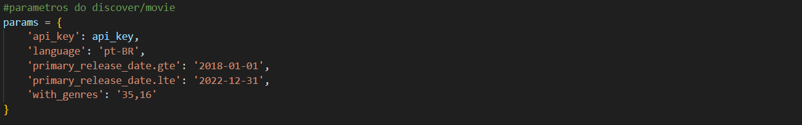
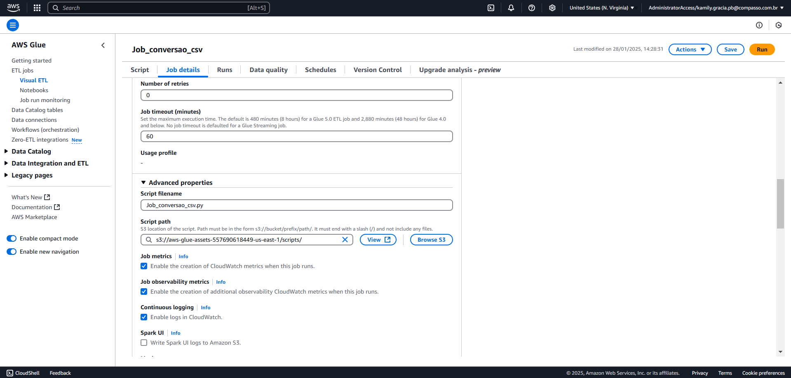
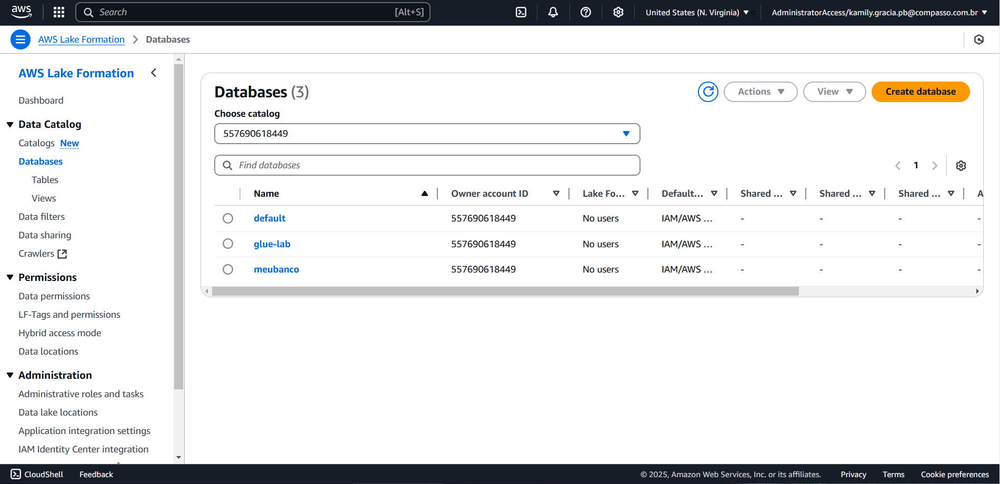

# Orientações

A terceira entrega do desafio tem como objetivo iniciar o tratamento dos dados que serão utilizados no processo de análise. Nesta etapa, os arquivos `JSON` gerados anteriormente foram processados para garantir a confiabilidade das informações. Para isso, foram desenvolvidos dois scripts responsáveis por tratar os arquivos armazenados na pasta *Raw* do bucket S3, convertê-los para o formato `.parquet` e armazená-los na pasta *Trusted*.

## Preparação

Para dar início às atividades da terceira etapa do desafio, foi necessário reestruturar a fase anterior. Isso ocorreu porque as requisições feitas à API do TMDB, com os filtros configurados, retornaram um grande número de filmes com informações essenciais ausentes, como o ID do IMDb — fundamental para a fusão dos arquivos — e os dados de receita e custo de produção, que seriam utilizados na análise. 

Sendo assim, o [script](./script-requisicoes-refatorado.py) responsável pelas requisições do TMDB foi modificado da seguinte forma:

1. Os parâmetros que anteriormente aceitavam apenas filmes com os gêneros exclusivos de *Comédia* e *Animação* passaram a aceitar os demais gêneros, desde que estes incluam os gêneros destacados entre eles. Dessa forma, a gama de filmes recolhidos foi ampliada, e a proporção daqueles sem a informação do ID do IMDb foi reduzida. Além disso, o período de lançamento dos filmes foi ajustado para coincidir com o do arquivo csv, facilitando a futura junção dos arquivos.

2. O processo de obtenção do `imdb_id` foi alterado, passando a ser realizada uma nova requisição para o endpoint `external_ids`. Isso garantiu que o id de cada filme fosse pesquisado individualmente, assegurando que o ID externo fosse obtido corretamente. Com essa mudança, realiza-se a tentativa da diminuição da quantidade de filmes sem essa importante informação.

3. Durante a exploração dos dados obtidos na execução da versão anterior do script de requisições, constatou-se que apenas uma pequena quantidade de filmes possuía informações sobre receita e custo de produção. Como resultado, as perguntas baseadas nesses dados não poderão ser respondidas. Para a formulação de novas perguntas, será utilizada a nacionalidade dos atores mais populares. Para isso, foi realizada uma nova requisição ao endpoint person do TMDB, que fornece essas informações.

Ao final das mudanças, a pasta Raw foi atualizada por meio da nova função Lambda e os arquivos JSONs com os dados atualizados foram armazenados, como é visto em:

## Análises a serem realizadas

Após as mudanças as perguntas a serem respondidas na análise passaram a ser:

1. Quais países produziram os filmes de comédia/animação mais populares entre 2018 e 2022?
2. Qual é a tendência histórica das notas médias de filmes de comédia/animação por país de origem entre 2018 e 2022?
3. Como a popularidade média dos filmes de comédia/animação varia por país e qual a relação com suas notas médias?
4. Quais países têm os atores mais populares presentes em filmes de comédia/animação?
5. Quais países têm os diretores mais populares presentes em filmes de comédia/animação?
6. Qual a distribuição das nacionalidades entre os atores mais populares no mercado de filmes de comédia/animação?

## Desenvolvimento

Para a resolução do desafio, inicialmente as análises exploratórias e testes de limpeza foram realizados localmente, e, assim que concluídos, a execução no serviço AWS Glue pôde ser realizada. Sendo assim o desafio pode ser dividido em algumas etapas:

### Etapa 1: Scripts de limpeza (csv e TMDB)

Para o desenvolvimento dos scripts de limpeza, foram considerados os conceitos aplicados no cotidiano profissional, onde o tratamento de dados é realizado de forma abrangente. Isso se deve ao fato de que uma mesma base de dados é utilizada para diferentes propósitos e por diversas equipes.

No caso do arquivo CSV, as alterações foram mínimas, pois não é possível determinar antecipadamente quais dados serão necessários para cada finalidade. A única modificação realizada foi a remoção de duplicatas.

Utilizando do serviço AWS Glue, pôde ser então criado o job de tratamento:

No script ocorre:
* A passagem dos caminhos de origem e destino; 
* A leitura dos arquivos e a transformação para um dataframe spark;
* A remoção das duplicatas;
* O retorno para o formato DynamicFrame;
* O armazenamento dos dados em formato `parquet` na pasta trusted no bucket S3.

Além disso foi necessário configurar os detalhes do job a ser executado, o passo a passo pode ser evidenciado:

Ao final da execução a mensagem de sucesso é exibida no monitoramento e a pasta trusted criada contém o caminho `Trusted/Local/Parquet/Movies/` para os arquivos gerados:

Com a mesma lógica pôde-se então realizar o tratamento dos arquivos JSON 

O script também possui a definição dos caminhos de origem e destino e a leitura dos arquivos e a transformação para um dataframe spark. Exposta em:

Além disso, as tranformações iniciam-se na definição de um esquema para a nomeação e estruturação das colunas do dataframe:

Os demais tratamentos realizados são realizados, há-se:

* A remoção dos filmes que não possuem a informação `imdb_id` necessária para o seguimento das etapas;
* O preenchimento das células nulas presentes em colunas não numéricas com "desconhecido" para fins de contagem;
* A renomeação de uma coluna que estava fora do padrão do esquema definido.

Obs: No dataframe não foi observada a ocorrência de duplicatas, por isso não foi necessário introduzir o comando de remoção.

Por fim observa-se a conversão do dataframe em um dynamicframe e este para o formato parquet. Com a execução, obeserva-se a mensagem de sucesso e, com isso, os arquivos gerados são armazenados no caminho `Trusted/TMDB/Parquet/Movies/2025/1/31/` no bucket S3

Obs: É válido destacar que os detalhes de configuração do job de conversão dos arquivos JSON do TMDB são os mesmos introduzidos para o job de conversão dos arquivos JSON do csv.

### Etapa 2: Criação de crawlers

Para a realização da catalogação de dados por meio do crawler do serviço AWS Glue, primeiro, foi necessário criar uma base de dados no serviço AWS Lake Formation que fará a ingestão dos dados presentes na camada Trusted. Sendo assim, o passo a passo realizado pode ser evidenciado:

1. Entrar no serviço AWS Lake Formation e clicar em "create database".

2. Nomear a base de dados que será utilizada e clicar em "create".

A mensagem de sucesso será exibida e com isso podemos retornar ao serviço AWS Glue.

Ao clicar no menu esquerdo em "crawlers" e em seguida "add a crawler" serão exibidas as opções de configuração do crawler a ser criado:

1. Em primeiro lugar, após a nomeação do crwaler, pode ser definido o local de origem dos. No caso, deseja-se mapear os arquivos parquets referentes ao arquivo csv. Estes se encontram no bucket S3 no caminho `Trusted/Local/Parquet/Movies/` exposto anteriormente.
   

2. Em seguida define-se a *Role* a ser utilizada.

3. A base de dados criada anteriormente é definida como local de destino. Será solicitada uma revisão das configurações e então o crawler pode ser criado

São exibidas mensagens de sucesso após a criação e execução do crawler:

Em "Tables" no menu esquerdo, será encontrada a tabela criada com a execução do crawler. Ao clicar em "view table" somos direcionados ao serviço AWS Athena que contém a tabela dos dados do arquivo csv:

Da mesma forma, deve ser feito com os arquivos parquet que contém os dados providos pela API do TMDB. 

A diferença na criação encontra-se no caminho de origem dos dados, que agora se configura como `Trusted/TMDB/Parquet/Movies/2025/1/31/`. 

Obs: Todos os outros passos podem ser espelhados na criação do crawler do arquivo csv.

Sendo assim, o serviço AWS Athena exibe a tabela criada da seguinte forma: 

## Dificuldades encontradas

Foram enfrentadas diversas dificuldades relacionadas à falta de informações disponibilizadas pela API do TMDB. Apesar de seguir as orientações sobre como realizar as requisições para garantir uma análise eficiente, a ausência de dados essenciais impediu a execução completa das fases. Como resultado, o script anterior e as perguntas definidas precisaram ser ajustados para possibilitar a continuidade do processo de ETL.