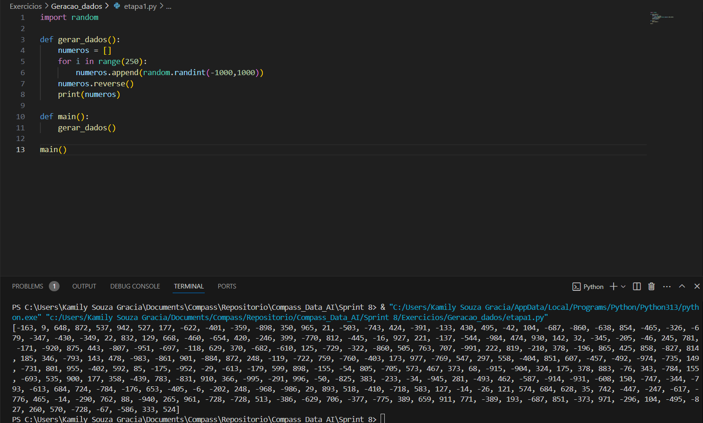
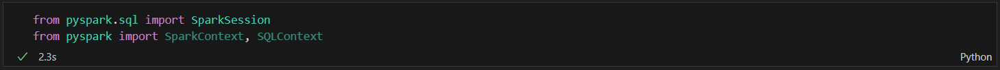
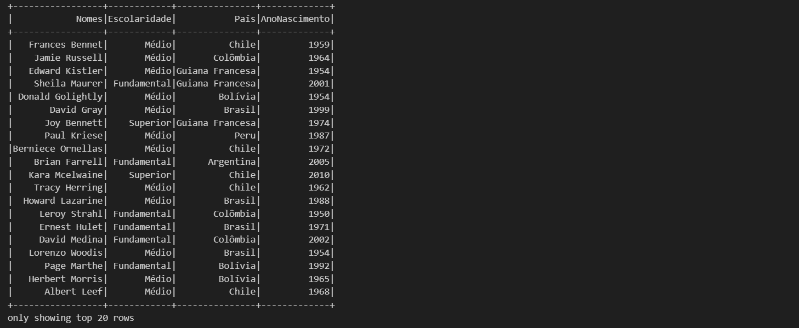
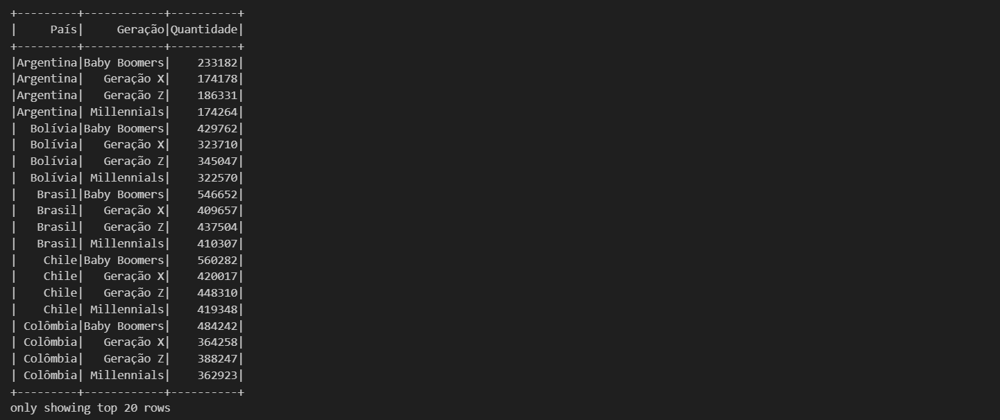

# Informações

Na oitava sprint pude colocar em prática os conhecimentos aprendidos sobre Spark e Python por meio da realização de exercícios, além de observar como os serviços da AWS Glue, Athena e Quicksight são utilizados no processo de ETL por meio de tutoriais técnicos disponibilizados. Por fim, pude dar continuidade ao processo de análise do [desafio final](./Desafio/README.md).

# Resumo

**Tutoriais Técnicos - Analytics**

* AWS Glue: serviço de integração de dados que oferece recursos para análise (preparação, catalogação e tranformação de dados)
  
  Casos de uso: 
    * Pipeline ETL controlados por eventos: pode ser configurado para a realização do serviço a medida que chegam novos dados;
    * Utilização do catálogo unificado para localizar dados em varios armazenamentos;
    * AWS Glue Studio permite realizar trabalhos ETL sem a necessidade de codificar.

* Amazon Athena: serviço de consultas interativas que utiliza o SQL para análise
  
  Casos de uso:
    * Consultas instantâneas;
    * Utiliza presto que processa análises simples e complexas de arquivos.

* Amazon Quicksight: serviço BI de machine learning que permite a visualização dos dados
  
  Casos de uso:
    * Permite o dimensionamento para milhares de usuários;
    * Análises avançadas com machine learning;
    * Incorporação dos painéis BI nas aplicações.

# Exercícios e Evidências

Os exercícios visam a aplicação dos conceitos aprendidos e a integração com os serviços AWS, tais como 

## Exercício 1 - Spark Batch: Geração e massa de dados

O exercício tem por objetivo utilizar de funções python e spark para realizar a geração de dados.

### Etapa 1 - Inicializar uma lista contendo 250 inteiros aleatórios, reverter e imprimi-la.



Para a execução dessa etapa foi utilizada a biblioteca `random` que realiza a geração de números aleatórios. Sendo assim, o script pode ser explicado:

```python
#importação da biblioteca
import random

#criação da função que realizará a geração de dados
def gerar_dados():
    #criação de uma lista vazia
    numeros = []
    #definição de um looping
    for i in range(250):
        #introdução dos números aleatórios na lista, estes estarão presentes dentro do intervalo definido em radint()
        numeros.append(random.randint(-1000,1000))
    #reversão da lista
    numeros.reverse()
    #exibição
    print(numeros)

#chamada da função
def main():
    gerar_dados()

main()
```

### Etapa 2 - Inicializar uma lista contendo o nome de 20 animais, ordenar e imprimilos em ordem crescente por meio de uma iteração e armazenar os dados em um arquivo .csv.


O código pode então ser esclarecido:

```python
#importação da biblioteca csv que permitirá a criação do arquivo
import csv

#criação da lista de animais
animais = ["Baleia", "Canguru", "Borboleta", "Peixe", "Mosca", 
            "Grilo", "Cachorro", "Gato", "Papagaio", "Rato",
            "Arara", "Sapo", "Porco", "Camelo", "Crocodilo",
            "Urso", "Gorila", "Macaco", "Cabra", "Ovelha"]

#função de criação de arquivo com o conteúdo da lista recebida
def transformar_csv(animais):
    #abertura  de um novo arquivo em modo de escrita
    #o parâmetro `newline=''` evita linhas em branco extras
    with open('animais.csv', mode='w', newline='') as file:
        #cria um objeto escritor para manipular o arquivo CSV
        escrita = csv.writer(file)
        #escreve cada elemento (animal) da lista em uma linha separada no arquivo CSV
        escrita.writerows([[animal] for animal in animais])

#função de ordenação que recebe como parâmetro a lista
def ordenacao_alfabetica(animais):
    #reorganização dos nomes presentes na lista em ordem alfabática
    animais = [animal for animal in sorted(animais)] 
    #exibição da lista
    print(animais)
    #chamada da segunda função
    transformar_csv(animais)

#chamada da função de ordenação
def main():
    ordenacao_alfabetica(animais)

main()
```

Com a execução do código o [arquivo gerado](./Exercicios/Geracao_dados/arquivos_gerados/animais.csv) apresenta-se da seguinte forma:


### Etapa 3 - Geração de um dataset que contém o nome de pessoas

#### Passo 1 - Instalação da biblioteca names (geração de nomes aleatórios):


#### Passo 2 - Importação das bibliotecas

```python
import names, os, time, random
```

#### Passo 3 - Definição de parâmetros para a geração do dataset (quantidade de nomes e quantidade de nomes únicos)

```python
#definição da semente (seed) para o gerador de números aleatórios da biblioteca random, garantindo que os resultados gerados sejam sempre os mesmos em diferentes execuções, desde que os mesmos parâmetros sejam utilizados
random.seed(40)

qtd_nomes_unicos = 3000
qtd_nomes_aleatorios = 10000000
```

#### Passo 4 - Geração de nomes aleatórios

```python
#criação da lista auxiliar
aux = []

#abertura do looping que será executado 3000 vezes
for i in range(0,qtd_nomes_unicos):
    #em cada iteração, a função names.get_full_name() gera um nome completo aleatório e o adiciona à lista aux
    aux.append(names.get_full_name())

print("Gerando {} números aleatórios".format(qtd_nomes_aleatorios))

#criação da lista principal
dados = []

#execução de um looping 10000000 vezes
for i in range(0, qtd_nomes_aleatorios):
    #em cada iteração, um nome aleatório é escolhido da lista aux usando random.choice(aux) e adicionado à lista dados
    dados.append(random.choice(aux))
```

#### Passo 5 - Geração de um arquivo `nomes_aleatorios.txt` contendo um nome em cada linha

```python
#criação do arquivo em modo escrita
with open('nomes_aleatorios.txt', mode='w', newline='') as file:
    #escritura de cada nome contido na lista 'dados' em linhas diferentes
    escrita = [file.write(nome + "\n") for nome in dados]
```

#### Passo 6 - Abertura do arquivo e verificação do conteúdo

```python
#abertura do arquivo em modo leitura
with open('nomes_aleatorios.txt', mode='r') as file2:
    #armazenamento do conteúdo presente no arquivo em uma variável
    conteudo = file2.read()
    #exposição do conteúdo
    print(conteudo)
```

Ao final dos passos o código se configura assim:


Ao ser executado o terminal apresenta os nomes no arquivo contido:


O [arquivo](./Exercicios/Geracao_dados/arquivos_gerados/nomes_aleatorios.txt) também pode destacar a quantidade de nomes de forma organizada:


## Exercício 2 - Spark Batch: Apache Spark

O exercício visa a manpulação de dataframes utilizando do recurso Spark.

### Etapa 1 - Preparação do ambiente de execução

#### Passo 1 - Importação das bibliotecas necessárias



#### Passo 2 - Inicialização da sessão


#### Passo 3 - Leitura do arquivo `nomes_aleatorios.txt`, carregamento dos dados para um data frame e exibição


### Etapa 2 - Renomeação da coluna, impressão do esquema e do dataframe

#### Passo 1 - Exibição do esquema anterior


#### Passo 2 - Renomeação e exibição do dataframe


### Etapa 3 - Adição de uma nova coluna 'Escolaridade' e atribuição de valores aleatórios (Fundamental, Médio ou Superior)

Para a realização desta etapa foi necessário utilizar das funções oferecidas pela bilioteca:

```python
from pyspark.sql import functions as f
```
A resolução foi dada por:


Onde:

```python
#Os possíveis resultados são armazenados em uma lista
niveis = ["Fundamental", "Médio", "Superior"]

#o dataframe recebe a coluna escolaridade
#a função 'rand' será a responsável por atribuir valores aleatório a cada uma das linhas, estes variam de 0 à 1.
df_nomes = df_nomes.withColumn("Escolaridade", 
    f.when(f.rand()<0.33, niveis[0]) #se o número aleatório for menor que 0.33, então é atribuido "Fundamental"
    .when(f.rand() < 0.66, niveis[1])  #se for entre 0.33 e 0.66, então é atribuido "Médio"
    .otherwise(niveis[2]) #se for maior ou igual a 0.66 então, é atribuido "Superior"
    .when(f.rand()<0.66, niveis[1])
    .otherwise(niveis[2]))

#apresentação
df_nomes.show()
```
O resultado exibido é:


### Etapa 4 - Adição de uma nova coluna 'País' e atribuição aleatória dos países da América do Sul


Para a resolução, utilizou-se a mesma lógica da etapa anterior, dividindo a quantidade de valores na lista e atribuindo cada resultado a um país.

```python
#criação da lista de países - resultados possíveis
paises = [ "Argentina", "Bolívia", "Brasil", "Chile", "Colômbia",
    "Equador", "Guiana Francesa", "Paraguai", "Peru", "Suriname",
    "Uruguai", "Venezuela", "Guiana"]

#criação da coluna e utilização da função rand
df_nomes = df_nomes.withColumn(
    "País",
    f.when(f.rand() < 1/13, paises[0])
    .when(f.rand() < 2/13, paises[1])
    .when(f.rand() < 3/13, paises[2])
    .when(f.rand() < 4/13, paises[3])
    .when(f.rand() < 5/13, paises[4])
    .when(f.rand() < 6/13, paises[5])
    .when(f.rand() < 7/13, paises[6])
    .when(f.rand() < 8/13, paises[7])
    .when(f.rand() < 9/13, paises[8])
    .when(f.rand() < 10/13, paises[9])
    .when(f.rand() < 11/13, paises[10])
    .when(f.rand() < 12/13, paises[11])
    .otherwise(paises[12])
)

#apresentação
df_nomes.show()
```

O resultado é apresentado da seguinte forma:


### Etapa 5 - Adição de uma nova coluna 'AnoNascimento' e atribuição aleatória de anos entre 1945-2010


Para a resolução do exercício foi necessário aumentar o número de valores presentes no intervalo de rand(), para isso utilizou-se da seguinte lógica:

```Python
#criação da coluna e utilização de rand
df_nomes = df_nomes.withColumn("AnoNascimento", 
    #abertura do intervalo de valores de 0 a 66
    (f.rand() * (2011 - 1945) 
    #cada valor aleatório será somado a 1945
    #resultando em um ano dentro do período informado
    + 1945).cast("int")) #cast("int") converte o resultado para inteiro

#apresentação
df_nomes.show()
```
O resultado é então apresentado:



### Etapa 6 - Seleção e armazenamento das pessoas nascidas neste século


### Etapa 7 - Realizar o mesmo procedimento da etapa anterior utilizando Spark SQL para a criação de tabelas temporárias

#### Passo 1 - Armazenar o conteúdo do dataframe em uma tabela temporária


#### Passo 2 - Realizar a seleção SQL de acordo com os filtros estabelecidos (pessoas nascidas no século atual)


### Etapa 8 - Contar o número de pessoas nascidas entre os anos 1980 e 1994 (Millenials)

Na resolução do exercício foi utilizzada a função `filter()`, que faz o filtro dos resultados esperados e `count()` que realiza a contagem:


### Etapa 9 - Repetir a etapa anterior utilizando Spark SQL:


### Etapa 10 - Utilizando Spark SQL obter a quantidade de cada geração (Baby Boomers, Geração X, Millenials, Geração Z) em cada país e exibir o resultado de maneira ordenada por país, geração e quantidade


A construção da lógica do exercício pode ser esclarecida:

```python
df_geracoes = spark.sql("""
    SELECT -- seleção do país
        `País`,
        CASE
            WHEN anoNascimento BETWEEN 1944 AND 1964 THEN 'Baby Boomers' -- se ano de nascimento entre 1944 a 1964 → "Baby Boomers
            WHEN anoNascimento BETWEEN 1965 AND 1979 THEN 'Geração X' -- se 1965 a 1979 → "Geração X"
            WHEN anoNascimento BETWEEN 1980 AND 1994 THEN 'Millennials' -- se 1980 a 1994 → "Millennials"
            WHEN anoNascimento BETWEEN 1995 AND 2015 THEN 'Geração Z' -- se 1995 a 2015 → "Geração Z"
        END AS `Geração`, -- criação da coluna Geração
        COUNT(*) AS Quantidade -- criação da coluna quantidade que realizará a contagem
    FROM pessoas -- define a tabela pessoas como fonte dos dados
    GROUP BY `País`, `Geração` -- agrupamento por país e geração
    ORDER BY `País`, `Geração`, Quantidade -- ordenação consecutiva
""")

#apresentação
df_geracoes.show()
```
O resultado apresentado é:




## Exercício 3 - TMDB

O exercício solicitado foi realizado na [sprint anterior](../Sprint%207/README.md), onde ocorre o teste das requisições à API do site TMDB.

## Certificados

Não houveram certificados AWS emitidos durante a sprint.