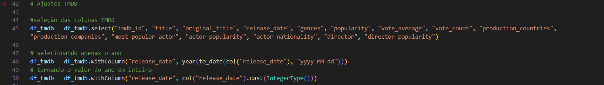
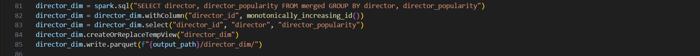
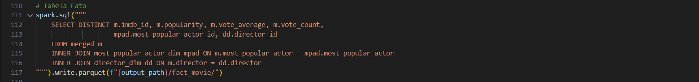

# Orientações

Na quarta entrega do desafio final, foi desenvolvido um script em Python utilizando Spark para realizar o tratamento final dos dados armazenados na pasta *Trusted*. Esse processo envolveu a junção de arquivos de origens distintas e a construção da modelagem dimensional, servindo como base para a divisão das tabelas em dimensões e fato. Ao término das etapas, os resultados foram salvos na pasta *Refined* do bucket S3.

## Desenvolvimento

Para a resolução do desafio, inicialmente foram realizados, localmente, os testes de limpeza e divisão das tabelas, e, assim que concluídos, a execução no serviço AWS Glue pôde ser realizada. Sendo assim o script construído cumpre alguns objetivos, que podem ser divididos em algumas etapas:

### Etapa 1: Limpeza final dos arquivos CSV e TMDB

Após a leitura dos arquivos `PARQUET` presentes na pasta *Trusted* o primeiro passo foi realizar a limpeza final dos arquivos :

- Para a limpeza dos dados providos pelo csv foram realizados os seguintes passos:
    - Filtragem dos generos de interesse (comédia e animação);
    - Filtragem do período de interesse:
      - Conversão da coluna `anoLancamento` para inteiro;
      - Utilização da condição 2018 <=`anolancamento` <= 2022;
    - Correção do nome da coluna `tituloPrincipal`;
    - Organização da disposição das colunas do DataFrame;
    - Remoção das duplicatas levando em consideração o `id`.
  


- Para a limpeza dos dados providos pelo TMDB foram realizados os seguintes passos:
    - Seleção das colunas de interesse;
    - Conversão do tipo da coluna `release_date`:
      - Conversão para o formato data e seleção do ano;
      - Conversão para inteiro para futuras seleções;



### Etapa 2: Junção dos DataFrames - método fallback

Para a realização da junção, considerando que os dados do CSV também estavam presentes no DataFrame do TMDB, optou-se por utilizar o método fallback com `coalesce()`. A junção foi feita por meio de um `LEFT JOIN`, garantindo que todos os dados do TMDB fossem mantidos e que, do CSV, apenas os registros correspondentes fossem adicionados.

Para os filmes com essa correspondência, foi verificada a presença de todos os dados nas colunas e, caso houvesse algum valor ausente, ele era substituído pelo dado disponível no CSV.

Após essa substituição dos valores nulos, as colunas do CSV que já haviam sido utilizadas puderam ser removidas.


### Etapa 3: Explode em linhas com multipilicidade de valores

Após a obtenção do Dataframe unido, foi observada a presença de listas nas células das colunas `production_countries` e `production_countries` devido às colaborações que podem ocorrer na produção de um único filme:


Devido à necessidade de contar os países e produtoras envolvidos na produção de um filme, foi preciso separar os elementos em linhas distintas para obter resultados mais precisos.


E como resultado obteve-se um DataFrame com os dados separados, no entanto com repetições dos filmes:


### Etapa 4: Modelagem dimensional

Com o DataFrame final construído, pude realizar a modelagem da tabela fato e das dimensões a serem separadas posteriormente. Como resultado da modelagem obtive:


Na modelagem observa-se que:
- A tabela fato `fact_movie` contém os dados numéricos e gerais relacionados ao evento 'filme', além dos ids das tabelas às quais está associada. Esta possui como chave primária o `imdb_id` que é único para cada filme;
  
- A dimensão `movies_dim` contém informações detalhadas sobre os filmes, como título, título original, data de lançamento e os gêneros presentes. Possui relação 1:1 com a tabela fato, e também utiliza `imdb_id` como chave primária.

- A dimensão `most_popular_actor_dim` contém informações relacionadas ao ator mais popular do filme em questão, tais como seu nome, popularidade e nacionalidade. Relaciona-se com a tabela fato por meio da cardinalidade N:1 e possui uma chave primaria superficial (autoincrementada pelo código).

- A dimensão `director_dim` contém informações relacionadas ao diretor do filme, como seu nome e popularidade. Relaciona-se com a tabela fato por meio da cardinalidade N:1 e possui uma chave primaria superficial.

- A dimensão `production_country_dim` contém os nomes dos países participantes na produção do filme e a chave primária superficial. Como se une à tabela fato por meio da cardinalidade N:M, foi necessário criar uma tabela associativa:
  - A tabela associativa `bridge_country_fact` possui as chaves primárias das tabelas `fact_movie` e `production_country_dim`, é responsável por realizar a ligação entre ambas.
  
- A dimensão `production_company_dim` contém os nomes das produtoras participantes na produção do filme e a chave primária superficial. Da mesma forma, une-se à tabela fato por meio da cardinalidade N:M e foi necessário criar uma tabela associativa:
  - A tabela associativa `bridge_company_fact` possui as chaves primárias das tabelas `fact_movie` e `production_company_dim`, é responsável por realizar a ligação entre ambas.

### Etapa 5: Divisão das tabelas no código

Foi utilizada como base de dados o DataFrame unido anteriormente que foi transformado em uma view temporária para a utilização da escrita sql para seleção das colunas das tabelas a serem criadas: 

```python
  df_exploded.createOrReplaceTempView("merged")
```

**movies_dim**: 
  


Observa-se:
  - A seleção das colunas pertencentes à dimensão, providas pela tabela 'merged' e agrupadas para evitar a repetição desnecessária de dados;
  - A criação de uma view temporária para uma possível utilização posterior;
  - A transformação do DataFrame criado em arquivos parquet serão salvos no caminho destino (pasta Refined) dentro da subpasta com o nome da dimensão.
<br>

**director_dim**:



Observa-se:
- A seleção das colunas pertencentes à dimensão, providas pela tabela 'merged' e agrupadas para evitar a repetição desnecessária de dados;
- A adição da coluna `director_id`, que, por meio do método `monotonically_increasing_id()` irá introduzir id's a cada diretor;
- A reorganização da disposição das colunas;
- A criação de uma view temporária para uma possível utilização posterior;
- A tranformação em arquivos parquet e armazenamento na pasta Refined seguindo o modelo.
<br>

**most_popular_actor_dim**


Observa-se:
- A seleção das colunas pertencentes à dimensão, providas pela tabela 'merged', desta vez utilizando o `DISTINCT` para evitar a repetição desnecessária de dados;
- Atribuição da palavra "desconhecido" às células nulas da coluna que armazena os nomes dos aristas;
- A adição da coluna `most_popular_actor_id` que também utiliza do método `monotonically_increasing_id()`;
- A reorganização da disposição das colunas;
- A criação de uma view temporária para uma possível utilização posterior;
- A tranformação em arquivos parquet e armazenamento na pasta Refined seguindo o modelo.
<br>

**production_country_dim**


Observa-se:
- A seleção das colunas pertencentes à dimensão, providas pela tabela 'merged', utilizando o `DISTINCT` para evitar a repetição desnecessária de dados;
- A adição da coluna `production_country_id`, que também utiliza do método `monotonically_increasing_id()`;
- A reorganização da disposição das colunas;
- A criação de uma view temporária para uma possível utilização posterior;
- A tranformação em arquivos parquet e armazenamento na pasta Refined seguindo o modelo.
<br>

**production_company_dim**


Observa-se:
- A seleção das colunas pertencentes à dimensão, providas pela tabela 'merged', utilizando o `DISTINCT` para evitar a repetição desnecessária de dados;
- A adição da coluna `production_company_id`, que também utiliza do método `monotonically_increasing_id()`;
- A reorganização da disposição das colunas;
- Atribuição da palavra "desconhecido" às células nulas da coluna que armazena os nomes das produtoras;
- A criação de uma view temporária para uma possível utilização posterior;
- A tranformação em arquivos parquet e armazenamento na pasta Refined seguindo o modelo.
<br>

**fact_movies**



Observa-se:
- A seleção das colunas pertencentes à dimensão, providas pela tabela 'merged' unida às tabelas 'most_popular_actor_dim' e 'director_dim' por meio do `JOIN`, utilizando o `DISTINCT` para evitar a repetição desnecessária de dados;
- A tranformação em arquivos parquet e armazenamento na pasta Refined seguindo o modelo.
<br>

**bridge_country_fact**


Observa-se:
- A seleção das colunas pertencentes à dimensão, providas pela tabela 'merged' unida à tabela 'production_country_dim', utilizando o `GROUP BY` para evitar a repetição desnecessária de dados;
- A tranformação em arquivos parquet e armazenamento na pasta Refined seguindo o modelo.
<br>

**bridge_company_fact**


Observa-se:
- A seleção das colunas pertencentes à dimensão, providas pela tabela 'merged' unida à tabela 'production_company_dim', utilizando o `GROUP BY` para evitar a repetição desnecessária de dados;
- A tranformação em arquivos parquet e armazenamento na pasta Refined seguindo o modelo.
<br>

### Etapa 6: Execução no serviço AWS Glue

Após a realização dos testes em ambiente local, o código pôde ser executado no serviço AWS Glue por meio do job 'Tratamento_Divisao_Refined':


Os ''Job details' foram também ajustados seguindo o padrão estabelecido nas sprints anteriores. Para a execução deste job em específico foram atribuídos diferentes parâmetros para a localização dos arquivos de origem presentes na pasta *Trusted* e para a criação e armazenamento dos arquivos gerados na pasta *Refined*.


Desta forma pôde então se inicar o *run* do job. Como resultado observa-se a mensagem de sucesso:


Além da criação das pastas e subpastas no bucket s3:


### Etapa 7: Criação da base de dados

Para a ligação dos serviços AWS Glue e AWs Athena faz-se necessária a criação de uma base de dados realizada no serviço AWS Lake Formation:


Esta será responsável por armazenar as tabelas criadas pelo crawler.

### Etapa 8: Criação do Crawler

De volta ao AWS Glue, pode ser criado então o crawler que mapeará as tabelas presentes na pasta *Refined*:


Ao executar o crawler recebe-se a mensagem de sucesso:


### Etapa 9: Acesso às tabelas no serviço AWS Athena

Com as tabelas mapeadas pelo crawler criado, estas podem ser acessadas pelo serviço AWS Athena. Apresentam-se os exemplos das queries: 

* **Tabela fact_movie:**


* **Tabela movies_dim:**


* **Tabela director_dim:**


* **Tabela most_popular_actor_dim:**


* **Tabela production_country_dim:**


* **Tabela production_company_dim:**


* **Tabela bridge_country_fact:**


*Obs: "United States of America" é o elemento que possui como id o número 0.

* **Tabela bridge_company_fact:**


## Dificuldades encontradas

As dificuldades encontradas referem-se ao planejamento de como a junção dos dados `csv` e `TMDB` seria realizada, além da adaptação do código para o serviço AWS Glue.