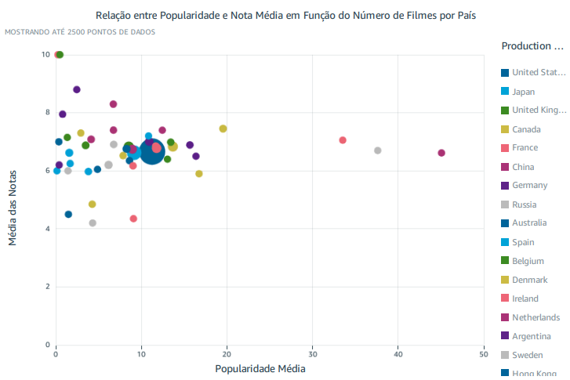
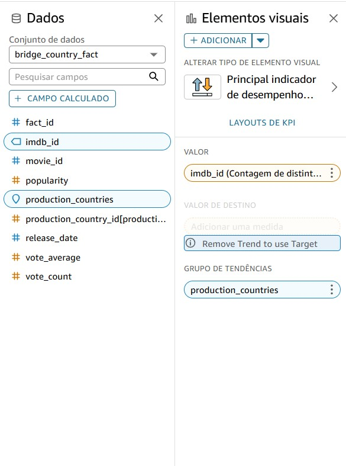

# Orientações

Na quinta (e última) entrega do desafio final, com os dados refinados criou-se um dashboard utilizando o serviço QuickSight da AWS. Com esta ferramenta, gráficoss foram criados de forma a representar as respostas obtidas com a análise de maneira intuitiva.

# A Geografia do Cinema: Popularidade de Filmes, Atores, Produtoras e Diretores ao Redor do Mundo

## Introdução e Hipótese Inicial

O cinema é um fenômeno global, mas será que certos países dominam a produção e a popularidade dos filmes de comédia e animação? O sucesso de um filme pode estar relacionado à nacionalidade de seus atores e diretores? Com essa análise, buscou-se explorar como diferentes países influenciam o mercado cinematográfico, identificando padrões que possam explicar a distribuição da popularidade nesse segmento.

## Objetivo da Pesquisa

A pesquisa tem por objetivo mapear a indústria cinematográfica de comédia e animação, analisando quais países mais produzem esses filmes, quais são os mais populares e como a nacionalidade de seu elenco e produtora podem influenciar no seu sucesso.

## Método de Pesquisa

Pode-se atribuir como fonte da análise a base de dados do TMDB (The Movie Database), uma plataforma amplamente reconhecida por fornecer informações detalhadas sobre filmes, diretores, atores e outros aspectos da indústria cinematográfica.

Para conduzir essa pesquisa, foi desenvolvido um processo de ETL (Extract, Transform, Load), estruturando e refinando os dados para garantir a extração de insights relevantes. A análise concentrou-se em métricas como:

* **Popularidade dos filmes:** Indicador baseado no engajamento do público, considerando acessos e avaliações.
* **Média das notas:** Avaliação qualitativa dos filmes, refletindo a recepção da crítica e dos espectadores.
* **Anos de lançamento:** Distribuição temporal das produções para entender tendências no mercado.
* **Produtoras responsáveis:** Identificação das empresas que mais contribuíram para a popularidade do gênero.
* **Nacionalidade de diretores e atores:** Investigação sobre quais países possuem os talentos mais reconhecidos.

Os dados foram processados e visualizados em um dashboard interativo, permitindo uma interpretação dos padrões encontrados.

## Perguntas que Guiaram a Análise

### Quais países produziram os filmes de comédia/animação mais populares entre 2018 e 2022?


A análise, baseada na popularidade de filmes produzidos por diferentes países, revela que os Estados Unidos dominam a produção dos títulos mais populares, seguidos por Japão, Canadá, França e Reino Unido.

Além disso, os Estados Unidos também se destacam como o maior produtor de filmes de comédia e animação, totalizando 272 produções no período analisado, reforçando sua influência na indústria cinematográfica global.

<div align="center">


</div>

## Pode ser traçada uma relação entre a popularidade dos filmes e suas respectivas notas, considerando o país que o produziu?



A partir do gráfico de dispersão que relaciona popularidade média e nota média dos filmes por país, podemos observar se existe um padrão entre esses dois fatores.

A análise do gráfico sugere que não há uma relação linear direta entre a popularidade dos filmes e suas notas médias, considerando os países produtores. Alguns países, como os Estados Unidos e o Japão, aparecem com altos índices de popularidade, mas a qualidade percebida dos filmes (nota média) pode variar.

Isso indica que um filme pode ser muito popular mesmo sem ter uma avaliação extremamente alta, possivelmente devido ao marketing, à distribuição global e à força das produtoras envolvidas. Por outro lado, alguns países podem produzir filmes bem avaliados, mas que não necessariamente atingem grande popularidade mundial.

Essa observação reforça a ideia de que popularidade e qualidade nem sempre andam juntas, e que fatores externos, como presença de grandes estúdios e acesso a mercados internacionais, podem influenciar o sucesso de um filme.

## Qual a distribuição das nacionalidades entre os atores mais populares no mercado de filmes de comédia/animação? Tal informação pode influenciar em sua popularidade no meio cinematográfico?


Por meio do gráfico, observa-se os países que os artistas mais populares de cada filme têm como nacionalidade. Nota-se que há uma forte concentração de atores populares em determinados países, especialmente nos Estados Unidos, Reino Unido, Canadá e Japão.

Essa distribuição sugere que a nacionalidade de um artista pode, sim, influenciar sua popularidade no meio cinematográfico. Países com indústrias cinematográficas consolidadas, como os Estados Unidos e o Reino Unido, tendem a projetar seus atores para um público global, aumentando sua visibilidade e reconhecimento. Além disso, a influência de Hollywood e de grandes estúdios pode impulsionar a carreira de atores dessas regiões.

Por outro lado, países com menor representatividade na indústria cinematográfica global apresentam poucos atores entre os mais populares, o que reforça a ideia de que o mercado e a estrutura da indústria local desempenham um papel crucial na ascensão de um artista ao estrelato.

## Quais países têm os atores mais populares presentes em filmes de comédia/animação?


Por outro lado, ao calcular a média da popularidade dos artistas presentes nas produções, países como Nova Zelândia, China, Grécia e Itália se destacam. Isso ocorre porque, apesar de não serem os principais polos da indústria de comédia e animação, suas produções frequentemente contam com a participação de atores de grande renome, elevando a mídia de popularidade. Diferentemente dos Estados Unidos, Reino Unido, Canadá e Japão, onde há uma alta concentração de atores populares devido à força de suas indústrias cinematográficas, esses países podem apresentar médias elevadas mesmo com um número menor de filmes no gênero.

## Quais países têm os diretores mais populares presentes em filmes de comédia/animação?


Os países com os diretores mais populares em filmes de comédia e animação são, principalmente, a Espanha, Itália e os Estados Unidos. A Espanha lidera com o diretor mais popular, seguida pela Itália com o segundo mais popular. Outros países, como Polônia, Reino Unido e EUA, compartilham o terceiro lugar, demonstrando uma forte presença na indústria. Além disso, o Canadá e países como China, Dinamarca e França também se destacam, ocupando posições de relevância no ranking. Esses dados indicam que, embora países como os Estados Unidos e o Reino Unido tenham uma presença significativa no mercado global, na produção de filmes de comédia e animação, outras nações como Espanha e Itália também podem apresentar em seu elenco diretores com grande popularidade.


## Quais são as produtoras que mais produziram filmes do gênero comédia e animação ao longo do período analisado?


As produtoras que mais lançaram filmes de comédia e animação ao longo do período analisado foram Warner Bros., Walt Disney Studios, Toei Animation, Sony Pictures e Pixar. Essas empresas tiveram uma participação significativa no mercado, consolidando-se como as principais impulsionadoras desses gêneros. A forte presença desses produtos sugere que a popularidade e o alcance global de filmes de comédia e animação estão fortemente vinculados à capacidade dessas companhias de investimento em produções recorrentes, explorar franquias de sucesso e manter um público fiel ao longo dos anos. Além disso, a diversidade geográfica dessas empresas – com representantes dos Estados Unidos e do Japão – reforça a importância desses países como centros da indústria cinematográfica nesses gêneros.

Vale destacar também que, ao analisar a média de popularidade das obras por produtora, a BermanBraun aparece com a maior média, um indicativo de que suas produções apresentaram um nível de popularidade excepcional. Essa métrica pode refletir o impacto de filmes com grande sucesso, que se destacam no cenário global, gerando um alto índice de popularidade, mesmo que a produtora não tenha sido uma das mais produtivas no total de lançamentos no gênero.

<div align="center">


</div>

## Conclusão

A pesquisa revela a complexa geografia da indústria de filmes de comédia e animação, destacando o impacto das nacionalidades de países, diretores, atores e produtoras na popularidade global dessas produções. Os Estados Unidos surgem como o principal protagonista, não apenas pela quantidade de filmes produzidos, mas também pela presença de diretores e atores de grande renome. No entanto, outros países, como Japão, Reino Unido, Canadá, França e até nações como Espanha e Itália, demonstram uma influência considerável, especialmente por meio da participação de talentos populares e diretores altamente reconhecidos.

Os dados indicam que a popularidade de um filme nem sempre está atrelada à sua avaliação crítica, mostrando que fatores como marketing, distribuição global e a força das produtoras desempenham papéis cruciais no sucesso de filmes de comédia e animação. A presença de grandes estúdios como Warner Bros., Walt Disney e Toei Animation também destaca a centralidade dos Estados Unidos e do Japão no cenário mundial do gênero.

Além disso, a análise das nacionalidades de artistas sugere que a indústria cinematográfica de certos países, como os EUA e Reino Unido, continua a impulsionar as carreiras de seus atores para um público global. No entanto, países com menor representatividade na indústria, como Nova Zelândia e China, também conseguem gerar grande popularidade ao contar com estrelas de renome internacional.

Portanto, embora os Estados Unidos dominem a produção e a popularidade de filmes de comédia e animação, outros países demonstram que a diversidade geográfica e cultural também tem um papel significativo no crescimento e no sucesso global desses gêneros. A convergência entre talento, estúdios e estratégias de distribuição é, sem dúvida, o fator determinante para o alcance e a durabilidade dos filmes nesse segmento.

# Execução do Desafio

## Preparação

É importante destacar que alguns ajustes foram realizados na modelagem dimensional que originou as tabelas utilizadas na análise:


Seguindo as orientações, foram adicionadas chaves primárias para cada uma das dimensões, bem como para a tabela fato, garantindo que a mesma chave não identificasse tabelas distintas. Para isso, foi adotado o seguinte método para gerar identificadores únicos de forma incremental:

```python
monotonically_increasing_id() + lit(1)
```

Com essa abordagem, todas as tabelas passaram a contar com chaves primárias superficiais (IDs), iniciando a numeração a partir de 1, a fim de identificar cada ocorrência. Dessa forma pode ser observada a mudança no código executado no serviço AWS Glue e seu respectivo resultado no bucket do S3:


Algumas abordagens, no entanto, foram mantidas e precisam ser esclarecidas. A dimensão tempo não foi criada, pois o único dado armazenado seria o campo release_date, que registra apenas o ano de lançamento do filme. Como esse nível de detalhamento é limitado, decidiu-se manter essa informação diretamente na tabela fato.

Além disso, as tabelas bridge foram necessárias para evitar a duplicação de linhas durante a análise. Isso ocorreu devido ao uso do método `explode` na separação de elementos multivalorados das colunas *production_countries* e *production_companies*. Como essas colunas geraram relações de muitos para muitos entre a tabela fato e suas respectivas dimensões, optou-se por manter as tabelas associativas para estruturar corretamente os dados.   

## Desenvolvimento

O primeiro passo para a realização do desafio foi a criação de um conjunto de dados na plataforma QuickSight, garantindo uma organização adequada conforme a modelagem dimensional desenvolvida. Durante o processo, foram criados três conjuntos distintos para viabilizar o uso das tabelas *bridge* sem comprometer a integridade da análise. Dessa forma, diferentes conjuntos de dados foram utilizados para diferentes gráficos, assegurando uma abordagem estruturada e coerente.


O primeiro conjunto de dados criado agrupou as tabelas fact_movie, bridge_country_fact e production_country_dim para consolidar as informações sobre os países produtores e seus respectivos filmes. O processo seguiu os seguintes passos:

1. Criação da fonte de dados: Uma nova fonte de dados foi criada e nomeada.
   


2. Seleção da primeira tabela: A tabela *bridge* foi a primeira a ser selecionada, pois desempenha um papel central na conexão entre as tabelas.
   


3. Definição dos relacionamentos: As tabelas foram associadas conforme a lógica aprendida no curso, onde a tabela de maior cardinalidade (muitos) foi conectada às tabelas de menor cardinalidade (um) utilizando a relação *left join*.
   


4. Limpeza e ajuste dos dados: Durante o processo de limpeza, foram mantidos apenas os dados necessários, enquanto os demais foram excluídos. Além disso, os tipos de dados foram ajustados conforme a natureza de cada campo.
   
<div align="center">
    
</div>

Com a construção desse conjunto puderam ser criadas algumas visualizações:

<details>
<summary><strong>KPI - Maior país produtor de filmes do gênero analisado:</strong></summary>

Para a realização dessa visualização os elementos visuais e propriedades foram configurados da seguinte forma:

* Em elementos visuais utilizou-se como **valor** a contagem de ids (filmes) distintos agrupados em **grupo de tendências** por país de produção:



* Em propriedades, apenas foi desativada a opção de **elemento visual** a fim de não comprometer a visibilidade das informações e alterado o título da visualização:


Como resultado é exibito o seguinte KPI:


</details>

<details>
<summary><strong>Gráfico - Top 5 países com as obras mais populares</strong></summary>

Para a construção do gráfico de barras apresentado, foram configurados os seguintes parâmetros em elementos visuais:


**Configurações**
- **Eixo X:** São inseridos os países de produção das obras.
- **Eixo Y:** É inserida a métrica popularidade agregada pela soma.

Os filtros adicionados foram inseridos a fim de excluir as obras que não haviam a informação do país que a produziu e para selecionar apenas os 5 primeiros países que possuíssem os maiores totais de popularidade:


Em propriedades, foi ativada a opção de **Rótulos de dados** para fornecer uma visualização mais clara dos resultados do gráfico:


Como resultado, obtém-se o seguinte gráfico:


</details>

<details>
<summary><strong>Grafico - Popularidade X Nota Média (Considerando países) </strong></summary>

Este gráfico foi elaborado com base na configuração dos valores nos elementos visuais da seguinte forma:


**Configurações:**
- **Eixo X:** Representa a popularidade das obras, agregada pela média, considerando que um país pode ter produzido mais de um filme.  
- **Eixo Y:** Indica a média das notas das obras de cada país.  
- **Cor:** Cada país é representado por uma cor distinta, facilitando a diferenciação visual.  
- **Tamanho:** O tamanho dos pontos varia conforme o número de filmes produzidos por cada país, permitindo uma análise comparativa do volume de produção.  

Foram também adicionados filtros para que o gráfico fosse exibido de maneira coerente. Todos visam eliminar dos resultados os dados nulos nos campos popularidade, nota media e país de produção:

<div align="center">


</div>

Obs: Em propriedades, as configurações padrão foram mantidas, apenas o título foi alterado.

Como resultado, obtém-se o seguinte gráfico:


</details>
<br>
O segundo conjunto de dados, reuniu informações dos países por meio das tabelas *fact_movie, bridge_country_fact, production_country_dim* e informações do elenco por meio das tabelas *most_popular_actor_dim, director_dim*.

O relacionamento das tabelas pode ser observado:


Além disso, foram removidos campos redundantes e desnecessáriso e adicionada uma nova coluna calculada, chamada *actor_nationality_ajustado*. Essa inclusão foi necessária devido à identificação de erros de digitação nas células da coluna original fornecida pela base de dados. A construção da coluna se deu por meio da seguinte lógica:


No QuickSight o conjunto pôde ser adicionado para a construções de outras visualizações:


<details>
<summary><strong>Gráfico - Distribuição dos artistas mais famosos por sua nacionalidade </strong></summary>

Para construir o gráfico, foi selecionado o tipo "Pontos no mapa" que ilustra com clareza a dimensão da quantidade de artistas concentrados em determinadas localidades. 

Em Elementos visuais as seguintes medidas foram inseridas:


**Configurações**

- **Geospatial:** Para gerar o mapa, é necessário inserir uma coluna que possua o tipo de dado geoespacial, permitindo a correta plotagem dos pontos no mapa. Nesse caso foi utilizado o campo calculado criado para a correta atribuição dos artistas as suas respectivas nacionalidades.
- **Size:** Para determinar o tamanho dos pontos, foi inserida a contagem (distinta) dos ids dos artistas.

Nos filtros, foi aplicado apenas um critério para remover da lista de países aqueles cujo campo continha a palavra "desconhecido".

<div align="center">


</div>

Obs: Em propriedades as configurações padrão foram mantidas, apenas o título foi alterado.

Como resultado, obtém-se o seguinte gráfico:


</details>

<details>
<summary><strong>Gráfico- Mapa geoespacial da popularidade dos artistas por país de produção</strong></summary>

Para a construção do mapa preenchido apresentado, foram configurados os seguintes parâmetros em elementos visuais:


**configurações**

- **Geospatial:** São inseridos os países de produção dos filmes.
- **Color:** Popularidade média dos artistas agregada pela média.

Em filtros, introduz-se apenas a exclusão de valores nulos:


Obs: Em propriedades, as configurações padrão foram mantidas, apenas o título foi alterado.

Como resultado, obtém-se o seguinte gráfico:


</details>

<details>
<summary><strong>Gráfico - Ranking dos diretores mais populares por país de produção</strong></summary>

Para a construção do gráfico, foram configurados os seguintes parâmetros em elementos visuais:


**Configurações**

- **Eixo Y:** São inseridos os países de produção.
- **Valor:** Analisa-se a popularidade dos diretores por meio da agregação *Máx* que busca o maior valor entre as ocorrências de determinado país.

Em filtros, são excluídos valores nulos ou 'desconehcidos' das colunas país de produção e popularidade do diretor.


Além disso os resultados da popularidade do diretor são ordenados de forma decrescente e selecionados apenas os 10 primeiros:


Em propriedades, apenas foi alterado o título e ativada a opção de *Rótulos de dados* para melhor visualização de resultados.

Como resultado, obtém-se o seguinte gráfico:


</details>
<br>
O terceiro e último conjunto de dados foi elaborado com o propósito de analisar as companhias de produção cinematográfica envolvidas na criação de filmes de comédia e animação. Para garantir a qualidade das informações, foram estabelecidos os relacionamentos entre as tabelas *fact_movie, bridge_company_fact, production_company_dim* e aplicadas as limpezas necessárias, como a exclusão de campos irrelevantes e a padronização dos tipos de dados.


Com isso, a análise passou a contar com três conjuntos de dados distintos, utilizados como base para a construção das visualizações apresentadas.

A integração do terceiro conjunto de dados ao projeto pode ser observada na imagem a seguir:


A partir dessa adição, tornou-se possível a criação das seguintes visualizações:

<details>
<summary><strong>Gráfico - Contribuições de lançamentos das principais produtoras para os gêneros</strong></summary>

Para a construção do gráfico, foram configurados os seguintes valores em elementos visuais:


**Configurações**

- **Eixo Y:** Foram inseridos os anos de lançamentos dos filmes analisados (2018 - 2022).
- **Valor:** É feita a contagem de ids (distintos) que representa 100% de cada ano.
- **Grupo/Cor:** Além do ano de lançamento, os dados são agrupados por companhias de produção dos filmes, apresentando quanto em percentual cada uma contribuiu para atingir o número total de filmes.

Em filtros, são selecionadas apenas as 5 maiores produtoras de filmes dos gêneros comédia e animação:


Onde novamente é feita a contagem de filmes por produtoras. As 5 produtoras com mais filmes serão selecionadas:


Em propriedades, além da alteração do título do gráfico são ativadas as opções de legenda e rótulos para melhor visualização:


Como resultado, obtém-se o seguinte gráfico:


</details>

<details>
<summary><strong>KPI - Produtora com a maior popularidade média</strong></summary>

Em adição, é criada uma visualização KPI para determinar a produtora que em média possui a maior popularidade segundo suas obras. Em elementos visuais, as configurações dispõem-se da seguinte forma:


**Configurações**

- **Valor:** É inserida a média da popularidade das obras.
- **Grupo de Tendências:** Para agrupar os dados, são introduzidas as companhias produtoras dos filmes.

Não foram adicionados filtros para tal visualização. Entretanto as propredades podem ser observadas a seguir;


Como resultado, pode ser observar a seguinte visualização:


</details>


## Dificuldades encontradas

Na execução do desafio, algumas dificuldades encontradas relacionam-se com a falta de alguns dados das colunas trazidas para a análise. No desenvolver, tive de alterar algumas perguntas pois os dados disponibilizados não eram suficientes para tirar conclusões. Além disso, a interface da plataforma QuickSight é um pouco limitada e dificulta a manipulação das visualizações.